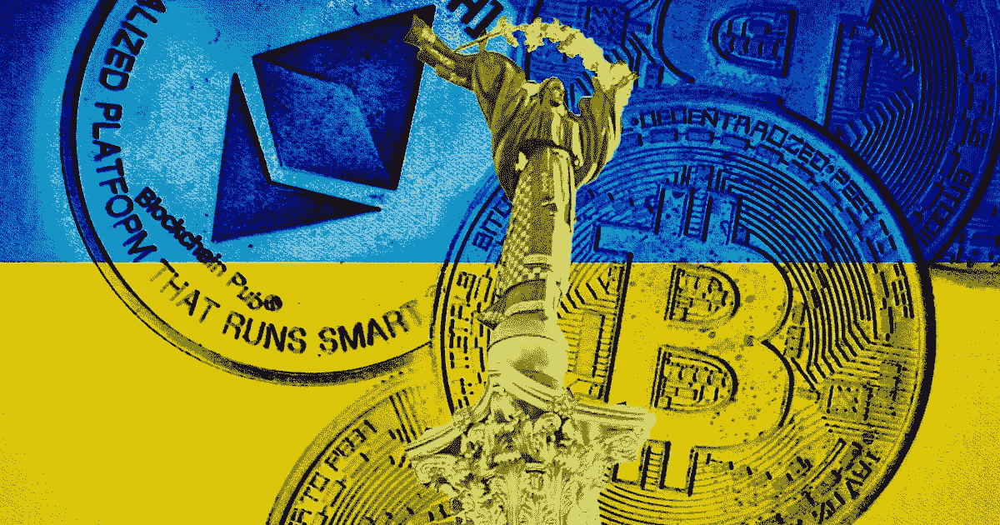

# 乌克兰停止分发代币，宣布新的 NFT 计划

> 原文：<https://medium.com/coinmonks/ukraine-stops-the-token-distribution-and-announces-fresh-nft-plans-d2b2599cf637?source=collection_archive---------76----------------------->

**Visit our website:-** [**https://bitcoinsupports.com/**](https://bitcoinsupports.com/)

乌克兰已经收到大约 4000 万美元的加密货币捐款，其中近 700 万美元来自取消空投后。周三，乌克兰副总理费多罗夫向公众表示，该国已决定取消周二宣布的对加密贡献者的空投，以支持通过出售不可伪造代币(NFT)筹集更多资金。https://twitter.com/[费多罗夫姆凯洛](https://twitter.com/FedorovMykhailo/status/1499348177002151937) /status/1499348177002151937

周三，乌克兰的加密空投计划出现了意想不到的变化，一个欺诈账户创造了 70 亿个“和平世界令牌”，给人的印象是，它们是加密捐赠者的真正空投令牌。假空投在官方宣布的时间前一个小时开始，但以太扫描很快就检测到了。几个小时后，费多罗夫证实，乌克兰将使用 NFTs，并且不会发布任何可替换的令牌。

空投公告发布后，乌克兰官方的捐赠加密钱包显然收到了 700 万美元的捐款，这在加密推特上引发了争议。虽然部长没有具体说明空投被取消的原因，但加密界的一些人感到失望，而其他人，如 Twitter 人物 Cobie，在这种情况下找到了幽默。

[https://twitter.com/cobie/status/1499350181263065088](https://twitter.com/cobie/status/1499350181263065088) 
乌克兰周三首次宣布空投，此前获得了加密社区的大量支持和数百万美元的数字资产捐赠。

[https://twitter.com/Ukraine/status/1498733635083587584](https://twitter.com/Ukraine/status/1498733635083587584) 
面对俄国入侵导致的国家地位恶化，乌克兰转向了加密货币。上周六，乌克兰官方 Twitter 账户发布了一个比特币(BTC)和以太坊(ETH)钱包地址，并请求全球加密社区提供帮助。官方捐赠钱包增加了 Polkadot 和 Dogecoin 地址，以响应加密社区对进一步加密支持的需求。

[https://twitter.com/Ukraine/status/1497594592438497282](https://twitter.com/Ukraine/status/1497594592438497282) 
据报道，乌克兰官方捐赠钱包已收到 3700 万美元受监控的加密捐款。

**访问我们的网站:-**[**【https://bitcoinsupports.com/】**](https://bitcoinsupports.com/)

**免责声明:这些是作者的观点，不应被视为投资建议。读者应该自己做研究。**

> 加入 Coinmonks [电报频道](https://t.me/coincodecap)和 [Youtube 频道](https://www.youtube.com/c/coinmonks/videos)了解加密交易和投资

# 另外，阅读

*   [新加坡十大最佳加密交易所](https://coincodecap.com/crypto-exchange-in-singapore) | [购买 AXS](https://coincodecap.com/buy-axs-token)
*   [投资印度的最佳加密软件](https://coincodecap.com/best-crypto-to-invest-in-india-in-2021) | [WazirX P2P](https://coincodecap.com/wazirx-p2p)
*   7 个最佳零费用加密交易平台
*   [最佳网上赌场](https://coincodecap.com/best-online-casinos) | [期货交易机器人](/coinmonks/futures-trading-bots-5a282ccee3f5)
*   [分散交易所](https://coincodecap.com/what-are-decentralized-exchanges) | [比特 FIP](https://coincodecap.com/bitbns-fip) | [宾邦评论](https://coincodecap.com/bingbon-review)
*   [用信用卡购买密码的 10 个最佳地点](https://coincodecap.com/buy-crypto-with-credit-card)
*   [加拿大最佳加密交易机器人](https://coincodecap.com/5-best-crypto-trading-bots-in-canada) | [Bybit vs 币安](https://coincodecap.com/bybit-binance-moonxbt)