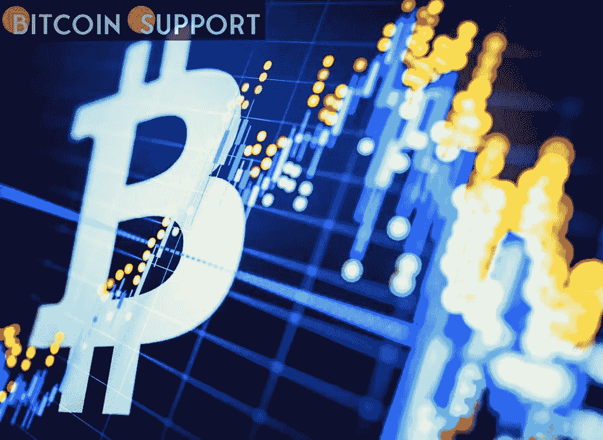
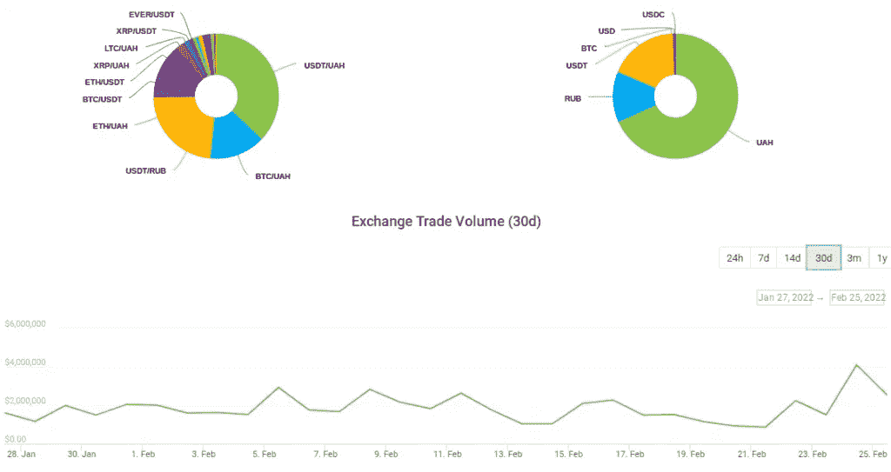

# 由于与俄罗斯的战争，乌克兰的比特币交易量激增 200%

> 原文：<https://medium.com/coinmonks/ukraines-bitcoin-exchange-volume-surges-200-percent-because-of-the-war-with-russia-d89d594b555f?source=collection_archive---------46----------------------->

**Visit our website:-** [**https://bitcoinsupports.com/**](https://bitcoinsupports.com/)

随着货币管制的到位和格里夫纳处于历史低点，长期运行的本地加密交易所 Kuna 的客户活动正在发生快速变化。数据显示，在俄罗斯入侵乌克兰后，乌克兰一家主要加密货币交易所的比特币(BTC)和替代币交易量有所增加。根据 CoinGecko 的数据，2 月 24 日，Kuna 的交易额几乎翻了三倍，达到 400 多万美元。

**乌克兰人对加密货币感兴趣。随着与俄罗斯的武装冲突开始，这两个国家的法定货币受到的影响立即显现出来。虽然俄罗斯卢布首当其冲，乌克兰格里夫纳也下跌，目标是创下 1 美元兑 30 卢布的历史新低。

经过政客们的反复讨论，乌克兰最近通过了一项加密货币合法化的法律，这引发了对替代货币的兴趣。这种影响在 Kuna 上是显而易见的，这只成立 7 年的股票在 2 月 21 日的成交量还不到 100 万美元，但三天后就接近 410 万美元。根据 CoinGecko 的数据，在第一波热潮过后，这种热情已经开始消退，与此同时，法币对美元和其他主要货币的汇率趋于稳定。Kuna 自己的利率不那么明显，比特币市场价格的两边都有奇怪的价差。在撰写本文时，Bitstamp 的 BTC/美元交易价格约为 38，300 美元，而 Kuna 的美元交易价格超过 40，000 美元。

stable coin Tether(USDT)的交易价格为每比特币 37800 美元。**

**Visit our website:-** [**https://bitcoinsupports.com/**](https://bitcoinsupports.com/)

货币自由正受到央行的限制。另一方面，政府的货币管制为本周比特币的进入提供了第二个理由。乌克兰国家银行(National Bank of Ukraine)周三开始限制现金，将每日提取格里夫纳的上限设定为 10 万 UAH(合 3353 美元)，并完全禁止跨境购买和提取外币。据《脸书邮报》报道，该银行还旨在保持格里夫纳汇率稳定。与此同时，俄罗斯央行周四开始干预外汇市场，以支撑卢布的暴跌，过去 24 小时内似乎发生了多次波动。

**访问我们的网站:-**[**https://bitcoinsupports.com/**](https://bitcoinsupports.com/)

**免责声明:以上为作者观点，不应视为投资建议。读者应该自己做研究。**

> 加入 Coinmonks [电报频道](https://t.me/coincodecap)和 [Youtube 频道](https://www.youtube.com/c/coinmonks/videos)了解加密交易和投资

# 另外，阅读

*   [印度加密交易所](/coinmonks/bitcoin-exchange-in-india-7f1fe79715c9) | [比特币储蓄账户](/coinmonks/bitcoin-savings-account-e65b13f92451)
*   [OKEx vs KuCoin](https://coincodecap.com/okex-kucoin) | [摄氏替代品](https://coincodecap.com/celsius-alternatives) | [如何购买 VeChain](https://coincodecap.com/buy-vechain)
*   [币安期货交易](https://coincodecap.com/binance-futures-trading)|[3 comas vs Mudrex vs eToro](https://coincodecap.com/mudrex-3commas-etoro)
*   [如何购买 Monero](https://coincodecap.com/buy-monero) | [IDEX 评论](https://coincodecap.com/idex-review) | [BitKan 交易机器人](https://coincodecap.com/bitkan-trading-bot)
*   [CoinDCX 评论](/coinmonks/coindcx-review-8444db3621a2) | [加密保证金交易交易所](https://coincodecap.com/crypto-margin-trading-exchanges)
*   [红狗赌场评论](https://coincodecap.com/red-dog-casino-review) | [Swyftx 评论](https://coincodecap.com/swyftx-review) | [CoinGate 评论](https://coincodecap.com/coingate-review)
*   [Bookmap 评论](https://coincodecap.com/bookmap-review-2021-best-trading-software) | [美国 5 大最佳加密交易所](https://coincodecap.com/crypto-exchange-usa)