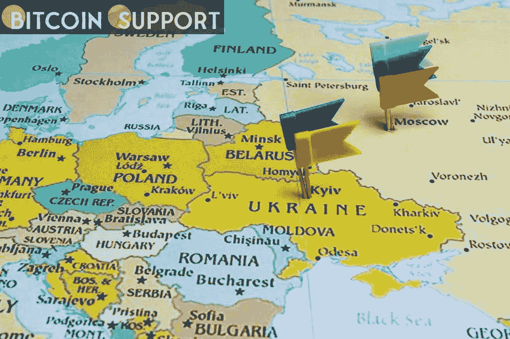

# 乌克兰国防部负责决定如何使用加密货币资金

> 原文：<https://medium.com/coinmonks/ukraines-defense-ministry-is-in-charge-of-deciding-how-cryptocurrency-funds-are-spent-e67b5d29b439?source=collection_archive---------79----------------------->

**Visit our website:-** [**https://bitcoinsupports.com/**](https://bitcoinsupports.com/)

政府的秘密基金已经获得了 1680 万美元的捐款。乌克兰交易所 Kuna 的创始人迈克尔·乔比安(Michael Chobian)领导着该国的加密运动，他表示，乌克兰国防部正在决定贡献的加密现金的分配。

Chobian 在发推文后不久评论说，乌克兰的加密基金已经从世界各地的捐助者那里收集了 1680 万美元的加密货币。

[https://Twitter . com/ChobanianMike/status/1498568005306966017](https://twitter.com/ChobanianMike/status/1498568005306966017)

CHO bian 表示，“1680 万美元中的 1400 万美元已经花掉了。”支出被披露的同一天，俄罗斯导弹袭击造成 70 名乌克兰士兵死亡，卫星照片显示，一个 40 英里(64 公里)长的俄罗斯军事车队距离乌克兰首都基辅仅 17 英里，并且仍在前进。在向欧洲议会发表视频讲话后，乌克兰总统弗拉基米尔·泽伦斯基赢得了全场起立鼓掌。乌克兰政府拒绝透露资金的去向，“因为涉及保密级别”，但声称由于区块链的技术，这一过程是透明的。据一位熟悉该程序的消息人士透露，乌克兰国防部长 Oleksii Reznikov 知道这笔钱是如何被分配的，因为他是发布指令的人。根据消息来源，政府将不得不发布更多的信息。

**访问我们的网站:-**[**https://bitcoinsupports.com/**](https://bitcoinsupports.com/)

**免责声明:以上为作者观点，不应视为投资建议。读者应该自己做研究。**

> 加入 Coinmonks [电报频道](https://t.me/coincodecap)和 [Youtube 频道](https://www.youtube.com/c/coinmonks/videos)了解加密交易和投资

# 另外，阅读

*   [如何购买 Ripple (XRP)](https://coincodecap.com/buy-ripple-india) | [非洲最好的加密交易所](https://coincodecap.com/crypto-exchange-africa)
*   [非洲最佳加密交易所](https://coincodecap.com/crypto-exchange-africa) | [胡交易所评论](https://coincodecap.com/hoo-exchange-review)
*   [eToro vs robin hood](https://coincodecap.com/etoro-robinhood)|[MoonXBT vs Bybit vs Bityard](https://coincodecap.com/bybit-bityard-moonxbt)
*   [Stormgain 回顾](https://coincodecap.com/stormgain-review) | [Bexplus 回顾](https://coincodecap.com/bexplus-review) | [币安 vs Bittrex](https://coincodecap.com/binance-vs-bittrex)
*   [Bookmap 评论](https://coincodecap.com/bookmap-review-2021-best-trading-software) | [美国 5 大最佳加密交易所](https://coincodecap.com/crypto-exchange-usa)
*   [如何在 FTX 交易所交易期货](https://coincodecap.com/ftx-futures-trading) | [OKEx vs 币安](https://coincodecap.com/okex-vs-binance)
*   [如何在势不可挡的域名上购买域名？](https://coincodecap.com/buy-domain-on-unstoppable-domains)
*   [印度的秘密税](https://coincodecap.com/crypto-tax-india) | [altFINS 审查](https://coincodecap.com/altfins-review) | [Prokey 审查](/coinmonks/prokey-review-26611173c13c)