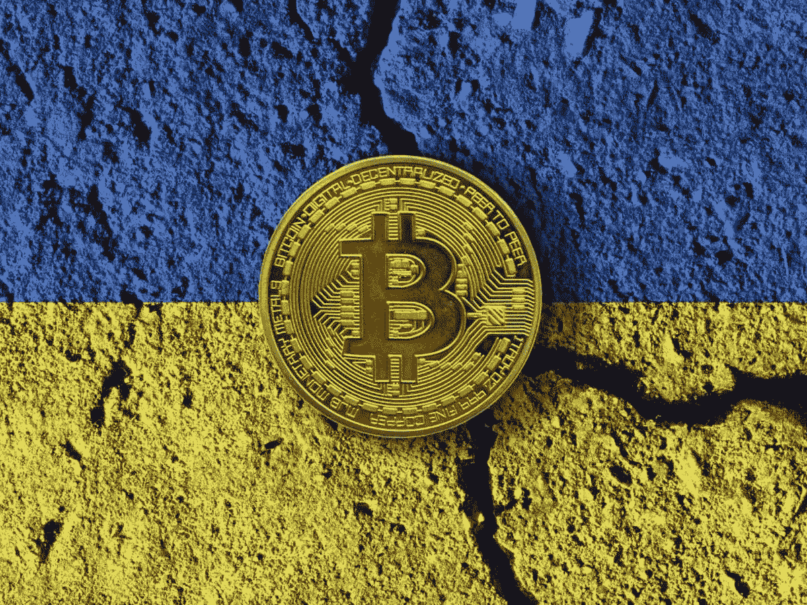

# 乌克兰政府接受加密货币捐赠！

> 原文：<https://medium.com/coinmonks/ukrainian-government-accepts-cryptocurrency-donations-cc74e8464b57?source=collection_archive---------65----------------------->

在俄罗斯入侵的背景下，乌克兰通过副总理宣布接受加密货币捐赠。自那时以来，根据政府提出的地址已经收到了几百万美元。

# 加密货币在乌克兰战争中的力量