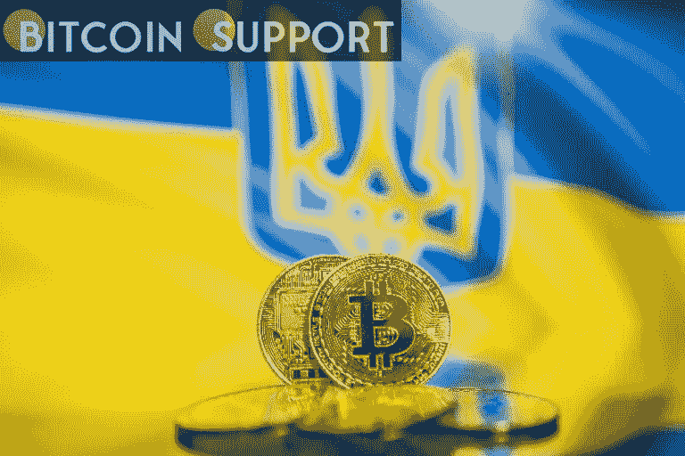

# 乌克兰政府正在寻求加密货币捐赠

> 原文：<https://medium.com/coinmonks/ukrainian-government-is-looking-for-cryptocurrency-donations-b170bee1b20e?source=collection_archive---------45----------------------->

**Visit our website:-** [**https://bitcoinsupports.com/**](https://bitcoinsupports.com/)

在文章发表时，与该呼吁相关的加密钱包中有大约 43.5 万美元的加密货币。

为了抵御俄罗斯的入侵，乌克兰政府正在请求加密货币捐赠。

[https://twitter.com/Ukraine/status/1497594592438497282](https://twitter.com/Ukraine/status/1497594592438497282)

[https://Twitter . com/FedorovMykhailo/status/1497549813205848068](https://twitter.com/FedorovMykhailo/status/1497549813205848068)

乌克兰政府和副总理 Mykhailo 费多罗夫的官方推特账号公布了比特币(BTC)、以太坊(ETH)、stablecoin 系绳捐款(USDT)的钱包地址。在文章发表时，这些钱包里有 43.5 万美元。然而，这可能不是捐赠的全部金额，因为有证据表明一些比特币已经从钱包中取出。这并不是比特币第一次被用于帮助乌克兰人抗击俄罗斯入侵。一个数字钱包收到了近 600 万美元的比特币捐款，该钱包正在筹集捐款以支持乌克兰军队。虽然以太坊的联合创始人维塔利克·布特林质疑请愿的合法性，但这些推文是由经过验证的账户发出的。记者无法立即联系到乌克兰政府的代表发表评论，该国的官方网站似乎也关闭了。

**访问我们的网站:-**[**https://bitcoinsupports.com/**](https://bitcoinsupports.com/)

**免责声明:以上为作者观点，不应视为投资建议。读者应该自己做研究。**

> *加入 Coinmonks* [*电报频道*](https://t.me/coincodecap) *和* [*Youtube 频道*](https://www.youtube.com/c/coinmonks/videos) *了解加密交易和投资*

# 另外，阅读

*   【T43 商业评论 | [Pionex 评论](https://coincodecap.com/pionex-review-exchange-with-crypto-trading-bot) | [Coinrule 评论](/coinmonks/coinrule-review-2021-a-beginner-friendly-crypto-trading-bot-daf0504848ba)
*   [莱杰 vs Ngrave](/coinmonks/ledger-vs-ngrave-zero-7e40f0c1d694) | [莱杰 nano s vs x](/coinmonks/ledger-nano-s-vs-x-battery-hardware-price-storage-59a6663fe3b0) | [币安评论](/coinmonks/binance-review-ee10d3bf3b6e)
*   [Bybit Exchange 评论](/coinmonks/bybit-exchange-review-dbd570019b71) | [Bityard 评论](https://coincodecap.com/bityard-reivew) | [Jet-Bot 评论](https://coincodecap.com/jet-bot-review)
*   [3 commas vs crypto hopper](/coinmonks/3commas-vs-pionex-vs-cryptohopper-best-crypto-bot-6a98d2baa203)|[赚取加密利息](/coinmonks/earn-crypto-interest-b10b810fdda3)
*   最好的比特币[硬件钱包](/coinmonks/hardware-wallets-dfa1211730c6) | [BitBox02 回顾](/coinmonks/bitbox02-review-your-swiss-bitcoin-hardware-wallet-c36c88fff29)
*   [BlockFi vs 摄氏](/coinmonks/blockfi-vs-celsius-vs-hodlnaut-8a1cc8c26630) | [Hodlnaut 点评](/coinmonks/hodlnaut-review-best-way-to-hodl-is-to-earn-interest-on-your-bitcoin-6658a8c19edf) | [KuCoin 点评](https://coincodecap.com/kucoin-review)
*   [Bitsgap 审查](/coinmonks/bitsgap-review-a-crypto-trading-bot-that-makes-easy-money-a5d88a336df2) | [Quadency 审查](/coinmonks/quadency-review-a-crypto-trading-automation-platform-3068eaa374e1) | [Bitbns 审查](/coinmonks/bitbns-review-38256a07e161)