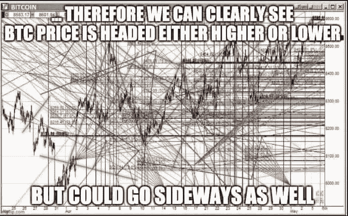

# 初学者终极加密交易指南|技术分析

> 原文：<https://medium.com/coinmonks/ultimate-crypto-trading-guide-chapter-4-technical-analysis-2e65dca8f267?source=collection_archive---------24----------------------->

## 第四章:技术分析

Leave a clap for the memes :)

# 目录:

*   第一章:[什么是加密货币？](https://neogenesis49.medium.com/ultimate-crypto-trading-guide-for-beginners-introduction-c0a5a809799d?sk=729551e5c1861c948ba1584b6564109c)
*   第二章:[加密货币交易基础知识](https://neogenesis49.medium.com/ultimate-crypto-trading-guide-for-beginners-trading-101-6bd901cf8558)
*   第三章:[交易策略](https://neogenesis49.medium.com/ultimate-crypto-trading-guide-for-beginners-trading-strategy-e666a3602c4b)
*   第四章:[技术分析基础](https://neogenesis49.medium.com/ultimate-crypto-trading-guide-chapter-4-technical-analysis-2e65dca8f267)