# 用信任钱包赌一把的终极指南

> 原文：<https://medium.com/coinmonks/ultimate-guide-to-staking-on-pancakeswap-with-trust-wallet-ef89919e091?source=collection_archive---------32----------------------->

本教程将教你一切你需要知道的关于在 PancakeSwap 交易所赚取被动收入。

您将了解如何使用 LP(流动性提供者)令牌来产生农场。

我们还将讨论在 PancakeSwap 的自动混合糖浆池中下注蛋糕代币。

听起来很困惑？别担心，我还会解释打桩和产量耕作的区别。

所有这些都可以在 Trust Wallet 应用程序中直接完成。

这就是我将在本指南中使用的应用程序。

## 设置信任钱包应用程序

在你开始下注之前，你需要一个钱包。

如果你还没有信任钱包，你可以查看我的指南[如何设置信任钱包](https://mikedcrypto.com/trust-wallet-tutorial/)。

这款应用可以在 iPhone、Android 和谷歌 Play 商店上使用。

设置完钱包后，我们可以继续下一步…

# 在你的钱包里放一些 BNB 代币

既然你已经装好了钱包，你需要一些 BNB 代币。

这有两个原因-

1.  支付汽油费(交易成本)。
2.  你可以使用 BNB 购买任何你想下注的代币(在本教程中我们将下注蛋糕)。

要在您的钱包中接收 BNB，请单击信任钱包中的“钱包”选项卡。

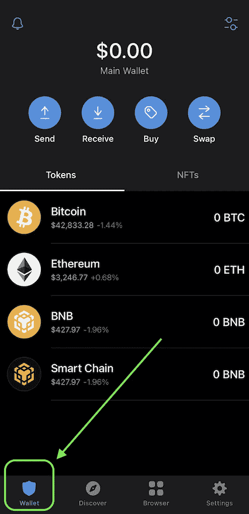

然后点击“接收”，再点击“智能链”。

下一个屏幕将为您提供您的币安智能链钱包地址。

将该地址粘贴到您获取 BNB 代币的钱包或交易所中。

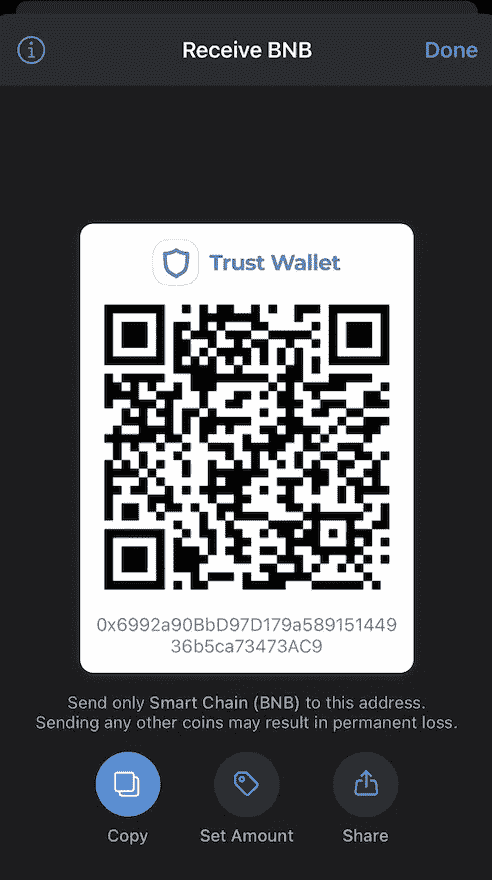

或者，您可以点击钱包页面上的“购买”按钮。

这将允许您使用第三方应用程序(MoonPay、Transak 或 Simplex)用信用卡购买 BNB。

其中一些服务可能需要 KYC，和/或在某些地区不可用。

# 使用信任钱包浏览器导航到 PancakeSwap

一旦你的钱包里有了一些 BNB，是时候去 PancakeSwap 了。

您可以点击 Trust Wallet 底部的“浏览器”选项卡来完成此操作。

然后，在搜索栏中输入[**pancakeswap . finance**](https://pancakeswap.finance/)。

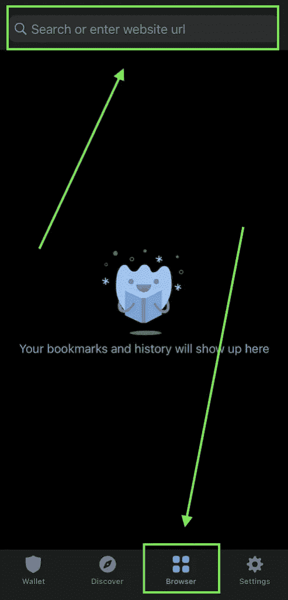

# 将信任钱包连接到 PancakeSwap

当你登陆 PancakeSwap 应用程序的主页时，它应该是这样的:

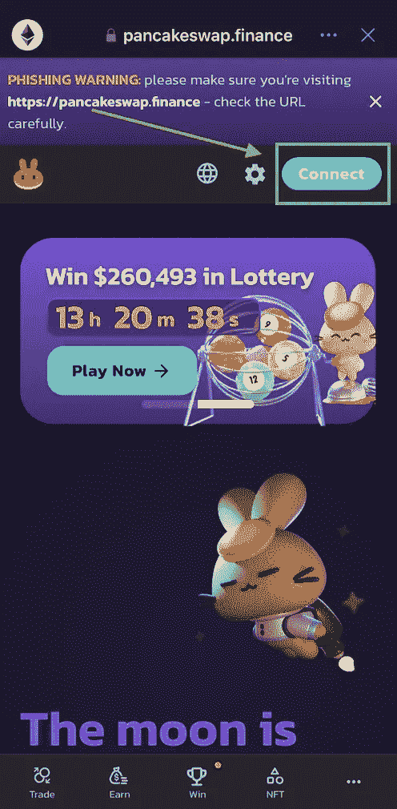

在开始下注之前，您需要将您的信任钱包连接到 PancakeSwap。

这可以通过点击页面顶部的“连接”按钮来完成。

点击“连接”后，点击“更多”，然后点击“信任钱包”。

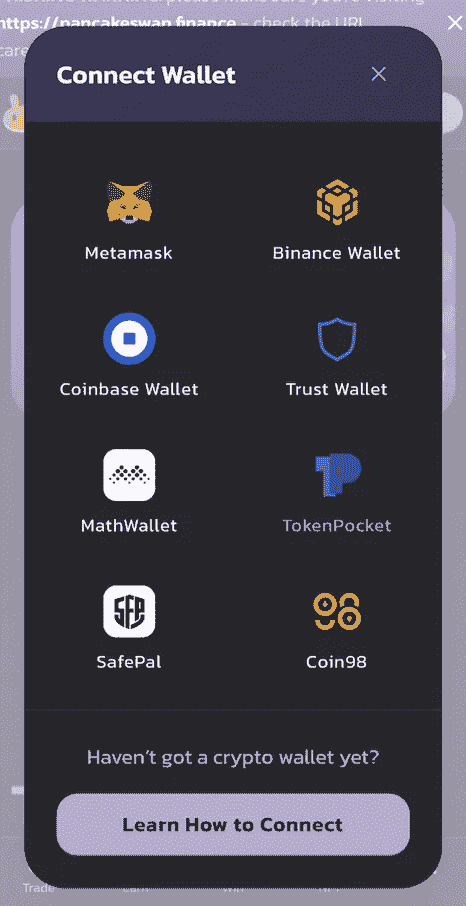

然后，点击“智能链”，最后，点击“连接”。

# PancakeSwap 上的产量农场和糖浆池

现在您已经连接了您的钱包，请点击屏幕底部的“赢取”选项卡。

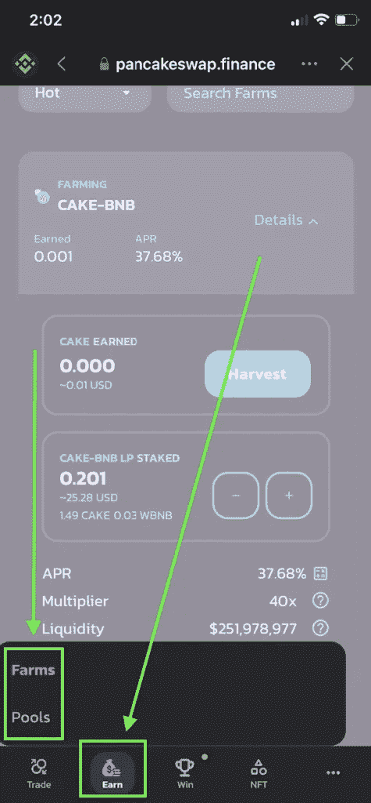

您会注意到弹出了两个选项- **农场**和**池**。

我将解释它们的区别，以及如何使用它们。

# 高产农业和打桩的区别

产量耕作和打桩都非常相似。你锁定了一些密码，你就获得了被动收入。

但是这两者之间有一些不同之处。

# 在 V2 赌上一把

下注是指将代币存入池中，并以“下注奖励”的形式赚取利息。

这仅仅意味着你得到了更多的代币。

例如，假设您将 1000 个蛋糕代币存入蛋糕赌注池(也称为糖浆池)。

让我们假设蛋糕池提供 40%的年利率。

这意味着，如果你下注 1 年，你将获得 400 个蛋糕代币的赌注奖励。

# PancakeSwap 上的高产农业

产量农业就像打桩一样，但是有一些不同。

为了“农场”，你需要在一个 PancakeSwap 交易池中提供流动性。

您在流动性池中的所有权份额由一个名为“LP 令牌”的令牌表示。

这些 LP 代币可以像蛋糕代币一样存入池中。

而且，他们也赚取收益(利息)，就像糖浆池一样。

赌博和耕作的区别在于，当你耕作时，你得到的回报是不同的象征。

例如，假设您在 PancakeSwap v2 上为蛋糕-BNB 组合提供流动性。

然后你把你的 LP 代币存入一个收益农场。

即使您将 LP 代币存入农场，您仍然可以获得蛋糕代币作为奖励。

不像糖浆池，赌注奖励和你放入池中的一样。

# APY 和 APR 的区别

在我们进入下一步之前，我想解释一下 APY 和 APR 的区别。

你会注意到一些 PancakeSwap 的赌注池计算利息为 **APR** ，而一些池的利息计算器显示的是 **APY** 。

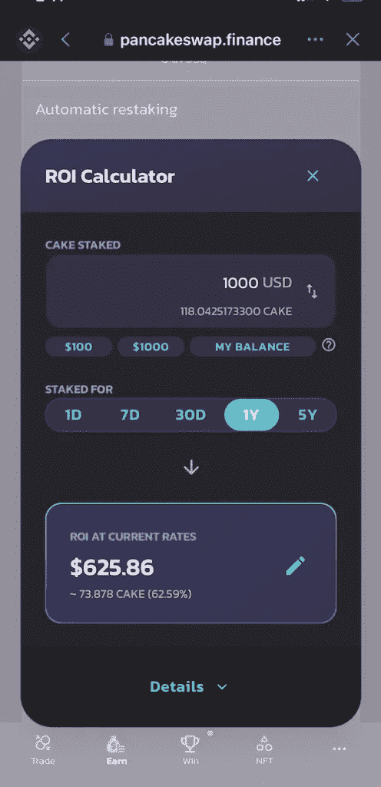

APR 是赚取利息的“简单”形式。

你先存入一笔钱，这笔钱会带来回报。

在这种情况下，为了计算投资回报率，你需要做的就是获得初始投资金额，然后用你的利息计算器乘以年利率。

APY(年收益率)稍微复杂一点。

该术语指的是自动复合池，并考虑了以下因素:

*   基础四月
*   多长时间复利一次

让我们用之前的例子。您将 1000 个蛋糕代币存入自动合成池。

那个池子有 40%**4 月**，每天自动化合一次。

要计算你的 **APY** ，你需要做的是。

用 40%的年利率除以 365(一年中的天数)。

这给了你每天 0.10958904%的利息。

现在拿你的初始投资 1000 个蛋糕代币，加上 0.10958904%。

1 天后，您的总额为 1001.09589 蛋糕代币。

再次执行相同的过程，只是这次使用 1001.09589 作为起始数字，而不是 1000。

两天后您的总余额将是 1002.19298 蛋糕代币。

如果你总共做这个过程 365 次，你最终得到总共 1491.5 个蛋糕代币。

正如你所看到的，即使我们例子中的两个池都有 40%的 APR，自动复利池为你赢得了额外的 91.5 蛋糕(额外的 9.15%)。

这意味着自动复合池的 APY 是 49.15%，即使它的年利率只有 40%。

显然，你不需要手动进行这些计算，你可以使用 PancakeSwap 上的利息计算器，它会告诉你你的估计收益率是多少。

# 如何在 V2 的糖水交易中下注

现在你明白了赌注和耕作的区别，让我们来谈谈如何真正的赌注。

单击 PancakeSwap 底部的“赢取”选项卡，然后单击“池”。

在本教程中，我将在自动混合蛋糕池中下注一些蛋糕。

如您所见，该池上的 APY 为 62.63%。这意味着如果你投资 10，000 美元，你每年将获得 6，263 美元的收益。

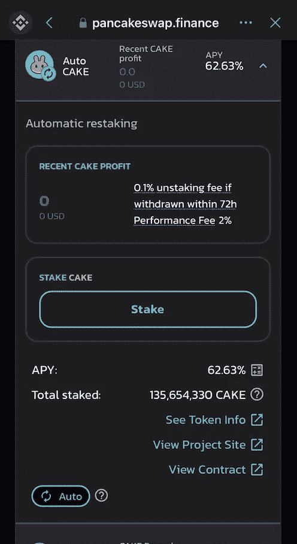

我还没有蛋糕，所以我会很快买一些。

# 如何在 PancakeSwap Exchange 上购买蛋糕代币

要购买蛋糕，我只需点击 Trust Wallet 屏幕底部的“交易”标签。

现在，我已进入交换页面，只需选择我想要交换的令牌。

由于我使用 BNB 购买蛋糕，我将在顶部字段中选择 BNB。

在底部字段中，我将选择蛋糕。

现在我只需要输入我想买的蛋糕的数量。

我钱包里只有几块钱，所以我会花 0.03 BNB 买蛋糕。

以目前的蛋糕价格，这将使我得到 1.4893 块蛋糕。

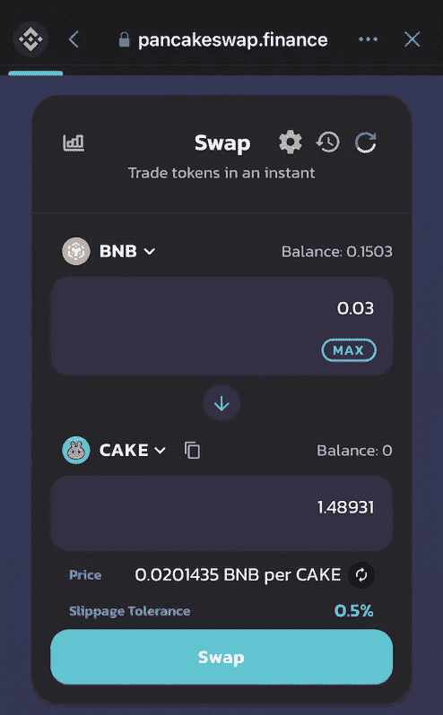

填写完详细信息后，我只需点击“交换”按钮。

会要求我确认细节，然后要求我确认实际交易。

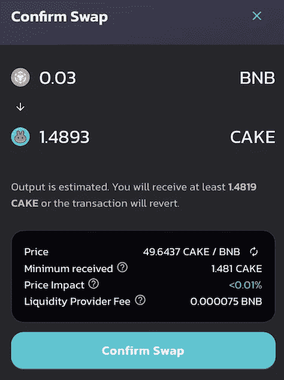

现在，我将等待几秒钟，等待事务完成，然后我将得到一个确认，表明我的事务已通过。

蛋糕代币现在在我的钱包里，我可以回到“Pools”页面下注。

# 在自动合成池中下注蛋糕代币

一旦我进入“池”页面，我可以向下滚动到蛋糕糖浆池。

单击池以展开详细信息。

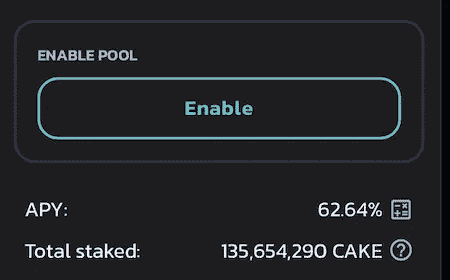

在将蛋糕放入池中之前，您需要先单击“启用”。

这基本上只是允许 PancakeSwap 接受您的存款。

点击“确认”,等待几秒钟，等待交易完成。

一旦您的交易确认，您将看到“赌注”按钮出现。

点击“下注”,然后输入您要下注的蛋糕数量。

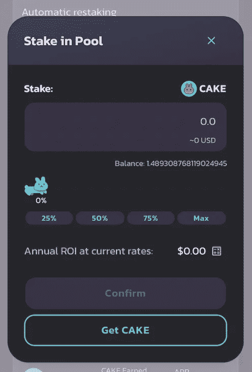

正如你所看到的，PancakeSwap 在页面上是一个不错的 ROI 计算器，这样你就可以算出你每年能赚多少钱。

填写完详细信息后，单击“确认”，然后在下一个屏幕上再次单击“确认”。

等待几秒钟，等待交易完成，然后您应该能够看到您在池中下注了多少蛋糕。

# 如何在 PancakeSwap 上生产农场

为了生产农场，我们需要一些 LP 代币。

为了获得 LP 代币，我们需要提供流动性。

我们必须为我们提供流动性的两种代币提供相等的美元价值。在这种情况下，我将为蛋糕-BNB 对提供流动性。

所以我需要相等价值的蛋糕和 BNB。

我的信托钱包里已经有一些 BNB，但我需要一些蛋糕。

我们已经介绍了如何购买蛋糕代币，所以我将跳到下一步。

# 如何提供流动性

我花了 0.03 BNB 买了一些蛋糕代币，所以现在是时候为蛋糕-BNB 池提供流动性了。

单击泛卡互换底部的“交易”选项卡。

在页面顶部，您将看到一个“流动性”选项卡。

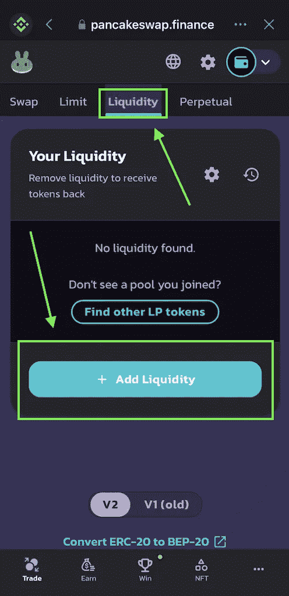

点击该按钮，然后点击“添加流动性”按钮。

接下来，您需要选择要为其提供流动性的令牌。

我会选择蛋糕和 BNB。

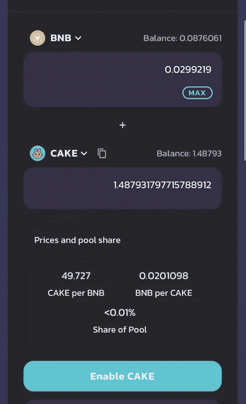

现在，我们需要输入我们想存入流动性池的金额。

我会点击蛋糕旁边的“最大”按钮，因为我想添加所有的蛋糕和等量的 BNB。

同样，我们需要在存入代币之前启用 CAKE。

BNB 不需要在这里启用，但是如果您要存放其他令牌，您可能需要同时启用这两个令牌。

单击“启用”后，您需要单击“确认”。

然后等待几秒钟，等待交易完成。

一旦通过，“启用”按钮应变成“供应”按钮。

单击“供应”，然后单击“确认”。然后再次单击“确认”。

交易完成后，我们可以去生产我们的低压代币，赚一些 APY。

# 种植您的低压代币

单击屏幕底部的“赚钱”选项卡，然后单击“农场”。

由于我在种植蛋糕-BNB LP 代币，我将选择蛋糕-BNB 农场来扩展细节。

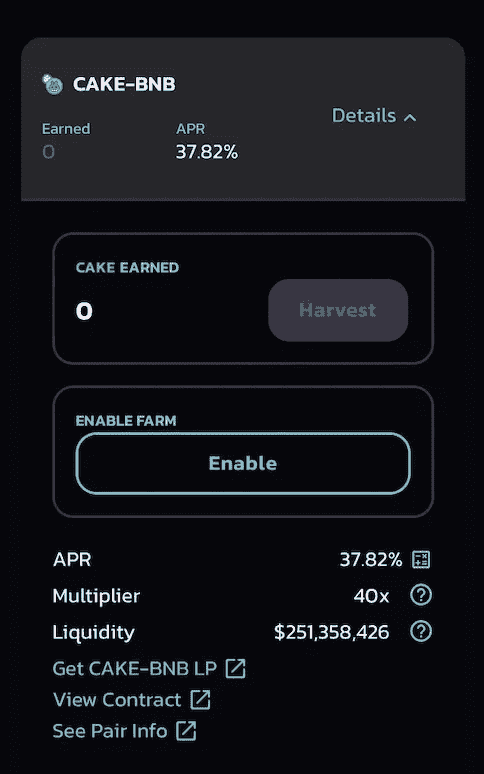

我们可以看到这个农场的 APR 为 37.6%。

在我可以存放我的 LP 令牌之前，我需要通过单击“启用”按钮来启用场。

然后，我需要单击“确认”，然后等待交易完成。

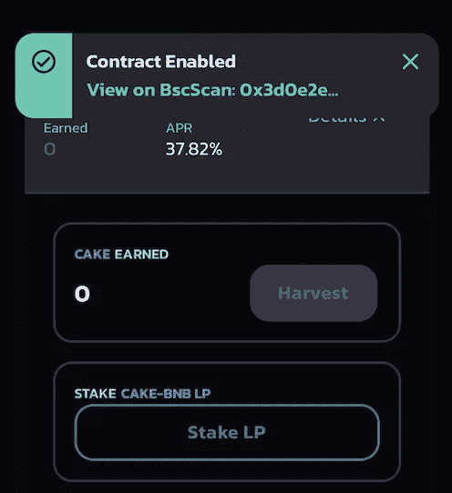

一旦确认，我可以通过点击“入股 LP”来入股我的 LP 令牌。

选择您想下注的低压代币金额。

我会选择“马克斯”，因为我想把他们都押进农场。

现在我只需要单击“确认”，然后再次单击“确认”。

一旦交易完成，我的代币现在给我带来了收益。

# 如何收获赌注回报

让我们谈谈收获(收回)您的奖励。

这仅适用于**手动**池——自动复合池会自动获取您的收入并为您再投资。

所以，如果您要在人工游泳池中游泳或耕作，以下是您获得奖励的方式。

您需要做的只是单击您正在使用的池或场。这将扩展细节。

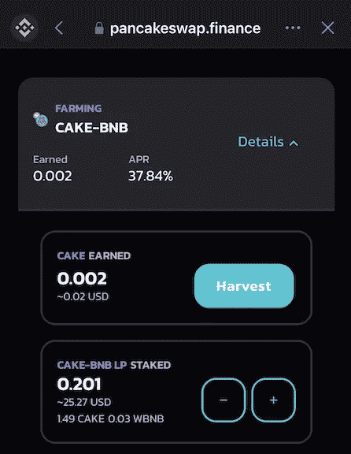

然后只需单击“收获”按钮，然后单击“确认”。

一旦交易完成，您的奖励将出现在您的钱包中。很简单吧。

# 从糖浆池中取出

要从标记池中删除令牌，您需要做的就是单击您正在使用的池。

然后单击—按钮。

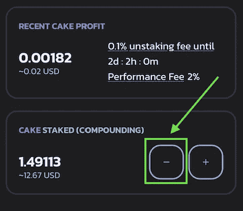

输入要取消标记的令牌数量，然后单击“确认”。

交易完成后，您的代币将出现在您的钱包中。

如果你只下了一两天的赌注，你可能会注意到有 0.1%的拆赌注费。所以请记住这一点，并据此制定计划。

# 从服务器场中提取 LP 令牌

如果你已经决定不再经营农场，以下是如何收回 LP 代币的方法。

转到 farms 页面，单击您正在使用的 farm。

然后点击—按钮。

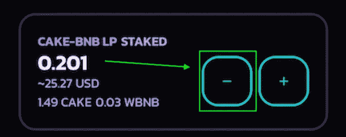

接下来，输入要从服务器场中移除的令牌数量。

然后点击“确认”。

# 从 PancakeSwap 中移除流动性

如果你想摆脱你的 LP 代币，这样你就可以拿回你原来的 2 个代币，实际上我已经为此做了一个指南。

去我那篇关于 [Polycub](https://mikedcrypto.com/polycub-ultimate-guide-how-to-use-cub-finance/) 的文章。那篇文章的第 9.20 节讨论了从 PancakeSwap 中去除流动性的问题。

# 结论

你现在应该明白了产量农业和赌注的区别，APR 和 APY 的区别，以及你需要知道的关于在 PancakeSwap 上下注的一切。

如果你觉得这个指南有帮助，请在社交媒体或你能想到的任何地方分享它。

如果你想看到更多这类内容，请考虑[订阅我的频道](https://mikedcrypto.com/subscribe/)。

感谢您的阅读，下次见。再见。

> 加入 Coinmonks [电报频道](https://t.me/coincodecap)和 [Youtube 频道](https://www.youtube.com/c/coinmonks/videos)了解加密交易和投资

# 另外，阅读

*   [Bookmap 评论](https://coincodecap.com/bookmap-review-2021-best-trading-software) | [美国 5 大最佳加密交易所](https://coincodecap.com/crypto-exchange-usa)
*   最佳加密[硬件钱包](/coinmonks/hardware-wallets-dfa1211730c6) | [Bitbns 评论](/coinmonks/bitbns-review-38256a07e161)
*   [新加坡十大最佳加密交易所](https://coincodecap.com/crypto-exchange-in-singapore) | [购买 AXS](https://coincodecap.com/buy-axs-token)
*   [红狗赌场评论](https://coincodecap.com/red-dog-casino-review) | [Swyftx 评论](https://coincodecap.com/swyftx-review) | [CoinGate 评论](https://coincodecap.com/coingate-review)
*   [投资印度的最佳密码](https://coincodecap.com/best-crypto-to-invest-in-india-in-2021)|[WazirX P2P](https://coincodecap.com/wazirx-p2p)|[Hi Dollar Review](https://coincodecap.com/hi-dollar-review)