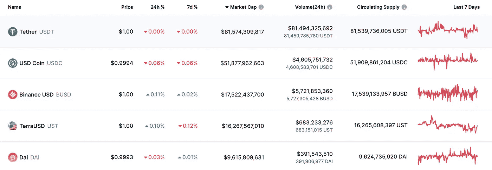
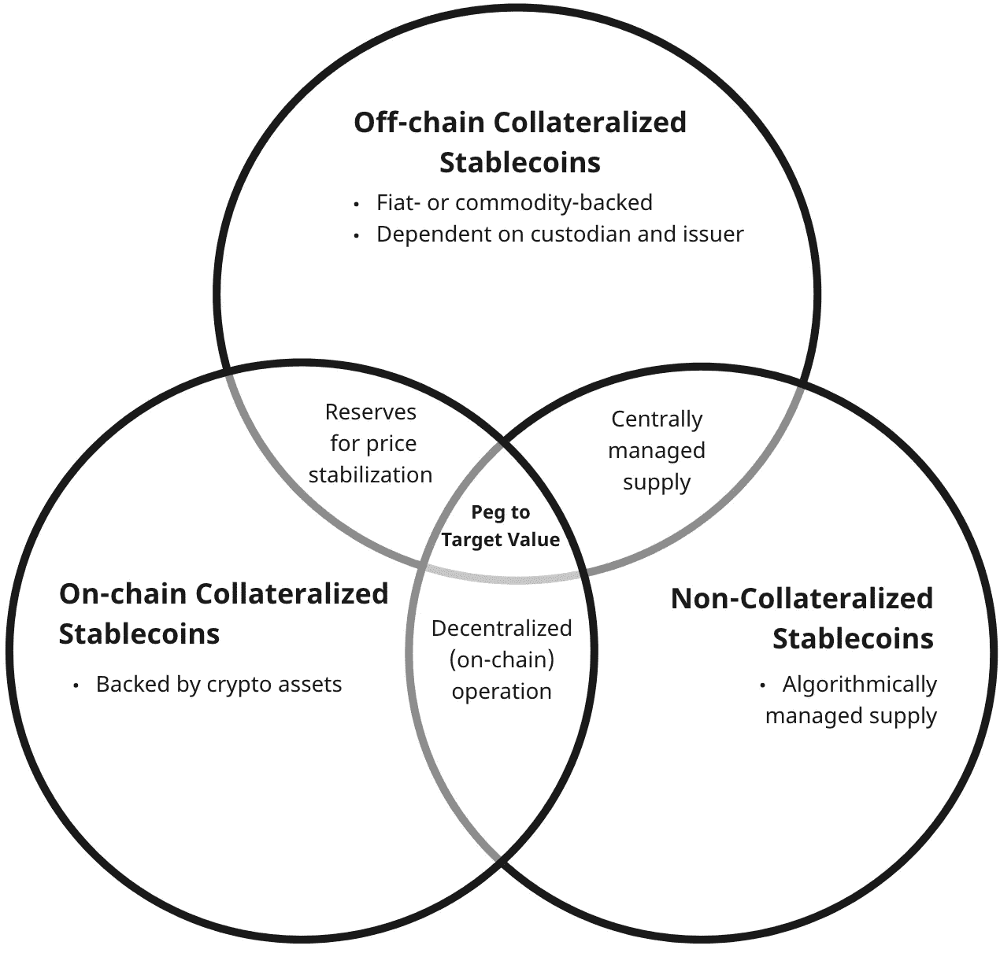

# 最终稳定硬币分类

> 原文：<https://medium.com/coinmonks/ultimate-stablecoin-classification-bd70db1ae3f3?source=collection_archive---------40----------------------->

加密货币因其波动性而臭名昭著。稳定币减轻了这种加密波动风险，因为稳定币的价值(几乎总是)等于目标法定货币(美元、欧元、瑞士法郎等)或一篮子货币。因此，稳定的玉米成为 DeFi 生态系统的支柱。

由于建立了储备，稳定的货币保持了目标价值。这些储备类似于中央银行的储备，用于管理硬币的供给和需求。

根据储备中基础资产(抵押品)的类型，稳定存款可以分为三类:

*   **非连锁抵押或法定/商品担保**
    那些稳定的货币在传统的银行(*法定担保*)中以法定货币的形式保留他们的储备，或储存商品，如黄金(*商品担保*)，
    这是法定担保稳定货币的一个例子，每 1 USDT 在银行账户中保留 1 美元
*   **链上抵押/加密支持**
    这些稳定货币利用加密资产，如其他加密货币、股票代币或其他稳定货币，建立储备。由于这个原因，他们也经常被称为*密码支持的*稳定币。
    加密支持的稳定代码示例包括 DAI、aUSD 或 lUSD。
*   **非抵押/算法**
    稳定的银行不建立储备，但通过算法管理其供求。因此，它们也被称为*算法*稳定点数

# 稳定状态

稳定货币——低波动性的加密货币——是 DeFi 的支柱。它们的供应量在 2021 年激增了 388%，加上 TVL DeFi 的总体增长(总价值锁定)从 2020 年的 10 亿美元增长到 2021 年的 3000 亿美元。

在撰写本文时，CoinGecko 和 CoinMarketCap 上列出了 60 多个 stablecoins。绝大多数稳定货币以美元为目标，只有三种货币——jCHF、dCHF 和 XCHF——与瑞士法郎挂钩。

上图显示了市值最大的五家稳定银行(根据 CoinMarketCap)。所有货币都与美元挂钩，而且除了戴(DAI)是加密货币以外，所有货币都由法定货币美元支持。

XCHF 和 dCHF 都由法定货币瑞士法郎支持，并面临瑞士负利率的风险。与美元挂钩的硬币相比，瑞士法郎挂钩的稳定硬币的市值相对较小(低于 200 万美元)。

# **分类框架**

稳定机制是每个 stablecoin 协议的核心。它决定了协议相对于固定目标保持稳定值的能力。根据它们建立的保护区类型，稳定区可分为三大类:

1.  **链外抵押稳定债券**
    它们利用法定货币(fiat-backed)或商品(commodity-backed)抵押品来控制目标价值。这种稳定债券需要一个负责保管抵押品的托管人和一个管理和控制铸造和赎回过程的发行人。
2.  连锁抵押(加密支持)稳定银行
    他们用加密资产建立储备以稳定价格。这些稳定币的操作是完全分散的，并且允许任何密码用户根据协议的条件铸造稳定币。操作不需要可信的保管人，也不需要发行人。
3.  **非抵押(算法)稳定债券** 它们运用算法来管理它们的供给和需求，从而稳定它们的价值。运营是分散的，独立于任何发行人或托管人。

# 稳定硬币比较

稳定性机制不仅允许一个稳定的币维持目标值，还决定了对链外可信中介的依赖性。离链担保稳定债券依赖于发行人和托管人，因此是集中管理的。菲亚特支持的 stablecoins(导管、币安美元等)虽然被 DeFi 协议广泛使用，但其本身并不是 DeFi 协议。

连锁抵押和非抵押稳定信贷完全在连锁上以分散的方式运作。区块链技术允许任何区块链用户访问任何部署的协议的源代码，包括 stablecoin 协议。因此，链上抵押和算法稳定库提供了对所有源代码的公开访问。此外，区块链技术使链上担保稳定币的服务完全透明，并允许任何区块链用户铸造这些稳定币。

无抵押稳定债券未能稳定其价格，仍只是一种理论上的可能性。

> 本文最初提交给 2022 年苏黎世瑞士国家银行 CIF 加密资产和金融创新会议

> *加入 Coinmonks* [*电报频道*](https://t.me/coincodecap) *和* [*Youtube 频道*](https://www.youtube.com/c/coinmonks/videos) *了解加密交易和投资*

# 另外，阅读

*   [3 商业评论](/coinmonks/3commas-review-an-excellent-crypto-trading-bot-2020-1313a58bec92) | [Pionex 评论](https://coincodecap.com/pionex-review-exchange-with-crypto-trading-bot) | [Coinrule 评论](/coinmonks/coinrule-review-2021-a-beginner-friendly-crypto-trading-bot-daf0504848ba)
*   [莱杰 vs n rave](/coinmonks/ledger-vs-ngrave-zero-7e40f0c1d694)|[莱杰 nano s vs x](/coinmonks/ledger-nano-s-vs-x-battery-hardware-price-storage-59a6663fe3b0) | [币安评论](/coinmonks/binance-review-ee10d3bf3b6e)
*   [Bybit Exchange 审查](/coinmonks/bybit-exchange-review-dbd570019b71) | [Bityard 审查](https://coincodecap.com/bityard-reivew) | [Jet-Bot 审查](https://coincodecap.com/jet-bot-review)
*   [3 commas vs crypto hopper](/coinmonks/3commas-vs-pionex-vs-cryptohopper-best-crypto-bot-6a98d2baa203)|[赚取加密利息](/coinmonks/earn-crypto-interest-b10b810fdda3)
*   最好的比特币[硬件钱包](/coinmonks/hardware-wallets-dfa1211730c6) | [BitBox02 回顾](/coinmonks/bitbox02-review-your-swiss-bitcoin-hardware-wallet-c36c88fff29)