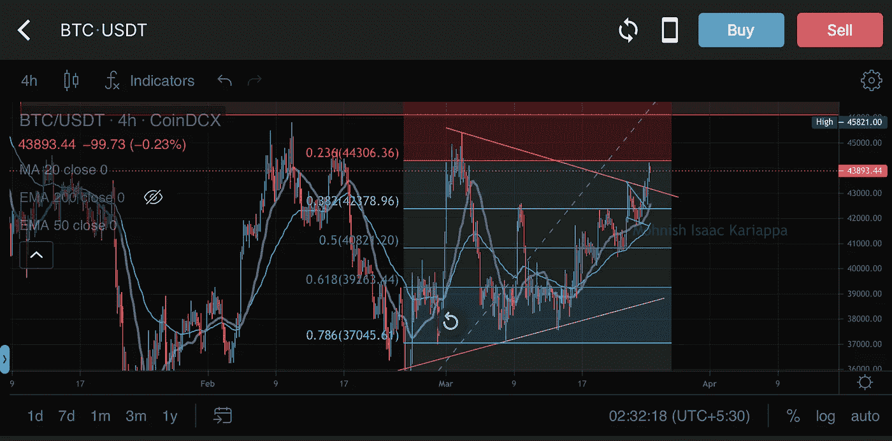

# 终极交易指南:图表和模式

> 原文：<https://medium.com/coinmonks/ultimate-trading-guide-charts-pattern-a2338b6293e4?source=collection_archive---------28----------------------->

# CoinDCXpathbreaker

在这篇文章中，我将讨论你可以在交易中使用的最有用的图表模式。

图表模式将是你进入技术分析世界的敲门砖，相信我，一旦你开始掌握技术分析的诀窍，你将不再依赖任何交易来源。在文章中，我将详细讨论以下主题:

## 斐波那契回撤和延伸

BTC/USDT 4H on CoinDCX Pro app

ETH/USDT 4H on CoinDCX Pro app

对于任何价格运动，斐波纳契回撤线可以从最高点画到最低点。在这个价格范围内，比率分割的支持/阻力线被画出，并可以作为价格行动的**潜在反转区** (PRZ)交易。交易者密切关注这些水平，开始或结束交易，使斐波纳契比率更加一致。

交易者可以根据相关的**支撑位:阻力位**模式轻松识别系统，因为该工具遵循斐波纳契数列的顺序。令人惊讶的是，任何资产的价格行为都能够很好地遵循斐波纳契比率，并且能够清楚地表明价格趋势反转、拒绝水平和支撑区域。

你可以使用斐波纳契回撤和延伸来分析宏观或微观趋势，就像我在下面的 BTC/USDT 日线图中使用的一样…

BTC/USDT 1D Fibonacci Retracement (CoinDCX)

在更高的时间框架图上使用 fib，可以帮助交易者绘制宏观结构和价格走势图…

XRP/USDT 1H on CoinDCX Pro app

类似地，进行日内交易的交易者也可以利用较低时间框架的谎言，比如 1H 图表。CoinDCX Pro 应用上图 **XRP/USDT。**

## 干草叉

干草叉从价格的最高点或最低点画出，连接到另一个最低点或最高点，锚点是之前的最低点或最高点。

**中线(红色)**给出了趋势的预期均值，也就是说，价格将继续试图回到这条线，直到跌破或高于这条线，这取决于干草叉的图表。

BTC/USDT 1D on CoinDCX Pro app

如上图所示，有 4 条对角线(不包括红色对角线)，干草叉的每条对角线代表一个潜在的反转区；或者支撑:阻力线。

上面的蓝色对角线区域是“严重超买”，下面的蓝色对角线区域是“严重超卖”

## 分形

图表上的分形将重复价格模式，这将通过一致的价格行为显示出来。图表模式和谐波是已知的重复分形的例子。

上面的图表清楚地显示了第一个橙色的盒子，价格在进一步下跌之前与 3 个蓝点汇合。

第二个方框显示了相同的分形，在与第三个蓝点汇合后，BTC 的价格没有跌破 31，000 美元的水平(在撰写本文时)

## 图表模式

**所有图表模式包括:**

**体积蜡烛**

BTC/USDT Volume candles on chart

在上面的 **BTC/USDT、**的图表中，我们可以看到指向**音量蜡烛的白色箭头。**这些蜡烛与资产价格行动的主要蜡烛相对应。如果你放大，你可以在图表上看到任何主要的**红色**蜡烛线，它也与 **BTC/USDT** 对的成交量蜡烛线相对应。

成交量蜡烛线给你一个给定时间内买/卖压力的概念。上图是在 **1D TF** 上，也就是说成交量代表 **24 小时的买入/卖出数据**。

交易**突破&分解形态时，成交量蜡烛线非常重要。**例如，如果我们在价格从**下跌楔形(看涨形态)**向上突破后等待做多，那么突破也应该有巨大的成交量支持，表明**强大的买入压力。**

永远记住，**上涨的价格** & **下跌的成交量**都是**看跌的迹象**

**实测招式**

Bear Flag pattern on BTC/USDT

每一种模式，不管是看涨还是看跌，都给了我们衡量的走势。通常，所有测量的移动都是简单地通过测量图案的大小来计算的。

在上图中，我们看到一个**熊旗**阵型。价格跌破旗帜形态后，衡量的移动就是旗杆的**长度。**

总会有误差&你不应该考虑 100%的准确性。相应地关闭位置大小。

**通过模式进行交易输入**

Head & Shoulders on BTC/USDT

上面的图表显示了“H”的形成。现在，交易进场虽然模式是做多或做空硬币的强有力的方法，但是如果交易想法过早执行，它肯定会是一场灾难。

上面的 H&S 是成功的，如果交易者等待价格:

1.  **从领口击穿**
2.  **重新测试领口&确认为电阻**
3.  **然后开仓做空，止损在颈线上方**

有时价格会出现错误的下跌，让交易者措手不及，并立即反弹— **使整个设置&模式无效。**

一旦**价格行动**允许，所有的**技术模式**都可以被画在图表上并被预测，但是交易执行不应该发生。

**趋势逆转**

Trend Reversals

作为交易者，你应该随时注意图表上的趋势反转。在上面所附的 **BTC/USDT** (CoinDCX)的图表中，我们可以清楚地看到绿色突出显示的区域是一个**向上趋势的价格动作，**，但是因为我们发现了一个带有蓝色水平线的阻力区域&价格未能突破它，我们可以检测到趋势反转。

同样，在**熊市趋势**的底部，如果你看到一个熊市形态形成，它总是指示一个**延续形态**，而不是**趋势反转区。**

## 结论

目前我们处于熊市，这是无可否认的事实。作为交易者，你不应该专注于**恐慌或报复交易**，而是磨练你的交易技巧，专注于自我教育……网上有大量的资源&你甚至可以利用 [**CoinDCX 学习**](https://dcxlearn.com/)

熊市是一个绝好的机会，让你远离兴奋的噪音，专注于为下一轮牛市做准备。

…

非常感谢 [CoinDCX](https://coindcx.com/) 给我这个机会写这么详细的报告，并成为**# coindcxpathbaker**计划的一部分，使我能够与加密领域的每个人分享这些知识。

> 加入 Coinmonks [电报频道](https://t.me/coincodecap)和 [Youtube 频道](https://www.youtube.com/c/coinmonks/videos)了解加密交易和投资

# 另外，阅读

*   最佳[加密借贷平台](/coinmonks/top-5-crypto-lending-platforms-in-2020-that-you-need-to-know-a1b675cec3fa) | [杠杆代币](/coinmonks/leveraged-token-3f5257808b22)
*   最佳[加密制图工具](/coinmonks/what-are-the-best-charting-platforms-for-cryptocurrency-trading-85aade584d80) | [最佳加密交易所](/coinmonks/crypto-exchange-dd2f9d6f3769)
*   [比斯勒评论](https://coincodecap.com/bitsler-review)|[WazirX vs coin switch vs coin dcx](https://coincodecap.com/wazirx-vs-coinswitch-vs-coindcx)
*   [7 大副本交易平台](https://coincodecap.com/copy-trading-platforms) | [买币点评](https://coincodecap.com/buycoins-review)
*   [MyConstant 点评](https://coincodecap.com/myconstant-review) | [8 款最佳摇摆交易机器人](https://coincodecap.com/best-swing-trading-bots)
*   [Godex.io 审核](/coinmonks/godex-io-review-7366086519fb) | [邀请审核](/coinmonks/invity-review-70f3030c0502) | [BitForex 审核](https://coincodecap.com/bitforex-review)