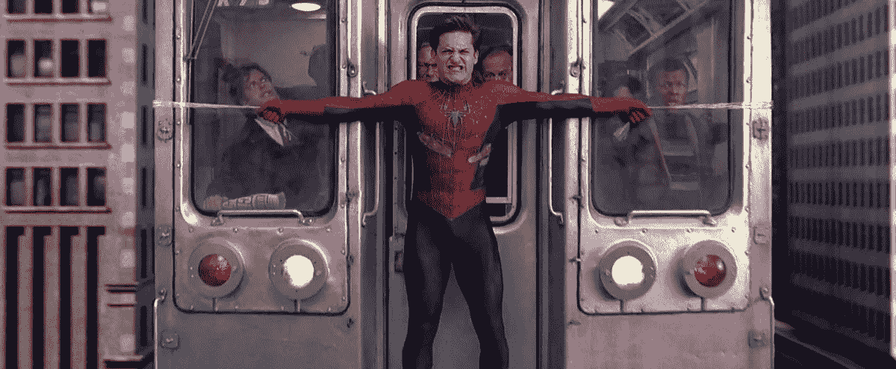
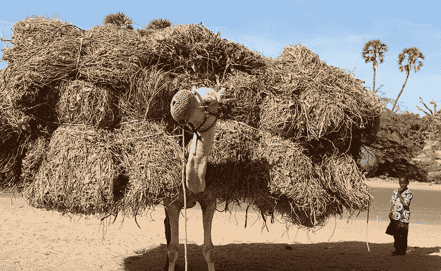
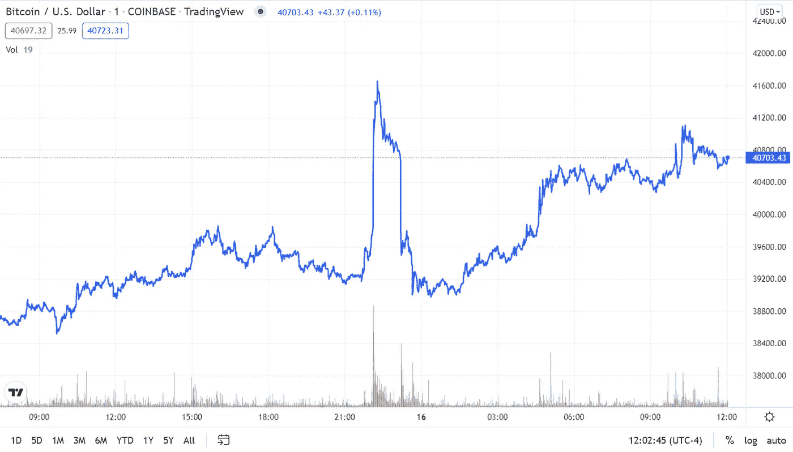

# 解禁区块链，第二部分

> 原文：<https://medium.com/coinmonks/unblocking-blockchain-part-ii-db305bb94704?source=collection_archive---------98----------------------->

***旧闻就是好消息***

正如我在 2022 年 3 月 15 日下午写的那样，比特币在 39500 美元的范围内，这听起来很糟糕，如果你碰巧在 2021 年 11 月读到这篇文章，在这种情况下:做空 BTC/美元，在超级碗比赛中拿下孟加拉+4 和以下。

但请假装你在今年 1 月 21 日读到这篇文章，当时 BTC 雕刻了一根 10%的红烛，并从 11 月份的高点首次跌至 39，000 美元以下。想象一下我告诉你以下内容:

——美联储主席杰罗姆·鲍威尔(Jerome Powell)不仅会否认“通胀是短暂的”这一愚蠢观点(他在去年 12 月就这么做了)，还会公开考虑在 3 月份加息 50 个基点，并在今年加息 6 至 7 次

——俄罗斯入侵乌克兰，将石油价格推高至 100 多美元，小麦价格上涨近一倍，黄金价格创下历史新高，镍价格升至。。。[好主](https://markets.businessinsider.com/commodities/nickel-price)。。。

—由于 COVID，中国再次锁定，达美和奥米克隆变体已经联手进行团聚之旅

。。。BTC 3 月 15 日的价格将高于今天的收盘价格。如果你像我一样，你的第一个想法会是“等等，孟加拉虎队进了超级碗？”

但是你的第二个想法会是。。。这怎么可能？”

比特币本应是一种风险资产。然而，S&P 下跌了近 5%，纳斯达克南方指数甚至下跌了 6%，尽管 king crypto 的旅程并不是最平稳的，但它已经收支平衡，轻松跑赢了波动较大的科技股，如 Paypal (-39%)、Meta (-37%)和网飞(-13%，但这是在 1 月 21 日因错过用户数量而暴跌 21%之后。它甚至远远超过了比特币基地(-19%)。

包括我在内的每一个来到 crypto post-COVID 的人可能会把“力量”等同于抛物线上升🚀🚀🚀天文表情符号🌙🌙🌙。

但在世界陷入地狱的时候，能够坚持下去是一种很大的力量。

Pictured: Bitcoin holding its $35K support

看跌者正在为比特币磨刀，许多人仍然坚持认为比特币可能会跌至 20，000 美元左右。但是经历了这一切之后，为什么现在它会崩溃呢？

周三下午，鲍威尔和美联储将决定是否加息，或者说，加息多少。他们还将根据宏观经济数据给出前瞻性指引，为未来的决策提供框架。

但是市场已经消化了 25 个百分点的加息和随之而来的坏消息。鉴于岌岌可危的经济时代精神，美联储可能不会做出太多改变。如果我们生活在一个“[超级泡沫](https://www.youtube.com/watch?v=yF7EJhkt4Y8)”中，美联储明智的做法是慢慢将空气排出。

之后。。。是什么让 crypto 变得更低？周五是期权到期日，随着比特币的平衡达到最大痛苦点，这往往会产生清算的重大波动。

当然，中国可能会入侵台湾，或者某个政府可能会通过一项愚蠢的法律禁止比特币采矿，或者[这个淫秽的重磅炸弹可能最终会落下](https://twitter.com/jeffjohnroberts/status/1503410901948538883) ( **内容警告**)。

但这只骆驼似乎相当强壮，宏观世界的稻草也快用完了。

Pictured: Bitcoin

果然，就在我昨晚写这篇文章的时候，BTC 兑美元几乎垂直上涨了 5%，大约一个小时后又恢复了正常的涨势。

如果你问我，它看起来像一个中指。

BTC/USD telling you what you can do with your predictions. (TradingView)

> 加入 Coinmonks [电报频道](https://t.me/coincodecap)和 [Youtube 频道](https://www.youtube.com/c/coinmonks/videos)了解加密交易和投资

# 另外，阅读

*   [5 款最佳加密交易终端](https://coincodecap.com/crypto-trading-terminals) | [最佳 DeFi 应用](https://coincodecap.com/best-defi-apps)
*   [在美国如何使用 BitMEX？](https://coincodecap.com/use-bitmex-in-usa) | [BitMEX 评论](https://coincodecap.com/bitmex-review)
*   [最佳期货交易信号](https://coincodecap.com/futures-trading-signals) | [流动性交易所评论](https://coincodecap.com/liquid-exchange-review)
*   [南非的加密交易所](https://coincodecap.com/crypto-exchanges-in-south-africa) | [BitMEX 加密信号](https://coincodecap.com/bitmex-crypto-signals)
*   [MoonXBT 副本交易](https://coincodecap.com/moonxbt-copy-trading) | [阿联酋的加密钱包](https://coincodecap.com/crypto-wallets-in-uae)