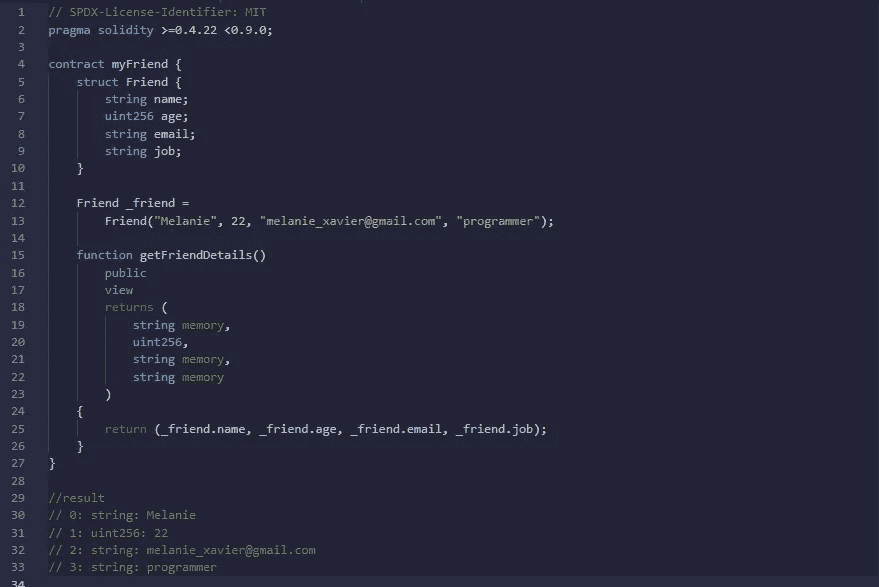
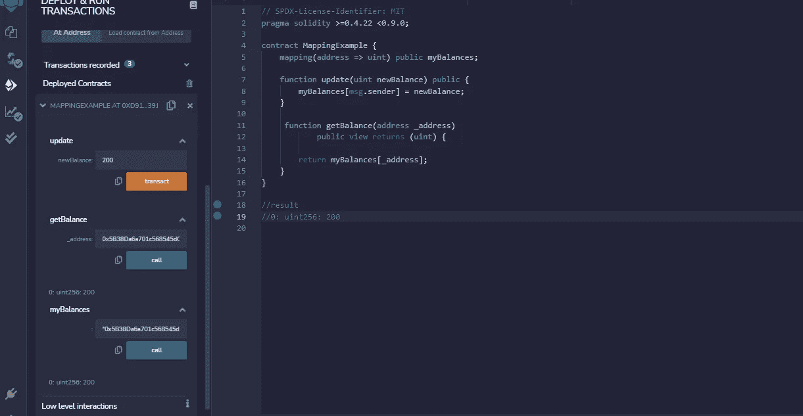

# 具有实度参考类型的引擎盖下

> 原文：<https://medium.com/coinmonks/under-the-hood-with-solidity-reference-types-16b3e4e3559f?source=collection_archive---------11----------------------->


引用类型…这到底是什么意思？😏

引用类型是一个代码对象，它不直接存储在创建它的地方，而是充当一种指向存储在其他地方的值的指针。

让我们从不同的角度来看它，称它为 ***别名*** ，这只是你引用你正在创建引用的对象的另一个名字。

一个非常贴切的例子是你给朋友起的昵称。这个人还是老样子，只是名字不同。

在 Solidity 中，与我们在上一篇关于值类型的[文章中讨论的值类型存储自己的数据不同，引用类型不直接将数据存储到变量中，而是存储数据的位置。引用类型的值可以通过多个不同的名称来修改。当使用引用类型时，我们总是必须明确地提供数据区域或**数据位置，也就是存储类型的地方。**](/@sandraifeoma22/the-nitty-gritty-of-value-types-in-solidity-9f557f146ebc)

***数据位置…***

我们可以在 3 个数据位置存储引用类型:

*   `memory` —其生存期仅限于外部函数调用
*   `storage` —存储状态变量的位置，有效期限于合同的有效期
*   `calldata` —是一个特殊的数据位置，不可修改，不持久，包含函数参数。它有类似于`memory`的行为模式

solidity 中的参照类型包括以下内容:

*   数组
*   结构
*   映射

***阵列* …**

数组是一个容器，包含一组相同数据类型的元素，如整数或字符串。数组的每个元素都有一个称为索引的特定位置，可以用。数组有不同的大小:

*   固定大小的数组
*   动态数组

**固定大小数组**是在创建和/或分配数组时确定其大小或长度的数组。例如，一个固定大小的数组`5` 和元素类型`uint` 被写成，

```
uint[5] myFixedArray;
```

**动态数组**是一种随机存取、可变大小的列表数据结构，允许添加或删除元素。动态数组的大小不是在声明时预先确定的。例如，动态大小的数组被写成，

```
uint[] myDynamicArray;
```

我们还应该提到一些特殊的数组，它们是`bytes` 和`strings`。`bytes`类型类似于`bytes1[]`，但是它被紧密地打包在调用数据和内存中。`string`等于`bytes`，但不允许长度或索引访问。一般来说，使用`bytes`表示任意长度的原始字节数据，使用`string`表示任意长度的字符串(UTF-8)数据。如果可以将长度限制在一定的字节数，那么总是使用值类型`bytes1`到`bytes32`中的一种，因为它们便宜得多。

*现在让我们了解一些数组成员* …

*   `length`-`length`成员用于获取数组中元素的数量。对于内存数组，长度是固定的和动态的，这意味着一旦创建了内存数组，它就可以依赖于运行时参数。
*   `push` -在动态存储数组和字节(非字符串)的末尾追加一个元素。新添加的元素是零初始化的。
*   `pop`删除动态存储数组末尾的元素和字节(不是字符串)。

*好的*😀*…关于数组的信息已经足够了。你可以在* *这里了解更多关于 solidity* [*中的数组。让我们来了解一下什么是结构😎🎯 *…**](https://docs.soliditylang.org/en/v0.8.11/types.html)

***结构* …**

一般来说，structs 用来表示某个东西的记录。在可靠性方面，structs 允许用户以结构的形式创建自己的数据类型。它们用于将相关数据分组在一起。结构可以包含值类型和引用类型，但不能包含自身类型的成员。

例如，假设您想要跟踪您的朋友，您可能想要跟踪以下属性:

*   名字
*   年龄
*   电子邮件
*   工作

我们可以用这样的结构来表示朋友的记录，

```
struct Friend { string name; uint256 age; string email; string job;}
```

这里有一个简单的合同来获取一个朋友的记录，



让我们先睹为快...

***映射…***

映射用于以键值对格式存储数据或信息。`**key type**`可以是任何内置类型、字节、字符串或任何契约或枚举类型，但不能是引用类型。`**value type**`可以是任何类型，包括引用类型，如映射、数组和结构。

关于映射，我们需要注意一些事情..

*   存储是映射可以拥有的唯一数据位置。
*   状态变量允许映射为函数中的存储引用类型。
*   映射没有设置键或值的概念，也没有长度。
*   映射通常用于将唯一的以太坊地址链接到相关联的值类型

映射类型的变量可以声明为，

```
mapping(_KeyType => _ValueType) _VariableName
```

用实际变量名、键类型和值类型声明映射变量的一个更明确的例子是这样写的:

```
mapping(address => uint) public myBalances;
```

在下面使用映射存储和接收用户信息的例子中，我们可以看看映射是如何工作的:



`MappingExample`契约定义了一个公共`myBalances` 映射，键类型为`address`，值类型为`uint`，将以太坊地址映射为一个无符号整数值，我们检索了存储在地址键上的余额值。

**结论**:

在这篇文章中，我们学习了 solidity 中不同的引用类型，如数组、结构和映射。

**按键参考**

[https://docs.soliditylang.org/en/v0.8.11/types.html](https://docs.soliditylang.org/en/v0.8.11/types.html)