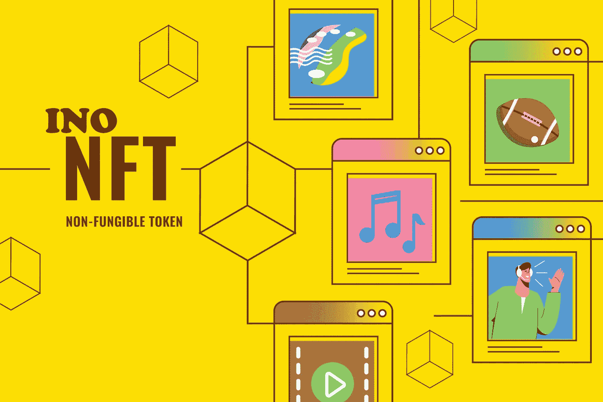

# 了解 NFT 首次公开募股(INO)

> 原文：<https://medium.com/coinmonks/understand-initial-nft-offering-ino-3a2b94b92934?source=collection_archive---------14----------------------->

Understand Initial NFT Offering ( INO )

越来越接近数字世界的 swift 策略同样将加密货币的利用加速到了高质量的程度。因此，为了帮助企业实体和蹒跚学步的系统增加现金并培育他们的企业以产生额外的知名度并吸引早期投资者，已经开发了各种各样的筹资方式和众筹倡议。这些筹资系统帮助许多企业实体扩大利润产出。值得注意的是，密码屋中最著名的筹款模特是首次发行硬币(ICO)。这个人体模型的用户奖励他们的交易者一个加密令牌来资助平台。除了 ICO，不同的优秀筹资计划包括首次交易所发行(IEO)、首次 Dex 发行(IDO)和首次 NFT 发行(INO)，这是我们在本指南中最重要的重点难点。

对分散系统的过度需求导致加密货币的声誉急剧上升，因为数字财产在世界上几乎所有地方都得到认可。这给了不可替代代币向上的竞争。因此，我们呼吁推出一种新的加密货币众筹创新“INO 匮乏”(want for America)，这种创新主要基于最初发行硬币的想法。

# 什么是 NFT 首次公开募股(INO)？

初始不可替代代币发行是一种新型的众筹平台，在规定的期限内，不可替代代币在创业初期发行。不可替代的代币(NFT)是一种可收集的数字资产，它以加密货币的形式持有价格，就像在各种艺术(如歌曲或文化)的数字插图中一样。

它是一个数字令牌，具有加密货币的变体。它的区别主要在于它的专业知识领域，以及它现在无法实现对等交换的现实。这实际上是一种能力，你不能像纸币一样兑换非货币。用 NFT 交换其他 NFT 最终会让你拥有独一无二的数字资产，NFT 通常由附近的加密货币支持。如前所述，不可替换的令牌可以是绘画收藏品、文件、音轨文件、音频或买卖卡的结构。

# INO 是如何工作的

了解了 INO 的含义后，理解它是如何工作的是必不可少的。NFT 的定义与选择顶尖的 NFT 市场所必须的一些因素是一致的。NFT 是所有交易的 T2 区块链 T3 上资产的数字说明。区块链本质上因其在[去中心化金融](https://cryptoworldfinace.blogspot.com/2021/12/liquidity-pools-in-defi-explained.html)领域的众多功能而得到认可。一个著名的用于保留非金融交易的区块链平台是[以太坊(ETH)](https://cryptoworldfinace.blogspot.com/2021/12/understanding-ethereum-blockchain.html) ，旁边是为以太坊上的交易提供帮助的不同区块链的位置。

创建一个 NFT 包括说明数字对象，无论是有形或无形的项目。这些对象应该包括收藏品、音乐、视频、艺术品、gif、时尚设计师运动鞋、体育活动集锦、数字化身和视频游戏。一些不常见的对象，比如 tweets，在 NFTs 的世界里有适当确定的注意力。

出于这个原因，更简单的做法是，把不可替代的代币想象成数字屋中个人收藏的小玩意。购买者可以获得一个拥有所有权的数字文件，而不是获得一幅真正的画。NFTs 在特定时间应该只有一个所有者。

# INO 的优势

如前所述，随着许多新爱好者投入 NFT 市场，非功能性测试正在获得巨大的采用。这解释了非上市交易的增加，随之而来的是为 NFT 市场提供大量优势的首次 NFT 发行的上升。以下是其中的一些:

*   无需专业知识即可轻松启动 NFT 任务。最初的 NFT 产品使人类能够毫无困难地实现受限版本的 NFTs。有了 NFT 首次发行的元素，每个对 NFT 地区知之甚少的人都可以通过 INO 的帮助接触到更广泛的观众。因此，打算建立 NFT 倡议的艺术家们在资金上面临挑战，可以通过在项目发展之前的首次 NFT 发行来增加所需的资金。
*   降低交易价格，获得更高的资金回报。具有特殊元素的初始 NFT 产品使客户在交易上花费少得多。创造者和发明者陶醉于交易成本的降低，因为首次 NFT 发行有助于限制这些创造者和购买者的交易费用。与受限制的交易价格相结合的是，首次 NFT 发行获得了更大的资金回报，因为交易商从非上市交易的内在短缺中获得了优势。

# 结论

除了对加密货币更感兴趣之外，NFT 也受到了很多关注。随着 NFT 市场的成长和成熟，NFT 债券发行的融资性质变得越来越清晰。随着 NFT 的上市，NFT 的生态系统将会发生革命性的变化。INO 是一个现代的答案，它揭示了所有人都面临的挑战。它实现了 NFT 的流动性，简化了记录过程，避免了合规风险，并为用户提供了一个包容性的旅程。[阅读更多](https://cryptoworldfinace.blogspot.com/2022/01/understand-initial-nft-offering-ino.html)。

> 加入 Coinmonks [电报频道](https://t.me/coincodecap)和 [Youtube 频道](https://www.youtube.com/c/coinmonks/videos)了解加密交易和投资

## 也阅读

 [## 杠杆代币[多头代币]终极指南

### 杠杆化令牌是具有杠杆化风险敞口的 ERC20 令牌，不考虑保证金、要求、管理…

medium.com](/coinmonks/leveraged-token-3f5257808b22)  [## 最佳加密交易所| 2021 年十大加密货币交易所

### 编辑描述

blog.coincodecap.com](https://blog.coincodecap.com/crypto-exchange)  [## 2021 年最佳加密交换平台| CoinCodeCap

### 如果我们看看今天的场景，许多加密货币交换平台提供了广泛的功能和深度…

blog.coincodecap.com](https://blog.coincodecap.com/best-swap-platforms)  [## 10 大最佳网上赌场[2021] |赢取免费 BTC | CoinCodeCap

### 编辑描述

blog.coincodecap.com](https://blog.coincodecap.com/best-online-casinos)  [## 2021 年最佳加密借贷平台| 6 大比特币借贷平台

### 获得比特币和其他加密货币的最佳贷款利率

medium.com](/coinmonks/top-5-crypto-lending-platforms-in-2020-that-you-need-to-know-a1b675cec3fa)  [## 2021 年 6 大最佳硬件钱包|顶级加密硬件钱包[更新]

### 最好的加密货币硬件钱包是绝对必要的。我们将在 NGRAVE、Ledger Nano X 和…

medium.com](/coinmonks/the-best-cryptocurrency-hardware-wallets-of-2020-e28b1c124069)  [## 2021 年最佳免费加密交易机器人

### 2021 年币安、比特币基地、库币和其他密码交易所的最佳密码交易机器人。四进制，位间隙…

medium.com](/coinmonks/crypto-trading-bot-c2ffce8acb2a)