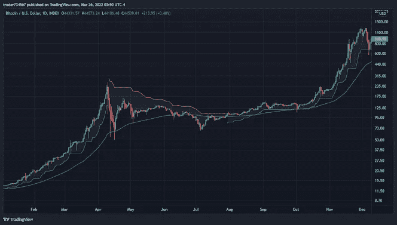
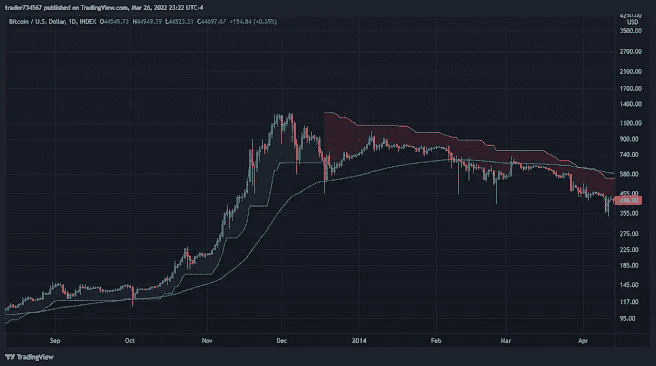

# 从不同的角度理解比特币#2

> 原文：<https://medium.com/coinmonks/understanding-bitcoin-from-a-different-perspective-2-6a09651a3cc5?source=collection_archive---------46----------------------->

2013 年 4 月 11 日比特币在两天内下跌超过 70%,恐慌抛售随之而来。

*中本聪是？*

*嗯，聪的神秘将永远存在。对我来说，我认为聪是一个理想主义者。与其猜测，不如试着分析一下比特币的转折点。“维基解密宣布他们接受比特币捐赠，因为他们被踢出了其他所有主要的支付平台。维基解密因发布机密军事文件而成为新闻焦点，许多人第一次听说比特币是在与维基解密联系在一起时。*

*Satoshi:“在任何其他情况下，得到这样的关注都很好。维基解密已经捅了马蜂窝，蜂群正向我们扑来。”简而言之，satoshi 正在创造他真正相信会改变世界的东西。他相信比特币社区。任何优秀领导者的品质都是授权的能力，通过 satoshi 放弃比特币，实际上帮助网络发展了点对点价值交换的理念。*

在抛售狂潮开始后的短短六天内，比特币从 228.94 美元跌至 68.09 美元，使比特币回到了本月初的水平。那时候到底发生了什么？“任何当时交易比特币的人，如果有兴趣与我交谈，请发表评论或给我发短信。”Mt Gox 无法跟上贸易量的增长。当时，他们控制了超过 70%的比特币交易。他们不得不完全停止交易，让事情平静下来。该交易所表示，“最近几天注册的新账户数量惊人……对开始滞后的整体系统产生了重大影响。”人们开始恐慌，大量抛售比特币，导致交易热潮，最终导致贸易引擎崩溃。对投资者来说，这有点像打了一记耳光，但上个月已经见证了如此巨大的涨幅，以至于任何在前一个月购买了该货币的人仍将获利。让我买更多的比特币来纪念它。

美国政府首次没收比特币，导致价值暴跌不到 7%。在对一名所谓的毒贩进行突袭后，美国官员于 4 月 12 日宣布，他们首次没收了比特币。一名涉嫌在丝绸之路贩卖毒品的男子因携带 11.02 比特币被缉毒署逮捕。比特币的非官方巴勃罗·埃斯科巴。

7 月 5 日，油价跌至 66.93 美元的低点，今年年初为 13.24 美元，4 月份达到 235.29 美元的高点。全球最知名的比特币交易所 Mt. Gox 已经停止用美元支付，理由是“交易量越来越大”。继今年早些时候比特币大幅飙升的欢欣鼓舞之后，媒体逐渐对这种加密货币失去了兴趣。此外，在这个时候，你仍然不能用比特币购买很多东西，这对一种货币来说有点糟糕。哦，但是这个年轻的硬币有一个非常不同的未来，等着瞧吧。这是一个你希望你有一个时间机器去购买的时候。

还记得丝绸之路，那个接受比特币作为支付的匿名网上黑市吗？插头终于在 2013 年 10 月被拔掉，导致比特币价格暴跌超过 18%，从 127.30 美元跌至 103.85 美元，最低时为 85 美元。经过两年的联邦调查局(FBI)调查，Ulbricht 在旧金山公共图书馆被捕(那时候书还是个东西)。这位可怕的海盗被判处终身监禁，因为他的个人钱包中有 144，000 枚比特币被没收，并在一次秘密拍卖中出售(由著名的加密冠军蒂姆·德雷珀赢得)。然而，他仍然是比特币最狂热的支持者之一。尽管存在争议，比特币在被捕后的第二天上涨了 13%。

**2013 年 11 月 20 日欢迎中国加入比特币(fud 国家😅)**

中国外交部长王毅采取了建设性的姿态。在一次会议上，他宣称中国公民“可以自由参与比特币市场”，并承诺要“从长远角度”看待这种货币。这一保证大大减轻了人们的忧虑。BTC China(当时世界上最大的比特币交易所)的交易量增加了，而全球比特币价格从 600 多美元上涨到 1000 多美元。中国一直对比特币有着重大影响，中国交易员渴望拥抱比特币的自由，将其作为中国严格控制的货币的可行替代方案。

11 月，比特币达到 1000 美元，结束了自 2012 年比特币首次减半以来的长期价格飙升。但是等等，这个故事还有更多。根据塔尔萨大学和特拉维夫大学的研究，2013 年的上升可能是由两个机器人引起的——每个机器人都由背景中的一个影子控制。在一年的时间里，这些机器人买卖了数十万枚比特币来操纵市场。11 月 19 日，价格单日涨跌幅度高达 50%，彰显了当月的极端波动性。它在 11 月 30 日达到 1163 美元的峰值，然后开始了未来两年将持续的长期下跌趋势。

2013 年 12 月 5 日

中国逆转对比特币的立场。中国央行正式禁止金融机构和支付公司使用人民币，导致了一场意料之外的崩盘。尽管自 2009 年以来，中国一直禁止用虚拟货币购买实物，但百度(Baidu)和易宝支付(YeePay)等互联网公司仍继续将比特币用于各种服务。所有这一切都在 2013 年终结，当时央行宣布比特币是一种资产而非货币。人们愤怒了，因为这使得它有责任缴纳一系列的附加税。

同月，中国最大的加密交易所 BTC China 停止接受人民币存款。尽管个人在没有第三方支付提供商的情况下兑换硬币仍然是合法的，但活动几乎立即就结束了。中国是比特币的主要影响者吗？就在禁令颁布后，比特币从 12 月 4 日的 1131.76 美元跌至 12 月 7 日的 693.30 美元，市值缩水了一半以上。在接下来的三年里，它不会以 1000 美元收盘。

由纽特拉德撰写

> 加入 Coinmonks [电报频道](https://t.me/coincodecap)和 [Youtube 频道](https://www.youtube.com/c/coinmonks/videos)了解加密交易和投资

# 另外，阅读

*   [5 款最佳加密交易终端](https://coincodecap.com/crypto-trading-terminals) | [最佳 DeFi 应用](https://coincodecap.com/best-defi-apps)
*   [比特币基地 vs 瓦济克斯](https://coincodecap.com/coinbase-vs-wazirx) | [比特鲁点评](https://coincodecap.com/bitrue-review) | [波洛涅克斯 vs 比特鲁](https://coincodecap.com/poloniex-vs-bittrex)
*   [德国最佳加密交易所](https://coincodecap.com/crypto-exchanges-in-germany) | [Arbitrum:第二层解决方案](https://coincodecap.com/arbitrum)
*   [币安交易机器人](/coinmonks/binance-trading-bots-d0d57bb62c4c) | [OKEx 评论](/coinmonks/okex-review-6b369304110f) | [阿塔尼评论](https://coincodecap.com/atani-review)
*   [最佳加密交易信号电报](/coinmonks/best-crypto-signals-telegram-5785cdbc4b2b) | [MoonXBT 评论](/coinmonks/moonxbt-review-6e4ab26d037)