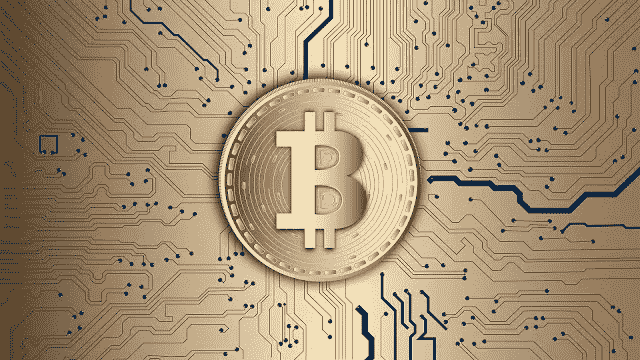

# 从不同的角度理解比特币#3

> 原文：<https://medium.com/coinmonks/understanding-bitcoin-from-a-different-perspective-3-ead72560d621?source=collection_archive---------95----------------------->

*比特币的价值是什么？是资产还是货币？* *在我看来它既不是正义的也不是。在第一篇文章中，我们发现比特币首次由交易所定价。他们通过计算单台计算机开采一枚比特币所需的电力来实现这一点。那么，如果最后一枚比特币将在 2040 年被开采，那么比特币的定价会是多少呢？*

2014 年 1 月 31 日

尽管就在一个月前，中国人民银行取消了对人民币的限制，但 BTC China 已经恢复交易。价格保持稳定。全球最知名的交易所之一 BTC China 表示，将恢复允许人民币交易。“一切都很好。它从未被政府明令禁止。”BTC 中国首席执行官世尘小雪告诉美国消费者新闻与商业频道。这看起来像是毫无理由的大惊小怪。此前一个月，比特币价格下跌了 70%😡😡。

2014 年 2 月 24 日

全球最大的比特币交易所 Mt. Gox 已经宣布破产。交易所破产了；几乎所有的比特币资产都消失了，包括大约 65 万枚属于客户的比特币(价值约 4000 万美元)和 10 万枚属于交易所本身的比特币。黑客利用比特币协议中的一个弱点，抽走了该交易所的所有资产。“交易延展性”是一个设计缺陷，它允许多次提取相同的金额，但这并不是一个新概念。这个问题已经被其他交易所发现并编码了。令人惊讶的是，比特币经受住了声誉损害，人们指责交易所而不是资产。比特币已经从 2013 年 12 月 1160 美元左右的高位跌至 2014 年 2 月的不足 400 美元。

2014 年 3 月 26 日

美国国税局效仿中国的做法，认定比特币是财产而非现金，因此要缴纳资本利得税。此举粉碎了加密货币自由和去中心化的创始价值观。缺乏信心导致其价值在接下来的一个月下跌了 33%，从 3 月 10 日的 600 多美元跌至 4 月中旬的 400 多美元。

2014 年 6 月 13 日

采矿池 GHash 现在控制着所有哈希输出的 51%，这使它能够绕过比特币区块链的去中心化，并对其许多功能进行控制。这到底意味着什么？哈希是制造比特币的计算过程。它是矿工执行来构建单独的块，这些块随后被添加到链中。如果有人持有超过 51%的 hashrate，他们可以拒绝甚至反向交易，两次花费相同的硬币，要求更高的费用，甚至拒绝比特币网络服务。当年晚些时候，矿池召集了一次矿工和开发商的圆桌会议，试图拿出一个长期解决 51%问题的方案。这导致了对隔离见证特性的支持(稍后将详细介绍)。

2014 年 7 月 30 日

今年夏天，一系列热切的企业加入了比特币热潮，包括微软(Microsoft)、戴尔(Dell)、brain tree(Paypal 在 PYPL 的子公司)和在线购物巨头 Overstock。然而，长期价格下跌仍在继续，到今年年底，比特币将回到 300 美元以下。事实上，有可能是大公司压低了价格。接受比特币作为支付方式后，他们会立即在市场上出售手中的比特币，以便将其兑换回普通现金，从而增加供应量并使比特币贬值。等等，我以为投资比特币的机构会带我们去月球。这就是加密推特告诉我们的。

没想到，一个交易员卖出了有史以来最大的一笔比特币交易。他试图在 Bitstamp 平台上以 300 美元的价格出售 30，000 枚硬币，远低于当前 300 多枚硬币的售价。“熊鲸”让市场如此困惑？为什么卖这么便宜？—价格有点波动。但只是短暂的一瞬间。一些人认为，900 万美元的降价幅度是有意为之，以提高市场的突出地位，吸引新的买家，这将有助于吸收交易量。在比特币领域，“杀死熊鲸”已经成为传奇，产生了大量的神话、诗歌和艺术来纪念他的滑稽动作。

2015 年 1 月 4 日:

黑客对 Bitstamp 员工 Luka Kodric 进行了有针对性的网络钓鱼攻击，以获得对该交易所系统的访问权限，并窃取了近 2 万枚比特币，价值超过 500 万美元。价格从 1 月 4 日的 264 美元跌至下一周的 171 美元。这不是世界末日，当然也不是另一个 Mt. Gox。窃贼只拿走了 Bitstamp 总硬币的一小部分，盗窃行为对客户账户或存放该公司大部分资产的“冷藏”部分没有影响。

2015 年 2 月 4 日

现在有超过 10 万个商家接受比特币，包括微软(MSFT)、戴尔(戴尔)、维基百科(Wikipedia)、Twitch、绿色和平组织(Greenpeace)、Expedia 和贝宝(PYPL)。由于商家的广泛采用，人们可能会相信比特币具有真正的货币价值，而不仅仅是一种数字投资。根据比特币支付处理器 BitPay 的数据，去年比特币风险投资活动增加了 342%，从 2013 年的 9600 万美元增加到 2014 年的 3.35 亿美元。Xapo 获得 4000 万美元，区块链获得 3000 万美元，BitPay 获得 3050 万美元。

一些值得注意的事情:

*   中国和比特币有着有毒的关系
*   比特币从 1000 多美元跌至 171 美元👀。
*   熊鲸的传说。
*   Ghash 曾经拥有整个比特币网络 51%的控制权

由纽特拉德撰写

*原载于 2022 年 3 月 28 日*[*【https://cryptoverse2.blogspot.com】*](https://cryptoverse2.blogspot.com/2022/03/understanding-bitcoin-from-different_28.html)*。*

> 加入 Coinmonks [电报频道](https://t.me/coincodecap)和 [Youtube 频道](https://www.youtube.com/c/coinmonks/videos)了解加密交易和投资

# 另外，阅读

*   [印度最佳 P2P 加密交易所](https://coincodecap.com/p2p-crypto-exchanges-in-india) | [柴犬钱包](https://coincodecap.com/baby-shiba-inu-wallets)
*   [8 大加密附属计划](https://coincodecap.com/crypto-affiliate-programs) | [eToro vs 比特币基地](https://coincodecap.com/etoro-vs-coinbase)
*   [最佳以太坊钱包](https://coincodecap.com/best-ethereum-wallets) | [电报上的加密货币机器人](https://coincodecap.com/telegram-crypto-bots)
*   [交易杠杆代币的最佳交易所](https://coincodecap.com/leveraged-token-exchanges)
*   [最佳加密分析或链上数据](https://coincodecap.com/blockchain-analytics) | [Bexplus 评论](https://coincodecap.com/bexplus-review)