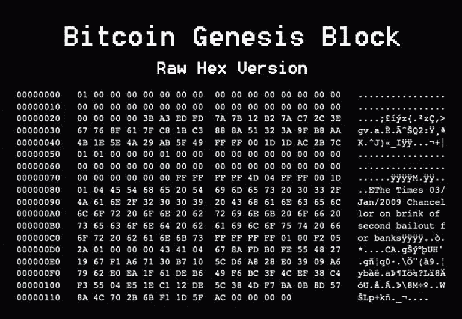

# 从不同的角度理解比特币#4

> 原文：<https://medium.com/coinmonks/understanding-bitcoin-from-a-different-perspective-4-f8fa66ee2ee2?source=collection_archive---------58----------------------->

11 月 19 日，芬尼称赞了 Satoshi 的一些修改，并询问了比特币网络的理想规模，这将影响可扩展性和性能。你认为它会变得多大？上百个节点？几千？“几百万？”这预示着规模讨论，最终导致比特币现金等分裂加密货币的出现，以及侧链和闪电网络等所谓的第二层解决方案的出现。

不同寻常的是，比特币社区发布了一份季度报告，对于这样一种通常不稳定的货币来说，其价值保持了显著的稳定。在本季度，该网站的页面浏览量超过 700 万次，该页面引入了三个新的钱包供用户选择，提供了超过 114 页新的开发人员文档，并上传了 26 种语言的翻译。

今年 3 月，比特币基金会迎来了一名新成员，奥利维尔·扬森斯的第一件事似乎是在 Reddit 帖子中披露了一系列比特币秘密，声称由于“两年来荒谬的支出和考虑不周的决定”，该基金会“实际上已经破产”根据他的揭露，比特币基金会几乎没有钱了，已经解雇了 90%的员工。

过去几个月，比特币的价格一直徘徊在 220 美元至 240 美元之间，但在 6 月 16 日，比特币达到了 252.05 美元的峰值。据一些人说，价格上涨归因于希腊的经济形势。乍一看，这似乎是一种疯狂的关联，但希腊经济状况不佳。如果该国不履行信贷义务，银行账户甚至可能被冻结。在这种情况下，数字货币可能是进出该国的主要手段。这是我们首次看到比特币被一个主权国家视为解决传统金融局限的可行方案。

比特币核心开发者迈克·赫恩(Mike Hearn)和加文·安德森(Gavin Andresen)发布了比特币 XT，这是该软件的一个新版本，略有修改。对分拆的担忧推动了价格波动。这个问题可以归结为对链条块大小的分歧。安德森、赫恩和他们的追随者声称，随着货币越来越受欢迎，积木的尺寸也应该增加。他们警告说，如果这种情况没有发生，比特币将跌入“容量悬崖”，所有区块都将变满，导致交易积压。这将使网络数据泛滥，造成长时间的延迟，并可能提高速率。比特币 XT 提出将区块大小从 1MB 增加到 8MB 作为解决方案。

然而，新软件的发布让许多人感到震惊，因为它提供了比特币社区可能无法就大小达成一致的机会。在一个分散的团队中，共识是至关重要的，持久的争论可能会导致永久的分裂。然而这一次，它没有按计划进行:很少有矿工选择比特币 XT，替代软件最终在 2016 年年中左右消亡。然而，硬分叉的前景继续令市场担忧，价格从 8 月 15 日的 261.46 美元跌至 8 月 24 日的 209.72 美元。

欧盟已经宣布不对比特币交易所征收增值税，并宣布其为合法货币，这对 crypto 来说是一个巨大的收益。相比之下，美国政府在 9 月份将比特币归类为商品。欧洲的裁决也很受欢迎，比特币新的免税地位吸引了交易员，推动价格回升至 300 美元。

“比特币已经失败了，”比特币核心工程师迈克·赫恩(Mike Hearn)宣布，他之前曾开发过替代的比特币 XT 软件。他也是中本聪据称在 2013 年 10 月给他写“辞职”邮件的人。“基本面已经崩溃，”赫恩在 Medium 上写道，“无论价格在短期内发生什么，长期趋势肯定会更低。”他声称已经卖掉了他所有的硬币，并警告说“网络正处于技术故障的边缘。”当然，这么多年过去了，比特币还在使用。

比特币网络上第一个成功的零知识或有支付(ZKCP)已经宣布。价格上涨了 2%。零知识条件支付是一种交易协议，允许买方使用比特币匿名安全地从卖方购买信息；简单地说，你不必相信任何人，因为除非付款，否则不会传输任何信息。

日本政府批准了一项法案，承认虚拟货币等同于真实货币，具有支付能力和数字化转移能力。这是向前迈出的重要一步，因为许多其他国家仍在努力应对加密货币可能或应该扮演的角色。《支付服务法修正案》旨在将该行业置于日本金融厅(FSA)的监管之下，并对虚拟货币交易所以及向日本用户提供服务的海外交易所提出新的注册要求。它还对加密货币交易所实施了一系列附加监管，如记录保存、年度报告和反洗钱合规性。

经过几周相当稳定的整体价格表现，尽管日间交易存在波动，但比特币的收盘价达到 467.42 美元，为 2014 年 9 月以来的最高水平。加密货币技术的广泛使用被认为是激增的原因。英特尔(INTC)宣布计划雇用区块链技术公司，Storj，一个新的区块链技术开发商，加入了微软(MSFT) Azure 区块链，英国宣布计划在 4 月 26 日使用区块链跟踪纳税人的钱。

第二次减半即将到来。人们欣喜若狂，比特币也在受益。这将成为一个不争的事实，5 月份价格将上涨 10%。关于是什么导致了 5 月份的激增，有一些理论，但最有可能的是多种因素的混合。竞争货币以太坊(Ethereum)在几个月前进入市场，吸引了全球对数字货币生态系统的更多关注，最终给比特币带来了一些有意义的竞争。减半的前景也激发了英国市场的热情。5 月份以 448.43 美元的价格开始，5 月份收于 531.84 美元，6 月份的价格有所上涨。

纽特拉德写的。

> 加入 Coinmonks [电报频道](https://t.me/coincodecap)和 [Youtube 频道](https://www.youtube.com/c/coinmonks/videos)了解加密交易和投资

# 另外，阅读

*   [如何在 FTX 交易所交易期货](https://coincodecap.com/ftx-futures-trading) | [OKEx vs 币安](https://coincodecap.com/okex-vs-binance)
*   [CoinLoan 评论](https://coincodecap.com/coinloan-review) | [YouHodler 评论](/coinmonks/youhodler-4-easy-ways-to-make-money-98969b9689f2) | [BlockFi 评论](https://coincodecap.com/blockfi-review)
*   [XT.COM 评论](https://coincodecap.com/profittradingapp-for-binance)币安评论 |
*   [SmithBot 评论](https://coincodecap.com/smithbot-review) | [4 款最佳免费开源交易机器人](https://coincodecap.com/free-open-source-trading-bots)
*   [比特币基地僵尸程序](/coinmonks/coinbase-bots-ac6359e897f3) | [AscendEX 审查](/coinmonks/ascendex-review-53e829cf75fa) | [OKEx 交易僵尸程序](/coinmonks/okex-trading-bots-234920f61e60)