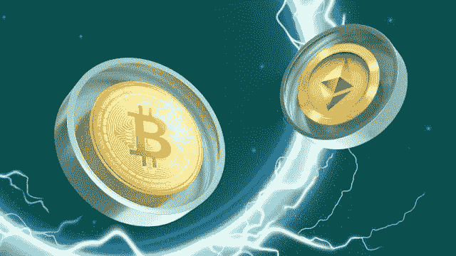

# 从不同的角度理解比特币#5

> 原文：<https://medium.com/coinmonks/understanding-bitcoin-from-a-different-perspective-5-9587ef5b5323?source=collection_archive---------71----------------------->

**2016 年 7 月 9 日***6 月 21 日，价格下跌超过 10%,因为一项民意调查显示，英国选民倾向于留在欧盟，此前在 6 月 1 日至 6 月 18 日期间，由于英国退出欧盟的势头，英国选民上涨了近 50%。在调查帮助推动金融市场和英镑走高后，比特币在 6 月 22 日又下跌了 9.92%，给比特币带来了一些困难。英国退出欧盟的大部分人似乎是被一种希望所推动，即无交易的英国退出欧盟将放松比特币法律。此外，对英镑和欧元的负面影响可能会为一个新的参与者铺平道路……也许是一种数字货币？事实上，人们曾希望，如果欧盟不再控制英国的规则，英国会接受比特币。不管怎样，人们都欣喜若狂。想象一下，如果他们知道“要么成交，要么不成交”的局面会持续多久，他们会作何反应。虽然价格在 6 月 21 日下跌，但在 6 月 23 日举行公投时又上涨了，尽管没有达到本月早些时候达到的同样高的水平。*

第二次比特币减半会自动将价格再降低 50%，但波动性仍然很小，价格会很快恢复，因为在拆分前的准备阶段，乐观情绪很强。

又是一次黑。Bitfinex (BITFINEX/BTCUSD)因安全漏洞导致近 12 万比特币被盗，导致价格暴跌，已暂停交易。这是自 2014 年 Mt Gox 灾难以来最大的比特币损失，价值约 7200 万美元的约 119756 个客户比特币不翼而飞。鉴于亏损的规模，市场自然感到困惑和沮丧，价格从 606.84 美元跌至 540.03 美元，跌幅约为 11%，跌至 465.28 美元的低点。幸运的是，第二天开始反弹。

**2016 年 10 月 11 日**

路透社得到了一个独家新闻，但情况不妙。数据显示，三分之一的比特币交易平台在某个时候遭到过黑客攻击，比特币持有者面临的危险更加严重，因为储户不存在网络盗窃保险。然而，在今年早些时候 Bitfinex (BITFINEX/BTCUSD)崩盘后，没有人感到意外，价格几乎没有变动。从那时起，一切似乎都没有改变，到 2020 年，超过 110 亿美元从“安全的”密码交易所、钱包和采矿网站被盗。

**2016 年 11 月 9 日**

过去一个月，比特币一直停留在 615 美元至 595 美元之间，但《纽约时报》关于央行使用的一份报告使其走出了低迷。政府和银行监管与比特币的关系一直不稳定，但似乎各国央行对采用区块链技术(如果不是比特币本身)的想法越来越感兴趣。一些机构在 2016 年开始投资积累比特币，以支付威胁其系统的网络犯罪分子。

**2017 年 1 月 3 日**

唐纳德·特朗普(Donald Trump)当选美国总统令全球股市陷入混乱。投资者正在逃离下跌的股市，寻找其他选择，这有助于比特币。价格在一天内上涨了大约 5%，考虑到特朗普的反比特币立场，这很有趣。

比特币三年来首次破 1000 美元。它不会停留在那里，但前几年媒体持续报道吸引的新投资者的涌入有助于 2017 年的巨大牛市。2016 年也表现不错；根据 Business Insider，它是今年表现最好的货币。

比特币和中国就像一对不断分手，互相抨击，然后又重新在一起的情侣。现在，他们正处于分裂之中，中国两大比特币交易所阻止用户提取资金。比特币的价值暴跌。在中国人民银行和比特币交易所召开会议后，这一消息得以公布。因为当时中国主导了比特币交易，几乎所有的比特币交易都是在中国的交易所进行的。

美国证券交易委员会(SEC)拒绝了卡梅隆和泰勒·文克莱沃斯组建首只比特币交易所交易基金的申请。由于这一决定，价格在几分钟内从 1350 美元的高点暴跌至 975 美元的低点，跌幅高达 28%，最终收盘下跌近 6%，至 1116.97 美元。

日本已将比特币定为法定货币，这一举措看似积极，但可能是监管比特币并进一步限制其使用的一种玩世不恭的尝试。这就是政府的工作方式。尽管监管变化限制了比特币在日本的自由，但交易界对此表示欢迎。价格反映了价格的上涨，从月初的 1070 美元上涨到月底的 1350 美元。由于政府的批准，商人获得了信心。这也导致日本新交易所的涌入，截至 2017 年 9 月，已有 11 家获得许可。

**2017 年 6 月 20 日**

俄罗斯表示，它可能会将加密货币的使用合法化，这对比特币来说是一个重大进展，比特币的价格已经大幅上涨。与前一年相比，这是一个重大变化，当时俄罗斯官员威胁要起诉任何被抓到交易加密货币的人。为什么？一些愤世嫉俗者认为这是因为比特币的速度、安全性和透明度优于传统银行渠道。无论如何，这花了很长时间——2020 年 8 月，普京总统签署了加密货币合法化的法案。它允许人们兑换比特币，但禁止任何人使用比特币作为支付方式。

**2017 年 7 月 15 日**

为几个月的显著进步做好准备。比特币的价格已经从 3 月 25 日的 928.10 美元上涨到 6 月 11 日收盘时的 2954.22 美元。但增长并不容易，在更大规模的数字货币抛售中，增长正在下滑。然而，痛苦不会持续很长时间，因为随后会出现一轮轻松的反弹，价格从 6 月 15 日的低点 2120 美元升至 6 月 20 日的 2740 美元。

备受争议的隔离见证软件升级已获批准，导致价格小幅下跌，可能是因为交易商考虑到了潜在影响。此次升级旨在解决一些长期存在的比特币问题。首先是“交易可延展性”的问题，这是 2014 年导致 Mt. Gox 倒闭的一个问题。关于可伸缩性和块大小的讨论可能更有意义。SegWit 允许建设一个新的支付系统，闪电网络，允许几乎无限量的“链外”快速和低成本的交易。尽管直到 8 月底才全面投入运营，SegWit 升级版还是非常受欢迎，100%的比特币挖矿池都支持它。

其理念是，通过增加块大小，可以处理更多的事务，使系统更具成本效益，使用更快。罗杰·弗(Roger Ver，Bitcoin.com 前首席执行官，被广泛称为“比特币耶稣”)等 BCH 的支持者认为，通过升级而不是增加区块大小，塞格维特正在推动比特币变得更像一种数字投资，而不是一种真正的可用货币，偏离了其最初的目标。新货币首次亮相时的价格约为 240 美元，而不是 2731 美元。

中国政府作为比特币最重要的全球交易中心之一。他们在 9 月采取了迄今为止最大胆的一步，下令关闭该国所有比特币和加密货币交易所。这一举动产生了立竿见影的效果，在短短几天内价格下跌了近 1000 美元，并在再次反弹前回落至 3227 美元。

由纽特拉德撰写

*原载于 2022 年 4 月 7 日*[*【https://cryptoverse2.blogspot.com】*](https://cryptoverse2.blogspot.com/2022/04/understanding-bitcoin-from-different_7.html)*。*

> 加入 Coinmonks [电报频道](https://t.me/coincodecap)和 [Youtube 频道](https://www.youtube.com/c/coinmonks/videos)了解加密交易和投资

# 另外，阅读

*   [如何在 FTX 交易所交易期货](https://coincodecap.com/ftx-futures-trading) | [OKEx vs 币安](https://coincodecap.com/okex-vs-binance)
*   [OKEx vs KuCoin](https://coincodecap.com/okex-kucoin) | [摄氏替代度](https://coincodecap.com/celsius-alternatives) | [如何购买 VeChain](https://coincodecap.com/buy-vechain)
*   [ProfitFarmers 回顾](https://coincodecap.com/profitfarmers-review) | [如何使用 Cornix 交易机器人](https://coincodecap.com/cornix-trading-bot)
*   [如何匿名购买比特币](https://coincodecap.com/buy-bitcoin-anonymously) | [比特币现金钱包](https://coincodecap.com/bitcoin-cash-wallets)
*   [瓦济里克斯 NFT 评论](https://coincodecap.com/wazirx-nft-review)|[Bitsgap vs Pionex](https://coincodecap.com/bitsgap-vs-pionex)|[Tangem 评论](https://coincodecap.com/tangem-wallet-review)
*   如何使用 Solidity 在以太坊上创建 DApp？
*   [币安 vs FTX](https://coincodecap.com/binance-vs-ftx) | [最佳(SOL)索拉纳钱包](https://coincodecap.com/solana-wallets)