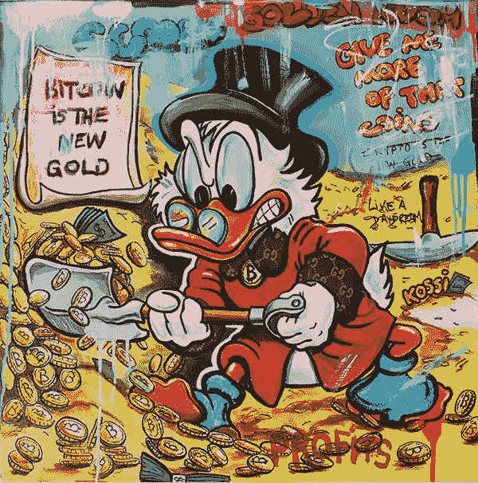

# 从不同的角度理解比特币#6

> 原文：<https://medium.com/coinmonks/understanding-bitcoin-from-a-different-perspective-6-2a6d47c459f7?source=collection_archive---------52----------------------->

**2017 年 10 月 5 日**

通过消除比特币交易中的签名数据来增加区块链上的块大小限制的比特币系统的名称是隔离见证(SegWit)。因为该方法通过将“见证数据”推到事务结束来减小块上事务的大小，从而加速网络，所以该名称暗指各种事务签名。SegWit 交易最早于 2017 年 8 月由使用最广泛的协议软件比特币核心(Bitcoin Core)实现。于是，一些工程师将比特币分割成两个区块链，比特币现金诞生了。

瑞士人已经以一种很大的方式接受了比特币，国家铁路运营商 SSB 在 10 月份开始通过其售票亭网络销售比特币。“直到今天，在瑞士只有几种方式可以购买比特币。SBB 有一个强大的分销网络，拥有 1000 多台售票机，每天 24 小时开放，不仅可以购买门票，还可以获得额外的服务，”根据 SSB 的说法。

比特币从 2017 年 1 月 1 日的不到 1000 美元飙升至 2017 年 12 月 1 日的 10840 美元，在这个过程中，许多人变得极其富有。然而，这些收益是真实的吗？德克萨斯大学的约翰·格里芬教授是持不同意见的人之一。他认为，其中很大一部分是由使用 Tether (USDTUSD)的协同价格操纵造成的，他说这可能只由一名流氓交易员实施。他调查了 Bitfinex 交易所的数百万笔交易，发现在比特币价格下跌时，Tether (USDTUSD)被用来收购比特币，以提振其价格。

银行也不为所动。摩根大通(纽约证券交易所-JPM)首席执行官杰米·戴蒙公开宣称，任何被抓到交易比特币的员工都将因“愚蠢”而被解雇，并称比特币是“欺诈”，不会有好下场。尽管有负面的头条新闻，但摩根大通(纽约证券交易所-JPM)在 2017 年 9 月购买了约 300 万美元的 XBT 股票(跟踪比特币价格的交易所交易票据)，使其成为加密市场上更活跃的银行之一。📢📢📢📢照他们做的去做，而不是照他们说的去做。跟着钱走💲💲💰💰。

**2017 年 12 月 18 日**

去中心化金融的概念是比特币在 2009 年作为第一种点对点数字货币“正式”推出的，但许多人认为 MakerDAO 的推出是真正的转折点，因为它标志着金融应用的开始，这些应用不仅仅是将钱从一个地方转移到另一个地方。MakerDAO 是许多基于以太坊的协议中的第一个，通过将加密货币与一美元的价值挂钩，并允许任何人利用数字资产作为抵押品，允许任何人在不依赖银行等中央机构的情况下获得贷款。仅在四年后的 2021 年，就有超过 200 个 Defi 应用程序可用，范围从基本贷款到合成资产的创建。

**2017 年 12 月 28 日**

拥有世界第三大加密货币市场的韩国暗示，它可能会效仿中国，关闭加密货币交易所，称该行业“不合理地过热”。这种变化不受欢迎，到年底，价格已经下降到大约 12，000 美元。

2 月 1 日，中国彻底禁止所有比特币交易，并关闭所有采矿作业，导致价格大幅下跌。比特币的价值暴跌约 40%，从 1 月底的 1 万多美元跌至 2 月 5 日的 6914 美元。许多在 2017 年牛市期间赚了钱的比特币交易者获得了“REKT”(他们在聊天室里这样称呼)。但并不是所有人——像 TheBoot 这样的玩家继续“买入”，在 2018 年 3 月至 2019 年 6 月期间，将 0.6 个比特币变成了 300 个。

另一方面，传统银行开始担心比特币。2018 年 1 月，国际清算银行(代表世界各国央行)行长阿古斯滕·卡斯滕斯(Agustn Carstens)将比特币描述为危害全球金融稳定的庞氏骗局。他说，“有一个令人信服的政策参与的案例。”"有关当局必须准备采取行动，以教育和保护投资者和消费者."哦，别忘了，只剩 20%了！截至 2018 年 1 月，80%的比特币已经被开采。

**2018 年 3 月 6 日**

在经历了如此壮观的 12 月之后，人们对 2018 年的比特币抱有很大的期望，但在 3 月初该货币下跌近 3500 美元后，气氛发生了变化。一些人推测，价格的快速下降是泡沫的结果，泡沫最终会破裂。然而，许多人将它与 1929 年华尔街崩盘联系起来。在一切崩溃之前，这次反弹仅仅是雷达上的一个光点吗？就连在 2014 年对加密货币持乐观态度的比尔·盖茨也改变了主意，称加密货币正以“相当直接的方式”造成死亡，因为它与恐怖主义资金和洗钱有关联。

Twitter 宣布禁止加密广告后，股价下跌 3.60%。加入科技巨头谷歌和脸书的行列，Twitter 宣布将禁止加密货币广告，以保护投资者免受欺诈。1 月 30 日，在脸书禁止所有加密广告以防止金融产品和服务“经常与误导或欺骗性促销行为相关”的传播后，价格下跌了 10%以上 3 月 14 日，谷歌紧随其后，股价又下跌了 10%。😢😢😢😢

在 Twitter 宣布禁止加密广告后，价格下降了 3.60%。Twitter 已加入谷歌和脸书的行列，禁止加密货币广告，以保护投资者免受欺诈。脸书于 1 月 30 日禁止了所有加密广告，以防止金融商品和服务的传播，“这些商品和服务往往与误导或欺骗性的促销技术相关”价格下降了近 10%。当谷歌在 3 月 14 日跟进时，它又损失了 10%。

全球监管机构开始认识到初始硬币发行(ico)和通过被称为代币销售的筹资活动推出的数字货币的潜在风险，从而推动了打击行动。美国证券交易委员会此前加大了对代币销售过程的监督力度，在 2018 年 3 月向加密基金发出传票，包括 TechCrunch 创始人迈克尔·阿灵顿的 1 亿美元加密基金。这完全没问题。他们现在需要做的就是找出他们想要什么。阿林顿说，他们需要建立规则，以便我们都能遵守，而市场正在恳求他们这样做。不仅仅是美国注意到了这一点——2017 年 9 月，中国政府彻底禁止了所有 ico，导致价格暴跌近 7%。

**2018 年 4 月 12 日**

比特币在 3 月 29 日下跌后反弹了 14%，当时价格下跌了 10%以上，并保持不变。当天购买量的增加被认为是上涨的原因。在 4 月税收截止日期之前，比特币投资者担心政府的打击和与税收有关的抛售。当该事件平安无事地过去时，市场恢复了一些信心。

**2018 年 5 月 23 日**

比特币继续下跌，自 5 月以来失去了所有收益。分析师对上周纽约区块链周持乐观态度，但预期喜忧参半，当周价格从 8，518.64 美元跌至 7，471.18 美元。在加密货币社区，纽约区块链周是一件大事，自开始以来的三年里，比特币每年都在飙升，所以今年也不是完全没有可能。监管方面的担忧给整个市场带来了压力，不仅仅是比特币。在被称为“秘密扫荡行动”中，美国和加拿大政府透露了打击秘密投资计划的实质性意图。

至少 70 项调查已经在进行中，加大了 SEC 起诉一系列比特币运营商欺诈的力度。这场运动开始了持续到 6 月的螺旋式下降。

英国劳埃德保险公司(Lloyd's)和维珍货币公司(Virgin Money)的客户不允许用信用卡购买比特币，Twitter (TWTR)、谷歌(Google)和脸书()也禁止加密广告。尽管他们都迅速改变了决定，但全面禁令使价格在 6 月底降至 6000 美元以下。美国司法部对加密货币价格操纵的调查也于事无补。

比特币表现不佳，美国证券交易委员会(SEC)在 7 月份拒绝了文克莱沃斯提出的另一项比特币交易所交易基金(ETF)申请，推动价格下跌约 3%。SEC 的问题远未结束，这导致比特币在今年剩余时间里持续波动。

**2018 年 8 月 14 日**

这是特别困难的一个月。到 8 月 14 日，比特币从 7726.85 美元跌至约 5880 美元。事实上，加密货币在整个月份表现不佳，当月贬值约 70%。这引发了人们对所有交易员和投资者心理健康的担忧，随着市场进入崩溃模式，这些交易员和投资者遭受了巨额亏损，声称绝望和自杀的人数不断增加。

由纽特拉德撰写

*原载于 2022 年 4 月 13 日*[*【https://cryptoverse2.blogspot.com】*](https://cryptoverse2.blogspot.com/2022/04/understanding-bitcoin-from-different_12.html)*。*

> 加入 Coinmonks [电报频道](https://t.me/coincodecap)和 [Youtube 频道](https://www.youtube.com/c/coinmonks/videos)了解加密交易和投资

# 另外，阅读

*   [如何购买 Monero](https://coincodecap.com/buy-monero) | [IDEX 评论](https://coincodecap.com/idex-review) | [BitKan 交易机器人](https://coincodecap.com/bitkan-trading-bot)
*   [CoinDCX 评论](/coinmonks/coindcx-review-8444db3621a2) | [加密保证金交易交易所](https://coincodecap.com/crypto-margin-trading-exchanges)
*   [红狗赌场评论](https://coincodecap.com/red-dog-casino-review) | [Swyftx 评论](https://coincodecap.com/swyftx-review) | [造币厂评论](https://coincodecap.com/coingate-review)
*   [Bookmap 评论](https://coincodecap.com/bookmap-review-2021-best-trading-software) | [美国 5 大最佳加密交易所](https://coincodecap.com/crypto-exchange-usa)
*   [如何在 FTX 交易所交易期货](https://coincodecap.com/ftx-futures-trading) | [OKEx vs 币安](https://coincodecap.com/okex-vs-binance)