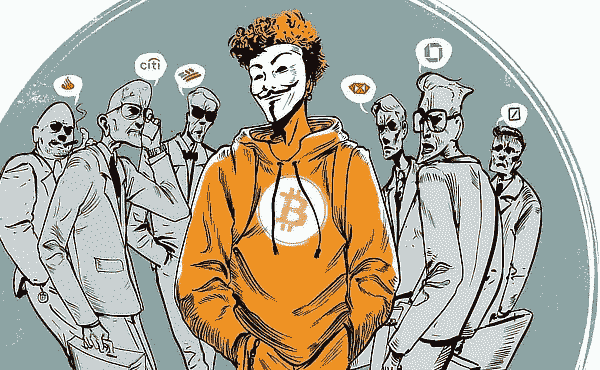

# 从不同的角度理解比特币#7

> 原文：<https://medium.com/coinmonks/understanding-bitcoin-from-a-different-perspective-7-2e5c88f3479b?source=collection_archive---------79----------------------->

在高盛(Goldman Sachs)放弃建立比特币交易平台的雄心的消息传出后，9 月 5 日比特币价格再次大幅下跌近 10%，并持续了几天。到 9 月 8 日，价格从 7，353.48 美元跌至 6，178.31 美元，抹去了 8 月份实现的任何利润，并为“大加密崩溃”火上浇油。尽管这份报告是“假消息”，而且高盛从未打算在 BTC 开设交易部门，但对加密货币未来的担忧正在加剧。大约在同一时间，Reddit 上的一篇帖子透露，一个包含超过 111，000 个比特币的丝绸之路钱包在丢失多年后被投放市场，进一步降低了价格。

**2018 年 10 月 15 日**

请注意。在经历了上个月的所有骚动后，大男孩们终于清醒过来，并注意到了这场迟到了九年的派对。10 月 15 日，投资巨头富达(FIS)将推出自己的机构加密交易平台。贝莱德(BLK)最近宣布成立加密货币工作组。然而，由于市场不稳定，价格继续下降。

**2018 年 12 月 3 日**

临近 2018 年底，比特币的价格开始了又一次长期下跌。尽管比特币现金的硬分叉(BCHUSD)区块链对最初的比特币没有直接影响，但加密市场的信心已经下降。挖掘比特币的难度在 12 月 3 日下降了 15%左右，为历史第二大降幅。为什么？因为比特币挖矿难度改为占目前市场挖矿的机器数量。为了保持每个块十分钟的一致处理时间，这是必要的。随着越来越多的人加入游戏，难度也在稳步上升。然而，在一年的糟糕结果后，难度水平急剧下降，表明信心明显丧失。价格从 1 月份的近 17000 美元暴跌至 12 月 16 日的约 3193.78 美元。

**2019 年 1 月 3 日**

自 2009 年 1 月 3 日中本聪开采第一个创世纪区块以来，已经过去了疯狂的 10 年——这 10 年见证了诉讼、毒品交易、世仇、分歧，以及为地球上的普通人创造了大量严肃的、前所未见的财富。比特币在它的第十个生日达到每天 3893.40 美元的高点。不是 2017 年的天文高度。

**2019 年 2 月 24 日**

在前一天比特币价格飙升至 4000 美元以上后，价格再次暴跌，无缘无故下跌约 10%。然而，似乎我们已经触底，因为这是今年剩余时间缓慢而稳定上涨的开始。

以前，科技行业也有过几次愚人节恶作剧，结果糟糕透顶。你可能会认为他们现在已经明白了，市场不喜欢惊喜。然而，这一次，一个笑话产生了相反的效果，比特币因此获得了提振。金融巨头发表了一篇愚人节玩笑帖子，声称 SEC 终于批准了期待已久的基于比特币的 ETF。这条消息很快就被删除了，但价格已经开始上涨，尽管消息是假的，但价格没有下跌。一些人猜测这是由于比特币交易机器人，或者交易员的自动关键词搜索让他们走在了自己的前面。

才华横溢的比特币开发者 Pieter Wuille 公布了两项比特币改进提案(BIP)，这可能是加密货币的下一次重大升级，提供了显著的隐私好处。这些更改是对 Taproot 进行的，tap root 是开发人员 Greg Maxwell 在 2018 年提交的代码更新，旨在增加比特币的隐私。2019 年 5 月，Wuille 将其正式化为一种软叉，同时进行了一次名为 Schnorr 的升级，增加了一种新的签名。他们一起标志着比特币的隐私和可扩展性向前迈出了重要的一步——尽管还有很长的路要走，整个软分叉计划要到 2020 年 1 月才能最终确定。然而，对隐私保护的预期推高了价格，从 5 月 6 日的 5755.79 美元飙升至一周后的 8167.50 美元。

**2019 年 7 月 12 日**

唐纳德·特朗普总统深陷其中。事实证明，他不是一个粉丝。他表示，比特币和其他加密货币“建立在稀薄的空气中”，它们在一系列充满敌意的推文中鼓励“非法行为”。价格从 7 月 9 日的略高于 12，500 美元跌至 7 月 16 日的略高于 9，000 美元。在关于加密货币的国会听证会(由脸书新数字货币 Libra 的推出引发)之后，一些共和党人站出来支持比特币，采取了与其总司令截然不同的立场。尽管大多数立法者公开怀疑 Libra，但比特币获得了惊人的高支持。“我支持比特币，”共和党众议院少数党领袖凯文·麦卡锡当时告诉美国消费者新闻与商业频道。说到比特币，我更喜欢它的原因是因为它提供的安全性。我想看到政府收养区块链。7 月 17 日，北卡罗莱纳州众议员帕特里克·麦克亨利告诉国会，比特币是一股“不可阻挡的力量”，控制它的努力是徒劳的。

Bitcoin rallies as people begin to believe that Trump’s rhetoric will lead to a real conflict. Bitcoin gained over 9% in the two days following Trump’s tweet announcing his plans to ramp up the pressure on China, saying: On September 1st, the United States will begin imposing a little extra tariff of 10% on the remaining $300 billion in goods and products imported from China. Analysts referred to the growing economic uncertainty surrounding US-China relations as a potential disaster hedge, which was driving investors to digital assets.According to John Todaro, director of digital currency research at TradeBlock, Bitcoin has the potential to operate as a more safe haven asset, and indicators of a worsening trade war with China could have been the key catalyst for driving up Bitcoin prices following Trump’s tweet.

**September 22/2019**

Through commodity exchange ICE Futures, the New York Stock Exchange debuts its long-awaited Bitcoin futures market. The CME, the world’s largest futures market, and the CBOE Futures Exchange both offered Bitcoin futures in 2017\. (AMEX-CBOE). The price, on the other hand, plummeted as a result of the move, probably due to low trading volumes. Did you know that there were 5,457 Bitcoin ATMs in the globe as of September 2019.

**October 24/2019**

The price rises when Chinese President Xi Jinping declares his support for blockchain technology and declares his desire to invest more in cryptocurrencies.

**November 22/2019**

The Chinese central bank has launched a new crackdown on cryptocurrency, and Bitcoin has begun to fall in value. The People’s Bank of China also issued a warning about the dangers of using or trading bitcoin, and values plummeted to a six-month low.

*******************************************************************************

Honestly this is frustrating to write.China acts like an ex who will just not let it go.How can a sovereign nation keep changing its mind within a span of less than 3 months and this is not the first or the last.

**********************************************************************************

Bitcoin Core 0.19.0 is now available, featuring plenty of new features, performance enhancements, and bug fixes. Prices are down 5.63 percent. Wladimir van der Laan oversaw the release, which was created over the course of six months by over 100 contributors and was the result of over 550 merged pull requests. The “bech32” address format was selected as the default option in the Bitcoin Core wallet Graphical User Interface, which was one of the most significant improvements (GUI).

**December 18/2019**

Bitcoin receives a lovely little Christmas present in the form of a 10% increase thanks to positive market sentiment leading up to the holidays. After research from digital currency exchange SFOX revealed that Bitcoin normally sees a strong market response around the holidays, the seasonal boost was somewhat expected.In December, YouTube accidentally banned all bitcoin videos. Oops. It eventually apologized, claiming that it had made a mistake.

由纽特拉德撰写

*原载于 2022 年 4 月 18 日*[*【https://cryptoverse2.blogspot.com】*](https://cryptoverse2.blogspot.com/2022/04/understanding-bitcoin-from-different_17.html)*。*

> 加入 Coinmonks [电报频道](https://t.me/coincodecap)和 [Youtube 频道](https://www.youtube.com/c/coinmonks/videos)了解加密交易和投资

# 另外，阅读

*   [Bookmap 评论](https://coincodecap.com/bookmap-review-2021-best-trading-software) | [美国 5 大最佳加密交易所](https://coincodecap.com/crypto-exchange-usa)
*   最佳加密[硬件钱包](/coinmonks/hardware-wallets-dfa1211730c6) | [Bitbns 评论](/coinmonks/bitbns-review-38256a07e161)
*   [新加坡十大最佳加密交易所](https://coincodecap.com/crypto-exchange-in-singapore) | [购买 AXS](https://coincodecap.com/buy-axs-token)
*   [红狗赌场评论](https://coincodecap.com/red-dog-casino-review) | [Swyftx 评论](https://coincodecap.com/swyftx-review) | [CoinGate 评论](https://coincodecap.com/coingate-review)
*   [投资印度的最佳密码](https://coincodecap.com/best-crypto-to-invest-in-india-in-2021)|[WazirX P2P](https://coincodecap.com/wazirx-p2p)|[Hi Dollar Review](https://coincodecap.com/hi-dollar-review)