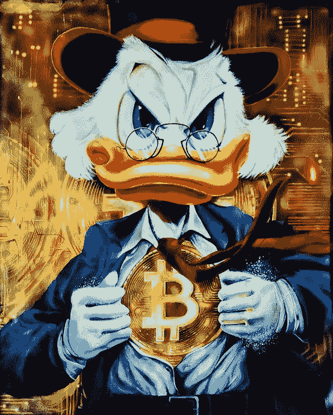

# 从不同的角度理解比特币#8

> 原文：<https://medium.com/coinmonks/understanding-bitcoin-from-a-different-perspective-8-b66138900796?source=collection_archive---------40----------------------->

**2020 年 1 月 14 日；**

芝加哥商业交易所集团(CME)推出比特币期货合约的期权交易。第二天，比特币在兴奋中暴涨约 9%。总部位于芝加哥的交易所首次推出的合约取得了成功，交易首日交易量超过了竞争对手 Bakkt。

**2020 年 2 月 5 日；**

比特币并没有让沃伦·巴菲特兴奋。他在 2018 年将其命名为“老鼠药平方”，他将在 2020 年 2 月再次这样做。他声称“加密货币没有价值。”“你唯一能做的就是卖掉它。”我不持有任何加密货币，也无意在未来持有。"

但这并没有阻止社区的其他人。2020 年 2 月 5 日，由 Tron 创始人兼 Bittorrent 首席执行官贾斯汀·孙(Justin Sun)领导的一群加密先驱在内布拉斯加州奥马哈的快乐山谷俱乐部(Happy Hollow Club)为这位 90 岁的伯克希尔·哈撒韦传奇人物举办了一场长达 3 小时的慈善晚宴。

他们给了他一对配备各种加密货币的三星 Galaxy Fold 智能手机，孙在吃饭时给巴菲特送了他的第一个比特币。

尽管巴菲特不看好比特币，但有传言称他可能即将改变主意。2020 年，他改变了对黄金的看法，并购买了世界上最大的金矿之一的股份。

*************************************************************************************

就我个人而言，我喜欢比特币社区中的自助餐。我厌倦了埃隆·马斯克成为我们最大的名人影响者。

还记得 2015 年自称中本聪的澳大利亚密码企业家克雷格·赖特吗？他的回答是“哦，不，你不是？”他回来了，他对此很不高兴。赖特自称是比特币的唯一发明者，他现在辩称，比特币核心开发团队通过修改数据库侵犯了他的知识产权。“作为比特币的唯一创造者，我拥有比特币注册的全部权利，”他在 2020 年 2 月 13 日的一篇博客中表示。人们可以派生我的程序并创建他们自己的变体。但是，他们无权使用底层数据库更改协议。"

**2020 年 3 月 6 日；**

流行病来袭。新冠肺炎闯入我们的生活，让世界各地的市场陷入混乱。随着世界陷入封锁，比特币也没有逃脱，在不到一周的时间里暴跌了 50%以上。3 月 12 日，它在一天内从约 8000 美元暴跌至 5000 美元以下，市值损失了 39%。随着市场流动性冻结，投资者纷纷买入现金。令人惊讶的是，比特币交易者立即回到了游戏中——到 5 月份，在美联储大规模刺激计划和 0%利率的支持下，价格已经升至疫情之前的水平。

**2020 年 4 月 2 日；**

加密商业银行 Galaxy Digital 的首席执行官迈克·诺沃格拉茨(Mike Novogratz)告诉美国消费者新闻与商业频道的收盘钟，如果比特币的价格到 10 月份(从 4 月 2 日的 7236.39 美元的高点)没有翻倍，到年底达到 20000 美元，他将“挂靴”，也许会放弃这种货币。他声称“这是比特币之年。”在这方面，他并不孤单。尽管有疫情效应，今年乐观的预测还是很多。2020 年 6 月,《加密研究报告》( CRR)将发布第十版，这将是一个巨大的成功。它预计比特币的价格将在 2020 年攀升至 19，044 美元，2025 年为 341，000 美元，2030 年为 397，727 美元，使用“交换方程式”方法，根据“关于供需变化的某些假设”预测目标价格。五年内，你增长了 35 倍？这是我们愿意考虑的事情。

**2020 年 4 月 30 日；**

比特币现在正在飞速发展。自 3 月底以来，人民币已升值 34%，4 月 30 日接近 9500 美元，月底为 8627.32 美元。它又回到了 10，000 美元——但是为什么呢？嗯，部分原因是它在疫情之前一直在狂跌，直到现在随着投资者重拾信心，它才回到正轨(股票市场出人意料地强劲反弹)。美联储主席杰罗姆·鲍威尔(Jerome Powell)重申了他对提振美国经济的承诺，注入了超过 6 万亿美元的流动性，并承诺在必要时投入更多资金，这也没有什么坏处。大多数比特币投资者现在都很乐观，预计年底价格将达到 20，000 美元。总部位于新加坡的指数基金 Stack 的专家表示:“比特币现在正处于一个重要的拐点。”。"重要的斐波纳契回撤，50 天移动平均线和 10 天移动平均线在日线图上汇合."

**2020 年 5 月 11 日；**

对于门外汉来说，减半通常对比特币的价格有很大影响——第一次降价在一年内将比特币的价格从 12 美元推高到 1000 美元以上。最近的一次发生在 5 月 11 日，比计划提前了一天，将挖掘一个比特币区块的支付从 12.5 个比特币降至 6.25 个比特币。这引发了大量的市场波动，价格在 6 月 1 日再次突破 10，000 美元大关之前到处飙升。

事实上，许多人认为，到 2020 年底，油价将升至 2 万美元。密码分析师 PlanB 是最乐观的人之一，他预测到 2020-24 年价格将达到 10 万美元。这就是我所说的希望。尽管上涨幅度没有之前的一半那么大(比例上)，但它标志着一个美好夏天的开始——发生了许多令人兴奋的事情，包括新投资工具的增长。6 月下半月，以比特币为基础的交易所交易工具出现了前所未有的资金流入，如 AUM 全球最大的比特币基金 gray ' s 比特币信托(OTC-GBTC)，截至 2020 年 9 月，该基金持有全球 BTC 供应量的 2.4%。

2020 年 6 月 6 日；

根据 The Intercept 的一篇文章，美国五角大楼在 2018 年开发了一个名为联合陆、海、空战略特别计划(JLASS)的战争游戏场景，其中 21 世纪幻想破灭的年轻 Z 一代被招募来对抗当权派，并因参与“Zbellion”而获得比特币奖励。

截至 2020 年 6 月，长期投资者持有 1140 万 BTC(约 1070 亿美元)，使可交易供应量降至仅 20%。然而，根据 Chainalysis 的数据，活跃交易的 350 万枚硬币供应市场，因此保持价格稳定。“散户交易者被定义为每次在交易所存放价值不到 1 万美元的比特币的个人，”根据该研究，“似乎是绝大多数，占平均每周提交给交易所的所有交易的 96%。”“然而，专业交易员控制着市场的流动性，占以美元形式传输到交易所的所有比特币价值的 85%。”

得益于 DeFi 运动的推动，以太坊已经超过比特币，成为日结算额最高的网络。比特币价格不受影响，上涨 2.50%。根据新的 Messari 数据，以太网已经接管，这意味着以太网及其 DeFi 代币的美元价值现在高于比特币。虽然比特币在最近几周相对平淡，但以太坊网络上的 DeFi 代币主导了市场。其他加密货币开始出现在市场上，与比特币一较高下，DeFi 部门正迅速受到欢迎。

好消息是，美国银行现在可以代表客户持有比特币，让传统的主流玩家最终参与进来。7 月 22 日，货币监理署(OCC)宣布，所有美国国家特许银行现在都可以提供加密货币托管服务。这是一个大事件，但对于像比特币基地这样的利基平台来说，这不是什么好消息，因为到目前为止，只有能够提供这项服务。

长期以来，价格一直徘徊在 9000 美元左右，但比特币终于在 7 月底爆发，7 月 27 日价格飙升 11.08%，超过 11000 美元。

**2020 年 8 月 6 日；**

根据美国国会议员汤姆·艾默的说法，比特币只会随着我们走出乔维德·疫情而变得更加强大。看来他是对的。与其他“避险”投资一样，比特币本周一直在稳步上涨。它受益于对冠状病毒刺激措施可能导致高通胀的担忧。比特币被用来对冲通货膨胀。

那么，哪里出了问题？整个 8 月份一切都很顺利，价格稳定在 11，000 美元至 12，000 美元之间，直到 9 月 3 日的暴跌将价格降至 9，987.86 美元，当天收于 10，160 美元。接下来的两个星期里，它不会净赚 11000 美元。

那么，贬值 10%发生了什么？根据 Coindesk 的说法，交易所存款的显著增加表明，一些投资者可能试图一次性抛售他们所有的比特币，从而降低价格。

比特币矿工已经创造了超过 1850 万 BTC，占 2100 万总限额的 88%。然而，由于持续的减半，将需要一个多世纪才能达到 100 %,预计 2140 年达到全部容量。顺便说一下，截至 2020 年 9 月，比特币百万富翁几乎有 17000 人。

**2020 年 10 月 21 日；**

比特币价格保持稳定，约为 10，500-11，000 美元，今年上涨约 50%，但不足以点燃全球。一切都会突然改变。PayPal 将于 10 月 21 日推出一项新服务，允许其 3.46 亿消费者直接从 PayPal 账户购买、持有和出售加密货币，并将其作为 PayPal 2600 万商户的资金来源。这是一个巨大的事件，比特币立即飙升 7%以上，自 8 月以来首次突破 12，000 美元大关，创下今年迄今为止的新高。

“最引人注目的是 PayPal 的庞大规模。量子经济(Quantum Economics)的加密货币分析师杰森·迪恩(Jason Deane)表示，“这很容易成为一个分水岭，比特币成为真正主流的时刻。“以前的批评者跳上船来支持比特币的声誉，贝宝标志着市场的转折点。摩根大通(JP Morgan)10 月 26 日评论称，比特币有“相当大的价格上涨空间”，这与首席执行官杰米·戴蒙(Jamie Dimon)此前的评论截然不同，他此前曾表示，比特币是一种“欺诈”。"

**2020 年 11 月 5 日；**

在今天的交易中，比特币达到了 15，770 美元的高点，比昨天的收盘价上涨了 10%以上，今年以来的涨幅超过了 100%，达到了三年来的创纪录水平。交易员认为这是因为美联储继续印钞。随着美国大选越来越近、越来越不可思议，市场正拼命试图找出各种可能性，并对其进行定价。另一方面，无论哪种情况，比特币都有可能获胜。“如果特朗普获胜导致社会动荡，美联储就会发表声明。如果选举导致蓝色浪潮和税收增加，美元将下跌，因为美联储将继续印更多的钱，”CoinDesk 采访了加密货币研究公司 Token Metrics 的首席技术分析师 Bill Noble。

看起来所有的看涨者在预测 2020 年底达到 20，000 美元时都是正确的。比特币就要诞生了，11 月 30 日，比特币达到了 19864 美元的日高点，本月收于 19700 美元。11 月 20 日，全球最大的资金管理公司里克·里德(Rick Rieder)宣布，比特币将继续存在，并可能“取代黄金”。11 月 30 日，Alliance Bernstein 的分析师 Inigo Fraser-Jenkins 改变了主意，告诉客户比特币在资产配置中有一席之地。

12 月 16 日，加密货币突破 20，000 美元大关，几乎没有停顿，就飙升至 21，576 美元的新高，同比增长近 180%。然而，事情并没有就此结束。币值继续上升，12 月 21 日达到 24000 美元，12 月 26 日达到 26000 美元。我们认为，数字资产投资巨头 Arca 的首席投资官杰夫·多尔曼非常有效地总结了这种情况。

他告诉 CoinDesk，“比特币已经从‘数字资产游乐场’过渡到‘全球主流投资’。”“投资者现在拥有自己购买比特币的专业知识和资源，我们正在实时看到这一点，这比我们预期的要快得多。"然而，他告诫基金经理不要过快跟风. "投资者很快就会寻找不拥有任何比特币的数字资产对冲基金策略，因为他们希望基金经理让他们接触自己无法获得或不知道的资产。“因此，围绕高比特币持有量构建的主动管理型对冲基金和被动指数可能会存在很短的时间。”

由纽特拉德撰写

*原载于 2022 年 4 月 24 日*[*【https://cryptoverse2.blogspot.com】*](https://cryptoverse2.blogspot.com/2022/04/understanding-bitcoin-from-different_23.html)*。*

> 加入 Coinmonks [电报频道](https://t.me/coincodecap)和 [Youtube 频道](https://www.youtube.com/c/coinmonks/videos)了解加密交易和投资

# 另外，阅读

*   [如何在 FTX 交易所交易期货](https://coincodecap.com/ftx-futures-trading) | [OKEx vs 币安](https://coincodecap.com/okex-vs-binance)
*   [CoinLoan 评论](https://coincodecap.com/coinloan-review) | [YouHodler 评论](/coinmonks/youhodler-4-easy-ways-to-make-money-98969b9689f2) | [BlockFi 评论](https://coincodecap.com/blockfi-review)
*   XT.COM 评论 | [币安评论](https://coincodecap.com/xt-com-review)
*   [SmithBot 评论](https://coincodecap.com/smithbot-review) | [4 款最佳免费开源交易机器人](https://coincodecap.com/free-open-source-trading-bots)
*   [比特币基地僵尸程序](/coinmonks/coinbase-bots-ac6359e897f3) | [AscendEX 审查](/coinmonks/ascendex-review-53e829cf75fa) | [OKEx 交易僵尸程序](/coinmonks/okex-trading-bots-234920f61e60)