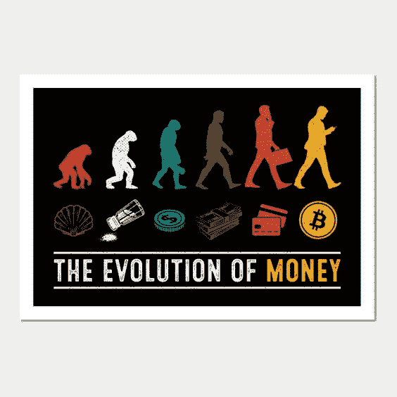

# 从不同的角度理解比特币#9

> 原文：<https://medium.com/coinmonks/understanding-bitcoin-from-a-different-perspective-9-df774ec197bf?source=collection_archive---------65----------------------->

**2020 年 12 月 31 日；**

随着今年接近尾声，比特币价格逼近 3 万美元(12 月 31 日达到 29，300 美元的峰值，收于 28，992 美元)。这几乎正是比特币专家 PlanB 一直以来的预测(尽管略低于他对 2020 年 12 月 31，000 美元的预测)。然而，它确实揭示了他所采用的库存-流量模型在许多情况下是惊人的准确。它将比特币视为像黄金一样的传统商品，将其当前供应量与其生产率进行比较，这意味着减少一半是重大事件，尽管它们一开始可能会显得虎头蛇尾。另一方面，PlanB 对未来更加乐观。12 月 31 日，他预测，从现在到下一个减半期(预计在 2024 年)，比特币的平均价格将达到 288，000 美元。

**2021 年 1 月 8 日；**

比特币继续牛市，1 月 2 日突破 30，000 美元大关，五天后突破 40，000 美元，然后在 1 月 8 日达到 42，000 美元的高点。在今年的第一周，这是 40%的增长。情况看起来不错，银行也同意了:1 月 5 日，JP 摩根预测，如果比特币开始在投资组合中取代黄金，它的价格可能会达到 146，000 美元。

然后，在一天之内，大约 2000 亿美元从市场上抹去。比特币下跌约 17%，在 1 月 11 日触及 30，261 美元的低点，最终收于 35，455.58 美元。英国金融行为监管局(FCA)警告称，投资加密资产的人“应该准备好失去所有的钱。”不出所料，这像一个铅气球一样使市场萎缩，仅比特币一项就在不到 24 小时内损失了 1250 亿美元的市值。FCA 此前一直反对加密，早在 2020 年 10 月就禁止向英国零售客户出售加密衍生品。

*************************************************************************************

值得注意的是，在这个时间点上，我正在积极地交易比特币，并在密码方面进行自我教育。哇，时间过得真快。

*************************************************************************************

自从比特币在 1 月初突破 40，000 美元以来，它就像坐过山车一样，货币波动剧烈。从那以后，它的价值下降了四分之一，在 1 月 22 日和 1 月 27 日一度跌破 3 万美元。1 月 25 日，英国金融监管机构 FCA 负责人安德鲁·贝利(Andrew Bailey)在达沃斯的一个在线小组讨论会上表示，“比特币的日子不长了”，尽管支付领域的数字创新将继续存在，但目前形式的加密货币不太可能存活。

埃隆·马斯克难以置信的互联网影响力的另一个例子是，他在自己的 Twitter 个人资料中添加了#比特币标签，价格飙升，单日涨幅约为 11%，第二天继续上涨 10%。Twitter 首席执行官杰克·多西紧随其后，引发了一连串的“这些人知道什么我们不知道的？”推特。

**2021 年 2 月 8 日；**

特斯拉在 1 月 8 日周一提交给美国证券交易委员会的文件中透露，作为新投资政策的一部分，它已向比特币(BTCUSD)投资 15 亿美元，该政策将为该业务提供“更大的自由，以实现多样化和最大化现金回报，这并不需要维持足够的运营流动性。”换句话说，他们很有钱。在新政策下，特斯拉可能会投资于其他替代储备资产，如数字资产、金条和黄金交易所交易基金，但比特币是其第一个大赌注，而男孩确实得到了回报。在中午 12 点宣布后的前 30 分钟，价格飙升了 10%以上，到下午 1 点，价格上涨了 16%。

特斯拉还证实了在不久的将来将比特币作为其产品支付手段的计划(首先在有限的范围内)，该公司告诉 SEC，它“可能会也可能不会在收到后清算。”所以，特斯拉(推而广之，马斯克)可能会成为世界上最大的比特币持有者之一。或者，如果它决定清算收入，它可能会获得对比特币价格的重大控制权。无论如何，此举预计将对加密市场产生重大影响——考虑到马斯克之前的加密言论，这很可能是一个意想不到的副作用。

***********************************************************************************

在我看来，这是牛市的终结。让我提醒你一下:机构投资比特币不利于价格，因为它引入了大量波动。这对作为散户的你我意味着什么？首先，你最有可能使用杠杆购买比特币，以便有可能让你的钱翻两番。价格区间突破 3-4 万美元肯定会导致清算。无论哪个方向，趋势都是如此。

***********************************************************************************

比特币经历了非凡的一年，今天是价格首次突破 50，000 美元的最佳时机。马斯克的推文似乎达到了预期的效果。自今年年初以来，人民币价格已经上涨了约 75%，随着投资者回归人民币，牛市没有放缓的迹象。2 月 16 日，比特币(BTC)在 Bitstamp 平台达到 50602.53 美元的高点，此后一直持续上涨，第二天达到 51721.15 美元。

2 月上半月，以太坊(ETHUSD)兑美元汇率上涨 38%，Ripple (XRPUSD)上涨 9%。尽管 Doge Coin 似乎正在从马斯克引发的高点下跌，但加密市场作为一个整体，今年在比特币的带领下飞速发展。

2021 年 3 月 4 日；

PayPal 正在推出一个新的专注于加密的业务部门，将该公司的加密工作“超越购买、出售和持有”价格下降了大约 4%。PayPal 首席执行官丹·舒尔曼(Dan Schulman)透露，该公司计划深入加密货币领域，以便在当前的金融技术时代保持竞争优势。新的业务部门将由来自技术、加密和监管行业的专家组成的委员会领导，并将包括一些核心技术人员的转移。智能合约以及以太坊和其他区块链将接受测试，作为改善支付和其他交易的方式。

法国政府正在拍卖€2800 万英镑的加密货币战利品，其中大部分是在 2019 年 GateHub 袭击事件发生后获得的。此次拍卖在法国尚属首次，代表法国被扣押和没收资产追回和管理机构分为两次交易。第一次出售包括 437 手 0.11 至 2 比特币不等的股票，第二次出售包括 41 手 5 至 20 比特币不等的股票。

瑞士货币智库 2B4CH 的创始人伊夫·贝奈姆(Yves Benaim)表示，政府选择在这个时候抛售。他说，从技术上讲，如果法国政府认为被查封的东西会贬值，他们是可以出售这些东西的。“有趣的是，他们现在正在抛售，大概是基于价格会下跌的假设，而这只是一个泡沫。比特币每枚已经价值约 5 万€，值得注意的是，它们以低于市场价 40%至 50%的价格开始拍卖，这表明一些个人有兴趣购买，只是为了能够“立即”出售它们

摩根士丹利(Morgan Stanley)成为第一家为客户提供比特币资金的美国主要银行，这使得这种加密货币重返连续第六个月上涨的轨道，价格上涨了 3.54%。这家投资银行巨头正式指示其财富管理公司提供比特币基金的访问权限，但仅限于最富有的客户，且最多不超过其总净值的 2.5%。尽管如此，这是对数字资产进行更多机构投资的重要一步，它可能有助于比特币获得作为投资级资产类别的合法性。

随着越来越多的机构采用加密货币，加密货币正在成为金融领域中得到更广泛认可的组成部分。今年，德意志银行(Deutsche Bank)加入了这场辩论。它在一份报告中表示，它认为比特币将继续存在，但波动性也是如此。当然，忽视 1 万亿美元的市值将是愚蠢的，但流动性不足仍然是比特币成为其单独基于估值的资产类别的主要障碍。并非所有人都对加密货币充满热情。今年 3 月，美国银行(Bank of America)发布了负面展望，认为该股票既不是通胀对冲工具，也不是那些担心气候变化的人的好选择。

Elon Musk 以典型的 meme 方式在 Twitter 上宣布，继上个月购买 15 亿美元的比特币后，特斯拉现在将接受比特币作为其车辆的支付方式，进一步将加密货币融入金融系统。价格上涨了 1%。

在 Visa 宣布其支付网络将允许使用加密货币 USD Coin(一种由美元支持的稳定货币)来结算交易后，比特币上涨了 3.24%。

此举推动了整个加密生态系统，比特币也因此繁荣起来。这是为加密货币腾出空间的一长串业务中的最新一个，特斯拉上周刚刚宣布，它现在将接受比特币作为其新车的支付方式。随着区块链技术在现有金融系统中得到越来越广泛的认可，贝莱德(BlackRock)和万事达(Mastercard)等大型金融机构正在接受数字货币的使用。

**2021 年 4 月 13 日；**

由于对比特币基地上市的预期，比特币价格飙升 6.24%，达到超过 63，000 美元的新高。随着比特币和其他加密货币的流行，比特币基地是美国最大的加密平台，拥有约 5600 万验证用户。在 IPO 预测的推动下，比特币超过了 3 月份的前期高点——而且它不是唯一一种反弹的货币。在过去的两天里，以太坊上涨了 10%，而 XRP 上涨了 25%。

有报道称，美国总统乔·拜登(Joe Biden)可能将富人的资本利得税提高一倍，比特币本周下跌超过 12%。比特币经历了近两个月来最糟糕的一周，使加密股票陷入混乱。4 月 23 日，拜登表示，他将提议将收入超过 100 万美元的人的最高长期资本收益率从 20%提高到 39.6%。这一想法宣布后，在周五的交易中，超过 2000 亿美元从比特币市场抹去，因为投资者担心这将损害对数字资产的投资。

**2021 年 5 月 2 日；**

比特币 0.21.1 版本发布，其中包含了直根软叉设置——这是比特币迄今为止最重要的更新之一。taproot soft fork 的激活是全面升级的第一步，全面升级已经规划了多年，将使比特币多签名交易更便宜，更容易部署，更隐私。隐私和可扩展性升级将是比特币有史以来最重大的改进之一。

因为比特币的去中心化性质，不能单方面改变；相反，对代码的重大修改需要整个用户群的合作。改进的实际实现需要所有利益相关方之间的协作，因此选择如何部署更新花费了数月时间，而不是升级本身，升级已经计划了很长时间

Pieter Wuille 是比特币核心贡献者，他是主根升级的幕后策划者，他终于准备好与他人分享代码了。5 月 1 日，网络难度暴跌 12.6%，为全年最高下调幅度，也是十年来最大的负难度调整。

**********************************************************************************

那些不经用户同意就能在一夜之间改变代码的协议真的很有说服力。

***********************************************************************************

由于环境影响，特斯拉决定停止接受比特币支付，这让 Crypto 不堪重负。比特币已经贬值了 13%。哎哟。埃隆·马斯克(Elon Musk)在推特上发文称，特斯拉将停止使用比特币购买汽车，并在其资产负债表上出售任何比特币，引发了加密界的又一场轩然大波，理由是担心化石燃料在加密采矿中的使用不断扩大。

与去年特斯拉(和马斯克)亲 BTC 的姿态相比，这是一个重大转变，这种逆转不太可能让比特币投机者高兴。比这复杂得多，但比特币是由难以置信的高性能计算机相互竞争来解决棘手的数学问题而形成的。这一过程消耗大量能源，并严重依赖于煤炭等化石燃料产生的电力。

该公告发布不到两个月前，特斯拉购买了 15 亿美元的比特币，并开始用这种数字货币支付车辆，导致比特币价值飙升约 20%。根据特斯拉最近的收益，收购 BTC 已经为该公司带来了至少 1 亿美元的“积极影响”。

由纽特拉德撰写，

*原载于 2022 年 5 月 31 日 https://cryptoverse2.blogspot.com***。**