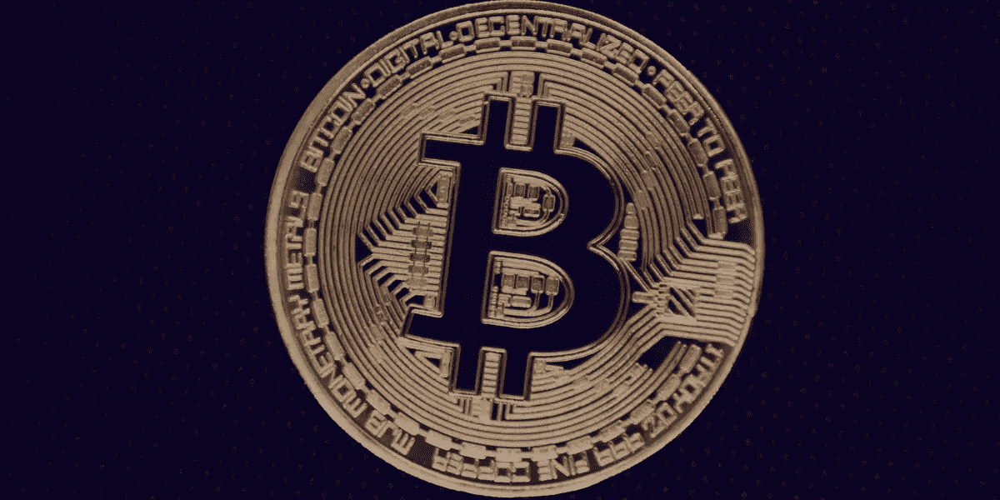

# 理解区块链的初学者指南

> 原文：<https://medium.com/coinmonks/understanding-blockchain-77ce52b9b8f5?source=collection_archive---------54----------------------->

最初，互联网旨在帮助信息和价值的分散化。

你可能不知道目前有两种互联网——信息互联网和价值互联网。我们今天所知道的互联网，我们研究和传递信息的地方，是信息的互联网。

这第一个互联网不能满足从对等点到对等点传输诸如数字货币、艺术品、土地记录和医疗记录等有价值项目的需求。

因此，互联网的第二个变种，区块链，被发明了。它使权力下放成为可能。有了区块链，人们可以在没有第三方干涉的情况下将有价值的物品转移给另一个人。这就是区块链被称为价值互联网的原因。

本文涵盖了您需要了解的关于区块链的内容:它是如何工作的，它的用途和应用，现有的各种类型的区块链，等等。

## 什么是区块链？

集中式机构，如银行，在他们单独控制的分类账上记录交易，因此我们说银行运行一个集中式数据库。记录的信息包括银行客户在他们账户上的贷方和借方。区块链就像这种账本，但它是分布式数据库。换句话说，这个分类账是由一个叫做节点的计算机网络保存的。

该数据库的条目由这些节点生成。因此，这些数据不能由单个节点操纵，因为节点必须就记录什么达成一致。该数据库是不可变的，因为这些块使用加密技术相互连接，因此形成了一个块链。

有人把它描述成一个代表分类账的大笔记本，树叶代表积木，活页夹把树叶粘在一起，就像把积木绑在一起的密码系统。

区块链的最终目标是在对等体之间分配数据控制权。

直截了当地说，发明区块链是为了从权力集中的机构手中夺走对数据的控制权。这样，数据可以在没有第三方干扰的情况下点对点传输。

## 但是为什么要发明区块链呢？

在某种程度上，人们厌倦了中央集权、强大的权力机构处理他们的敏感信息，因为这些机构不可信。

此外，由于在交易完成之前必须遵循协议，这些机构在运行交易时速度很慢。最重要的是，它们容易受到攻击，因为它们是单点故障。

社交网络、银行和政府机构等中央机构从个人那里获取数据，处理这些数据用于商业用途，并且不向这些数据的所有者支付报酬。

由于这些侵犯隐私的行为，人们觉得他们应该处理自己的数据，从而切断这些中间人。此外，这些集中式组织的服务速度慢且昂贵。这是交易完成前办公室和各方之间的官僚作风造成的结果。这一点，加上人类的低效率，创造了一个不可信的高效系统的需求，今天被称为区块链。

区块链是革命性的。它去掉了中间人，安排人来处理他们的事务，使系统对每个人开放，保护系统，甚至比传统的中央集权组织处理信息更快。

## 区块链和比特币

写区块链而忽略比特币是不完整的。

区块链是推动比特币的技术。它赋予了比特币生命。没有比特币可以有区块链，但没有区块链永远不可能有比特币。这两者交织在一起，因为比特币是第一种使用区块链技术成功实现的数字货币。

随后，为了便于理解，关于区块链的解释会加入比特币。

比特币是比特币生态系统中使用的数字货币。它是一种价值形式，可以在人与人之间转移。

让我们假设 John 想要使用比特币区块链向 Charles 发送一些比特币。第一件事是约翰广播说他想给查尔斯送些比特币。约翰会用他连接到比特币网络的设备来做这件事。

一旦约翰广播了这些信息，世界各地连接到比特币网络的所有节点都会同时获得这些信息。请记住，他们需要获得这些信息，以便能够记录交易，因为没有像银行这样的中央机构来做记录。

当每个节点获得这些信息时，它会检查约翰的钱包地址(类似于银行账号)中是否有他想要发送给查尔斯的正确数量的比特币。如果 John 确实拥有该事务，则该节点会在其块中记录该事务，该块中已经包含了来自不同人的其他事务。所以，每个区块都是像约翰一样的大量数据的集合。

当块达到它可以接受的最大条目数时，节点将它打包，并将其推送到其他节点接受它。每个节点都必须接受它，这样整个数据结构在比特币网络上所有连接的节点上都是相同的。

然后，那个块被*放在一边*，当一个新的块再次被接受时，它们使用加密技术连接起来。这成为一个连续的过程，形成一个非常长的链，因此得名区块链。所以，这是一系列的交易。

## 区块链的安全性

很容易认为约翰可以和他的朋友交谈，他的朋友是比特币网络的一部分，以帮助他操纵记录，对他有利。这样，他可以保留他的比特币，而查尔斯却被骗了。但这几乎是不可能的。

区块链依靠去中心化来保护网络。例如，如果有 10，000 台计算机连接到比特币网络，这意味着约翰的朋友要控制比特币网络，他必须控制超过 5100 台计算机。

对于要添加到区块链的块，超过一半(51%)的节点必须同意接受块。因此，如果约翰的朋友可以拥有这 51%的控制权，他将能够创建有利于约翰的条目，并迫使网络接受该记录，因为他控制了超过一半的计算能力。

但问题是，控制如此庞大的计算机网络需要大量的资源——计算能力和电力，这是个人或公司几乎不可能负担得起的。

另一个让区块链安全的因素是它的共识机制。区块链是分散的，并不意味着它是无组织的。让我们来看看比特币的例子。

当比特币区块链中的一个区块被填满并准备好被*链接*时，只需从节点池中选择一个节点的副本。

那么，会是谁的街区呢？所有节点都会尖叫，*抢走我的街区。*比特币软件中的网络协议(规则)已经规定，这些节点中的一个必须找到一个名为*随机数*的数字。

提出这个随机数的节点的块被其他节点强制接受。找到这个数字需要一些数学计算，谁先得到它并提出它，协议就会给谁一些比特币的丰厚奖励。

找到这个数字的过程称为工作证明(PoW)。将区块添加到区块链以获得奖励称为采矿。

与确保其他区块链权力共识机制类似的是利害关系证明、历史证明等等。这些不同的共识机制有一种激励节点的方式，就像在比特币网络中看到的那样。这些奖励诱使节点诚实地行动，从而保持区块链的安全。

密码术是帮助保护区块链的另一个重要机制。以比特币区块链为例，密码学是在网络中创建数字指纹的一种手段。

这个数字指纹被称为哈希。区块链中的每个块都有前一个块的哈希，这种情况会无限期地继续下去。

因此，假设在区块链中形成了三个板块，第一个板块被称为创世板块，因为它是第一个板块。然后，块二有块一的哈希，块三有块二的哈希。这样，就不可能改变每个块中的信息，因为任何块中的变化都会扭曲后续块的输出。因此，我们说区块链是不变的。

如果其中一个节点甚至试图改变块 1 上的信息，这将需要大量的计算能力，而这是它们无法负担的。

例如，如果块二中的一条信息最终被改变，指纹也将改变。这将中断该链，并且网络将不再接受该块。坏演员的目标将被挫败。这个坏演员浪费了计算能力，但他的目的还是没有达到。因此，知道了这一点，攻击者就不会攻击网络，而是试图保护它，因为它投资于网络。

## 区块链的类型

在本文中，为了简单起见，我们主要关注比特币区块链，这是一个公开的区块链。现在让我们来解释各种可用的区块链。

*   **公共区块链:**这种区块链是开放的，没有权限的。也就是说，任何人都可以在他们的电脑上下载区块链软件，成为网络的一部分。例子是比特币和以太坊区块链。
*   **私人区块链:**这种区块链不是对所有人开放，而是对特定人群开放。因此，通过许可进入。它主要被组织用来管理他们的事务。这方面的一个例子是银行拥有的用于控制其数字货币的区块链。这类银行可能允许经理和顶级银行家修改记录，但可能不允许初级银行家修改记录。尽管它可能对初级银行家开放，对客户关闭。
*   **混合型区块链:**这种区块链是私人和公共区块链的融合。通过这种方式，它赋予一个组织权力来利用两种区块链的优势。
*   **财团区块链:**这种区块链归一群组织所有，用于交叉交易。尼日利亚央行和欧洲央行管理区块链就是一个例子。这是一种被允许的区块链。

## 区块链的用途/应用

区块链的分散性、开放性、不变性、安全性和交易速度等特性使其有利于进行交易和记录数据。

区块链技术几乎可以应用在生活的各个领域。任何涉及第三方的组织、流程或交易都是区块链发展壮大的机会。

区块链已成功应用于金融领域，用于比特币、以太等数字货币的转移。它还成功地应用于现实生活资产的标记化，如艺术、音乐和称为不可伪造标记(NFT)的图像。它还被应用于银行业，颠覆了传统金融，产生了我们所说的分散金融(DeFi)。

通过将合同编码到计算机程序中，并允许它们作为智能合同自动运行，区块链已在法律中得到应用。智能合同是 DeFi 的核心。

很多领域仍然可以部署区块链，比如农业、投票、医疗记录等等。

## 结论

区块链是一项革命性的技术，改变了我们转移和获取价值的方式。在未来几年，它可能会像互联网一样成为我们日常生活的一部分。

> 加入 Coinmonks [电报频道](https://t.me/coincodecap)和 [Youtube 频道](https://www.youtube.com/c/coinmonks/videos)了解加密交易和投资

# 另外，阅读

*   [Bookmap 点评](https://coincodecap.com/bookmap-review-2021-best-trading-software) | [美国 5 大最佳加密交易所](https://coincodecap.com/crypto-exchange-usa)
*   [加密交易机器人](/coinmonks/crypto-trading-bot-c2ffce8acb2a) | [硬币门评论](https://coincodecap.com/coingate-review)
*   最佳加密[硬件钱包](/coinmonks/hardware-wallets-dfa1211730c6) | [Bitbns 评论](/coinmonks/bitbns-review-38256a07e161)
*   [新加坡十大最佳加密交易所](https://coincodecap.com/crypto-exchange-in-singapore) | [购买 AXS](https://coincodecap.com/buy-axs-token)
*   [红狗赌场评论](https://coincodecap.com/red-dog-casino-review) | [Swyftx 评论](https://coincodecap.com/swyftx-review)
*   [投资印度的最佳密码](https://coincodecap.com/best-crypto-to-invest-in-india-in-2021)|[WazirX P2P](https://coincodecap.com/wazirx-p2p)|[Hi Dollar Review](https://coincodecap.com/hi-dollar-review)