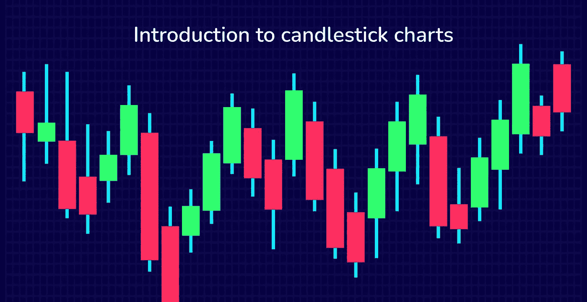
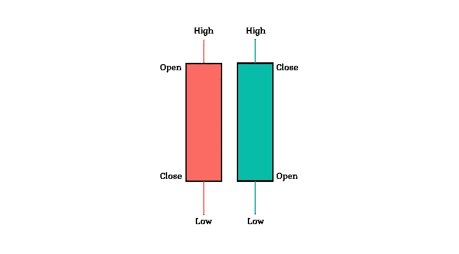

# 初学者理解蜡烛图

> 原文：<https://medium.com/coinmonks/understanding-candlestick-charts-for-beginners-simplified-2b4c06a33559?source=collection_archive---------19----------------------->

烛台图表模式被认为是在 18 世纪由一位名叫 Munehisa Homma 的日本富商开发出来的，用来分析大米合约的价格变动。Homma 发现，虽然大米的价格和供求之间存在潜在的联系，但市场也会受到人们情绪的影响。

# 烛台队形

烛台由三个主要部分组成:**主体**、**上灯芯**和**下灯芯**分别代表市场开盘价、收盘价、最高价和最低价。

*   **主体** —烛台主体可以是红色或绿色。红色蜡烛体代表在交易时段结束时收盘价低于开盘价的股票价格。而绿色蜡烛体代表股价正在上涨，在交易结束时收盘时高于开盘价。
*   **上灯芯** —代表交易时段的最高价位。
*   **下灯芯**—代表交易时段的最低价点。

烛台模式或形成被证明与人们的情绪相关，这就是为什么它被技术交易者广泛用于预测潜在的市场运动。要了解更多关于烛台模式的信息，请在 Google play 商店下载[股票烛台模式](https://play.google.com/store/apps/details?id=com.candlestickpatterns)。

> 加入 Coinmonks [电报频道](https://t.me/coincodecap)和 [Youtube 频道](https://www.youtube.com/c/coinmonks/videos)了解加密交易和投资

# 另外，阅读

*   [如何购买 Monero](https://coincodecap.com/buy-monero) | [IDEX 评论](https://coincodecap.com/idex-review) | [BitKan 交易机器人](https://coincodecap.com/bitkan-trading-bot)
*   [CoinDCX 评论](/coinmonks/coindcx-review-8444db3621a2) | [加密保证金交易交易所](https://coincodecap.com/crypto-margin-trading-exchanges)
*   [红狗赌场评论](https://coincodecap.com/red-dog-casino-review) | [Swyftx 评论](https://coincodecap.com/swyftx-review) | [造币厂评论](https://coincodecap.com/coingate-review)
*   [Bookmap 评论](https://coincodecap.com/bookmap-review-2021-best-trading-software) | [美国 5 大最佳加密交易所](https://coincodecap.com/crypto-exchange-usa)
*   [如何在 FTX 交易所交易期货](https://coincodecap.com/ftx-futures-trading) | [OKEx vs 币安](https://coincodecap.com/okex-vs-binance)
*   [CoinLoan 审查](https://coincodecap.com/coinloan-review) | [YouHodler 审查](/coinmonks/youhodler-4-easy-ways-to-make-money-98969b9689f2) | [BlockFi 审查](https://coincodecap.com/blockfi-review)
*   [XT.COM 评论](https://coincodecap.com/profittradingapp-for-binance)币安评论 |
*   [SmithBot 评论](https://coincodecap.com/smithbot-review) | [4 款最佳免费开源交易机器人](https://coincodecap.com/free-open-source-trading-bots)
*   [比特币基地僵尸程序](/coinmonks/coinbase-bots-ac6359e897f3) | [AscendEX 审查](/coinmonks/ascendex-review-53e829cf75fa) | [OKEx 交易僵尸程序](/coinmonks/okex-trading-bots-234920f61e60)
*   [如何在印度购买比特币？](/coinmonks/buy-bitcoin-in-india-feb50ddfef94) | [瓦济克斯审查](/coinmonks/wazirx-review-5c811b074f5b)