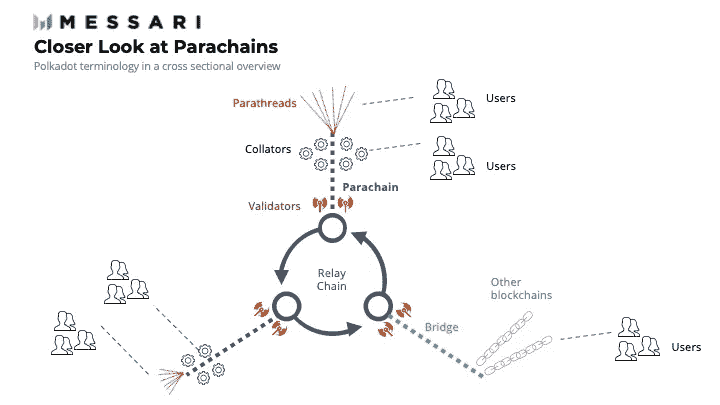
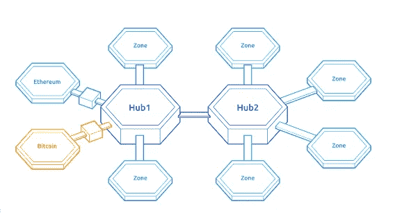

# 了解跨链和多链技术

> 原文：<https://medium.com/coinmonks/understanding-cross-chain-and-multi-chain-7cbec5cb6d13?source=collection_archive---------0----------------------->

Source: forkast.news

跨链和多链技术的目标都是使信息和数据能够在不同的区块链之间移动。他们实现这一目标的方法不同。

## **交叉链**

跨链是一种技术，通过实现区块链之间的无缝信息交换来改善区块链之间的连接。这消除了区块链的孤立性，创造了一个连接区块链的网络。例如，跨不同网络提供商进行呼叫的能力显示了互操作性在该领域的重要性。区块链之间相同级别的互操作性将提供相同级别的效率。

这项技术的主要目标是促进区块链网络之间的互操作性，交换硬币或代币，并提供审查阻力。

跨链桥是为跨链事务创建的。它们使用户能够通过网络发送和接收令牌，而无需集中交换或转换过程。简单来说，这些桥梁是区块链之间的一种交通方式。就像物理桥连接到地方一样，两个地方的居住者现在可以相互交流。

跨链项目包括 Tezos Wrap 协议桥、币安桥、雪崩桥、虫洞令牌桥、SmartBCH 桥、BitGo 的 Wrapped 比特币(WBTC)、Axie Infinity 的 Ronin 桥、Terra 的穿梭桥等等

## 交叉链桥的问题

以下是跨链桥当前状态的一些问题。

**集权**

为了理解集中化的问题，理解跨链桥如何工作是很重要的。

假设你有比特币(BTC)并想在以太坊上的 DeFi 协议上使用它，你计划建立一个桥来将你的 BTC 从比特币网络连接到以太坊网络。这座桥将容纳你在 ETH 上的硬币和铸币等价物(WBTC、BTCB、renBTC、sBTC、iBTC 等等)供我们使用。

你的 BTC 实际上没有离开比特币网络，相反，你打算在以太坊网络上使用的 BTC 数量被锁定在一个智能合同中，该合同以与以太坊网络兼容的形式铸造 BTC，通常是 ERC-20 令牌。这种新制造的 BTC 可以用来参与以太坊网络上的 DeFi 协议。当你想在比特币网络上兑换回 BTC 时，无论新铸造的 BTC 剩下多少，都会被烧掉，等量的 BTC 会回到你在比特币网络上的钱包里。

使用桥是有益的，因为用常规方法要昂贵得多。这需要你在一个交易所将 BTC 兑换成 ETH，然后把它存入你的钱包，当你完成后，再把它存入另一个交易所。这一过程将

如果你经常这样做，你必须在一个交易平台上把比特币转换成 ETH，把它存入钱包，然后再存入另一个交易所。到那时，你已经产生了比你最初计划的更多的费用。

集中化的问题存在是因为用户需要放弃对他们希望转换到他们正在交互的桥的硬币的控制。桥要么是托管的(集中的或可信的)，要么是非托管的(分散的或不可信的)。他们的不同之处在于谁持有硬币或代币，这些硬币或代币用于在连接的区块链中创建新的代币。例如，所有包装的比特币都由 BitGo(一家公司)持有，这使其成为保管或集中的桥梁。相比之下，虫洞桥上的令牌在智能控制中持有，使其更加分散。

然而，对于这两种类型的网桥，都有一个主要的故障点，它为黑客创造了一个可利用的目标。据称比集中监管更安全的分散监管并不完全安全。2022 年 2 月的[虫洞桥黑客](https://cointelegraph.com/news/wormhole-hack-illustrates-danger-of-defi-cross-chain-bridges)说明去中心化协议也是不安全的。

**安全问题**

交叉链桥的安全问题已经引起了密码领域用户的主要关注。

以太坊的联合创始人 Vitalik Buterin 在 2022 年 1 月的 [Reddit AMA 会议](https://www.reddit.com/r/ethereum/comments/rwojtk/ama_we_are_the_efs_research_team_pt_7_07_january/hrngyk8/)上写道。在那里，他解释了为什么区块链之间的互操作性的未来将是多链的而不是跨链的。

Vitalik 解释说，跨链桥不够好，因为它们增加了跨链移动硬币和代币过程中的安全风险。他解释了 51%的攻击对非本土资产可能带来的潜在风险，以及对该资产所属的区块链的影响。

他首先解释了在 51%的攻击发生后，区块链的状态如何恢复。

他写道:

> “例如，假设您在以太坊上有 100 个以太网，而以太坊受到了 51%的攻击，因此一些交易会受到审查和/或恢复。不管发生什么，你还有你的第 100 个 ETH。即使是 51%的攻击者也无法提议阻止您的 ETH，因为这样的阻止会违反协议规则，因此会被网络拒绝。即使 99%的 hashpower 或 stake 想要拿走你的 ETH，运行一个节点的每个人只会跟随剩下的 1%的链，因为只有它的块遵循协议规则。更一般地说，如果你在以太坊上有一个应用程序，那么 51%的攻击可能会审查或恢复一段时间，但最终得到的是一致的状态”

他解释说，如果跨链持有资产，风险就会增加。

> “现在，想象一下，如果你把 100 个 ETH 移动到 Solana 的桥上，得到 100 个 Solana-WETH，然后以太坊受到 51%的攻击，会发生什么。攻击者将一堆他们自己 ETH 存入 Solana-WETH，然后在 Solana 一方确认后，立即在 Ethereum 一方恢复该交易。索拉纳-韦瑟的合同现在不再是完全支持，也许你的 100 索拉纳-韦瑟现在只值 60 埃特。即使有一个完美的基于 ZK-斯纳克的桥完全验证了共识，它仍然容易受到 51%像这样的攻击。”

本质上，它在区块链产生了连锁反应。

> “当你超越两条锁链时，问题会变得更糟。如果有 100 个链，那么这些链之间将会有许多相互依赖的 dapps，51%的攻击即使是一个链也会造成系统性传染，威胁整个生态系统的经济。这就是为什么我认为相互依赖的区域可能与主权区域紧密相连(因此，许多以太坊-universe 应用程序相互紧密连接，许多 Avax-universe 应用程序相互紧密连接，等等，但以太坊-universe 和 Avax-universe 应用程序不会相互紧密连接)”

维塔利克的担忧确实有道理。他似乎并不反对互操作性，他只是不相信跨链桥将有助于促进区块链之间的适当连接。他担心的一个现实例子是冠状病毒的传播。这种病毒之所以能够在世界范围内传播，是因为这些年来各国的联系变得更加紧密。在过去，像腺鼠疫和西班牙流感这样的瘟疫不会像冠状病毒在 2020 年那样传播。

这并不意味着世界各国之间的联系不好，但正如病毒的传播所示，由于各国之间缺乏足够的措施，病毒传播了。冠状病毒的传播显然比这更复杂，我只是用它作为一个基本的例子来说明维塔利克的思想。

他的论点的核心是，本土资产应该留在本土区块链，因为这样更安全。

> “在以太坊上持有以太坊原生资产或在 Solana 上持有 Solana 原生资产总是比在 Solana 上持有以太坊原生资产或在以太坊上持有 Solana 原生资产更安全”

今年早些时候，当索拉纳区块链上的虫洞桥被黑客攻击时，他的担忧变成了现实。价值超过 3 . 75 亿美元的约 12 万包乙醚从桥上被盗。

虫洞令牌桥协议连接多个区块链网络，如以太坊、索拉纳、特拉、BNB 智能链、多边形、雪崩和绿洲。该漏洞被认为是 2022 年发生的最大的漏洞之一。智能合同审计公司 Certik 表示，通往特拉区块链的虫洞桥可能会受到与索拉纳桥相同的漏洞的影响，这可能会变得更糟。

## 多链

多链是一种要求项目同时存在于至少两个区块链上的技术。这有助于多个区块链之间的轻松通信。多链项目包括 Polkadot 和 Cosmos。

Cosmos 和 Polkadot 等多链生态系统(有时称为 0 层链)旨在缓解跨链桥的安全问题。

Polkadot 是一个分片的多链网络，用户能够同时跨多个链进行交易，而无需从一个网络移动到另一个网络。它使开发人员能够在现有基础设施之上构建他们的区块链(“parachains”)。Polkadot 网络充当第 0 层链，在其上可以构建多个第 1 层链。所有的副链都通过波尔卡多特的主中继链相互连接。中继链是 Polkadot 的核心，它负责安全，借助混合爷爷和贝比提名的利害关系证明(NPoS)共识机制维护网络共识。

简而言之，波尔卡多特寻求成为“区块链的区块链”

Source: [Polkadot Primer, Messari.](https://messari.io/article/polkadot-primer?referrer=grid-view)

Cosmos 是区块链的一个生态系统，它可以扩展并相互协作。该项目旨在帮助开发人员建立能够相互交流和交易的区块链

最终目标是建立一个互联网的区块链。从本质上说，这是一个区块链以分散方式进行通信的网络。这些区块链将维护其主权，更快地处理交易，并与生态系统中的其他区块链互动。该项目试图通过使用开源工具 Tendermint、Cosmos SDK 和 IBC 来实现这一目标，这些工具旨在帮助开发人员构建专业化、安全、可扩展和可互操作的区块链应用程序。

Cosmos 有多个中心枢纽，各种区域可以插入其中与其他区域进行交互。Terra、THORChain 和 Crypto.com 的 Cronos chain 是落户 Cosmos 的最受欢迎的名字。

Source: [What is Cosmos?](https://v1.cosmos.network/intro)

**结论**

维塔利克的担忧并非毫无根据，最近的事件证明他是对的。然而，值得注意的是，跨链技术还处于早期阶段，它有缺陷，因此，不应该这么早就放弃它。

目前，网桥是唯一可用的跨链解决方案，其当前状态并不完美。正如我们在一般加密领域所看到的，创新必然会推动这项技术的进步，甚至促进新解决方案的开发，以帮助跨链交易。

最终，无论以何种方式实现互操作性，它都将成为区块链技术的一个重要特征。这是因为如果所有的区块链都是可互操作的，那么这项技术将会更有效，也更容易被广泛采用。

**来源和进一步阅读:**

1.  [跨链与多链技术:它们如何影响英国的加密货币资产管理](https://keycoinassets.com/cross-chain-vs-multi-chain-tech-how-they-affect-cryptocurrency-asset-management-in-the-uk/)
2.  [Vitalik Buterin 解释为什么跨链桥不会成为未来多链桥的一部分](https://cryptoslate.com/vitalik-buterin-on-why-cross-chain-bridges-will-not-be-a-part-of-the-multi-chain-future/)
3.  [区块链的未来是跨连锁还是多连锁？](https://forkast.news/will-blockchains-future-be-crosschain-or-multichain/)
4.  [虫洞黑客展示了 DeFi 跨链桥的危险](https://cointelegraph.com/news/wormhole-hack-illustrates-danger-of-defi-cross-chain-bridges)
5.  [维塔利克的论点为什么未来会是多链的](https://www.reddit.com/r/ethereum/comments/rwojtk/ama_we_are_the_efs_research_team_pt_7_07_january/hrngyk8/)
6.  [什么是区块链桥，它们是如何工作的？](https://www.coindesk.com/learn/what-are-blockchain-bridges-and-how-do-they-work/)
7.  [什么是区块链桥，我们为什么需要区块链桥？](https://blog.liquid.com/blockchain-cross-chain-bridge#:~:text=A%20blockchain%20bridge%2C%20otherwise%20known,do%20that%20through%20the%20bridge.)

> *加入 Coinmonks* [*电报频道*](https://t.me/coincodecap) *和* [*Youtube 频道*](https://www.youtube.com/c/coinmonks/videos) *了解加密交易和投资*

# 另外，阅读

*   [有哪些交易信号？](https://coincodecap.com/trading-signal) | [Bitstamp vs 比特币基地](https://coincodecap.com/bitstamp-coinbase) | [买索拉纳](https://coincodecap.com/buy-solana)
*   [ProfitFarmers 回顾](https://coincodecap.com/profitfarmers-review) | [如何使用 Cornix 交易机器人](https://coincodecap.com/cornix-trading-bot)
*   [十大最佳加密货币博客](https://coincodecap.com/best-cryptocurrency-blogs) | [YouHodler 评论](https://coincodecap.com/youhodler-review)
*   [MyConstant Review](https://coincodecap.com/myconstant-review) | [8 款最佳摇摆交易机器人](https://coincodecap.com/best-swing-trading-bots)
*   [MXC 交易所评论](/coinmonks/mxc-exchange-review-3af0ec1cba8c) | [Pionex vs 币安](https://coincodecap.com/pionex-vs-binance) | [Pionex 套利机器人](https://coincodecap.com/pionex-arbitrage-bot)