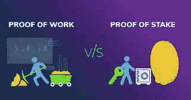
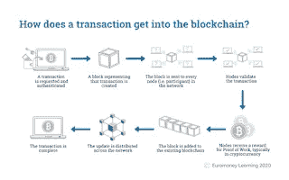
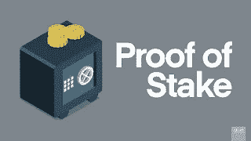

# 理解加密货币共识机制:工作证明和利益证明

> 原文：<https://medium.com/coinmonks/understanding-cryptocurrency-consensus-mechanisms-proof-of-work-and-proof-of-stake-8bb5244f5662?source=collection_archive---------58----------------------->

加密货币在区块链上运行，这是一个去中心化的分布式账本。这就像一个打开的 Excel 电子表格。某个区块链网络上的每个参与者(节点)在每个时间点都有该电子表格的有效副本。

但是，每个参与者或节点如何验证网络上的其他每个人都遵守规则呢？ ***网络上的每一个参与者如何在不需要中央权威的情况下就一个结果达成一致？***

这是通过所谓的**共识机制**实现的。

共识机制是一种容错机制，用于计算机和区块链系统中，以在分布式进程或多代理系统(如加密货币)之间就单个数据值达成必要的一致。

简单地说，这有助于加密货币网络实现所有参与者都可以接受和忍受的结果，它允许参与者能够相互信任。

这种机制或协议将区块链与所有普通数据库区分开来，它对于记录保存非常有用。

在正常的数据库中，簿记员或负责数据库的人控制着记录或数据，并可以决定修改数据。该网络的参与者不能验证簿记员是否遵守规则。这是共识机制试图阻止的。

在加密领域，两种最流行的共识机制是**工作证明(PoW)和利益证明(PoS)** 。

PoW 最初是为了解决垃圾邮件问题而创建的，是由 Cynthia Dwork 和 Mani Naor 在 1993 年发明的。

它后来在 2004 年被已故的美国开发者 Hal Finney 采用，以确保数字货币的安全。2009 年，由于芬尼是第一笔比特币交易的接受者，比特币成为哈尔芬尼想法的第一个应用。

工作证明被用作确认交易和加密货币挖掘的共识机制算法。

一些著名的使用工作证明作为共识机制的加密货币包括比特币、莱特币、Dogecoin、以太币、Ravencoin 等。

**工作证明是如何工作的，它是如何解决重复花费的问题**

为了在对等网络中的平等节点之间就谁应该能够添加到分布式分类帐或开放电子表格达成一致，采用了工作证明。

它的工作原理是要求网络中的一些节点在解决任意复杂的数学难题时相互竞争，以防止任何人操纵系统。

这些执行这项工作的节点被称为矿工，这个过程被称为挖掘。

在竞争中胜出的挖掘者能够在网络上的每个节点验证了所有事务都是有效的之后，将最新的数据块添加到先前的链中。

然后矿工被奖励一些硬币，通过激励矿工验证最新的交易在区块链，工作证明解决了重复支出的问题。

**工作证明的优势**

**工作证明的弊端**

为了解决使用工作证明的硬币的高能耗问题，斯科特·纳达尔和桑尼·金在 2012 年发明了赌注证明机制。

它被引入作为对等加入的共识机制。到那时为止，维护比特币网络每天要花费 15 万美元。

利害关系证明机制看起来实现了与工作证明相同的结果，当然，它们都是共识机制，但是方式不同。

其他一些使用 PoS 机制的加密货币包括 Peercoin、Cardano、Solana、Polkadot 等。

在这个系统中，某些被称为赌注者的节点锁定他们拥有的加密货币。当它们这样做时，它们被称为验证器节点。

一个节点成为验证新交易并将最新块添加到链中的一个节点的趋势，以及赚取奖励取决于他们下注多少加密货币。

你投入的加密货币越多，你成为被选中验证新区块的节点的机会就越大。

**股权证明的优点股权证明的缺点**

作为加密领域的参与者，了解一些加密货币项目背后的一些机制和技术非常重要。这都是“ *DYOR* 过程的一部分。

以太坊的创始人表示，由于以太坊希望从 PoW 转向 PoS，ETH 2.0 每秒将能够处理多达 100，000 笔交易。

权力机制未来是不确定的，因为在大多数分支中 PoS 被证明是更公平和更有效的机制。当然，我觉得 PoS 机制将比可能会看到加密货币采矿死亡的 PoS 更繁荣。

我支持 PoS 机，但我不能向你推荐使用特定机制的特定硬币，因为一如既往……你必须“ *DYOR* ”。

PoS 和 PoW 这两种机制中你最喜欢哪个？

让我在评论里听到你的回答。

一定要给我一些掌声和关注。

干杯。

*原载于 2022 年 6 月 15 日 https://frankiepen.blogspot.com***。**

> **加入 Coinmonks* [*电报频道*](https://t.me/coincodecap) *和* [*Youtube 频道*](https://www.youtube.com/c/coinmonks/videos) *了解加密交易和投资**

# *另外，阅读*

*   *[有哪些交易信号？](https://coincodecap.com/trading-signal) | [Bitstamp vs 比特币基地](https://coincodecap.com/bitstamp-coinbase) | [买索拉纳](https://coincodecap.com/buy-solana)*
*   *[密码交易机器人](/coinmonks/crypto-trading-bot-c2ffce8acb2a) | [维护审查](https://coincodecap.com/uphold-review)*
*   *[如何给 MetaMask 钱包添加 Arbitrum？](https://coincodecap.com/how-to-add-arbitrum-to-metamask-wallet)*
*   *[KuCoin vs 北海巨妖 vs BitYard](https://coincodecap.com/kucoin-vs-kraken-vs-bityard)*
*   *[加密交易的最佳 VPN](https://coincodecap.com/best-vpns-for-crypto-trading)*