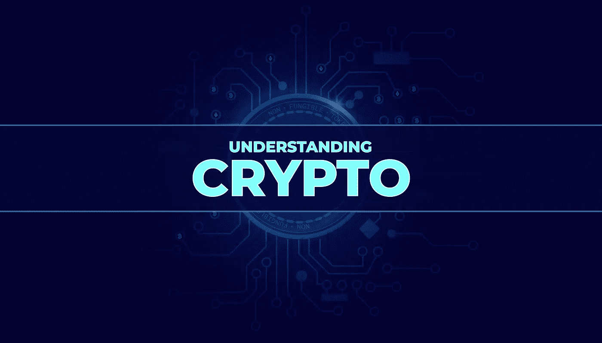

# 了解加密货币的价值、不同的硬币类型和代币

> 原文：<https://medium.com/coinmonks/understanding-cryptocurrency-volatile-value-different-coin-types-liquidity-pools-and-tokens-2a33124f8128?source=collection_archive---------63----------------------->

在本周我们的 [**了解加密**](https://tinyurl.com/understandingcryptopodcast) 播客中，我和共同主持人 [Paul Abercrombie](https://www.linkedin.com/in/paul-abercrombie/) 向听众简单介绍了加密硬币、加密货币价值和代币。我们试图简化比特币、替代币和稳定币的世界，此外，我们还解释了交易所是如何运作的，以及“货币”的价值是如何定义的。目的是…帮助每天的企业主、企业家和潜在的投资者试图揭开加密市场波动的神秘面纱，并分享一些关于消费者如何保护他们的加密投资资产的提示。

**我们从山寨币开始:** 山寨币基本上是指比特币的替代品，在撰写本文时，目前大约有 4000 种山寨币存在……尽管当你读到本文底部时，很可能还有几十种！

它们被称为加密货币的原因是因为有加密技术对它们进行加密，并使它们在后台工作。然而，除了比特币，替代币并不是真正的货币。相反，更准确的方式是将其视为一个创新的区块链项目。

从本质上来说，每一个 altcoin 都是一种筹资活动或人们分享治理、分享奖励或分享对一项新的创新或技术的兴趣的方式。有很多这样的项目，他们用自己创造的加密货币来表现自己。

一些替代硬币非常成功，而其他许多则不成功。

人们把投资替代货币误认为投资一种货币的另一个原因是，它们的交易方式非常相似。你可以去交易所交易替代硬币，类似于股票市场。因此，投资替代硬币与投资股票市场有相同的注意事项，即要小心！

**交易所和流动性池** 如果你要进入加密领域，你需要了解的另一个领域是“货币”的价值是如何产生的，以及支撑它的是什么。与所有资产类别一样，市场的存在必须有需求和供给。交易所通过持有流动性池使交易变得可能、简单和直接。当你想购买或出售你的密码，交易所提供即时结算，因为资金已经存在于流动性池。

因此，比特币的价格波动很快。

如果你创建了一个替代币，并想在交易所上市，你必须决定与哪个加密配对。然后，投资者将他们的资产投入流动性池，以支持替代硬币，使其保持价值。

正如保罗在播客中解释的那样，正是这种配对决定了加密价格如何根据交易活动而上升和下降。“在许多情况下，这些硬币中的一些并没有巨大的市值，所以向两个方向移动并不需要太多，这就是为什么你会看到大量的波动”。

有一种常见的误解，认为加密波动是因为市场作为一个整体是不稳定的，但本质上它是波动的，因为数学，这是由于流动性池的工作方式。如果一个主要的硬币持有人决定出售他们的资产，这将影响价格，就像一个主要股东出售他们在一家公司的股份会影响股价一样。

**stable coins** stable coins 是 altcoins 的迭代版本，设计巧妙，旨在克服波动性问题——如果你正在进行大规模交易，这是一个需要考虑的问题。例如，如果你把你的房子作为 NFT 或一个象征卖掉(这现在听起来可能很滑稽，但那一天即将到来！)这种交易必须在使用加密货币的区块链上进行——但如果你在错误的时间进行，通过智能合约立即执行的大额交易会让你面临被“汇率”波动套牢的风险。这可能会导致您的资产因转换而大幅贬值。

为了应对这种情况，对于像房产销售这样的事情，你可以使用稳定硬币进行交易，因为这些硬币被设计成与实际资产挂钩。例如，USDC(美国数字货币)与美元挂钩；这意味着一 USDC 大约等于一美元。它的波动性也降低了，因为美元的币值波动较小。

一般来说，稳定资产与更大的资产池相关联，它们被用于存储各种用途的价值。基本上，更大的可感知流动性价值的支持创造了稳定性。

鉴于替代硬币有 4000 种类型，它们用于不同的目的和服务于不同的需求也就不足为奇了；以下是一些主要的例子:

基于采矿的替代硬币是一种加密货币，作为将计算能力作为服务捐赠的“奖励”。所以，让我们说你“我的”以太坊，你的服务器能力(顺便说一下，我们不只是说你的标准 PC 能够做这些事情！)正被网络用来处理使区块链工作的数百万次复杂计算。

安全令牌与特定的业务相关联，可以比作 Web 2 世界中的股票。

最后，公用令牌以访问的形式授予其持有者公用设施。目前，这种访问通常是指信息、事件或网络。

那么，你能创造自己的货币吗？
基本上，是的。当然，要做到这一点，你必须跨越一些(实际上是很多)障碍，但在 Web 3.0 的世界里，你真的可以创造自己的经济。成功的关键在于你如何支撑这种“货币”的价值。令牌组学的概念是一个不可分割的部分，其逻辑是复杂的。如果你投资一种货币或硬币，你想知道它背后的价值是什么——特别要注意主要代币/硬币持有者和创始人的“归属”期是如何运作的。为了让加密货币具有稳定性，它们需要基于良好的财政结构，以确保强大的流动性。所有好的硬币都做到了这一点，它们创造了一个过程，这样就没有人能够创造一个“地毯拉”，并在消失之前有效地从流动性池中收回所有价值。

上面写的都不应该被认为是财务建议，但希望你认为它是一个有用的阅读！

[**关于这个话题的更多细节，请查看苹果播客十大投资播客了解加密。**](https://tinyurl.com/cryptocurrencytokens)

> 加入 Coinmonks [电报频道](https://t.me/coincodecap)和 [Youtube 频道](https://www.youtube.com/c/coinmonks/videos)了解加密交易和投资

# 另外，阅读

*   [如何使用 Solidity 在以太坊上创建 DApp？](https://coincodecap.com/create-a-dapp-on-ethereum-using-solidity)
*   [币安 vs FTX](https://coincodecap.com/binance-vs-ftx) | [最佳(SOL)索拉纳钱包](https://coincodecap.com/solana-wallets)
*   [如何在 Uniswap 上交换加密？](https://coincodecap.com/swap-crypto-on-uniswap) | [A-Ads 评论](https://coincodecap.com/a-ads-review)
*   [加密货币储蓄账户](/coinmonks/cryptocurrency-savings-accounts-be3bc0feffbf) | [YoBit 评论](/coinmonks/yobit-review-175464162c62)
*   [Botsfolio vs nap bots vs Mudrex](/coinmonks/botsfolio-vs-napbots-vs-mudrex-c81344970c02)|[gate . io 交流回顾](/coinmonks/gate-io-exchange-review-61bf87b7078f)