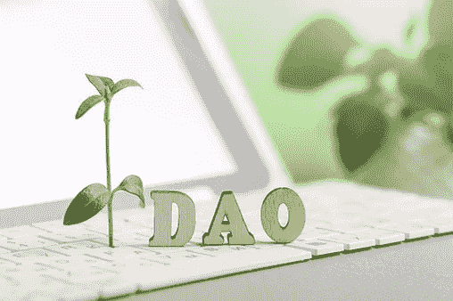

# 理解密码中的分散自治组织

> 原文：<https://medium.com/coinmonks/understanding-decentralized-autonomous-organisations-in-crypto-adb79280343a?source=collection_archive---------13----------------------->

## 把权力还给人民。

Image by Liliya Filakhtova on iStock

今天，受民主原则支配的民族国家的公民大多对民选官员的行为不满。

官员们根据自己的条件做决定，不考虑对他人的影响或后果。

如果公民能够对任何法律或采取的行动进行投票，如果没有他们的投票什么也做不了，他们就会感到民主真正属于他们。

每个人都为制定规则做出贡献，并遵守上述原则。

这些都是刀的特点。

> “道”是一个没有强大力量协调的社区，由社区成员在共同的目标和激励下运行。

你可能想知道这些是如何工作的，如何让每个人都有义务。

这些规则被编码在一个简单的计算机程序中，所有金融交易记录都存储在一个区块链上——这使得它们不会被破坏。

成员通过区块链投票，DAO 的治理通过这些提案进行管理，DAO 可以创建一个治理令牌来组织治理。

治理令牌也可以作为对积极贡献的奖励。一个道产生的成果，靠的是成员的努力。

## 怎么才能加入道？

您可以通过开放会员资格加入 DAO，只需加入他们的 Discord 服务器即可。

一些 Dao 要求您必须持有他们的 NFT 会员令牌，才能进入他们的 Discord 服务器或网站。

## 当今一些功能性 Dao 的例子

Dash 加密货币:这是一个 DAO，用它的治理令牌 DASH 来奖励成员的积极参与。

奥格:奥格是一个去中心化的预测市场，运行在以太坊区块链上。Augur 使用它的令牌(REP)来奖励任何用令牌支持其报告的成员。

开发者道(DAO):这个组织是为 web3 构建者如作家和开发者服务的，它在以太坊区块链上运行。

## Dao 的问题

法律问题:DAOs 的监管状况完全不稳定。虽然很多 Dao 都是合法授权的。

安全性:对已经编写的 DAO 代码的错误修复是无法修复的。更正将要求编写新的代码，这将留下可以利用的盲点。

中心化:随着一把刀的数量越来越大，它在区块链上编码的规则变得中心化(在最初的创始成员身上)。这方面的治理将缺乏充分的权力下放。

## 最后

Dao 是组织在没有权力或层级的中心点的情况下存在的一种方式，它设置尽可能实现最佳结果的治理规则，并奖励参与的成员。

社区的未来将受到这项技术的启发。

> 加入 Coinmonks [电报频道](https://t.me/coincodecap)和 [Youtube 频道](https://www.youtube.com/c/coinmonks/videos)了解加密交易和投资

## 也阅读

 [## 杠杆代币[多头代币]终极指南

### 杠杆化令牌是具有杠杆化风险敞口的 ERC20 令牌，不考虑保证金、要求、管理…

medium.com](/coinmonks/leveraged-token-3f5257808b22)  [## 最佳加密交易所| 2021 年十大加密货币交易所

### 编辑描述

blog.coincodecap.com](https://blog.coincodecap.com/crypto-exchange)  [## 2021 年最佳加密交换平台| CoinCodeCap

### 如果我们看看今天的场景，许多加密货币交换平台提供了广泛的功能和深度…

blog.coincodecap.com](https://blog.coincodecap.com/best-swap-platforms)  [## 10 大最佳网上赌场[2021] |赢取免费 BTC | CoinCodeCap

### 编辑描述

blog.coincodecap.com](https://blog.coincodecap.com/best-online-casinos)  [## 2021 年最佳加密借贷平台| 6 大比特币借贷平台

### 获得比特币和其他加密货币的最佳贷款利率

medium.com](/coinmonks/top-5-crypto-lending-platforms-in-2020-that-you-need-to-know-a1b675cec3fa)  [## 2021 年 6 大最佳硬件钱包|顶级加密硬件钱包[更新]

### 最好的加密货币硬件钱包是绝对必要的。我们将在 NGRAVE、Ledger Nano X 和…

medium.com](/coinmonks/the-best-cryptocurrency-hardware-wallets-of-2020-e28b1c124069)  [## 2021 年最佳免费加密交易机器人

### 2021 年币安、比特币基地、库币和其他密码交易所的最佳密码交易机器人。四进制，位间隙…

medium.com](/coinmonks/crypto-trading-bot-c2ffce8acb2a)  [## 最佳 4 个加密交易信号电报通道

### 这是乏味的找到正确的加密交易信号提供商。因此，在本文中，我们将讨论最好的…

medium.com](/coinmonks/best-crypto-signals-telegram-5785cdbc4b2b)  [## 获取信号、交易机器人和套利

### 编辑描述

blog.coincodecap.com](https://blog.coincodecap.com/bitsgap-review)