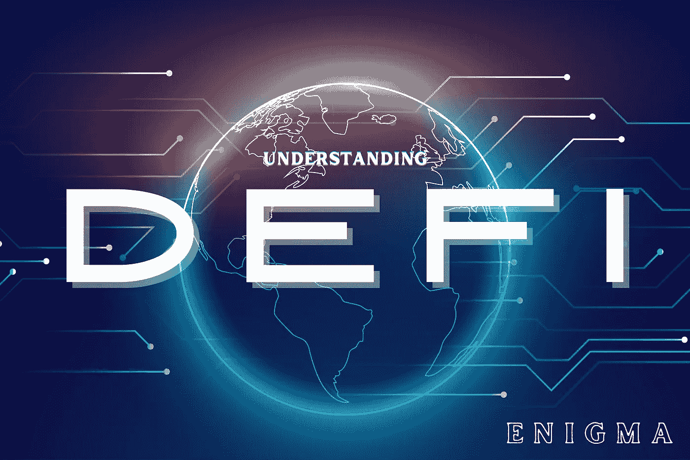
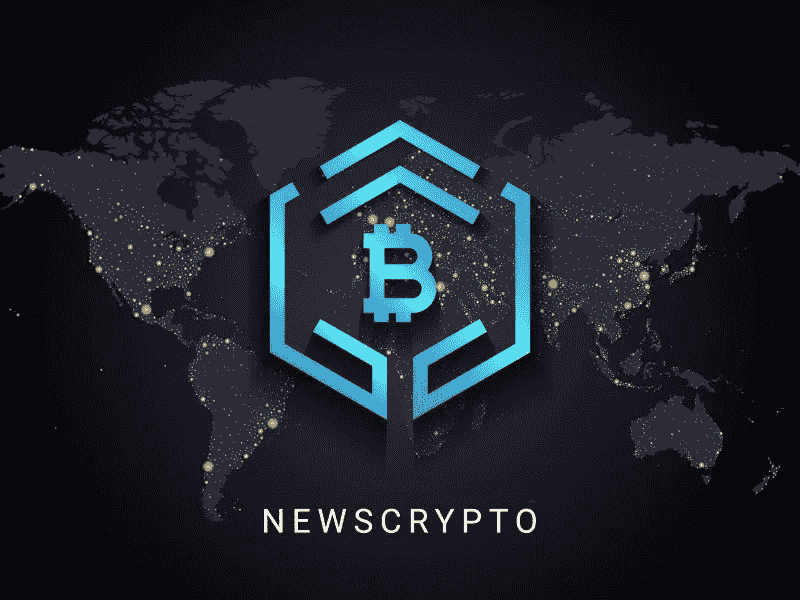
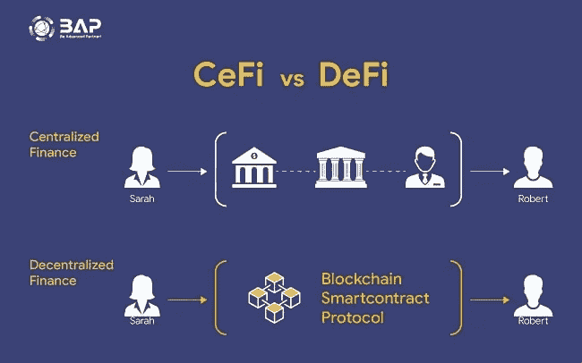
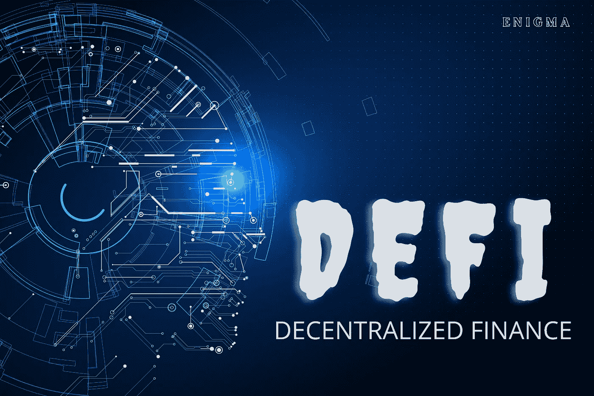
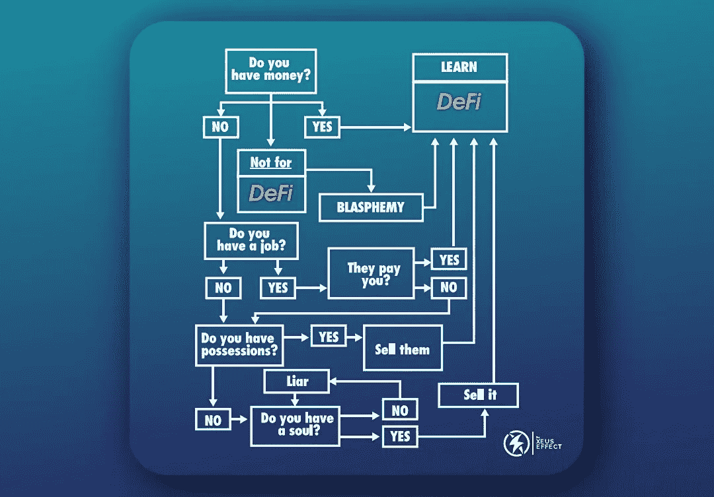

# 理解 DEFI！

> 原文：<https://medium.com/coinmonks/understanding-defi-71d390444d6e?source=collection_archive---------19----------------------->

我记得几天前我试图用我的借记卡从商场买东西，确信我有足够的钱。谢天谢地，我还没开始吃我买的东西。在等待机器完成交易时，服务员喃喃地说，“资金不足，”当她拿出打印的收据时，机器发出的最初声音似乎是试图警告我期待一些奇怪的事情。一个完整的我？我很困惑。一连串的想法掠过我的脑海。

你说不足是什么意思？走出商店时，我想，也许是机器工作不正常，也许是网络不稳定。

我查看了我的银行应用程序，发现他们刚刚在同一天扣除了印花税、到期短信和卡维护的费用。你一定也想知道他们是如何帮助维护我口袋里的卡的。

你应该知道金融机构如何倾向于控制我们自己的钱，未经我们同意就扣除我们的资金，政府如何放置不必要的网络费用，或者那些不尊重我们，忘记我们的胡子和社会地位的没有礼貌的银行家如何？我知道我们很多人可能都经历过这样的创伤。是的，我想向你介绍一个系统，它将把我们从这种统治地位拉出来。

我叫恩尼格玛，我是一名作家、分析师和研究员。我是这个领域的新手，但我写过一些大的东西，有一些技术写作经验。仅仅是因为我对 Defi 和区块链技术的一点点了解。

众所周知，蜡烛不会因为照亮别人而失去任何东西，所以我选择利用这个机会向所有感兴趣的人解释 Defi 到底是什么，它是如何工作的，以及任何人如何学习和利用它。

> **Newscypto** 是一个在线平台，你可以在这里了解关于区块链和加密货币的一切，拥有大量的学生和教育工作者，不断增长的社区，以及我们伟大的实用原生令牌，加入[**NEWSCYPTO 这里**](https://app.newscrypto.io/register/sign-up?referral=f386fdb2) ，你可以在 [**BYBIT 这里**](https://partner.bybit.com/b/NewsCrypto)

DEFI 只是“分散金融”的首字母缩写。因此，要理解分权，我们需要知道集权意味着什么。

“集权是一个短语，表示某物被个人或团体拥有或统治的情况。”“权力下放”显然指的是不属于或不能属于个人或单一机构的东西。

一个集中的金融系统包括一个中央机构或第三方。例如银行业或政府。

从历史上看，我们都以某种方式参与了这个体系。尤其是在银行系统和社交媒体领域。

他们强加做事的要求或标准；建立规章制度，并始终寻求界定我们应该做什么和不应该做什么，以及在未经我们同意的情况下为我们做决定。

中央财政并不局限于传统的银行系统；它还被用于加密货币行业，集中交易所如币安、库币和其他交易所，每个交易所都有自己的一套法律法规、条款和条件。事实上，即使是很小的错误也会阻止您访问您的资产。

然而，去中心化的金融体系的出现将我们从这些中央权力机构中解放出来，为我们提供了一个平台，在这个平台上我们可以按照自己的方式做事。

功能的分散被称为去中心化。它是分散的，因为它不是由一个人、实体或组织管理的。

**什么是 DEFI？**

Source BAP

分散金融，缩写为“Defi”，是一种数字金融基础设施，它消除了金融交易需要银行、政府机构或团体批准的要求。该系统旨在提供一个开源、无许可和透明的金融服务系统，该系统对任何人开放，并且在没有中央权力机构干预的情况下运行。

简单地说，分散融资意味着你是你的银行，对你的资产拥有完全的控制权。

Defi 还指在区块链网络基础上发展起来的金融生态系统。

它也可以比作一场运动，旨在创建一个开放源代码、无许可、透明的金融服务生态系统，任何人都可以访问，并且无需中央权威机构即可运行。用户将对他们的资产拥有完全的所有权，并通过分散的点对点(P2P)应用程序(dapps)参与生态系统。

这与在区块链复制的现有金融系统相当，但这次你可以控制你的资金。

所以基本上，Defi 是银行做的一切，但在区块链，没有协议。

因此，用最基本的术语来说，分散金融被描述为建立在区块链基础上的金融应用、服务和工具。请记住，在区块链上保存的任何数据都是永久的，永远不能删除，这意味着在分散金融中进行的所有金融交易都将永远保存在区块链上，并且记录对任何人都是公开的。但由于旧的金融体系依赖于产生利润的中介机构，它们的服务在低收入地区往往无法获得。另一方面，DeFi 的成本要低得多，低收入消费者可以利用更广泛的金融服务选择，使每个人都可以获得这些服务。

**有什么优势？**

你不需要“开”一个账户或申请任何东西。你只需要创建一个钱包就可以访问。

你不必给出你的名字、电子邮件地址或任何其他个人信息。

灵活:您可以在任何时间将资产转移到任何地方，而无需获得授权、等待漫长的转移完成或支付高昂的成本。

快速:利率和价格经常更新(每 15 秒一次)，可能比传统华尔街的利率和价格高得多。

透明:所有相关人员都可以看到整个交易过程(私营企业很少提供这种透明度)。

**DEFI 中的组件**

**区块链**

这是一种存储数据的方法，使黑客很难侵入、篡改或改变系统。

交易的数字分类账通过网络复制和分发，并通过加密进行链接和保护。

换句话说，它是一个不断增长的记录集合，称为链接和加密的块(页)。

目前有不同种类的区块链，如以太坊区块链，币安链，多边形区块链，等等。

这些区块链有自己的加密货币，称为“硬币”，但是其他没有区块链的加密货币被称为令牌:多边形区块链，例如，多边形有 Matic，而以太坊区块链有 Ether。

**2。密码术**是通过对消息进行编码或加密以使其不可读来实现安全性的行为。

因此，为了在区块链中发送安全通信，消息被加密成代码，这些代码可以被解密成原始形式，以使其可读。

**3。智能合约？**

智能合约是两个人之间达成的协议，作为在区块链上运行的计算机代码记录在公共数据库中。

智能合约交易由区块链处理，无需第三方协助即可自动发送。

执行由代码控制，事务是可跟踪的和不可逆的。

**4。流动性**

流动性是指代币在不影响其价格的情况下买卖的容易程度。

没有流动性，交易就无法进行。流动性不足的代币不能买卖。将流动性视为嵌入代币或硬币中的价值或用途。当流动性低时，它被卖出的机会将是有限的，
这就是你听到的滑点容忍度之类的东西，显然这里不会讨论。

# DeFi 的潜在使用案例有哪些？

**借贷。**

分散的借贷比传统的信贷系统有多种优势。抵押数字资产的能力、信用检查的缺乏以及未来标准化的可能性只是其中的几个优势。

这些贷款服务需要较少的信任，并提供加密证明，因为它们建立在公共区块链上。由于区块链的信贷系统降低了交易对手的风险，借贷变得更加实惠、快捷，也更容易为更多的人所接受。

# 分散的市场

这个类别可能很难评估，因为它是 Defi 的一部分，允许最大的金融创新。

分散式交换机可以说是一些最重要的 Defi 应用程序(DEXes)。这些平台允许用户交易数字资产，而不要求他们的资金由可信的中介(交易所)持有。随着智能合约的使用，交易在用户钱包之间直接完成。

分散交易所的交易成本通常比集中交易所低，因为它们需要的维护工作要少得多。

**货币银行业务**

随着区块链工业的成熟，稳定硬币的发展变得越来越重要。它们是一种加密资产，通常与物理资产挂钩，但可以轻松地以数字方式转移。鉴于加密货币的价格有时会快速变化，分散的稳定硬币可以作为数字现金用于日常生活，既不是由中央当局发行也不是由中央当局监控。

**如何开始**

首先，您需要以下一些工具:

(a)能上网的设备，如电话或笔记本电脑；

(b)一个分散的钱包来存放你的资产；

加密货币；

(d) DAPPS 和德克斯

一些应用程序提供了跟踪硬币和趋势的功能。

**注意事项**

虽然 Defi 有许多优点，但它也有几个缺点，其中之一是赔钱的可能性。虽然这只有在您的 Defi 途径包括购买和投资加密货币时才有可能，但其他人可能不会受到影响。

首先，你永远不要把你的钱包种子短语给任何人。

说到投资，一定要做足功课。

不要因为隔壁邻居买了加密货币就去买。

不要试图快速赚钱，而不先学习这门学科的所有知识；否则，你最终会失去一切。

应避免可疑的货币产品、蜜罐、rugpulls 和其他类似物品。

我们如何从这种赤字中获利？

哦，是的，我知道这是你一直在等待的部分。在这个 DEFI 空间，老实说，有许多不同的方式赚钱。

决定什么适合你的技能或兴趣完全由你自己决定。没有人会想做任何不赚钱或从长远来看不赚钱的事情；至少，应该出现一些事情来使它变得值得。

人们在这一领域赚钱的一些方式是翻转 IDOs、打桩/耕作、hodling、借贷、德根游戏、套利和提供服务，仅举几例。

IDO 是 Initial Dex Offerings 的首字母缩写，这是 Defi 中一个令人兴奋的发展，项目提供他们的想法和愿景，让人们在早期阶段买入，以便在项目开始交易时获利。

**下注**是赚取被动收入的一种方式。这或多或少就像把你的代币锁在池子里，然后获得回报。一个典型的例子是传统银行体系中的定期存款，

**农业**是同样的事情，但只是你在这里为他们提供流动性。

借贷和套利。

**学习和提供服务:**

这是我最常推荐的。在这里，你可以找到 Defi 的工作，并提供服务，无论是作为一名 Defi 导师，一名 Defi 研究员，一名设计师，一名编辑，一名社区经理或主持人，用户界面/UX，技术或文案，以及其他几个人。您对 Defi 的充分了解将使您能够提供这样的服务并获得更高的报酬，

但是如果你不能完全理解它，你就不能提供服务，因为任何 Defi 工作的主要标准当然是对它的理解。这就是拥有正确信息的关键所在。

即使你选择购买并持有 crypto，如果你没有必要的专业知识，你也可以在几秒钟内失去所有的利润。

因此，学习和获得足够的知识至关重要；它不仅为你提供了在 Defi 中打开宝石的钥匙。你会接触到很多志同道合的人。

因此，我将只推荐两个地方，从初学者到高级者都可以在那里学习。有没有先验知识并不重要。

XUES THE GREAT

我首先推荐 [**桃子学院**](https://wa.link/ld7flu) ，这是一个从新手到进阶，从一本书学到一切的好地方。通过 Coingecko，这本书实际上很贵，但你可以在这里的[**Selar**](https://selar.co/1vdk)**或 [**Gumroad 上买到。**](https://enigma778.gumroad.com/l/funyx)**

**[**在 Twitter 上关注我**](https://twitter.com/Soy_Enigma)**

**.:**

> **加入 Coinmonks [电报频道](https://t.me/coincodecap)和 [Youtube 频道](https://www.youtube.com/c/coinmonks/videos)了解加密交易和投资**

# **另外，阅读**

*   **[5 款最佳加密交易终端](https://coincodecap.com/crypto-trading-terminals) | [最佳 DeFi 应用](https://coincodecap.com/best-defi-apps)**
*   **[最佳网上赌场](https://coincodecap.com/best-online-casinos) | [币安评论](/coinmonks/binance-review-ee10d3bf3b6e) | [BitMEX 评论](https://coincodecap.com/bitmex-review)**
*   **[麻雀交换评论](https://coincodecap.com/sparrow-exchange-review) | [纳什交换评论](https://coincodecap.com/nash-exchange-review)**
*   **[美国最佳加密交易机器人](https://coincodecap.com/crypto-trading-bots-in-the-us) | [变化回顾](https://coincodecap.com/changelly-review)**
*   **[在印度利用加密套利赚取被动收入](https://coincodecap.com/crypto-arbitrage-in-india)**