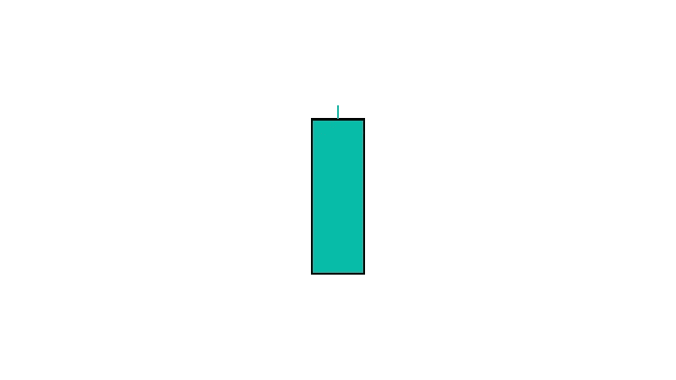

# 白色长日烛台模式——如何交易

> 原文：<https://medium.com/coinmonks/understanding-long-white-day-candlestick-pattern-36f28750d06c?source=collection_archive---------19----------------------->

Long white day candlestick pattern

长白日烛台是一个非常可靠的看涨反转形态。然而，应该注意的是，这种模式也可能出现在市场底部。在这种情况下，这将是一个熊市反转模式。

如果你在图表上看到一根长长的白色日线，请密切关注接下来几天的价格走势。如果多头能够保持控制，价格继续走高，那么这是一个非常看涨的信号。但是如果空头控制了市场，价格开始下跌，那么这个模式就失败了，你应该准备好获利了结或者退出你的头寸。

# 如何识别？

*   这支蜡烛很容易辨认，因为它只由一支蜡烛组成
*   由长长的身体组成，比图表上以前的蜡烛还要长
*   这根蜡烛的长度应该完全包含图表上以前的蜡烛

# 如何交易？

长长的白色蜡烛线是看涨反转形态，可以用来交易市场。有几种方法来交易这种模式，但一种方法是在一段时间的盘整或下跌后寻找一个长的白色蜡烛线。这表明市场已经准备好走高，买家已经控制了局面。另一种交易这种形态的方法是寻找一个上涨后形成的白色长蜡烛线。这表明市场已经准备好走高，买家已经控制了局面。

使用此移动应用程序了解更多关于烛台模式的信息并解锁更多交易机会— [交易:谷歌 Play 商店的烛台模式](https://play.google.com/store/apps/details?id=com.candlestickpatterns)

*感谢你阅读这篇文章！如果你有任何问题，请在下面留下评论，并确保在媒体上关注我:)*【https://medium.com/@algerwrites 

> 加入 Coinmonks [电报频道](https://t.me/coincodecap)和 [Youtube 频道](https://www.youtube.com/c/coinmonks/videos)了解加密交易和投资

# 另外，阅读

*   [Bitsgap 审查](/coinmonks/bitsgap-review-a-crypto-trading-bot-that-makes-easy-money-a5d88a336df2) | [Quadency 审查](/coinmonks/quadency-review-a-crypto-trading-automation-platform-3068eaa374e1) | [Bitbns 审查](/coinmonks/bitbns-review-38256a07e161)
*   [密码本交易平台](/coinmonks/top-10-crypto-copy-trading-platforms-for-beginners-d0c37c7d698c) | [Coinmama 审核](/coinmonks/coinmama-review-ace5641bde6e)
*   [印度的加密交易所](/coinmonks/bitcoin-exchange-in-india-7f1fe79715c9) | [比特币储蓄账户](/coinmonks/bitcoin-savings-account-e65b13f92451)
*   [OKEx vs KuCoin](https://coincodecap.com/okex-kucoin) | [摄氏替代品](https://coincodecap.com/celsius-alternatives) | [如何购买 VeChain](https://coincodecap.com/buy-vechain)
*   [币安期货交易](https://coincodecap.com/binance-futures-trading)|[3 comas vs Mudrex vs eToro](https://coincodecap.com/mudrex-3commas-etoro)