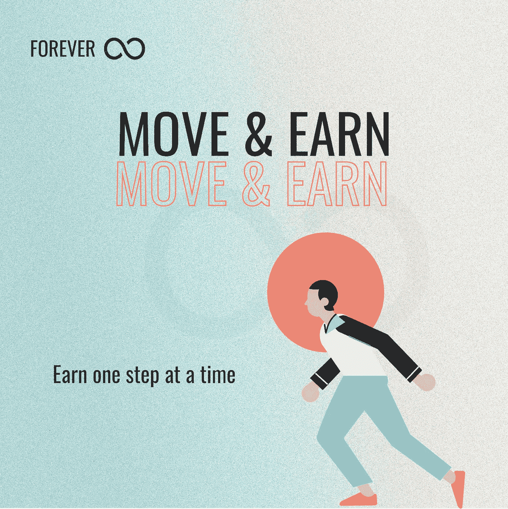

# 理解 Move2Earn:新兴的 Web3 游戏模式及其如何激励更健康的生活方式

> 原文：<https://medium.com/coinmonks/understanding-move2earn-the-emerging-web3-gaming-model-and-how-it-incentivizes-a-healthier-99a4b9967491?source=collection_archive---------6----------------------->

Move2Earn 模型的想法是，我们可以利用我们的自然运动来赚钱。

以 Web3 形式出现的新应用和技术带来了一个新概念，Move2Earn。虽然有人称之为 Burn2Earn 或 Play2Health，但这是 Web3 中的一个新兴概念，它激励用户认真对待自己的健康。这是生物技术和区块链的革命性融合。在本文中，我们将探讨与 web3 相关的 Move2Earn 的增长趋势，它带来的表层和深层解决方案，以及如何永远围绕这一概念来确保人们能够控制自己的健康数据。

**move 2 earn 概念是什么？**

Move2Earn、Burn2Earn 或 Play2Health 是一个新颖的概念，它结合了游戏保真、社交保真和 NFT 方面——可以在 Play2Earn 模型中找到的元素。参与 Move2Earn 项目的用户会因为保持更健康的生活方式而获得奖励，而不是在零激励的情况下独自玩游戏。Move2Earn 模型的想法是，我们可以利用我们的自然运动来赚钱。可穿戴设备、计步器、增强现实、GPS 和 NFTs 被用来跟踪锻炼习惯和活动，以奖励用户可以转换为法定货币的代币。

**是为了挣点报酬而漫无目的地移动吗？**

为了保持健康的生活方式，你需要合理饮食和经常锻炼——健身。当你做不到这些时会发生什么？简单！健康恶化。这就是 Move2Earn 概念的由来，它旨在创造一个更健康的世界，在这个世界上，人们有动力保持健康和活跃，同时赚钱。所附的奖励将作为一种激励和一种简单的方式来吸引那些通常不会参加健身活动的用户。听起来很酷，对吧？

**用 Move2Earn 模型建造的永远是什么**

永远是一个与众不同的 Move2Earn 平台。它生来就有一个使命:成为人类健康的谷歌搜索引擎。这是一个分布式所有权驱动的健康数据平台。Web3 将是未来的互联网，用户可以控制他们的数据。反过来，Forever 将确保用户在未来能够控制自己的健康数据。永久带给 Web3 的解决方案可以分为两类:

**表层解决方案:**用 Web3 机制激励更健康的生活方式。

**深度层面解决方案:**打造许可健康数据银行平台，让健康数据去中心化，由用户掌控。

为了理解*通过 Move2Earn 模型为 Web3 带来的表层和深层解决方案*，让我们来看看它激励用户的两种方式。Forever 正在区块链建立一个健康数据库，以两种方式激励用户:数据收集和数据共享。

**数据收集**

如前所述，Forever 正在为用户创造一个游戏化的环境，通过 Move2Earn 模型获得身体活动的奖励。用户数据将通过可穿戴设备和界面(包括脑机接口(BCI)、健身追踪器和眼球追踪技术)收集(通过用户的活动)。

在此阶段，收集的数据将自动发送到 Forever 的移动应用程序，仅供用户访问。数据将保存在区块链上，由只有用户才能访问的私有密钥保护。因此，通过这种锻炼模式，用户可以保持健康，并降低感染与缺乏锻炼和频繁身体运动相关的慢性疾病的风险。两个城市之间永远的第一次 Burn2Earn 竞争的白名单:迈阿密 x 纽约，正在进行中。[在这里加入](/p/69a30364b57a)。

**数据共享**

现在，数据已保存在 Forever 应用程序中，用户无法对其进行破坏、删除、篡改或限制，因为数据将保存在区块链上。第三方无法访问这些数据，包括永远无法访问。它只对用户开放——用户拥有数据。用户是如何获得回报的？通过向第三方提供对用户数据的只读访问，用户可以获得令牌作为奖励。这意味着用户可以通过 Forever 的 Web3 钱包匿名与其他用户分享他的健康数据。此外，研究人员、教师、讲师、学生或希望开展革命性健康研究的组织将付费访问这些数据。如果获得许可，用户可以在不暴露身份的情况下赚钱。如果用户决定不分享他的数据，这些数据将永远留在他的 Web3 钱包里。

这是永远用来激励用户的两种方式。这两种方式概述了什么是永远，以及它给 Web3 带来的最终解决方案——创建一个健康数据库。

网址:[https://steps . forever . today](https://steps.forever.today/i/INaAis)

推特:[https://twitter.com/ForeveToday](https://twitter.com/ForeveToday)

不和:[https://discord.gg/Jnbfrqn94Q](https://discord.gg/Jnbfrqn94Q)

> 加入 Coinmonks [电报频道](https://t.me/coincodecap)和 [Youtube 频道](https://www.youtube.com/c/coinmonks/videos)了解加密交易和投资

# 另外，阅读

*   [OKEx vs KuCoin](https://coincodecap.com/okex-kucoin) | [摄氏替代品](https://coincodecap.com/celsius-alternatives) | [如何购买 VeChain](https://coincodecap.com/buy-vechain)
*   [币安期货交易](https://coincodecap.com/binance-futures-trading)|[3 comas vs Mudrex vs eToro](https://coincodecap.com/mudrex-3commas-etoro)
*   [如何购买 Monero](https://coincodecap.com/buy-monero) | [IDEX 评论](https://coincodecap.com/idex-review) | [BitKan 交易机器人](https://coincodecap.com/bitkan-trading-bot)
*   [CoinDCX 评论](/coinmonks/coindcx-review-8444db3621a2) | [加密保证金交易交易所](https://coincodecap.com/crypto-margin-trading-exchanges)
*   [红狗赌场评论](https://coincodecap.com/red-dog-casino-review) | [Swyftx 评论](https://coincodecap.com/swyftx-review) | [CoinGate 评论](https://coincodecap.com/coingate-review)