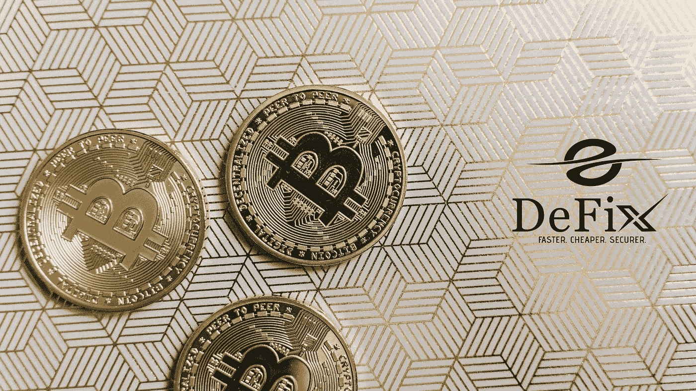
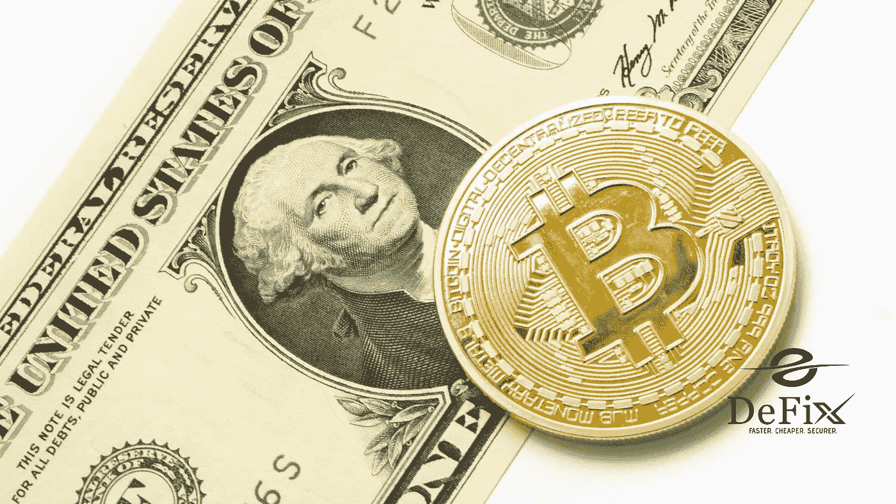

# 对比特币重复消费问题的理解

> 原文：<https://medium.com/coinmonks/understanding-on-the-double-spending-problem-with-bitcoin-151f5f89700c?source=collection_archive---------34----------------------->

货币操纵是所有经济体系中的一个问题。犯罪分子试图从当前的货币中获利，无论是伪造的黄金、美钞、硬币还是双重消费的数字现金。

不良行为者是新技术和资金的早期采用者，因为资产未经测试或不受控制，因此更容易被滥用。比特币是一种禁忌。

分散的比特币网络没有中央权威机构、监管机构或监管组织来监管窃贼和黑客。虽然传统的安全组织不会监控比特币网络的重复支出，但人们已经创建了各种网络防御来保护网络的共识过程和交易记录，从而给予投资者信任。

## 什么是双重消费？

当一个单位的现金被花了两次时，就会出现重复支出的问题。双重支出导致支出和可获得资金之间的差异。

假设一个人带着 10 美元走进一家服装店，买了一件 10 美元的衬衫，然后又用同样的 10 美元买了一件 10 美元的衬衫。虽然由于验证交易历史和当前所有者，这对于实物货币来说是困难的，但这对于数字货币是可能的。

双重消费通常与比特币有关，因为了解区块链协议的合格程序员可以很容易地改变或重新创建数字信息。由于比特币是一种绕过中介和机构的点对点货币，因此也是双重消费的目标。

比特币双重消费涉及发送支付副本，同时保留初始交易或完全删除初始交易。对于比特币或任何电子货币来说，这都是可能的，也是有风险的。犯罪分子使用许多方法来双倍消费比特币。

## **同时发送两次(或更多)相同金额的比特币**

攻击者会将相同的比特币转移到两个(或更多)不同的账户。这种攻击的目标是比特币网络的 10 分钟阻塞期，此时支付被传输到网络并排队等待矿工验证。窃贼可能会改变当前的区块链技术，并煞费苦心地重新挖掘具有虚假交易记录的区块，以通过将额外交易混入网络来支持预期的未来双重消费。

## **撤销已发送的交易**

另一种双重花费比特币的技术是在获得交易对手的商品或服务后取消支付，保留产品和交付的比特币。攻击者向网络发送几个数据包(数据单元)来逆转交易。

## **双消费和区块链**

黑客可能会通过向卖家提交虚假的交易历史和向网络提交虚假的日志来超越区块链安全机制或重复消费，以避开比特币验证系统。

重复支出的最大危险是，一个或多个用户控制了用于维护区块链分布式交易记录的 50%以上的计算机能力。一旦拥有了区块链，一个坏演员可能会编辑描述，将比特币发送到他们的钱包应用程序几次，就好像最初的交易从未发生过一样。

另一个问题是，如果 crypto 继续转向分散式交易所(DEX ),可能会出现重复支出。由于没有集中的实体或中介，dex 必须建立其安全性和能力，以避免重复支出。

尽管几次成功的双花费努力，大部分比特币盗窃是由于人们没有充分保护他们的比特币。

## **结论**

因为比特币是数字货币，所以没有中央权威机构来验证其消费记录。没有中央权威会引起对网络安全、验证者和货币供应的担忧。web 的分布式交易数据库 chain 会自动记录和验证每一笔交易。

在一群独立的验证者解决复杂的数学问题来认证和验证交易在被正式提交到程序的永久记录之前没有重复花费之前，区块链充当了防御的屏障。

由于新闻流和其他原因，比特币等加密货币的价格可能会飙升。但正是价格大幅波动的可能性吸引了一些投资者，尤其是长期投资者，考虑加密。

> 加入 Coinmonks [电报频道](https://t.me/coincodecap)和 [Youtube 频道](https://www.youtube.com/c/coinmonks/videos)了解加密交易和投资

# 另外，阅读

*   [Bookmap 评论](https://coincodecap.com/bookmap-review-2021-best-trading-software) | [美国 5 大最佳加密交易所](https://coincodecap.com/crypto-exchange-usa)
*   最佳加密[硬件钱包](/coinmonks/hardware-wallets-dfa1211730c6) | [Bitbns 评论](/coinmonks/bitbns-review-38256a07e161)
*   [新加坡十大最佳加密交易所](https://coincodecap.com/crypto-exchange-in-singapore) | [购买 AXS](https://coincodecap.com/buy-axs-token)
*   [红狗赌场评论](https://coincodecap.com/red-dog-casino-review) | [Swyftx 评论](https://coincodecap.com/swyftx-review) | [造币厂评论](https://coincodecap.com/coingate-review)
*   [投资印度的最佳密码](https://coincodecap.com/best-crypto-to-invest-in-india-in-2021)|[WazirX P2P](https://coincodecap.com/wazirx-p2p)|[Hi Dollar Review](https://coincodecap.com/hi-dollar-review)