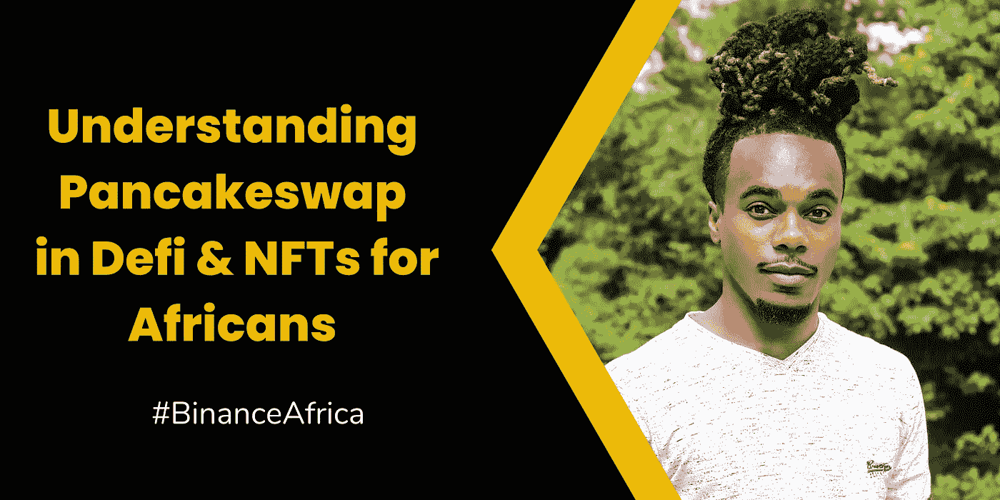
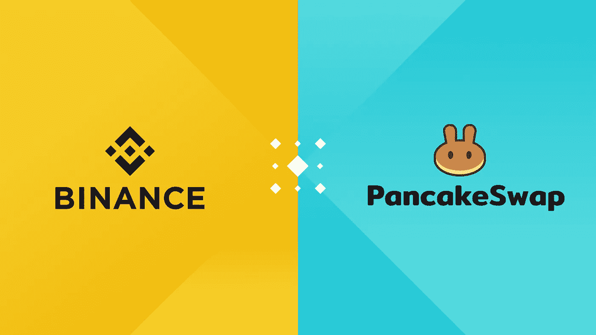

# 了解 Defi 中的 Pancakeswap & NFTs 对非洲人的重要性

> 原文：<https://medium.com/coinmonks/understanding-pancakeswap-in-defi-importance-of-nfts-for-africans-30f64f15bf74?source=collection_archive---------71----------------------->

分散式金融和非金融交易正在席卷加密领域。作为一个生活在非洲的人，这对你来说意味着什么？

在这篇博文中，我们将探讨 Defi 中的 Pancakeswap，以及 NFTs 对非洲人的重要性。

**重要提示**

1.  如果你还没有入门币安， [***在这里创建一个账号> >***](https://accounts.binance.com/en/register?ref=431277160)
2.  想了解更多关于加密、Defi & NFTs 的知识。 [***币安学院入门> >***](https://academy.binance.com/en)

**目录**

**∘**[**pancakeswap in defi&其对非洲人的好处**](#ee3d) **∘**[**非关税壁垒对非洲人的重要性**](#037c)

## Defi 中的 pancakeswap &它对非洲人的好处

不，这不是交换煎饼。听起来很棒。

Pancakeswap 是一个分散的交易所，在币安智能链上运行。

为了充分探索 Pancakeswap，我们必须了解分散式交换。

我说的“*去中心化交易所*”是什么意思？分散交易所源于*分散金融* (Defi)。

*Defi* 可以很容易地被描述为一个在其运营中主要依赖于密码学、智能合约和区块链的金融系统。

这是一个完全没有许可的金融系统，对所有人开放，不需要像银行这样的监管中介。

因此 *Pancakeswap* 只是 *Defi 生态系统*的一部分，用户可以将他们的资产借给 L *流动性池*，作为回报，他们可以获得*流动性代币。*

把流动性池想象成一个自动做市商。

让我们进一步证明这一点。

在传统金融系统中，金融机构依靠做市商提供流动性。这些人愿意在你想卖的时候买，反之亦然。没有这些人，就没有市场，银行也不会存在。

然而在 *Defi 生态系统*中，做市商是*你和我*。因此，我们成为市场(*银行*)。

当我们将资产借给流动性池时，我们赋予了生态系统清算资产的能力，用户可以不受阻碍地进行买卖。作为回报，我们会得到更多的代币(利息)。

本质上，这种做法就是我们所定义的 *Pancakeswap。*

这整个操作发生在币安智能连锁区块链网络上。

*作为一个生活在非洲的人，Pancakeswap 对你有什么帮助？*

想象一下，你是一个没有权限的金融系统的一部分，这个系统实际上平等地对待所有用户。在这里，守则就是法律。只要你遵守法律，你就是好人。在这个金融生态系统中，你的身份、肤色和所在地都无关紧要。

*那岂不是梦想成真？*

[***币安***](https://accounts.binance.com/en/register?ref=431277160) 用户可以通过简单易行的步骤开始使用 Pancakewap。

[***此处开始使用 Pancakeswap>>***](https://www.binance.com/en/how-to-buy/pancakeswap)

## 非传统疗法对非洲人的重要性

NFT 是这个街区的新成员，他最终将艺术带入了生活。

当我提到 NFT 的时候，我打赌你脑海中会浮现出一张猿猴的图片。请记住，NFT 只是一个平台，我们带给它什么完全取决于我们自己。

如果我们作为非洲人可以做得更多呢？如果我们可以通过展示我们的非洲遗产来彻底改变 NFT 空间，那会怎么样？当其他大陆占领太空时，我们不再袖手旁观。

因为面对现实吧。非功能性测试会一直存在。

和一群年轻的尼日利亚人，利用 NFT 的空间讲述非洲的故事。

在这一点上，我们仍然不确定 NFT 将如何定义未来。

这就像我们回到了 1993 年，没有人知道互联网将如何影响未来。

然而， [***币安***](https://accounts.binance.com/en/register?ref=431277160) 在代表非洲 NFT 方面就走大了。 [***今天就加入币安***](https://accounts.binance.com/en/register?ref=431277160) ，让我们一起推广自己。

[***加入币安东非电报集团> >***](https://t.me/BinanceEastAfrica)

> 加入 Coinmonks [电报频道](https://t.me/coincodecap)和 [Youtube 频道](https://www.youtube.com/c/coinmonks/videos)了解加密交易和投资

# 另外，阅读

*   [从 WazirX 转向 CoinDCX 的 5 个理由](https://coincodecap.com/reasons-to-switch-from-wazirx-to-coindcx)
*   [Unocoin 评论](https://coincodecap.com/unocoin-review) | [最佳加密赌注硬币](https://coincodecap.com/best-crypto-staking-coins)
*   [如何使用 MetaMask Wallet 获取 KCC 地址？](https://coincodecap.com/kcc-address-metamask)
*   [如何获得自己的。XYZ 领域？](https://coincodecap.com/xyz-domain)
*   [最佳加密交换平台](https://coincodecap.com/best-crypto-swap-platforms) | [最佳加密交易所](https://coincodecap.com/crypto-exchange)
*   [购买比特币印度](/coinmonks/buy-bitcoin-in-india-feb50ddfef94) | [Pionex 评论](/coinmonks/pionex-review-exchange-with-crypto-trading-bot-1e459d0191ea) | [加密交易机器人](/coinmonks/crypto-trading-bot-c2ffce8acb2a)