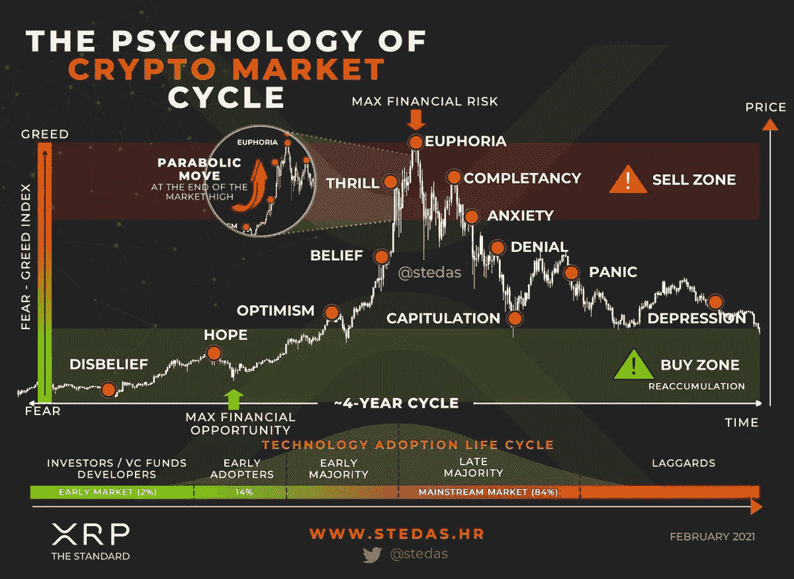
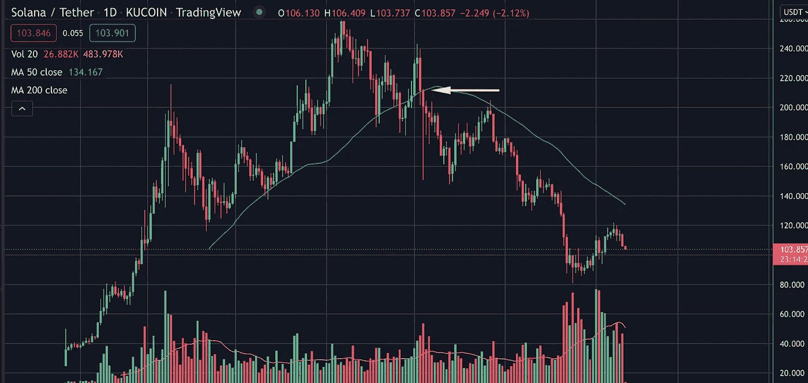
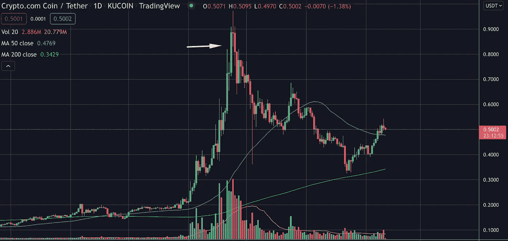
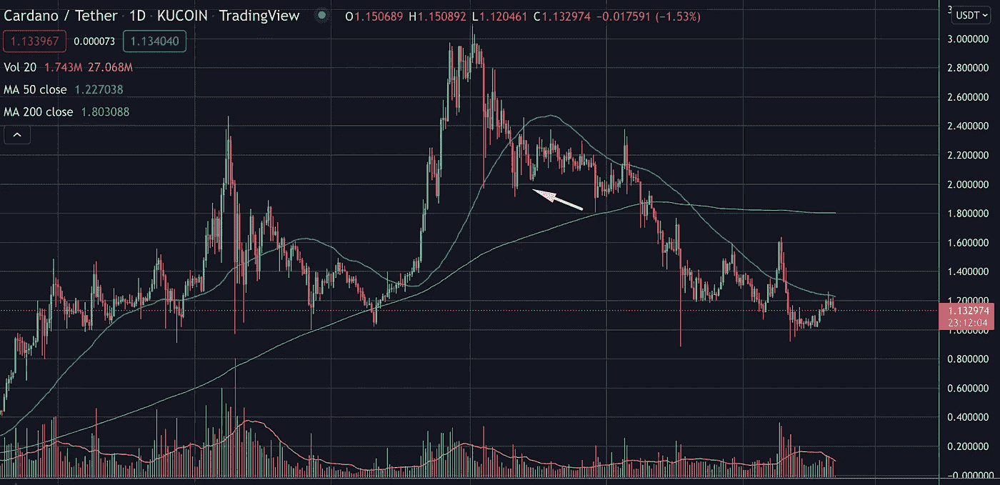

# 了解加密货币市场的定位和市值问题

> 原文：<https://medium.com/coinmonks/understanding-positioning-in-cryptocurrency-markets-and-market-cap-matters-e6d3bb0101c8?source=collection_archive---------12----------------------->

# 介绍

周期的概念存在于每个市场，加密货币也不例外。直到 2021 年末，有许多 4 年周期理论的支持者，但现在已经无效了。在这 4 年内，我们大概会有 2 年的下降期，2 年的上升期，然后在结束时会有一个爆发期，这将催生下一个隐秘的冬天。在每个加密市场周期中，每个硬币都有自己的周期。当你看着一枚硬币的时候，你需要试着理解在硬币当前的循环中，你处于什么位置来阻止自己进入。当我们处于只涨模式时，你开始观察到影响者不切实际的短期价格预测，这使你 FOMO 成了一枚已经上涨了 30 倍的硬币。太多的人在一个硬币上涨 30 倍后进入周期，希望它会再次上涨 30 倍并被刺。在这种情况下，你所做的只是为其他人提供退出流动性，这就是理解市值的重要性所在。

## 市值

当人们投资硬币，尤其是零售硬币时，他们通常会查看硬币的价格，并计算价格达到 10 倍的可行性。人们被更便宜的硬币所吸引，原因如下:
1)它们更便宜
2)在纸面上，从 1 美元到 10 美元看起来比从 100 美元到 1000 美元更容易
3)他们正在寻找下一个比特币/以太坊/主要 L1 硬币，以防它起飞。

当你第一次加入加密空间时，每个人都对此感到内疚。你还需要考虑的另外两个基本因素是市值和供应量。值得一提的是市值是如何计算的，因为我们稍后将需要这个:
**市值=流通中的硬币总数 x 在任何给定时间单个硬币的价格。**
例如，以太坊目前的流通供应量为 119，525，745 ETH，撰写本文时 1 ETH 的价格为 3，144.38 美元，意味着市值为 376，687，605，563 美元。现在把这个和一个受欢迎的 L1，索拉纳比较一下

所以让我们比较一下 ETH 和 BTC 与 SOL 的市值。ETH 的市值大约是 SOL 的 11 倍，BTC 的市值是 SOL 的 24-25 倍。像这样思考 SOL 的市值会给你一些视角。为了“抛”另一枚硬币，这枚硬币(在我们的例子中是 SOL)需要有超过它上面的硬币的市值。当你听到关于索尔或任何其他 L1 人的预言时，想想这一点。这是不现实的，在这个时候，这意味着 SOL 的市值需要增加超过 3420 亿美元(342131735583 美元)。试着理解这种转移需要多少资金。不要被骗去买别人的包。我经常提到的另一件事是，一旦市值增长，价格上涨的速度通常会放缓。

## 在循环中的位置

了解你在硬币价格周期中的位置是非常重要的，这将防止你进入一个已经有抛物线运动的硬币。许多有影响的人主张零售以 210 美元左右进入 SOL，以 0.80 美元进入 CRO，以 2 美元进入 ADA(见下图)，这在某种程度上是可以理解的。人们自己下注，并建议他人对最近表现良好的股票下注，希望它在中短期内继续表现良好。不幸的是，这不是它如何与 altcoins 一起工作。

Figure 1\. SOL/USDT (Daily)

Figure 2\. CRO/USDT (Daily)

Figure 3\. ADA/USDT (daily)

后见之明是 20/20，得益于此，我们都可以看到，在黄色箭头所指的点进场显然是错误的。需要考虑过去的价格波动，例如:
1)索拉纳:2021 年 1 月:2 美元，2021 年 11 月:200 美元(100 倍)
2)CRO:2021 年 1 月:0.07 美元，2021 年 11 月:0.80 美元(11 倍)
3)阿达:2021 年 1 月:0.30 美元，2021 年 9 月:3 美元(10 倍)

我想强调索拉纳，因为它是一个异数。即使你以 20 美元买入索拉纳(即 10 倍后)，它也会继续升值。它在许多场合被宣布为第一个合法的 ETH 竞争对手，因此它获得了牵引力，因此，即使在 20 美元也是一个很好的赌注，因为当时它的市值较低，基本面非常强劲。此外，风投和机构投资者也很感兴趣。但是任何硬币都是这样，它越高，当你考虑进入一个位置时，你就应该越怀疑。另一方面，索拉纳的高层接近 11 月 7 日的会议，这是销售新闻/事件的经典例子。但要小心，大多数其他替代币更具投机性，基本面更弱，因此在 10 倍波动后进入一个位置可能是危险的。你需要有预定的进场点和出场点(如果失败的话，减少你的损失),并了解特定硬币的任何重大事件/新闻，以避免成为“买谣言，卖新闻”策略的牺牲品。

## 结论

需要强调的主要一点是，你需要意识到硬币本身的价格周期和更广泛的市场情绪。许多人被抓到打盹，或者对预示牛市结束的宏观指标漠不关心。记住，人们总是会模仿已经做得很好的替代品，因为他们相信过去的表现总是未来表现的指标。不要落入这个陷阱，并为投机性的赌注准备好应急措施(例如止损)。如果你喜欢读这篇文章，请让我知道，看看剩下的部分:)

> 加入 Coinmonks [电报频道](https://t.me/coincodecap)和 [Youtube 频道](https://www.youtube.com/c/coinmonks/videos)了解加密交易和投资

## 另外，阅读

*   [Stormgain 回顾](https://coincodecap.com/stormgain-review) | [Bexplus 回顾](https://coincodecap.com/bexplus-review) | [币安 vs Bittrex](https://coincodecap.com/binance-vs-bittrex)
*   [Bookmap 评论](https://coincodecap.com/bookmap-review-2021-best-trading-software) | [美国 5 大最佳加密交易所](https://coincodecap.com/crypto-exchange-usa)
*   [如何在 FTX 交易所交易期货](https://coincodecap.com/ftx-futures-trading) | [OKEx vs 币安](https://coincodecap.com/okex-vs-binance)
*   [如何在势不可挡的域名上购买域名？](https://coincodecap.com/buy-domain-on-unstoppable-domains)
*   [印度的秘密税](https://coincodecap.com/crypto-tax-india) | [altFINS 审查](https://coincodecap.com/altfins-review) | [Prokey 审查](/coinmonks/prokey-review-26611173c13c)
*   [布洛克菲 vs 比特币基地](https://coincodecap.com/blockfi-vs-coinbase) | [比特坎评论](https://coincodecap.com/bitkan-review) | [币安评论](/coinmonks/binance-review-ee10d3bf3b6e)
*   [Coldcard 评论](https://coincodecap.com/coldcard-review) | [BOXtradEX 评论](https://coincodecap.com/boxtradex-review)|[uni swap 指南](https://coincodecap.com/uniswap)
*   [阿联酋 5 大最佳加密交易所](https://coincodecap.com/best-crypto-exchanges-in-uae) | [SimpleSwap 评论](https://coincodecap.com/simpleswap-review)
*   [最佳加密分析或链上数据](https://coincodecap.com/blockchain-analytics) | [Bexplus 评论](https://coincodecap.com/bexplus-review)