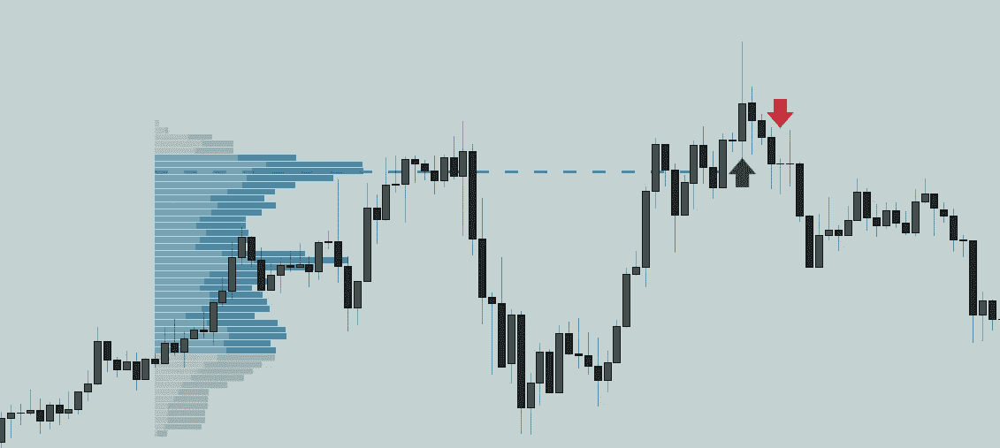

# 理解日内交易的时段、初始余额和时段交易量——第二部分

> 原文：<https://medium.com/coinmonks/understanding-sessions-initial-balance-and-session-volume-profile-for-day-trading-part-2-4ad44ffd4c6b?source=collection_archive---------6----------------------->

这是系列课程的第 2 部分，通过会话、初始余额和卷特征来识别机构区域。如果你错过了前一篇文章，这里是链接。

在下面的文章中，我将解释使用交易量剖面进行日内交易的基本原理。

**什么是卷概要文件？**

成交量曲线是给定价格范围内成交量的垂直钟形曲线表示。

它具有以下特点:

价值区域=从 VAH 到瓦尔的蓝色阴影区域。通常是总体积的 70%。

值域高=值域的最高点

值域下限=值域的最低点

控制点=交易量最大的点。

体积轮廓具有不同的结构，P 形、B 形、L 形等。在日内交易中，我不关心这些。如果你仍然对它们感到好奇，你可以在这里找到它[。](https://discord.gg/utR9wysjEV)

**会话音量配置文件的可能性以及如何形成偏差:**

***第一步:***

对于以下设置，您需要将 Sigmabasis 指标添加到 tradingview。它是完全免费的:

 [## 适马时段高点低点和时段亮点-菲拉哥诺奇尔的指标

### sSHL 显示每个时段的最高价和最低价。会议时间基于 AEDT/亚洲，因此请调整…

www.tradingview.com](https://www.tradingview.com/script/t3NN0tLS-Sigma-Session-High-Lows-Session-Highlights/) 

一旦你把它添加到 LTF 图表中，它将看起来像这样。

这个指标上的线显示了交易的最高点和最低点。突出显示的区域显示会话开始和结束。一旦交易完成，它将绘制交易的高点和低点，并在一天中保持固定，直到下一个交易开始并绘制其高点和低点。

我住在亚洲，取决于你住在哪里，它可能看起来不同。

*   红色=亚洲
*   绿色=伦敦
*   紫色=我们
*   蓝色=收盘和盘后市场

价格可以在盘中最高价和最低价之间波动。如果价格突破前一交易日的高点，价格可能会上涨。一旦价格爆发，如果它重新进入前一个交易日的高点或低点，它将反转。观察价格在交易水平上的反应。

***第二步:***

使用 tradingview 中的固定范围体积剖面绘制体积剖面。将其从一个会话的开头拖到另一个会话的开头。

1

2

3) Settings for Volume Profile Fixed Range

***第三步:***

基于交易量，价格会以下列方式做出反应:

*   价格范围可以在价值区域上限(VAH)和价值下限(瓦尔)之间

*   价格范围从 VAL 瓦尔到 POC。

Price bounced from VAL, reacted from POC

*   价格可以突破 VAH 或瓦尔，伪造和扭转。这种模式重复很多次。所以，在做多或做空之前，一定要等待 VAH、瓦尔或 POC 的再次测试。

Price broke out of VAH and POC, only to fake out and reverse

*   价格可以突破 VAH 或 POC，重新测试并上涨。此外，价格可能会低于 VAL 或 POC，重新测试，然后下降。

Price broke out of POC, Value Area High, retested the VAH, and sweeped up

练习:

画出交易量曲线并阅读结构，价格在那里反应、反弹、突破或重新测试。

Read this chart and try to recognize the patterns. Only take into consideration the previous volume profile before the start of the session or better yet go plot it yourself and observe.

**会话音量简档的重要性:**

会话量概况的 POC 和价值区域使机构能够瞄准流动性最强的区域。每个时段的做市商都想抓住前一时段交易量最大的区域的流动性，以此类推。

感谢您阅读这一部分。在下一篇文章中，我们将利用目前所学的知识来研究高概率的刷单系统。

快乐西格玛交易！

获得 90 天免费访问 Sigmabasis 指标:

*   sigmabasis.com

加入不和:

*   【https://discord.gg/utR9wysjEV 

在 twitter 上关注 Sigmabasis:

*   [sigma basis(@ sigma basis)/Twitter](https://twitter.com/sigmabasis)