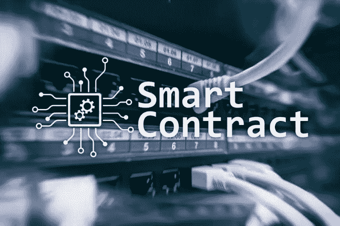
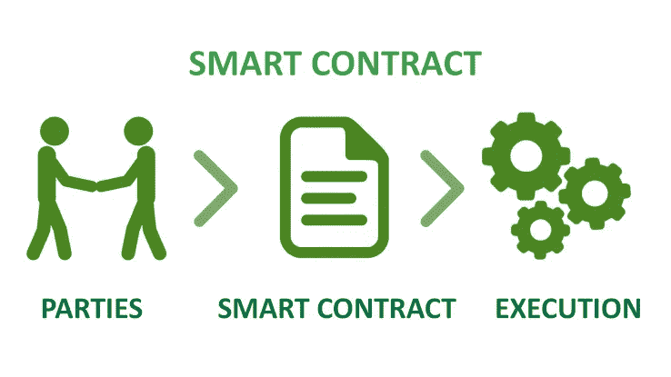

# 了解智能合同

> 原文：<https://medium.com/coinmonks/understanding-smart-7a9eacb30044?source=collection_archive---------64----------------------->

智能合同是在区块链技术上运行的自动执行协议。这是一个编码程序，由双方之间的条件组成。一旦双方满足条款，合同自动启动交易，无需中介。

智能合约最早是由 Nick Szabo 在 20 世纪 90 年代提出的，他建议在不需要政府机构和第三方的情况下启动交易。此外，它可能已经找到了一个完美的平台，因为它与区块链的合并使其在金融领域之外变得有用。

软件工程师在几个平台上开发智能合同，这些平台提供了构建合同的必要接口。它可以使用 Solidity 这样的语言部署在以太坊上；Corda，用 Java 和 KotlinDocker，使用 Python，Golang 等。

**智能合同如何工作**

**1。创建:**相关方开会讨论合同的条款、义务和界限。达成共识后，律师或辅导员起草合同协议。然后，这份协议被发送给软件工程师，他会将协议转换成用计算机语言编写的合同。

然后对软件进行测试，检查错误和缺陷。

**2。部署:**经过一系列检查，合同被证明是完美的，工程师将其部署到区块链的网络上。这使得合同不可更改，黑客也无法破解。此外，这导致自动冻结双方的资产，以避免重复支出。

**3。执行:**一旦双方满足条款条件，网络自动执行合同。那么事务也被执行并存储在区块链上。

**4。完成:**合同执行完毕后，资产不再被冻结，事物回到初始状态。

**智能合同的优势和应用**

智能合同相对于传统合同具有某些优势，因为它们是不可变的。此外，一旦合同部署在区块链上，就不能再被修改或破解。因此，它可以防止金融欺诈和网络犯罪。

它们的使用降低了某些成本和费用，因为中央机构不必监控合同。这也减少了执行事务的时间。

它有助于保护信息的真实性和隐私，并防止数据欺诈。在使用中央服务器进行信息传播或手动更新的公司中，他们可以部署智能合同来自动化这些过程。

**智能合同的挑战**

虽然他们很聪明，但他们也不是完全没有缺点。智能合约的挑战从创建之时就开始了。工程师使用 Kotlin 和 Java 等编程语言来编写这些合同。所以，这些程序中可能有错误和漏洞。一旦这些合同被部署到区块链，就不可能再更改了。

此外，智能合同不能与普通的 http 网络一起工作。因此，它需要一个可靠的神谕来验证现实世界的信息。

区块链网络将交易打包成块。因此，智能合约可能会相互作用，甚至形成新的智能合约。

智能合约有很多未开发的潜力，这也可能转化为未知的故障。因此，他们容易受到诈骗和网络攻击。

智能合约的能力在很大程度上是未知的。然而，这些合同将很快进入经济的各个领域。

> 加入 Coinmonks [电报频道](https://t.me/coincodecap)和 [Youtube 频道](https://www.youtube.com/c/coinmonks/videos)了解加密交易和投资

# 另外，阅读

*   [用信用卡购买密码的 10 个最佳地点](https://coincodecap.com/buy-crypto-with-credit-card)
*   [加拿大最佳加密交易机器人](https://coincodecap.com/5-best-crypto-trading-bots-in-canada) | [Bybit vs 币安](https://coincodecap.com/bybit-binance-moonxbt)
*   [阿联酋 5 大最佳加密交易所](https://coincodecap.com/best-crypto-exchanges-in-uae) | [SimpleSwap 评论](https://coincodecap.com/simpleswap-review)
*   购买 Dogecoin 的 7 种最佳方式
*   [最佳期货交易信号](https://coincodecap.com/futures-trading-signals) | [流动性交易所评论](https://coincodecap.com/liquid-exchange-review)
*   [用于 Huobi 的加密交易信号](https://coincodecap.com/huobi-crypto-trading-signals) | [Swapzone 审查](/coinmonks/swapzone-review-crypto-exchange-data-aggregator-e0ad78e55ed7)