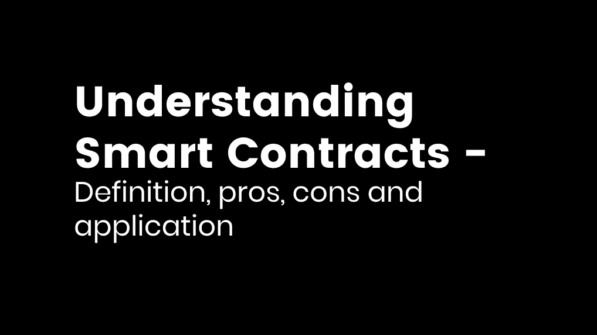

# 理解智能合同——定义、优点、缺点和应用

> 原文：<https://medium.com/coinmonks/understanding-smart-contracts-definition-pros-cons-and-application-51171f4f322c?source=collection_archive---------43----------------------->

如果你听说过智能合同，可能想知道它的真正含义，请相信，在这篇文章结束时，你将会非常详细地了解什么是智能合同，它的优点，一些限制，用例，并希望对创建过程有所了解。

# 关于以太坊的一点点

因此，在以太坊区块链，有两种不同类型的帐户可以创建，首先，外部拥有的帐户(EOA)和合同帐户。

eoa 本质上是你和我可以通过以太坊平台或协议外部的 [metamask wallet](https://metamask.io/) 创建和控制的账户类型，这些账户是免费创建的，由任何人使用加密签名的私钥进行控制。

与 EOA 不同，合约账户不是由用户控制的，而是由以太坊虚拟机(EVM)执行的一个通常被称为智能合约的程序代码控制的。它的创建是有成本的，并且它们没有私钥，因此被称为基于其程序代码逻辑的“自我控制”。值得注意的是，契约只有在被事务调用时才会运行，契约从来不会“自己”运行。

类似地，两种类型的帐户都有以太网地址，可以发送和接收以太网，但它们处理这些交易的方式不同，当交易目的地是合同地址时，它会使合同在 EVM 中运行，触发代码执行其中定义的操作，如发送、接收等。

**好了，让我们开始吃甜食吧**

那么什么是智能合约呢？

一点历史——术语“智能合同”是由 Nick Szabo 在 20 世纪 90 年代创造的，他试图找到一种将法律原则纳入数字空间的方法，这样违反合同将被禁止或变得非常昂贵。他还将它定义为“一组以数字形式规定的承诺，包括各方履行其他承诺的协议。”
Vitalik Buterin 给出了自己的定义:“一种涉及数字资产和两方或多方的机制，其中一些或所有方投入资产，资产根据基于某些数据的公式在这些方之间自动重新分配，这些数据在合同启动时是未知的。

就区块链以太坊而言，

> 智能合约是简单的自执行的不可变(一旦部署，不可更改)程序，当满足预定条件时，存储并运行在以太坊区块链上。它包含的代码、条件和功能存在于一个分布式的、分散的以太坊区块链网络中。

智能合同的基本工作原理如下

1.逻辑被编码到智能合同程序中。
2。EVM 上的节点通过网络 223
3 编译、验证、存储和复制智能合同。当预定条件出现时，合同由网络上的节点
4 执行。作为成功执行合同的结果，对网络上的适当账户进行改变。

# 智能合约的属性和优势。

这些是智能合约的一些好处和属性。

**安全性** —智能合同经过加密，具有高度的安全性

**准确性** —合同由网络上的许多节点进行验证**自主** —不需要第三方参与合同的执行，减少了出现偏差或错误的可能性

**自动化-** 智能合约是一种自动化业务逻辑的工具，允许无缝交易而无需干预。

**速度和效率** —智能合同消除了第三方、无意义且耗时的强制执行条件的手动流程，确保了高效快速的执行。

**透明度** —在区块链上，所有各方都可以访问共享的分类账；可以审计和跟踪交易。

**无权限** —世界上任何地方的任何人都可以编写智能合约，并将其部署到以太坊网络，前提是您已经要求 eth 进行部署，并且您(或者您可以会见其他人)可以对智能合约进行编码。

# 智能合同面临的缺点

然而，也有需要注意的缺点。由于代码是由人编写的，他们可能会出错，这使得合同容易受到攻击，并导致有害的资产损失。DAO 就是一个很好的例子，开发人员在代码中的错误给用户和公司带来了巨大的损失，黑客利用这些错误窃取了大约 6000 万美元。

此外，智能合约不能超过 24kb，否则它会耗尽汽油。

# 创造的工具

理解了智能合约的基础，创建智能合约需要编程知识就不足为奇了，有多种高级编程语言可用于智能合约编程。比如 llc，毒蛇，毒蛇，竹子，坚固。然而，这些语言中的一些已经被弃用，而另一些还没有获得一定程度的认可。Solidity 是迄今为止最流行的，也是以太坊和智能合约编程中事实上的高级语言，它是由 Gavin Wood 博士创建的。

可靠性代码需要一个编译器把代码转换成 EVM 可以理解的字节码。

此外，像 remix ide 和 metamask 等其他工具也是开发的重要工具。

帮助你入门 solidity 的资源—
[freecode camp](https://www.freecodecamp.org/news/learn-solidity-blockchain-and-smart-contracts-in-a-free/) 、
[Stephen grider solidity 和以太坊课程](https://www.udemy.com/course/ethereum-and-solidity-the-complete-developers-guide/)、
[crypto zombies](https://cryptozombies.io/) 。

总之，随着区块链的不断发展，智能合同有着巨大的潜力来进一步扰乱医疗、金融和银行、房地产行业，这种可能性是无穷无尽的。

打招呼— [推特](https://twitter.com/c_e_onyema) [linkedin](https://www.linkedin.com/in/emmanuel-c-onyema/)

> 加入 Coinmonks [电报频道](https://t.me/coincodecap)和 [Youtube 频道](https://www.youtube.com/c/coinmonks/videos)了解加密交易和投资

# 另外，阅读

*   [3 商业评论](/coinmonks/3commas-review-an-excellent-crypto-trading-bot-2020-1313a58bec92) | [Pionex 评论](https://coincodecap.com/pionex-review-exchange-with-crypto-trading-bot) | [Coinrule 评论](/coinmonks/coinrule-review-2021-a-beginner-friendly-crypto-trading-bot-daf0504848ba)
*   [莱杰 vs n rave](/coinmonks/ledger-vs-ngrave-zero-7e40f0c1d694)|[莱杰 nano s vs x](/coinmonks/ledger-nano-s-vs-x-battery-hardware-price-storage-59a6663fe3b0) | [币安评论](/coinmonks/binance-review-ee10d3bf3b6e)
*   [Bybit Exchange 审查](/coinmonks/bybit-exchange-review-dbd570019b71) | [Bityard 审查](https://coincodecap.com/bityard-reivew) | [Jet-Bot 审查](https://coincodecap.com/jet-bot-review)
*   [3 commas vs crypto hopper](/coinmonks/3commas-vs-pionex-vs-cryptohopper-best-crypto-bot-6a98d2baa203)|[赚取加密利息](/coinmonks/earn-crypto-interest-b10b810fdda3)
*   最好的比特币[硬件钱包](/coinmonks/hardware-wallets-dfa1211730c6) | [BitBox02 回顾](/coinmonks/bitbox02-review-your-swiss-bitcoin-hardware-wallet-c36c88fff29)
*   [BlockFi vs Celsius](/coinmonks/blockfi-vs-celsius-vs-hodlnaut-8a1cc8c26630)|[Hodlnaut 点评](/coinmonks/hodlnaut-review-best-way-to-hodl-is-to-earn-interest-on-your-bitcoin-6658a8c19edf) | [KuCoin 点评](https://coincodecap.com/kucoin-review)
*   [Bitsgap 审查](/coinmonks/bitsgap-review-a-crypto-trading-bot-that-makes-easy-money-a5d88a336df2) | [Quadency 审查](/coinmonks/quadency-review-a-crypto-trading-automation-platform-3068eaa374e1) | [Bitbns 审查](/coinmonks/bitbns-review-38256a07e161)