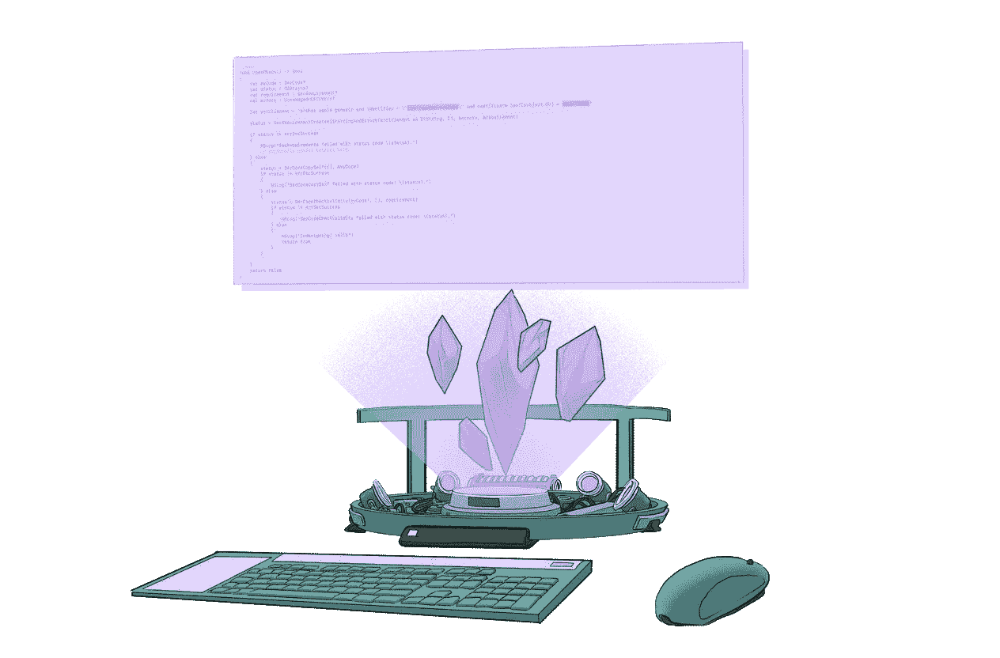
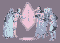
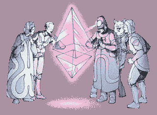
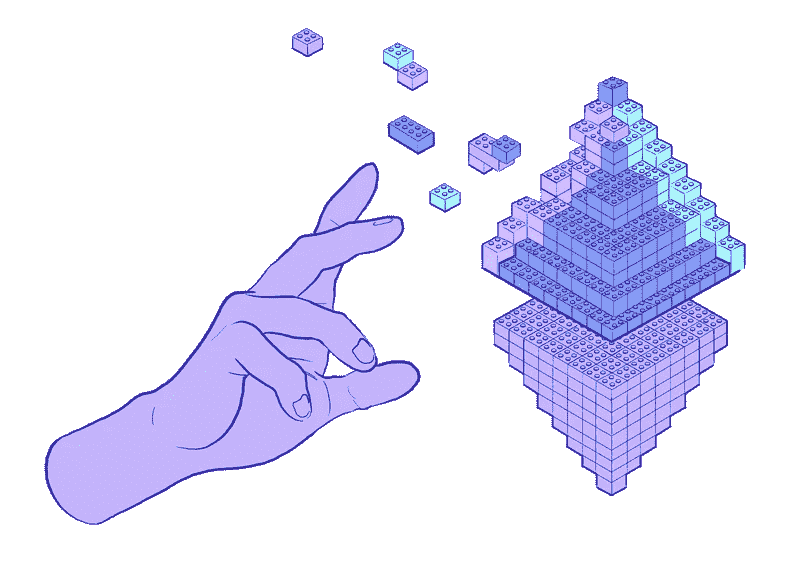

# 通过示例了解可靠性

> 原文：<https://medium.com/coinmonks/understanding-solidity-by-example-2fb06ab26f62?source=collection_archive---------8----------------------->

*在这篇短文中，我将带您浏览一些用 Remix IDE 编写的 Solidity 代码示例，让您对它的工作原理和一些常见用例有一个总体的了解。*

Source: [ethereum.org](http://ethereum.org/)

# 介绍

这篇文章是为那些已经了解一些编程语言和面向对象编程的程序员而写的。

我们将涉及的例子目前在 [Remix](https://remix.ethereum.org/) 介绍例子中可用，我将在本文中复制/粘贴一些代码块，以防他们更新或删除它。

涵盖了 3 种用例，按复杂性递增排序:

*   **存储:**非常简单的智能契约，将一个值存储在一个整数变量中。
*   **Owner:** 类似于 storage，但在这种情况下，契约存储一个名为*“Owner”的**地址**类型变量。*
*   **投票:**在最后一个例子中，我们有一个更有用的“真实世界”用例，契约实现了投票过程和投票委托。

Source: [ethereum.org](http://ethereum.org/)

# 示例 1:存储

Solidity By Example — Storage.sol

# 意义

`store`函数将使用给定的参数更新 number 变量的值。`retrieve`函数将返回数字函数的当前值。

# 概念

*   `pragma`:该关键字用于启用某些编译器特性或检查。一个`pragma`指令总是在一个源文件的本地，所以如果你想在你所有的项目中启用它，你必须把编译指令添加到你所有的文件中。
*   `contract`:通常与 OOP 编程语言的类比是*契约*就像*类*，其中包含属性和方法。
*   `public view returns`:它们是*修饰符*，本质上它们可以为包含它们的函数提供一些限制或验证。这种情况下`public`意味着函数可以从契约外部调用，`view`意味着函数不能改变契约的状态，`returns`仅仅意味着函数的返回类型，注意，您可以像在`returns`示例中那样为修饰符设置参数。

# 示例 2:所有者

Solidity By Example — Owner.sol

# 意义

这段代码做的事情与第一个示例类似，在智能合约中存储和更新一个变量。但是在这种情况下，我们有一个 ***地址*** 数据类型，而不是一个简单的整数。

这个**地址**(账户标识符)代表一个拥有者，该拥有者对契约具有一些特定的特权，例如，调用一些函数或访问一些值。

# 概念

*   `private`:就像在契约函数中一样，属性有*访问修饰符，*这些修饰符限制代码从“哪里”可以读取或改变属性的状态。在这种情况下是`private`，这意味着该变量只能从契约函数中访问。如果你想把变量保持为只读，那么你可以把它声明为私有，然后用一个只返回值的`view`修饰符创建一个 getter 函数。
*   `event`:是合同的可继承成员。发出一个事件，它存储在事务日志中传递的参数。这些日志存储在区块链上，可以使用合同地址进行访问。在本例中，我们创建了一个事件，每次在`changeOwner`函数中更改所有者时都会发出该事件。
*   `constructor & msg.sender`:部署智能合约时调用`constructor`函数，由于智能合约**不可变**，只能部署一次，因此`constructor`函数也只调用一次。`msg.sender`是当前(外部)函数调用的来源地址。在这种情况下，我们用部署者的地址初始化 owner 变量。
*   Solidity 提供了这个关键字来创建你自己的带有自定义逻辑的修改器。如果`require`的第一个参数评估为`false`，那么函数内部的操作被恢复，这对于检查函数是否被正确调用也是有用的。作为第二个论据，你也可以解释哪里出了问题。

# 示例 3:投票

> *代码相当长，没有必要全部读完，我将在* ***中用几句话解释一下*** *块的含义，然后如果你想阅读和分析一些具体的片段就看你的了。*

Solidity By Example — Ballot.sol

# 意义

实施投票流程以及投票授权，这意味着有一些提案需要投票(可以是人员、计划、想法等。)而且每个选民一票。

每个投票者也可以"*委托*"这是对另一个投票者的投票，这增加了接收者的投票权重*(最初权重是每个投票者 1)。不能有委托循环，这意味着如果 **Jon** 将他的选票委托给 **Rose** ，那么 **Rose** 将她的选票委托给 **Tom** ， **Tom** 不能再将他的选票委托给 **Jon** ，这个循环就被阻止了 2 到 *K* 人，其中 *K* 是投票人的总数。*

*最后，主席*可以将投票权分配给已经委托投票的投票人。**

# *概念*

*   *`struct`:它们是用来表示一个记录的类型，就像在 c 中一样，由于不存在*类*的概念(一个*契约*是一个*类*的类比)，它们在 Solidity 中被广泛使用。在这个例子中，我们有两个不同的结构:`Voter`和`Proposal`。*
*   *`bytes32`:是一个有 32 字节内存的`string`，它在值永远不会超过大小的情况下很有用，它使用较少的 [**气体**](https://ethereum.org/en/developers/docs/gas/) 因为它适合 [**EVM**](https://ethereum.org/en/developers/docs/evm/) **的一个单词。**另一方面，`string`是一个动态调整大小的类型，在可靠性方面有当前的限制(比如不能从函数返回到契约)。*
*   *`mapping`:它们可以被视为 [**散列表**](https://en.wikipedia.org/wiki/Hash_table) ，这些散列表被虚拟地初始化，使得每个可能的关键字都存在并且被映射到一个字节表示全为零的值。它们没有长度，也没有设置键或值的概念。*
*   *`memory`:Solidity 中的`memory`变量只能在方法中声明，它们是短期变量，不能保存在区块链中。它只在函数执行期间保存值，在执行后它的值被销毁。*

****

*Source: [ethereum.org](http://ethereum.org/)*

# *结论*

*混音版上的介绍性例子对那些想理解基本和不太基本的坚实概念的人来说是非常好的。*

*我确信这些例子是经过深思熟虑的，我相信它们值得一个彻底的解释，甚至更多，因为像我这样的人倾向于删除代码并开始在编辑器中编写`console.log(“Hello world!”)`而不用想太多。*

*如果你想在开始编写智能合同之前更深入地研究这种编程语言，我诚挚地邀请你阅读以太坊[官方文档](https://ethereum.org/en/developers/docs/)中的文档。🤓。*

> ***想联系作者？**在[推特](https://twitter.com/LakshayMaini_)上关注我。*
> 
> *加入 Coinmonks [电报频道](https://t.me/coincodecap)和 [Youtube 频道](https://www.youtube.com/c/coinmonks/videos)了解加密交易和投资*

# *另外，阅读*

*   *[AscendEx 保证金交易](https://coincodecap.com/ascendex-margin-trading) | [Bitfinex 赌注](https://coincodecap.com/bitfinex-staking) | [bitFlyer 审核](https://coincodecap.com/bitflyer-review)*
*   *[麻雀交换评论](https://coincodecap.com/sparrow-exchange-review) | [纳什交换评论](https://coincodecap.com/nash-exchange-review)*
*   *[支持卡审核](https://coincodecap.com/uphold-card-review) | [信任钱包 vs MetaMask](https://coincodecap.com/trust-wallet-vs-metamask)*
*   *[Exness 回顾](https://coincodecap.com/exness-review)|[moon xbt Vs bit get Vs Bingbon](https://coincodecap.com/bingbon-vs-bitget-vs-moonxbt)*
*   *[如何开始通过加密贷款赚取被动收入](https://coincodecap.com/passive-income-crypto-lending)*
*   *[加密货币储蓄账户](/coinmonks/cryptocurrency-savings-accounts-be3bc0feffbf) | [加密交易机器人](https://coincodecap.com/best-crypto-trading-bots)*
*   *[BigONE 交易所评论](/coinmonks/bigone-exchange-review-64705d85a1d4) | [CEX。IO 审查](https://coincodecap.com/cex-io-review) | [Swapzone 审查](/coinmonks/swapzone-review-crypto-exchange-data-aggregator-e0ad78e55ed7)*
*   *[最佳比特币保证金交易](/coinmonks/bitcoin-margin-trading-exchange-bcbfcbf7b8e3) | [比特币保证金交易](https://coincodecap.com/bityard-margin-trading)*
*   *[加密保证金交易交易所](/coinmonks/crypto-margin-trading-exchanges-428b1f7ad108) | [赚取比特币](/coinmonks/earn-bitcoin-6e8bd3c592d9)*