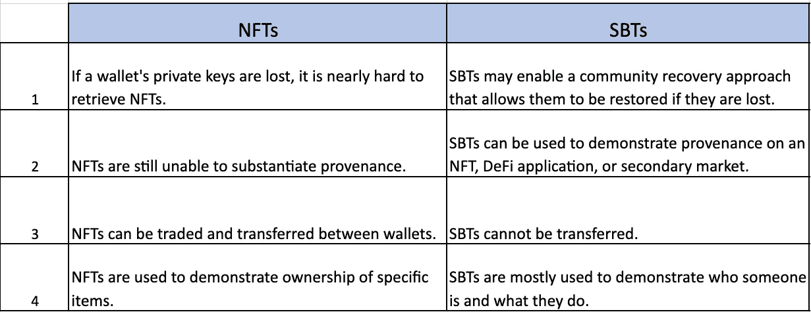
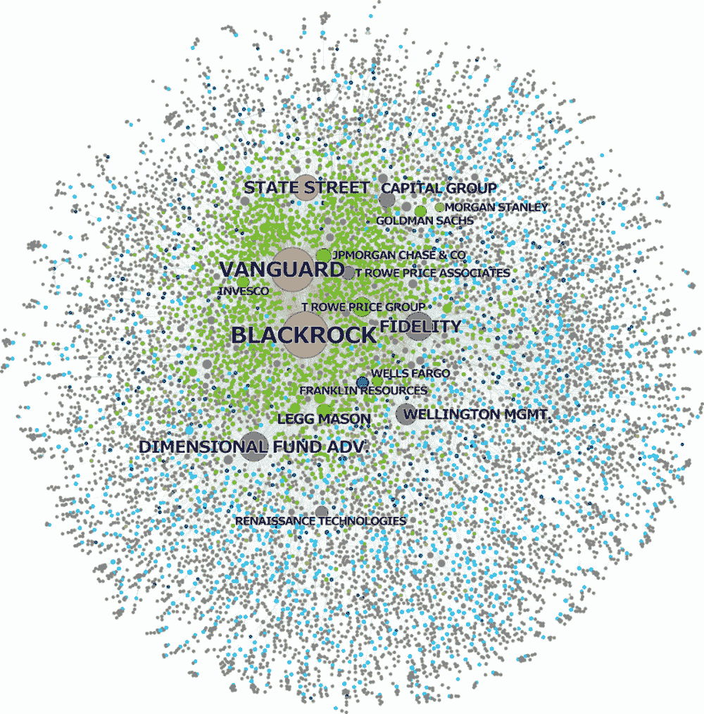
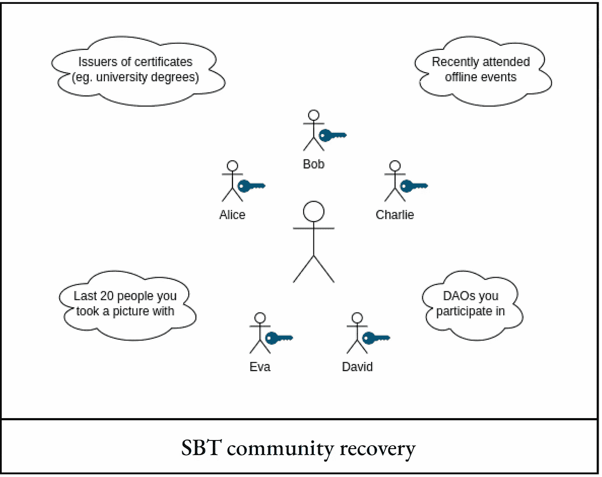

# 了解灵魂绑定令牌(SBT)及其用途

> 原文：<https://medium.com/coinmonks/understanding-soul-bound-tokens-sbts-and-their-uses-5be48a7c6e70?source=collection_archive---------9----------------------->

## 为什么 SBT 被认为是 Web 3 去中心化社会(DeSoc)的基石，为什么这些是如此独特，以至于这个概念被视为 Web 3 的下一个大事件？

```
**Table of Content** **·** [**Why do we need SBTs when we already have NFTs?**](#6770)**·** [**Introduction to Decentralised Society (DeSoc)**](#aea3)**·** [**Let us explore the uses of Soul Bound Tokens (SBT)**](#9f49)[**1\. Undercollateralized on-chain lending**](#9984)[**2\. Strengthen the DAO governance structure and give security from Sybil attacks**](#9c91)[**3\. Managing medical records**](#328e)[**4\. Airdrops based on “Souls,” also referred to as Souldrops**](#c7c4)[**5\. Digital Curriculum Vitae**](#7f08)**·** [**What if your “Souls” are lost?**](#f5ce)**·** [**Conclusion**](#d71c) **·** [**Reading Materials Suggestions**](#684f)
```

# 我们已经有了 NFT，为什么还需要 SBT？


Source- [https://www.istockphoto.com/photo/abstract-digital-human-face-gm1173158404-325734571](https://www.istockphoto.com/photo/abstract-digital-human-face-gm1173158404-325734571)

在不到十年的时间里，Web3 以令人难以置信的灵活性和创造性创造了一个并行的金融系统，令世界震惊。

**公钥加密、智能合同、工作证明和利益证明**是加密和经济原语的实例，它们为金融交易的表现创造了复杂开放的环境。

然而，金融交易的经济价值是由人类及其互动产生的。因为 **web3 缺乏代表这种社会身份的基本元素**，它已经变得从根本上依赖于它试图超越的高度集中的 web2 机构，再现了它们的局限性。

***为例:***

1.Dao 依靠 web2 平台，如 **Discord** 来避免 Sybil 攻击，并从硬币投票过渡。

2.NFT 收藏家使用推特和开放海洋来展示他们收藏的来源。

3.DeFi 贷款平台不能发放**无抵押贷款。**

4.许多 web3 参与者依靠中央公司来维持他们的保管钱包。除了最老练的用户之外，所有人都无法访问分散的密钥管理解决方案。

> 下表对 NFT 和 SBT 进行了比较



Source — Author’s understanding

“灵魂”这个词通常不会与区块链和加密货币这个高度科技化、经常以金融为导向的世界联系在一起。大多数人认为“灵魂束缚令牌(SBT)”这个词在密码设置中是违反直觉的，讽刺的，或者仅仅是怪异的。

最近推出了 SBT，这是一种不可转让、可公开验证的数字令牌，可以作为 web3 用户的一种简历形式，显示个人的会员资格、资格和从属关系。


Source — [https://rainbow.me/0xc8747abc6a88bbd20939d83e36295b4defb3989c?family=POAP](https://rainbow.me/0xc8747abc6a88bbd20939d83e36295b4defb3989c?family=POAP)

非金融化和/或不可转让代币不是一个新概念。事实上，今天成功的方案都是基于类似的概念。例如，[](https://poap.xyz/)**用没有货币价值的徽章来确认事件的参与。 [**人性证明**](https://www.proofofhumanity.id/) 使用不可转移性来将简档与独特的真人相关联。**

**灵魂绑定令牌融入更大的去中心化社会环境的方式使它们与众不同。**

# **去中心化社会介绍**

**“去中心化社会(DeSoc)”:一种共同决定的社会性，在这种社会中，灵魂和社区自下而上地聚集在一起，作为彼此的涌现特征，以提供各种规模的各种网络商品。**

**因为**网络是经济增长最强大的引擎**，但也最容易被私人实体和强大的政府反乌托邦式的攫取[，这篇论文强调了作为 DeSoc 组成部分的众多网络商品。](https://papers.ssrn.com/sol3/papers.cfm?abstract_id=4105763)**

**最显著的经济增长是由网络回报的增加引起的，在这种情况下，每一个额外的投入单位都会逐渐提供更大的产出。**

****

**Source — Network of ownership by the Big Three in listed US firms. ( Fichtner, Heemskerk & Garcia-Bernardo (2017)**

*   **今天，我们看到一类机构资产管理者的成长，他们是所有主要银行、航空公司、汽车公司和其他企业的最大股东。因为这种资产管理公司在一个行业内的所有竞争对手中都有股份，他们的动机是让他们拥有的公司看起来像一个竞争行业，而**则像一个垄断者，以消费者和公众为代价，最大化整个行业的利润和地位。****
*   ****在 DeFi 中，相同的“鲸鱼”和风投在堆栈的每一层以及堆栈内的竞争对手之间积累更多份额**，可能在令牌管理中投票或将其委托给同一类代表，这些代表通过网络以类似方式连接。**

**考虑这样一个社会，其中大多数参与者的灵魂包含代表各种关系、成员资格和证书的 SBT**。****

**例如，一个人的灵魂可能会存储表明教育证书、职业历史或其作品或艺术作品散列的 SBT。这些 SBT 可以以最基本的形式进行“自我认证”，类似于我们在简历中披露自己的信息。**然而，当一个灵魂拥有的 SBT 可以被作为这些连接的对应方的其他灵魂发布或确认时，这个过程的实际力量就显示出来了。****

**个人、企业或实体可能是交易对手的灵魂。虽然区块链包容性使我们能够追踪特定作品的创作时间，但 SBTs 将允许我们追踪社会起源，为我们提供发布作品的灵魂的丰富社会背景——他们的成员资格、从属关系、证书——以及他们与主题的社会距离。**

> **下面的推文显示了埃隆·马斯克(Elon Musk)的深度假电影提出了一种新的加密货币欺诈。根据视频，埃隆·马斯克(Elon Musk)拥有该交易平台，并为加密货币投资提供 30%的回报。**

**Source — [DogeDesigner](https://twitter.com/cb_doge)**

**深层赝品可能很容易被发现，因为它们出现在时间和社会背景之外，但这是互联网上最近的问题，也是 SBT 要调查的问题之一，而可信的赝品(如照片)将来自知名摄影师的证明。**

# **让我们探索灵魂绑定令牌的用途(SBT)**

**SBT 目前的“灵魂绑定”形式只有几个月的历史(在撰写本文时)。概念、应用案例和实现仍在讨论、创建和充实中。在这方面，SBTs 的未来尚未确定。以下是几个明显的使用案例:**

# **1.抵押不足的连锁贷款**

**“传统的”金融生态系统允许许多类型的无抵押贷款，但它依赖于集中的信用评分来评估借款人的信誉，这些借款人没有披露其信用历史信息的动机。然而，**这样的分数受制于过多的法律。往好里说，它们微妙地高估和低估了与信誉相关的标准，并且扭曲了缺乏足够数据的人，主要是少数民族和穷人。****

****一个 SBT 生态系统可以提供一个抵制审查、自下而上的替代方案，取代自上而下的商业和“社会”信用系统**。**

**代表大学证书、就业历史和租赁合同的 SBT 可以作为与信用相关的历史的永久记录，允许灵魂以巨大的声誉为赌注，以避免抵押限制并获得贷款。**

**贷款和信用额度可能表现为不可转让但可撤销的 SBT，嵌套在一个灵魂的其他 SBT 中——一种不可扣押的声誉抵押品形式— **,直到偿还，然后烧掉，或者更好的是，用还款证明代替。****

****

**PS; This book was a favourite of mine in my college days, and you can find it at your local online bookstore.**

**SBTs 可能会为社区借贷技术提供一个框架，就像 Muhammad Yunus 和 Grameen Bank 所开创的那样，在这种技术中，社交网络的成员同意支持彼此的债务。**

**由于灵魂的 SBT 星座代表了跨社会团体的成员资格，参与者可以很容易地找到其他灵魂，这些灵魂将成为合作贷款计划的共同参与者。商业贷款在偿还之前是一种“借了就忘”的策略，**社区融资可能采取“借了就帮”的方式，将营运资本与人力资本结合起来，产生更高的回报率。****

# **2.加强 DAO 治理结构并提供针对 Sybil 攻击的安全性**

**虽然 Dao 在跨越距离和差异的全球社会协调方面具有巨大的潜力，但它们容易受到 Sybil 攻击，在这种攻击中，一个用户可以拥有多个钱包来获得投票权，或者在不太复杂的一个令牌一票治理中，**只需囤积令牌来获得 51%的投票权，并剥夺其余 49%的投票权。****

**[本文引入了一个新的原语](https://papers.ssrn.com/sol3/papers.cfm?abstract_id=4105763)，称为**“相关分数”这种相关性折扣的概念可以用来构建有意的对话。例如，容易被多数派俘获的 Dao 可能会计算 SBT，将最多样化的成员聚集在一起进行对话**，并确保听取少数群体的观点。******

**SBT 提供了另一种方法**来确定 DAO、协议或网络中的去中心化(或多元化)程度。****

*   **作为第一步，**协议可能会将代币投票限制在对西比尔有一定抵抗力的灵魂**(或 SBT 富人)。**
*   **作为第二步，**协议可能会查看不同灵魂拥有的 SBT 和灵魂的折扣票**(考虑它们部分分离)之间的相关性，如果它们共享大量 SBT 的话。**
*   **第三步，为了获得网络去中心化的感觉，**人们可以测量跨网络堆栈不同层的灵魂持有的 SBT 之间的相关性**——测量投票、令牌所有权、治理相关的通信，甚至对计算资源的控制的相关性。**

# **3.管理病历**

**更换医生或保险公司可能是一件乏味的事情。这需要花几个小时在电话上获取病史，核实你的身份，并试图回忆你是否使用了你父亲的娘家姓或你长大的街道作为安全问题。有了像**这样拥有你所有病史的医学灵魂，SBTs 将使这个耗时的过程变得没有必要。****

# **4.基于“灵魂”的空投，也称为灵魂空投**

**空投，通过算法将代币免费分发到一组钱包中，主要有利于当前的代币持有者和钱包——很容易受到女巫的攻击，鼓励战略行为和[马太效应](https://en.wikipedia.org/wiki/Matthew_effect)。**

****

**Source-[https://atthecenterofliteracy.weebly.com/matthew-effect.html](https://atthecenterofliteracy.weebly.com/matthew-effect.html)**

**SBTs 提供了一个被称为“灵魂掉落”的显著增强**

**“灵魂空投”是基于灵魂内的 SBT 和其他令牌计算的空投。例如，想要在特定的第 1 层协议中召集一个社区的 DAO 可能会将 Souldrop 提供给在之前的 15 次会议出席中有 10 次出席的开发人员 SBT 或其他显示出席的令牌，如 POAPs。**

# **5.数字简历**

**在进行工作面试时，通过扫描候选人的简历来查看他们是否有资格获得该职位，这一过程会加快。然而，核实候选人声明的真实性有时可能很困难。**

****例如，医疗机构目睹了许多这样的情况:不熟练的医务人员谎报简历，结果在工作时给病人开出了错误的处方。****

**SBT 解决了这些问题，因为它们可以作为可以公开验证的数字 cv。灵魂从其他组织如大学和类似实体获得的 SBTs 可以用来做雇佣决定。**

# **如果你的“灵魂”丢失了怎么办？**

**由于缺乏社区恢复机制，今天的钱包组合可能**不是 SBTs** 的最终归宿。为了安全起见，社区恢复钱包需要分散在不同社区的各种 SBT。**

****SBTs 或社区康复:哪个更重要？谁是早期采用者的社区？不同链上的 SBT 如何相互通信？答案尚未揭晓****

****

**[Source- from the paper in the reading section](https://papers.ssrn.com/sol3/papers.cfm?abstract_id=4105763)**

**社会康复是一种基于个人信任关系的新选择。SBTs 实现了一个类似的，但是更大的范例:社区恢复，其中灵魂代表了其社会网络的交叉投票。一个更可靠的方法是将灵魂恢复与跨群体的灵魂成员资格联系起来，而不是监管，而是依靠最多样化的实时关系集来确保安全。**

**请注意，SBT 表示几个社区中的成员。这些社区中的一些，比如雇主、俱乐部、大学或宗教场所，可能在本质上更加链上化，而其他的，比如参与协议治理或 DAO，可能不那么链上化。**在社区恢复方法中，恢复 Soul 的私钥需要 Soul 社区(随机子集)中合格多数成员的批准。****

**这项工作需要对细节进行实验。未来研究的关键安全因素包括，例如，如何选择监护人，需要多少监护人的同意。**

# **结论**

**在撰写本文时，**没有正式的 Soulbound 令牌标准存在**；它们仍然只是一个想法。然而，一些机制已经被勾勒出来了。**

**SBTs 的最大区别在于它们的不可转让性。与当今最流行的令牌标准相反，如可替换的 ERC-20 令牌，如 ETH 和 ERC-721 NFT。**

**简单来说，SBT 就是，**

**它们是**“灵魂束缚令牌”的缩写**
他们类似于**不可转让的 NFT。**
他们**会蚕食 NFTs 的市场份额**(SBT 可以是你几乎任何事情的“钥匙”，包括空投(NFTs，erc-20)、投票权和 IRL 赛事。)
它们提供了**巨大的财务潜力**(尽管事实上你不能“出售”它们)。**

**理解了这个概念之后，看到诸如链内和链外可验证凭证的社区辩论是非常有趣的，Dao 的治理令牌是否是资本密集型的，以及为什么纯链上身份是 web 3.0 的基本原语，尽管论文建议了这两种方法。**

# **阅读材料建议**

1.  ***papers.ssrn.com，2022 年 5 月 11 日，[https://papers.ssrn.com/sol3/papers.cfm?抽象 _id=4105763。](https://papers.ssrn.com/sol3/papers.cfm?abstract_id=4105763.)***
2.  **“灵魂绑定令牌如何减少猜测并提高 DAO 投票——Ep。360." *YouTube* ，[www.youtube.com，](http://www.youtube.com,)2022 年 6 月 7 日，[https://www.youtube.com/watch?v=lKKgP2wS39U.](https://www.youtube.com/watch?v=lKKgP2wS39U.)**
3.  **"灵魂束缚"https://vitalik.ca/general/2022/01/26/soulbound.html.的**

****我的观点是我自己的，此内容仅用于教育目的。****

> ***加入 Coinmonks [电报频道](https://t.me/coincodecap)和 [Youtube 频道](https://www.youtube.com/c/coinmonks/videos)了解加密交易和投资***

# ***另外，阅读***

*   ***[法国 4 大最佳加密副本交易平台](https://coincodecap.com/copy-trading-platforms-france)***
*   ***[从 WazirX 切换到 CoinDCX 的 5 个理由](https://coincodecap.com/reasons-to-switch-from-wazirx-to-coindcx)***
*   ***[Unocoin 评论](https://coincodecap.com/unocoin-review) | [最佳加密赌注硬币](https://coincodecap.com/best-crypto-staking-coins)***
*   ***[如何使用 MetaMask Wallet 获取 KCC 地址？](https://coincodecap.com/kcc-address-metamask)***
*   ***[如何获得自己的。XYZ 领域？](https://coincodecap.com/xyz-domain)***
*   ***[最佳加密交换平台](https://coincodecap.com/best-crypto-swap-platforms) | [最佳加密交易所](https://coincodecap.com/crypto-exchange)***
*   ***[购买比特币印度](/coinmonks/buy-bitcoin-in-india-feb50ddfef94) | [Pionex 评论](/coinmonks/pionex-review-exchange-with-crypto-trading-bot-1e459d0191ea) | [加密交易机器人](/coinmonks/crypto-trading-bot-c2ffce8acb2a)***