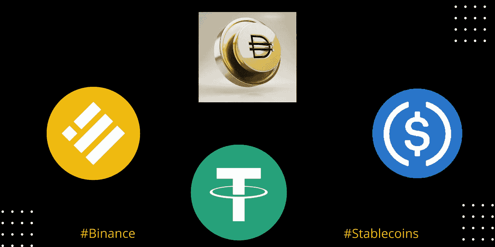

# 了解 Stablecoins 以及如何用信用卡在币安上购买它们

> 原文：<https://medium.com/coinmonks/understanding-stablecoins-and-how-to-buy-them-on-binance-with-a-credit-card-cbc3b2afad5a?source=collection_archive---------70----------------------->

*[***到底什么是稳定点？***](#d93f) ***∘***[***Stablecoins***](#0849) ***∘***[***stable coins***](#d566) ***∘***[***3 种最受欢迎的 stable coins***](#f0b0)*

*顾名思义，Stablecoins 是一种加密货币，致力于提供价格稳定；通常与美元等稳定资产挂钩。*

*例如，像 BUSD 这样的加密资产是由美元支持的。因此，1 BUSD 的价值相当于 1 美元 *(1:1)* 。*

**换个角度来看:**

*想象一下，如果你持有 1 BTC，比特币的价值上涨了 30%。但是，我们都知道 BTC 是一个“*投机投资*”。因此，你想锁定你的 BTC 资产免受波动的影响。*

*否则，价格可能会再次波动，你将是亏损的一方。*

*那么你如何保证你当前的**BTC 值呢？***

**这就是 Stablecoins 的用处所在。您可以轻松地将您的 BTC 转换成 USDT 或 BUSD，以保护您的加密投资价值不受波动的影响。**

***为什么不直接改装成菲亚特？***

**将你的 BTC 转换成菲亚特将意味着招致更多的费用、漫长的等待和高风险。**

**简而言之，你正在脱离一个分散的金融系统，进入一个集中的金融系统，使你暴露于 Cefi 带来的所有弱点。**

**本质上，Stablecoins 的主要作用是保护您的加密投资，同时仍然在 Defi 生态系统中运行。*有道理？***

## **稳定曲线的类型**

****

1.  **商品支持的稳定债券——这些是实物资产支持的稳定债券，如黄金、石油，甚至房地产。**

**当投资者希望投资像黄金这样通常遥不可及的资产时，这些稳定的货币很有用。**

**我的意思是，在什么样的世界里，你能轻易得到一些金条？**

**肯定是又贵又有风险。**

**因此，持有一些由黄金价值支持的稳定债券就成了合乎逻辑的选择。**

****2。法定抵押稳定货币-** 这些是由法定货币价值支持的稳定货币，如美元或英镑。他们代表了最常见的稳定与 USDT 和 BUSD 在前线。**

**把 1 USDT 或 BUSD 的价值，永远等同于 1 美元，这背后有一个理论。**

**例如，如果 USDT 的价值超过 1 美元，经纪人将把他们的美元换成 USDT，*以更高的价格卖出*。这一因素增加了 USDT 的供应量，并将价格拉回到 1 美元。**

**或者，如果 USDT 的价值低于 1 美元，经纪人将着手*购买* USDT，并将其兑换成美元。这将反过来增加对 USDT 的需求，推高 USDT 的价值回到 1 美元。**

****3。算法稳定积分-** 算法稳定积分截然不同。他们使用复杂的算法来管理代币的供应，从而保持与所追踪的法定货币的价值一致。在这里，智能合约是王道，完全消除了储备的需要。**

**为了维持稳定的价值，当价格低于追踪的特定法定货币时，算法稳定币会限制代币的供应。这可以通过锁定桩或燃烧来实现。**

**另一方面，如果价格超过跟踪的法定货币的价格，新的代币将被发行以降低稳定的硬币的价值。**

**不言而喻，运行算法稳定积分是非常具有挑战性的。一个很好的例子是 UST 股市崩盘。虽然它有一个良好的开端，但它都跌了下来，现在只值 0.015 美元。整个 Terra 生态系统也跟着改变了。**

**重要的是要注意到，我们在整个领域仍处于早期阶段。仍然有很多测试在进行，在我们撞上一个成功的算法稳定币之前，可能还需要一段时间。**

**但是我们是为此而来的。**

****4。加密货币支持的稳定货币与法定货币支持的稳定货币非常相似；只是密码被用作抵押品。由于加密市场的波动性很大，这些稳定的债券将超额抵押准备金，作为解决高波动性的一个办法。****

**加密支持的 Stablecoins 使用智能合同来监督铸造和燃烧。这一特点使系统更加可靠，因为用户有能力审计合同。**

**同样值得注意的是，一些加密支持的 Stablecoins 是由分散自治组织(Dao)运行的。**

***{道到底是什么？***

**“道”是一个分散的组织，由成员集体所有，没有中央权威。尽管去中心化财务完全独立，但没有人的干预，仍然不可能成功地运行业务。**

**这就是为什么需要 DAOs 的原因。把道想象成你现代的*“董事会”*，为公司做决策。**

**Dao 建立在智能契约的基础上，由创建它的人同意的代码运行。本质上，当做出任何决定时，它仅仅意味着代码的简单改变。**

***没有办公室政治也没有宣传。}***

**为了理解加密支持的 Stablecoins 是如何工作的，这里有一个例子:**

**为了铸造与美元挂钩的 50 元(50x1.5 美元= 75 美元)，你需要放弃价值 75 美元的密码和 1.5 倍的抵押品。**

**要回你的抵押品就意味着要偿还 50 Dai。但是，要敏锐的注意，如果抵押品比率下降，就会被清算。**

**当加密支持的稳定账户跌破 1 美元时，就设计了激励措施，让持有者返还他们的稳定账户作为抵押品；从而减少供应，最终将价格推回到 1 美元。**

**或者，当价格高于 1 美元时，用户被激励去创造代币，从而增加供应并因此降低价格。**

**一般来说，加密支持的稳定资本依赖于博弈理论和算法的组合来获得价格稳定性。**

## **稳定硬币的优点**

1.  ****稳定币被用于日常支付-** 由于加密货币的波动性很大，稳定币派上了用场，因为它们能够保持与美元的挂钩。这一功能使 Stablecoins 在我们的日常生活中能够可靠地进行支付。**
2.  ****Stable coins 的优势在于其位于区块链**——与需要中介(银行)进行支付的法定货币不同，Stable coins 可以通过兼容的加密钱包发送给全球任何人。此外，虚假交易是不可能的。**
3.  ****交易者可以利用稳定收益来对冲其投资组合-** 利用稳定收益来平衡您的投资组合是降低整体风险的一种建设性方式。这样，你的投资组合将更能抵御市场价格波动，当一个好机会出现时，你会有资金。此外，交易者可以在市场低迷时出售密码以换取稳定的收益，然后以更低的价格买入。**

## **3 个最受欢迎的 Stablecoins**

1.  **Tether (USDT)-目前的价格为 1 美元，市值为 73.20 亿英镑。**
2.  **币安硬币(BUSD)-1 美元，市值 69.5 亿美元。**
3.  **美元硬币(USDC)-1 美元，市值 53.19 亿美元。**

## **如何在币安用信用卡购买稳定的硬币**

**信用卡是最简单的支付方式之一。虽然你仍然可以用法定存款购买密码，但信用卡是最快的方法。如果你想获得一些稳定的收入，信用卡可能会非常有用。**

**币安是全球领先的加密货币交易所，也是购买加密货币最可靠的平台之一。**

*****这里有一个在币安用信用卡购买信用卡的分步指南:*****

1.  **第一步是登录你的币安账户，点击*、*，然后选择*、【信用卡/借记卡】、*。**

****

**2.在下一个选项卡上，选择您的法定货币，选择您理想的稳定货币，并指定您打算购买的数量。**

****

**3.如果您还没有向您的币安帐户添加卡，请点击添加卡并添加您的详细信息和帐单地址。**

****

**4.请仔细检查您的付款信息，然后确认您的订单。**

**5.在银行的 OTP 交易页面上验证您的付款。**

***就这样。***

**[***了解更多关于币安的常见问题> >***](https://www.binance.com/en/support/faq/8df758a570ba4d18941f38423f63aae5?ref=431277160)**

**[***今天用信用卡买密码> >***](https://www.binance.com/en/buy-sell-crypto?channel=card&fiat=EUR?ref=431277160)**

**[***用现金余额购买密码> >***](https://www.binance.com/en/buy-sell-crypto?channel=wallet&fiat=EUR?ref=431277160)**

**[***存款法币通过银行转账到币安> >***](https://www.binance.com/en/fiat/deposit/PHP?ref=431277160)**

*****关联披露:*** *本帖包含关联链接。如果您使用这些链接购买一些东西，我们可能会赚取佣金，对您没有额外的费用。感谢*。**

> **加入 Coinmonks [电报频道](https://t.me/coincodecap)和 [Youtube 频道](https://www.youtube.com/c/coinmonks/videos)了解加密交易和投资**

# **另外，阅读**

*   **[氹欞侊贸易评论](https://coincodecap.com/anny-trade-review) | [霍比保证金交易](/coinmonks/huobi-margin-trading-b3b06cdc1519)**
*   **[分散交易所](https://coincodecap.com/what-are-decentralized-exchanges) | [比特 FIP](https://coincodecap.com/bitbns-fip) | [Pionex 审查](https://coincodecap.com/pionex-review-exchange-with-crypto-trading-bot)**
*   **[用信用卡购买密码的 10 个最佳地点](https://coincodecap.com/buy-crypto-with-credit-card)**
*   **[百佳卡达诺钱包](https://coincodecap.com/best-cardano-wallets) | [Bingbon 副本交易](https://coincodecap.com/bingbon-copy-trading)**
*   **[印度最佳 P2P 加密交易所](https://coincodecap.com/p2p-crypto-exchanges-in-india) | [柴犬钱包](https://coincodecap.com/baby-shiba-inu-wallets)**
*   **[八大加密附属计划](https://coincodecap.com/crypto-affiliate-programs) | [eToro vs 比特币基地](https://coincodecap.com/etoro-vs-coinbase)**