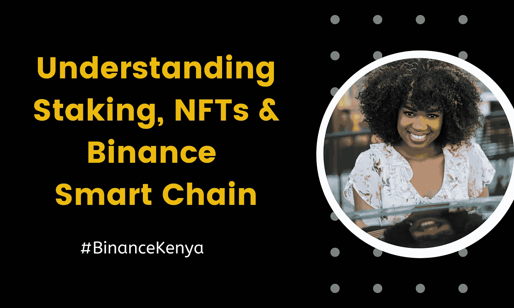
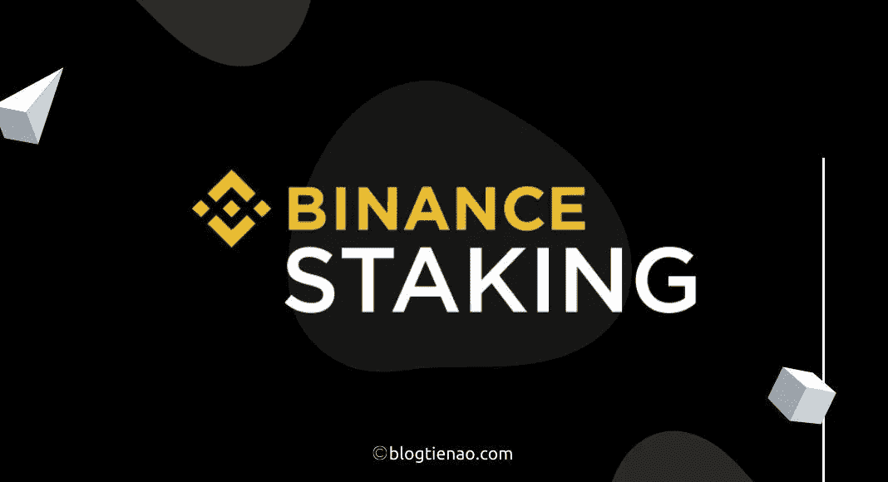
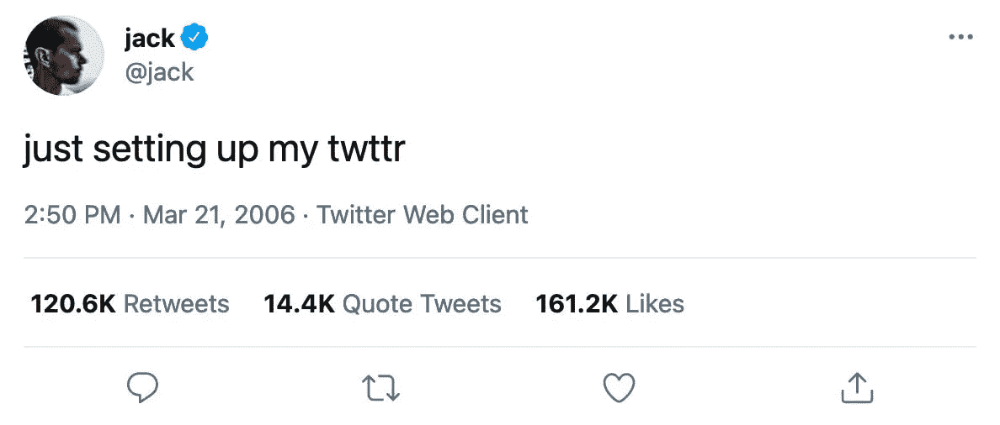
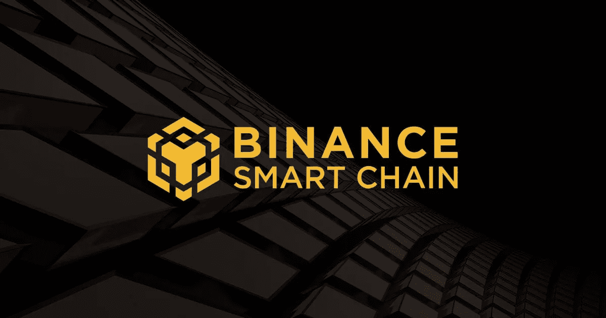

# 了解打桩、NFTs 和币安智能链

> 原文：<https://medium.com/coinmonks/understanding-staking-nfts-and-binance-smart-chain-kenya-bf1ac89a3857?source=collection_archive---------35----------------------->

就像任何其他行业一样，加密世界有自己的术语，理解这些术语非常重要。就像经济学家或金融专家完全理解金融原理一样，对于加密也是一样。

在这种情况下，我们的重点是币安，以及使用该平台带来的各种术语。在本文中，我们将探讨赌注、NFTs 和币安智能链。

**重要提示**

1.  如果你在肯雅，想知道如何开始学习币安、 [***点击这里了解更多信息> >***](/@maggiendegwa44/how-to-get-started-with-binance-in-kenya-820c396c2683)
2.  如果您想开立您的币安帐户，请务必 [***点击此链接***](https://accounts.binance.com/en/register?ref=431277160) ，然后开始使用。
3.  想了解更多关于币安& Crypto>> [***币安学院入门***](https://academy.binance.com/en)

**目录**

**∘** [**了解在币安跑马圈地及其运作方式**](#b820) **∘**[**了解 NFT 及其好处**](#0133) **∘**[**到底什么是币安智能链？**](#4ee4)

## 了解币安的赌注及其运作方式

赌注包括锁定加密钱包中的资金，以支持区块链网络的运营，目的是赚取回报。

币安在跑马圈地方面做得很大，这是用户在这个平台上赚钱的主要方式之一。

为了充分理解赌注是如何运作的，理解其背后的科学，即赌注的证据是至关重要的。

利益证明是区块链使用的一种共识操作，它根据相关加密钱包中的资产数量选择验证器。

另一方面，比特币使用工作证明模型。有了工作证明，矿工们参与解决复杂数学问题的竞赛，获胜者有机会在区块链添加下一个区块。

而这就是比特币用来完成交易的机制。然而，这个过程涉及大量的高计算成本。

与工作证明不同，赌注证明将涉及个人将他们的硬币锁在钱包中，协议将随机选择其中一个来认证/验证下一个区块。

但是，被选中的概率取决于一个人钱包里锁着的硬币数量。

赌注币安将涉及你只是简单地添加您的硬币到赌注池。你不会产生任何费用，也不必了解随之而来的所有技术细节。

你只需点击一个按钮就可以开始了。然后你会在下个月初收到你的收入。

## 了解非功能性测试及其优势

不可替换的令牌。什么是不可替换的令牌？可替换的简单意思就是“*可以被*替换”。因此，不可替代意味着“*不可替代*”。

客观地说，蒙娜丽莎是一件不可替代的艺术品，而且只能有一件。是的，可以创建它的副本，但是，这些副本没有任何价值。

为了向你展示不可替代物的价值，2006 年发布的第一篇 Twitter 帖子最近以 290 万美元的天价售出。为什么有人会在一篇 Twitter 帖子上砸钱呢？

不，这不仅仅是一篇 Twitter 帖子，这是*Twitter 帖子。2006 年 3 月 21 日下午 2:50，Twitter 平台上发布了第一篇也是唯一一篇 Twitter 帖子。因此，这是一个不可替代的罕见事件。*

您可以创建尽可能多的 Twitter 帖子，但只能有一个 Twitter 帖子是第一个在平台上发布的。因此，不可替代物被认为是真正有价值的，这就是为什么人们愿意在它们上面花费数百万。

既然你理解了“*不可替代*”，现在让我来给你解释一下“*令牌*方面。

我将使用 Twitter 帖子的例子来阐述这一点。

*那么*，你如何赋予每个人都能从网上下载的“ *Twitter 帖子 jpeg* ”以价值？

为此，您需要将这个“*不可替代的*”转换成数字资产(令牌)。这样，令牌将存储在区块链上，作为特定 NFT 的所有权证明。这通常是在以太坊区块链进行的。它就像一个数字证书，因此不能被复制。

因此，第一篇 Twitter 帖子可以有很多份，但只有一份是真实的。

作为一个生活在肯尼亚的人，NFT 对你来说重要吗？

哦是的！

为什么？

因为现在世界正在向 Web 3.0 版本的互联网转移。而 NFT 只是开始。

这绝对是一个数百万美元的行业，不容忽视，最先抓住机会的人会笑到最后。

想象现在是 2011 年，有人在跟你谈论比特币。这才是你应该认真对待 NFTs 的态度。

那么，作为一个住在肯尼亚的人，你如何进入 NFTs 的游戏呢？

币安最近在 NFT 开设了一个栏目，“币安 NFT 市场”，买家可以在这个平台上投标和购买非功能性纺织品。

在这里，你会发现由高质量的艺术家创作的高质量的 NFT。

用户可以通过 BNB、BUSD 和 Etherium 竞标和购买 NFT。因此，你需要装满你的钱包。

[***使用此指南为您在肯尼亚的币安钱包充值> >***](/@maggiendegwa44/the-complete-guide-to-depositing-kenya-shillings-and-buy-sell-crypto-on-binance-in-kenya-via-daa2ba86badd)

为了开始你的肯尼亚 NFT 之旅， [**按照以下步骤在币安购买 NFT。**](https://www.binance.com/en/blog/nft/how-to-buy-nfts-in-4-easy-steps-421499824684903165)

## 什么是币安智能连锁？

币安智能链是一种区块链，其功能来自以太网协议。为了充分理解这一切是如何开始的，我们必须追溯历史。

因此，早在 2018 年 4 月，币安决定建造自己的区块链，也被称为币安连锁店。

币安连锁店的唯一目的是发展一个有能力进行高级交易的连锁店。考虑到这一点，他们专门开发了币安 Dex 应用。

另一方面，Etherium 上的 Defi 正在蓬勃发展，而币安 Dex 应用程序几乎没有得到认可。币安链条团队很快注意到，币安链条缺少的因素是运行智能合同的能力。 [***了解有关智能合约的更多信息> >***](https://academy.binance.com/en/glossary/smart-contract)

因此，币安连锁店团队选择创建另一家连锁店"*币安* S *玛特连锁店"*，而不是为币安连锁店添加智能合同功能并篡改其功能。币安智能链于 2020 年 9 月正式上线。

币安智能链可以支持智能合同，并且完全可编程。然而，从零开始构建一个新的智能合约需要数年的分析和测试。

因此，币安利用用户和开发者对 Etherium 的了解，将 Etherium 的 GETH 分成两部分。

尽管有了这一新的发展，但币安需要站出来反对 Etherium，因此，他们为币安智能链实施了更低的费用和更高的交易。这就是币安智能链的由来。

[***今天打开你的币安账户> >***](https://accounts.binance.com/en/register?ref=431277160)

[***这里加入币安东非电报集团***](https://t.me/BinanceEastAfrica)

> *加入 Coinmonks* [*电报频道*](https://t.me/coincodecap) *和* [*Youtube 频道*](https://www.youtube.com/c/coinmonks/videos) *了解加密交易和投资*

# 另外，阅读

*   [3 商业评论](/coinmonks/3commas-review-an-excellent-crypto-trading-bot-2020-1313a58bec92) | [Pionex 评论](https://coincodecap.com/pionex-review-exchange-with-crypto-trading-bot) | [Coinrule 评论](/coinmonks/coinrule-review-2021-a-beginner-friendly-crypto-trading-bot-daf0504848ba)
*   [莱杰 vs n 格拉夫](/coinmonks/ledger-vs-ngrave-zero-7e40f0c1d694) | [莱杰纳诺 s vs x](/coinmonks/ledger-nano-s-vs-x-battery-hardware-price-storage-59a6663fe3b0) | [币安评论](/coinmonks/binance-review-ee10d3bf3b6e)
*   [Bybit Exchange 审查](/coinmonks/bybit-exchange-review-dbd570019b71) | [Bityard 审查](https://coincodecap.com/bityard-reivew) | [Jet-Bot 审查](https://coincodecap.com/jet-bot-review)
*   [3 commas vs crypto hopper](/coinmonks/3commas-vs-pionex-vs-cryptohopper-best-crypto-bot-6a98d2baa203)|[赚取加密利息](/coinmonks/earn-crypto-interest-b10b810fdda3)
*   最好的比特币[硬件钱包](/coinmonks/hardware-wallets-dfa1211730c6) | [BitBox02 回顾](/coinmonks/bitbox02-review-your-swiss-bitcoin-hardware-wallet-c36c88fff29)
*   [BlockFi vs Celsius](/coinmonks/blockfi-vs-celsius-vs-hodlnaut-8a1cc8c26630)|[Hodlnaut 点评](/coinmonks/hodlnaut-review-best-way-to-hodl-is-to-earn-interest-on-your-bitcoin-6658a8c19edf) | [KuCoin 点评](https://coincodecap.com/kucoin-review)