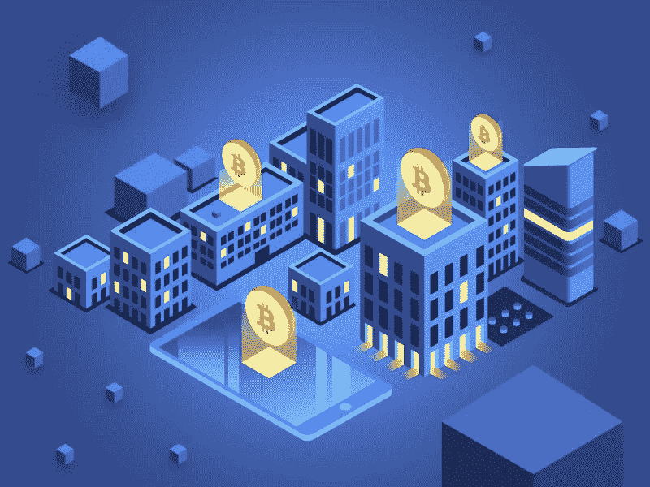

# 理解区块链:给会计师(第一部分)

> 原文：<https://medium.com/coinmonks/understanding-the-blockchain-for-accountants-part-1-bcb4bf544a0c?source=collection_archive---------83----------------------->

一个由两部分组成的系列来解释区块链的各个方面

我们大多数人都听说过比特币、以太坊、加密货币、区块链这些术语，但像我一样，除了作为一种交换和财富增长的手段之外，没有或仍然不理解它们的真正含义和它们是什么。在本教程中，我们将讨论区块链，包括:加密哈希函数、私钥、公钥、地址、事务、数字签名、挖掘器和挖掘。

**区块链是什么？**

你可能听说过这样的术语，它是一个被称为记录交易的块的数字分类账的链接。这些块或计算机/计算设备被称为节点。这些都是真的，但这一切是怎么发生的呢？嗯，我将用简单的术语来解释它。

如果你曾经参加过群聊，群聊中发送的每一条信息都会被广播给每个人，那么你一定经历过类似的事情。手机上应用程序的每个实例都指向手机上的一个 block，block lives(称为节点)。当所有的石块连接在一起时，它们就被统称为区块链。简而言之，它是由网络上的许多计算设备共享的数据库的集合。

那么，到底是什么模糊不清呢？为什么我们会关心几台不同的计算机上的一堆数字账簿，这些计算机都有相同的信息，并相互通信？嗯，放权！。这只是意味着每次添加新记录时，它都会被添加到链上所有现有的块(分类帐)中。这意味着如果单个块改变了其中的任何信息，该信息将不会对应于所有其他块。

为什么会这样？。在记录交易(数据)方面，区块链致力于一个基于共识的系统。这意味着在记录新的事务(记录)之前，所有后续块必须同意它们所拥有的信息不冲突。这通常是通过引用链中最新的块来完成的。我们稍后会更详细地研究它

**分权**

有趣的是，一个块要被认为是有价值的，其中的信息必须与链中的大多数块相同，如果一个块被破坏，那么它就不再是有效的块，并将被从链中排除。这是它真正去中心化的原因。要更改区块链上的任何信息，您必须更改至少 51%的块上的信息，以使其有效。这是一项几乎不可能完成的任务，使得任何个人或实体都很难操纵区块链。在撰写本文时，以太坊链有 25，000 个节点，假设每 14 秒就创建一个新的以太坊块，您可以看到操纵该链有多困难。

去中心化的另一个主要方面是，没有单个节点可以关闭链，这意味着即使只剩下一个节点，区块链也会存在，所以每次新节点添加到链中时，都将其视为新的备份。你可能已经在想这有多棒了。不过，下次我们会深入了解区块链的内部运作。

当我们再次见面时，更多地研究共识和加密散列函数。