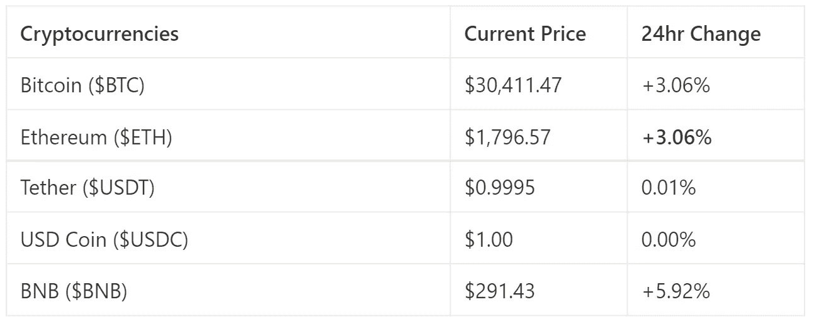
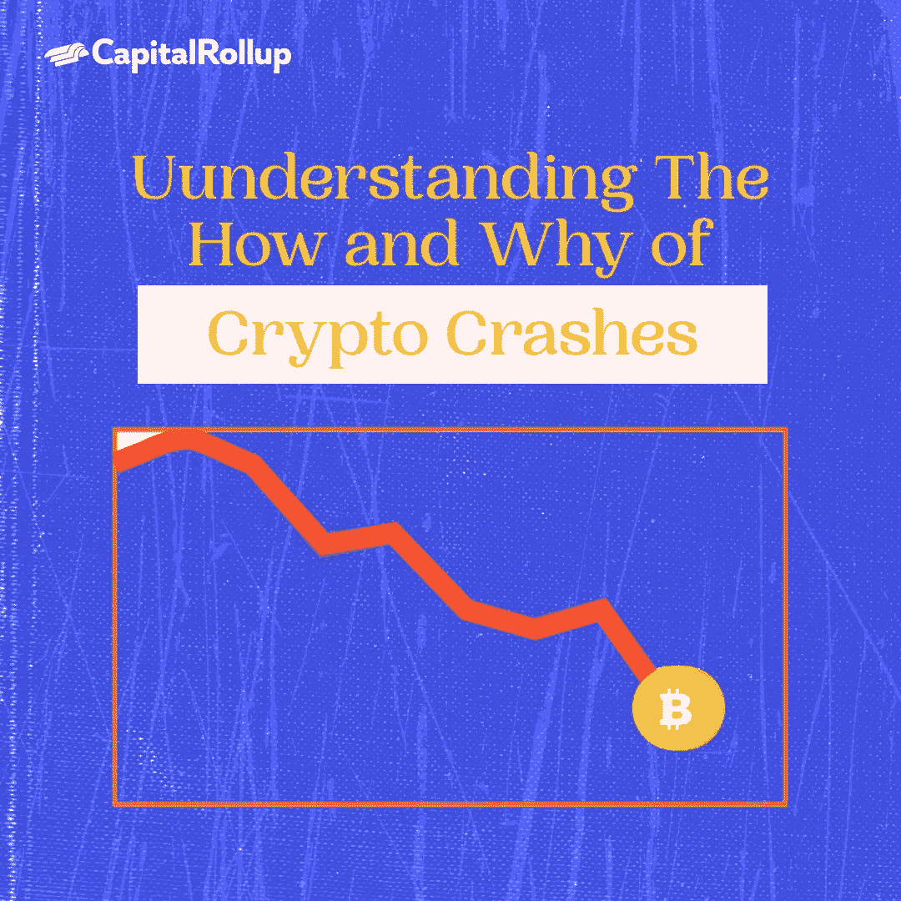

# 了解加密崩溃的方式和原因

> 原文：<https://medium.com/coinmonks/understanding-the-how-and-why-of-crypto-crashes-28ad61954926?source=collection_archive---------70----------------------->

欢迎来到最新一期的 CapitalRollup Digest！今天的文摘是 6 月 8 日的，大约需要 5 分钟。我们马上开始。

*   今天的市场看起来怎么样？(前 5/10 大流行加密货币)

Market Price update

# 了解加密崩溃的方式和原因

在一个像加密货币一样动荡的市场中，一个共同的特征是价格的高上涨和严重的崩溃。正如我们所见，加密资产在短短几分钟内损失其价值的巨大百分比并不罕见，尤其是在熊市季节。

最近，我们看到 Terra chain $LUNA 的价值从 120 美元的历史最高价下跌到 0.0003 美元，损失了 100%。甚至比特币和以太坊这两种最有价值的加密货币和资产在过去几个月里也下跌了 60%以上。

加密崩溃在加密领域非常常见，它们是熊市的一部分，因为价格下跌减少了想要继续投资或有资本这样做的人的数量。

今天，我们将讨论加密骤降及其原因。

# Crypto Dip 是什么意思？

加密下跌是加密货币价格的暂时下跌，尤其是当硬币或代币预计将很快上涨时。

你会经常听到“买蘸酱”这种说法。如果你在积极交易，而不是长期持有，买入下跌股票会更有效。在下跌时投资应该谨慎，因为只有当价格预期上涨时才有利可图。当一种货币处于下跌趋势时，逢低投资会让你拥有一堆毫无价值的硬币或代币。由于这些原因，dip 不适用于由于过时、倒闭的公司或其他任何会导致不可逆转的价格下跌而预计不会升值的硬币或代币。逢低买入就像在资产价格下跌时买入一样简单。目标是在市场自我调整、价格再次上涨时卖出。

# 这个术语是什么时候开始流行的？

在 2018 年加密货币市场的下行趋势之后，大多数加密投资者都明白了这意味着什么。正是在那一年，大多数投资者了解到加密技术的风险和投机性。

然而，在下跌趋势中买入一枚硬币并不意味着它的价格会上涨。

一个人应该有很强的情商，了解市场的本质，至少在短期内是如此。

让我们看看 2021 年**比特币价格从历史高点**跌落

世界上市值最高的数字货币只有 51，808.54 美元

加密货币周二下跌，比特币一度跌破 6 万美元，以太网触及本月最低水平，从近期的创纪录高位全面回落。我们中的许多人一定认为这种下降是由于埃隆·马斯克的推特。但是当马斯克的推特战争正在进行时，那时 BTC 大约 48k 美元，他发布了这个。在这之后，我们看到了 **BTC** 的下跌，大约在 42K 左右，但埃隆再次发布了一条推文，澄清了当时 **BTC** 在 42-43K 左右徘徊的猜测。

# 什么导致加密下降？

*   **加密货币市场缺乏流动性。**

每当杠杆投资者清算大量资产时，加密市场就会面临流动性问题。这也是为什么 crypto 会在周末出现下跌的部分原因。

例如，当一只鲸鱼——持有任何特定资产的大量头寸的投资者——出售大量密码时，它可以淹没市场。硬币只是流入更广阔的市场，留下供过于求的有限需求。

*   **加密安全漏洞引发恐惧。**

另一个可能导致加密下滑的因素是区块链和网络安全

如果比特币的安全漏洞浮出水面，这可能会影响挖掘它的欲望，从而影响散列率和整体价格。

*   **导致波动的潜在影响因素。**

投资者应该记住，“加密倡导者和关键影响者可以发推特，导致资本流入。”

显然，在埃隆·马斯克对 Dogecoin 的支持下，我们已经看到了这种情况的发生。发微博也会产生相反的效果。

# 你应该购买密码中的 Dip 吗？

在购买蘸酱时，你应该谨慎。

当价格下跌如此之快时，就像最近在密码市场上发生的那样，它可以让你一直关注的硬币看起来真的很划算。但华尔街的老专业人士有一条经验法则，可以很好地描述这样的时刻:“永远不要试图接住落下的刀。”

到现在为止，你应该意识到抓住一把落下的刀，也就是“买入”并不是一件好事。这并不是说，当波动性增加时，熟练的投资者不能快速获利。但这意味着，巨大而快速的市场波动可能会令散户投资者感到不安。

加密骤降一直在发生，但并不是所有的都会恢复。利用它们的最好方法之一是广泛的研究。通常情况下，你会发现信息比轻微下跌的交易更有价值。

# 琐事🤔

是谁在 2021 年 1 月把#比特币加到了自己的 Twitter 个人资料里，导致加密激增？

A.跆拳道

B.埃隆·马斯克

C.乔·拜登

D.珍妮特·耶伦

在下一期的 CapitalRollup Digest 中找到答案。😉

# 每日一词！

💡 **Rekt**

指的是当某人因价值暴跌的加密货币而遭受重大损失时的最低感受。

**句子中使用的术语:**

*——查克的加密货币发生了巨大的崩盘，他得到了* ***rekt*** *。*

*   **社区更新📢**

我们将很快与 5 个行业领导者组织一个 Twitter 空间会议，在那里我们将讨论加密市场和 web3 上的一切。你可以期待它😎

# 我们今天在读什么📰

**什么原因导致加密货币崩溃？** [***阅读更多***](https://blog.liquid.com/what-causes-a-cryptocurrency-crash)

“逢低买入”不是一个好的投资策略，只是一个好的迷因。 [***阅读更多***](https://www.marketwatch.com/story/heres-why-you-should-be-wary-of-buying-the-stock-market-dip-11650914628)

与朋友一起学习和投资加密技术💰

当您邀请您的朋友开始使用 CapitalRollup 进行有利可图的投资时，您将获得独特的奖励。

💬对 CapitalRollup Digest 有什么反馈吗？ [**告诉我们！**](mailto:hi@capitalrollup.com)

> 加入 Coinmonks [电报频道](https://t.me/coincodecap)和 [Youtube 频道](https://www.youtube.com/c/coinmonks/videos)了解加密交易和投资

# 另外，阅读

*   [分散交易所](https://coincodecap.com/what-are-decentralized-exchanges) | [比特 FIP](https://coincodecap.com/bitbns-fip) | [皮奥克斯评论](https://coincodecap.com/pionex-review-exchange-with-crypto-trading-bot)
*   [用信用卡购买密码的 10 个最佳地点](https://coincodecap.com/buy-crypto-with-credit-card)
*   [最好的卡达诺钱包](https://coincodecap.com/best-cardano-wallets) | [Bingbon 副本交易](https://coincodecap.com/bingbon-copy-trading)
*   [如何给 MetaMask 钱包添加 Arbitrum？](https://coincodecap.com/how-to-add-arbitrum-to-metamask-wallet)
*   [KuCoin vs 北海巨妖 vs BitYard](https://coincodecap.com/kucoin-vs-kraken-vs-bityard)
*   [加密交易的最佳 VPNs】](https://coincodecap.com/best-vpns-for-crypto-trading)