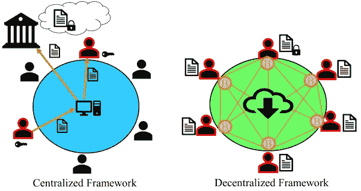
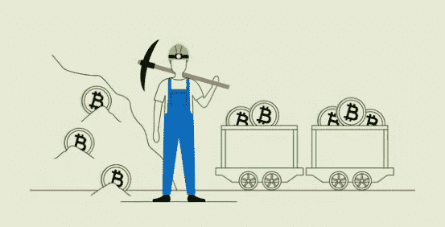
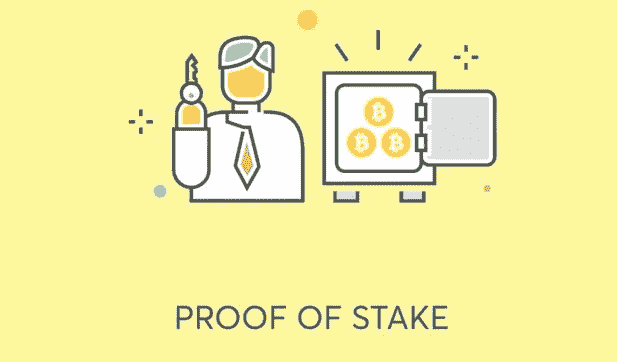
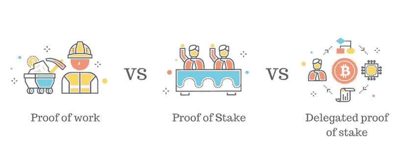
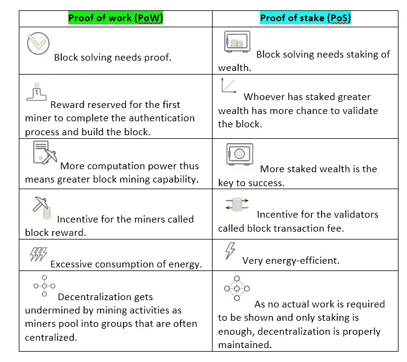

# 理解共识在区块链中的作用

> 原文：<https://medium.com/coinmonks/understanding-the-role-of-consensus-in-blockchain-db724fa63a53?source=collection_archive---------57----------------------->

区块链就是去中心化分布。因此，当交易在网络中发生时，信息以数字形式存储在块中，并在没有集中管理的[节点](https://coinsbench.com/understanding-the-architecture-of-a-blockchain-f50ad412bdc4)之间共享。在这种安排下，有必要定义分布式分类账中的记录如何得到验证。这是协商一致协议的本质。

与传统数据库的比较可以进一步说明在区块链[共识是如何运作的。](/coinmonks/what-is-blockchain-a7082404caa2)

[**Centralized database vs decentralized blockchain**](https://www.teksfera.com/product/de-centralised-system/)

数据库使用集中式框架。因此，管理权限也是集中维护的。所有信息都由具有限制性监管的中央治理系统处理和批准。现在，由于权力分散，区块链没有中央权威。因此，所有互连的节点都享有批准和分发特权。这培育了完美的无信任系统。每个区块链都遵循一个共识机制，确保可伸缩性、可问责性、不变性和安全性。

**类型**

有两个最广泛使用的共识协议。对它们的简短讨论对于理解它们在区块链技术中扮演的重要角色是必不可少的。

**工作证明(PoW)**

一项区块链创造涉及矿工运行硬件来解决一个密码难题。这个请求的完成验证了块的事务数据，并且[将新的块](https://coinsbench.com/understanding-the-architecture-of-a-blockchain-f50ad412bdc4)添加到网络中。这是工作证明(PoW)。像时间和能量这样的真实资源的消耗否定了伪造工作来建造积木的可能性。PoW 背后的理念很简单——很难生产，但很容易验证。该协议奖励矿工加密货币，这是通过他们的街区解决过程铸造的硬币。

[**Proof of work (PoW)**](https://www.bitpanda.com/academy/en/lessons/consensus-algorithms-proof-of-work/)

***优点*** *:*

●增强的安全性

●演示功能

●挖掘产生的加密货币的公平奖励分配方法

●简化支付验证

***弊端*** *:*

●采矿池的集中化

●有限的可扩展性

●在资金和能源消耗方面都极其昂贵

世界上最早的两种加密货币——[比特币](/coinmonks/what-is-bitcoin-e98b2b77c81b)和以太坊都遵循 PoW 协议。其他使用这种机制的还有 Litecoin、Dogecoin、Monero、Zcash、Dash、比特币现金、以太坊经典。有趣的是，[以太坊](/@DC.600/what-is-ethereum-part-2-design-c9b9f1b39fda)预计很快会将其共识协议转换为股权证明。

**股权证明&委托股权证明**

加密货币开采过程中的高能耗需要 PoW 协议的替代方案。其结果是重心从采矿转移到了打桩。在这里，验证者取代了挖掘者，成为过程的关键。他们在创建块之前，通过下注计算所需的必要贡献来冒险。这是股份证明。在这种机制中，staking 会为验证器生成大宗交易费用。因此，谁投入最多的财富作为抵押品，谁就最有机会获得利润。垄断因素是这一制度的固有缺点。这意味着那些投资风险较低的验证者，或者那些无法遵守长期锁定期标准的验证者，将会失败。

[**Proof of stake (PoS)**](https://crypto-academy.org/pos-meaning-in-crypto-what-is-proof-of-stake/)

为了解决这个问题，PoS 已经发展并形成了授权利益证明(DPoS)共识。它已经稳步发展成为许多著名的区块链项目的首选协议。在这种机制中，用户自己不是块验证者，而是通过简单地支持他人完成工作来获得回报。因此，任何拥有必要令牌的人都可以投票选举某人作为他们的代表，该代表将负责验证块的创建以及区块链维护。

[**Delegated proof of stake (DPoS)**](https://adriaticrypto.org/delegated-proof-of-stake-dpos/)

与 PoW 相比，对于所有参与者来说，高计算能力的使用是不可避免的，DPoS 使得这种需求变得过时。与 PoS 相比，dpo 允许更大的民主化，因为委托人(利益相关者)和代表(区块链运营商)都致力于提升区块链的绩效。

***优点*** *:*

●更民主的奖励分配

●更好的可扩展性、更高的速度、更高的能效以及更少的专用硬件要求

●投票机制通过根除任何恶意活动和通过良好行为激励表现来确保区块链生态系统的平稳运行。这反过来提高了实现高级治理模型的范围。

***弊端*** *:*

●易受有组织的网络攻击

●直接参与的参与者较少，导致项目开发停滞

代表的可能卡特尔化降低了权力下放的可行性

BNB、卡尔达诺、索拉纳、波尔卡多特、宇宙、流量(达珀实验室)、埃尔隆德和 NXT 是区块链系统采用这种特殊共识协议的主要例子。此外，以太坊 2.0 是以太坊的进化版本，长期以来一直使用复杂的测试网络来验证 PoS 与其生态系统的兼容性，这表明即将摆脱 PoW。

**功率与位置:比较**

**Proof of work vs Proof of stake comparison**

**结论**

随着区块链技术的更多创新应用被发现，对更新的共识概念的探索已经导致了一些有趣的发展。它们是实验性的，被广泛采用的可能性有限。突出的例子包括 Vechain 的权威证明(PoA)，以及 NXT 的分拆，NEM 的重要性证明(PoI)。

事实仍然是，当前加密货币市值的近 90%涉及符合 PoW 或 PoS(或者，在某些情况下，演进的替代 DPoS)协议的[区块链](/coinmonks/what-is-blockchain-a7082404caa2)。原因不言而喻——它们的好处远远大于任何坏处。此外，共识机制在区块链治理中发挥着至关重要的作用，有助于其绩效和发展。随着区块链科技在寻找创新解决方案和应用方面攀上新的高度，其分散化需要保持正确的方向。为此，有效的共识体系是不可或缺的，目前的趋势表明《区块链共识议定书》的未来正处于[危急关头](/@DC.600/what-is-staking-7ca67fa9d4da)。

**也读作:**

[*什么是区块链*？](/coinmonks/what-is-blockchain-a7082404caa2) *|* [*了解区块链的架构*](/@DC.600/understanding-the-architecture-of-a-blockchain-f50ad412bdc4) *|* [*什么是跑马圈地？*](/@DC.600/what-is-staking-7ca67fa9d4da)

跟随我:

[**LinkedIn**](https://www.linkedin.com/in/a600dc/)|[**Twitter**](https://twitter.com/dc_111)

联系人:**arnab.dc111@gmail.com**

> 加入 Coinmonks [电报频道](https://t.me/coincodecap)和 [Youtube 频道](https://www.youtube.com/c/coinmonks/videos)了解加密交易和投资

# 另外，阅读

*   [加密货币储蓄账户](/coinmonks/cryptocurrency-savings-accounts-be3bc0feffbf) | [YoBit 审核](/coinmonks/yobit-review-175464162c62)
*   [Botsfolio vs nap bots vs Mudrex](/coinmonks/botsfolio-vs-napbots-vs-mudrex-c81344970c02)|[gate . io 交流回顾](/coinmonks/gate-io-exchange-review-61bf87b7078f)
*   [CoinFLEX 评论](https://coincodecap.com/coinflex-review) | [AEX 交易所评论](https://coincodecap.com/aex-exchange-review) | [UPbit 评论](https://coincodecap.com/upbit-review)
*   [AscendEx 保证金交易](https://coincodecap.com/ascendex-margin-trading) | [Bitfinex 赌注](https://coincodecap.com/bitfinex-staking) | [bitFlyer 点评](https://coincodecap.com/bitflyer-review)
*   [Bitget 回顾](https://coincodecap.com/bitget-review)|[Gemini vs block fi](https://coincodecap.com/gemini-vs-blockfi)cmd |[OKEx 期货交易](https://coincodecap.com/okex-futures-trading)