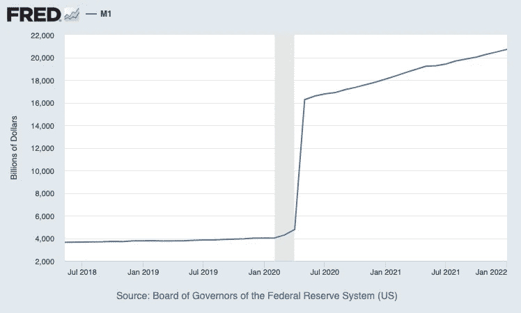
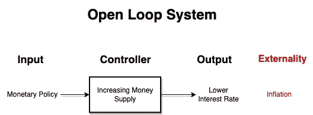
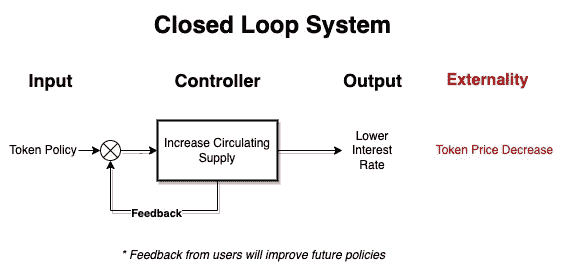

# 理解代币经济学

> 原文：<https://medium.com/coinmonks/understanding-token-economics-d5047a4d5e7a?source=collection_archive---------16----------------------->

> 代币经济学(Token Economics)或“代币经济学”的主题是理解加密货币的供求特征。

首先，在我们的传统经济体系中评估以下简单的概念是有价值的，以了解这些力量如何发挥作用。

## 货币与金钱

通常可以互换使用，但两者都有不同的含义和解释。

*   **货币**:指交易某种商品或服务的实际价值。它是无形的，但可以是价值的储存手段。
*   **货币**:以货币形式出现的本票或实物或硬币。货币是用来交易商品和价值的交换媒介。它是有形的，然而，它没有内在价值。

## 理解货币供应

货币供应量是指一国经济中所有的货币和其他流动性工具。这直接影响了经济中利率的百分比。货币供应量的变化被认为是推动市场经济变化的关键因素。货币政策用于控制通货膨胀、价格水平和商业周期。然而，政府和私人机构单独决定增加或减少货币供应的动机。这是一个令人担忧的特权，因为普通大众对货币流通几乎没有影响力。截至目前，加密货币不被视为货币供应的一部分。不是这样的原因有很多。尽管如此，了解到加密货币的核心是分散的，这使得政府很难确定其公民持有多少加密货币。

## 货币供应量是如何衡量的？

政府利用货币衡量标准，根据某个国家的流动性，对其当前的货币供应量进行分类。从 M0 到 M5，每个国家都有不同的方法来记录这些指标。

**储备货币 M0**=一国经济的货币基础。高能货币

**狭义 M1** =包括流通中的所有货币(如现金，不包括加密货币)、旅行支票和支票存款。

**中间值 M2** =包括 M1 的一切，加上所有储蓄存款、10 万美元以下的定期存款和零售货币市场基金余额。

**广义 M3** =包括 M2 的所有资产和超过 10 万美元的定期存款、机构货币市场基金余额以及定期回购协议。

*美国美联储目前发布狭义货币量(M1)和中间货币量(M2)的值。*

## 这些钱从哪里来？

中央银行负责向经济注入资金。这是通过货币政策来实现的，货币政策影响利率，设定银行准备金要求，并影响公开市场。然而，这笔钱的内在价值只与一个国家的经济福祉相关，而经济福祉是由国内生产总值(GDP)来衡量的。

## 我们如何确定金钱的价值？

货币的价值是由其需求决定的。同样的道理，商品和服务也会受到人们购买欲望的影响。

货币的价值来自三个决定因素:

*   **汇率**:本币对外币的价格。
*   **外汇储备**:外国政府持有的本币金额。
*   **对国库券的需求**:由财政部出售以支持地方政府的资金。

## 关键要点:

*   钱是一个无形的概念，需求决定价值。
*   货币是货币的一种表现形式，但没有内在价值。
*   货币供应量是一个经济体中流动货币的总量，货币供应量的变化会极大地影响利率和价格。
*   货币的价值是由其需求决定的，而需求又会转化为货币。

既然我们更好地理解了我们的传统经济是如何运作的，在两个生态系统之间画出相似之处应该会更直观。总的来说，我们可以在传统经济学和代币经济学之间做出显著的区分。

# 代币经济学——主要特征

## 开环与闭环系统

也称为非反馈和反馈系统是工程中常用的术语，用来表示系统的行为方式。在经济学中，你会发现外部性是任何过程的核心。这些都是由一些变化产生的意外结果。它们可以是积极的，也可以是消极的。负外部性的好例子是印更多的钱导致的通货膨胀或建造工厂造成的空气污染。

传统经济使用所谓的**开环系统**。没有状态反馈的空间。期望的结果或输出与其输入无关。这意味着所有的货币政策都是以当前的经济状况为基础制定的。然而，经济中产生的反应超出了政策制定者的范围。必须起草新的政策来解决新经济国家的问题。

As in our traditional economy. Money Printer go brrr

另一方面，代币经济是一个闭环系统。这意味着它可以通过状态反馈动态改变。输出完全取决于输入。由于反馈和用户参与，输入可以被改变。在这里，对经济政策的预期结果有更大的控制权，这可以显著提高长期稳定性。

Feedback can be done through official channels or even through Decentralized Autonomous Organizations (DAOs)

反馈可以通过官方渠道，通过参与协议的决策，甚至通过分散自治组织(Dao)提交

既然我们可以在传统经济学和代币经济学之间进行比较，我们就可以开始更深入地挖掘定义加密货币生态系统可能如何构建的基本概念。定义推动加密货币生态系统的关键因素至关重要。

## 硬币对代币

这两个术语可以互换使用。然而，还是有一些明显的区别。我们必须理解为什么这些术语有不同的含义。

*   **硬币**:这些是在本国网络上创造的加密货币，在自己的区块链独立运行。硬币代表了它们诞生时的区块链。他们也被称为*本地令牌*。这些有各种各样的用例，但最终它们促进了价值的转移——硬币的例子:比特币(BTC)，以太坊(ETH)，恒星(XLM)。
*   **令牌**:另一方面，这些可以在不同的区块链上建造和操作。它们往往比硬币更划算。令牌可以在允许在其基础设施之上构建应用程序的项目中找到，或者简单地作为一枚硬币的迭代*。*令牌示例:ERC-20 令牌[USDC，UNI WAP(UNI)，复合(Comp)，ChainLink 令牌(LINK)]，恒星令牌[USDC，ARST，AQUA]

这很重要，因为它有助于我们更好地理解令牌生态系统中产生的价值。区块链通过包含旨在解决问题的机制来创造价值。令牌通过使用现有技术并将其应用于不同的用例来产生价值。

## 加密货币供应

与传统经济学类似，加密货币的供应对其价格有直接影响。区分三种不同类型的加密货币供应很有帮助:

**总供应量:**发行的硬币总量，不考虑在哪里。

**最大供应量:**生态系统中可以存在的硬币的最大数量。

**流通供应量:**目前市场上流通的、人们拥有的硬币数量。

与传统经济学一样，这些供应子集的变化将直接影响硬币所在市场的行为。与此同时，我们意识到这些因素的规则比传统金融要灵活得多。很难想象美元的最大供应量。经济中永远不会存在一套确定的美元。然而，加密货币有机会自己决定它们的供应是否是无限的——像法定货币一样，或者它们希望限制在某个数量——像比特币一样。

管理供应的权力在于分发上述加密货币的机制。例如，比特币使用工作证明来铸造新硬币。它充当分发和治理机制。其他协议可能使用分散的管理机构来民主地做出这些决定，或者干脆让发行方自行决定。

好处显而易见；随着数千种不同的加密货币，你会发现数千种不同的机制可以影响其供应。每一种都有优点和缺点，但是大多数都倾向于通过利用其核心的去中心化为传统金融带来一个解决方案。

## 我们如何确定代币的价值？

一个令牌可以从不同的事物中获得其价值，但其首要功能是从自己的生态系统中获取经济价值。他们通过提供激励和惩罚来推动系统内的特定行为。代币都有一个共同的目标。它可以是像恒星区块链(XLM)那样的世界汇款，成为像 Compound 那样的借贷实体，或者像 Filecoin 那样创建存储网络。最终，加密货币从其效用中获得价值。然而，并不是所有的代币都考虑到了实用性。

## 不同类型的令牌

有许多类型的令牌和它们的用例，但是我们将只关注这三种，以便对它们的用例有一个总体的概念。

**公用令牌:**公用令牌是生态系统不可或缺的组成部分。这些可用于访问特定区块链的功能，甚至是构建在区块链之上的应用程序— DAPPs。

**治理令牌:**这些令牌用于驱动组织内的决策。一个治理令牌可以代表一个人在一个分散的实体中的投票权或决策权。

**安全代币:**这些代币通常是在传统金融的支持下产生的。它们是一种更安全的投资渠道，因为它们代表了现实世界中的资产。

## 共识机制

共识机制(或协议)允许分布式系统协同工作并保持安全。这些机制隐藏了区块链背后的大量逻辑；它们是理解供给和需求如何运作的关键概念，并且它们建立了生态系统的规则。在最受欢迎的共识中，我们可以找到:

**工作证明(PoW):** 在这个协议中，区块链的一名矿工与其他人竞争，通过解决一个复杂的数学难题来创建新的信息块。最快解决问题的人将获得一枚新铸造的本地令牌。然后在网络中共享该块以发布交易或智能合约。这个协议需要大量的能量才能发挥作用，决定权在矿工手中。

**利益证明(PoS):** 在 PoS 中，通过将该责任的一部分分配给其中持有令牌的参与节点来维护网络的完整性。该协议比 PoW 更具成本效益，但它鼓励长期持有令牌以在系统内积累更多功率。

截至 2022 年，我们可以找到更多可用的共识机制。他们每个人都试图解决复杂的问题或改进已经建立的共识协议。没有什么共识是最好的答案，但了解我们参与的共识是确保你在参与代币经济时安全和健康的关键。

## 所以，什么是令牌组学？

我们可以将令牌组学理解为定义基于令牌的经济系统的激励、惩罚和行为的一系列机制和特征。这些是由供给、需求、共识机制等多种因素驱动的。

我们的传统经济比我们想象的要复杂得多。控制和塑造他们的力量给了普通公民很少或没有权力去决定他们的未来。加密货币和作为实践研究的令牌组学是人们了解这些复杂经济生态系统背后的力量并参与其中的机会。像所有新事物一样，加密领域也有陷阱，但对令牌的行为方式有一个基本的了解，将有助于您区分可靠的加密项目与下一个迷因硬币。教育和合作让我们离财务自主、创造力和全面发展更近了一步。经济正在发生变化。你会吗？