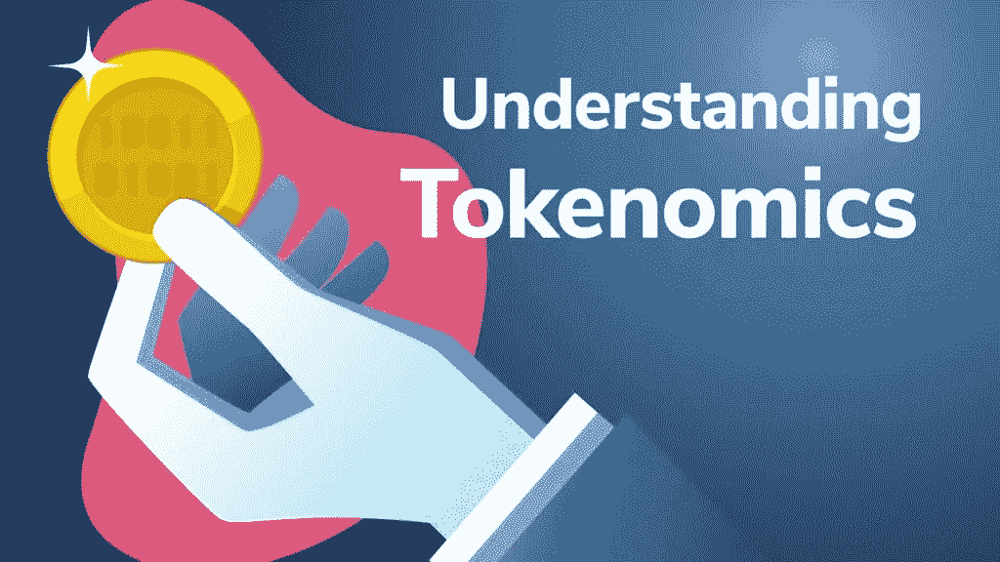

# 理解代币组学:代币的真正价值

> 原文：<https://medium.com/coinmonks/understanding-tokenomics-the-real-value-of-a-token-6e798c9a442e?source=collection_archive---------0----------------------->

## 什么是令牌组学

Tokenomics

在投资一种特定的加密货币之前，你需要了解该加密货币的**令牌组学**。一种加密货币的**令牌经济学**给你一个是否投资它的很好的主意。

# 理解加密令牌的令牌组学

在我们继续了解什么是令牌组学之前，我们需要首先了解什么是加密令牌。简而言之，加密令牌是一种基于区块链平台的加密硬币，可以与另一个区块链交换或交换，这为所述令牌的持有者提供了许多激励。

那么，什么是令牌组学？tokenomics 这个术语是由 token 和 economics 这两个词组合而成的。因此，令牌经济学这个术语基本上描述了加密令牌的经济学。它指的是一个加密令牌的所有特性，使其成为投资者的理想选择。

特定加密令牌的令牌组学通常在项目白皮书中有明确的详细描述，它应该有助于您理解加密令牌的目标、功能、分配策略等。

# 令牌组学为什么重要？

项目可以利用区块链技术创造微观经济。他们需要解读代币应该如何在他们的生态系统中发挥作用，才能自我维持。

谈到代币，没有所谓的“一刀切”的态度。区块链为广泛的应用和实现打开了大门。

Tokenomics 允许团队设计新的模型或修改现有的模型，以适应项目的目标。如果做得好，这可以创建一个稳定和高功能的平台。

# 价值在代币经济学中的意义

我们周围的世界是由激励驱动的。例如，一个孩子上学是因为这将为他们提供获得教育的机会，这将使他们在未来受益。人们遵循牙医的建议，保持口腔卫生，将任何牙齿问题的风险降至最低。

激励结构存在于每一个机构、企业、框架，以及你看到的几乎所有地方。加密货币并不打算摆脱激励结构，因此，令牌组学模型诞生了。

价值是推动符号组学建立的最基本因素。尽管加密资产以几个经济机会的承诺吸引了整个世界，但它们缺乏有形性。一美元可能看得见摸得着，但加密货币不是这样。

像 LITH Token 这样的加密令牌展示了它的实用价值，有助于通过加密货币分散和激励更清洁的未来。它利用区块链技术创造一个环境，在这个环境中，生态系统中的所有用户都被激励为一个共同的目标而努力:创造一个更可持续的环境。

# 令牌的类型

如果你想学习记号组学，首先了解记号的不同类型是很重要的。代币可以根据代币的结构，也可以根据用法进行分类。

令牌的结构可以分为:

# 第 1 层令牌

这些类型的令牌原产于特定的区块链，用于为区块链的所有服务提供动力。币安链上的 BNB 是加密货币中第一层令牌的一个例子。以太坊网络上的 Ether 或 ETH 是加密货币中第 1 层令牌的另一个众所周知的例子。

# 第 2 层令牌

在“什么是表征组学”的意义上，这些类型的表征具有不同的表现形式。它们用于特定网络中的分散式应用。例如，OMG 令牌被归类为第 2 层令牌，因为它们在 OmniseGO 中使用，OmniseGO 是以太坊网络中的一个分散项目。

根据使用情况，令牌可以分为:

# 安全令牌

安全令牌被称为投资合同，它们必须满足几个条件。这些代币受证券和法规的约束。简单来说，区块链的安全令牌将从可交易和外部来源获得价值。因此，它们将始终受到政府法规的约束，这使它们成为更安全的选择。

Sia 网络上的 Siafunds 或 SF 的工作方式是安全令牌最值得注意的例子之一。

# 实用令牌

实用令牌是令牌组学中另一种重要的令牌类型。这些类型的代币通过初始硬币发行(ICO)发行，它们对于网络融资非常有用。

ICO 对于资助项目开发至关重要。基本注意令牌(BAT)是通过 ICO 首次提供的实用令牌的一个示例。

# 令牌的分类

代币也可以分为两类:可替代代币和不可替代代币。

# 可替代代币

这些令牌被认为具有相同的值和复制功能。以太坊上的 ETH (Ether)场景是可替换令牌的一个完美例子。ETH 令牌的值是相同的，并且它们可以互相替换，因为它们的值是相同的。

# 不可替换的令牌

不可替换令牌(NFT)不共享相同的值，因此它们是唯一的。非关税壁垒近来一直是趋势，它们引发了人们对象征经济学的浓厚兴趣，尤其是在高调的 NFT 拍卖会上。

NFT 对房地产、艺术品、图片和收藏品等资产的令牌化引发了新一轮的数字所有权革命，同时也展示了令牌的潜力。

# 密码记号组学中包含的因素

当考虑加密令牌的令牌组学时，任何与该加密令牌的值稍微相关的因素都应该被考虑。

为了确定加密令牌的价值，下面给出了一些要考虑的最重要的指标。

# 代币的分配和分发

请确保您了解令牌将如何分发。大多数加密令牌都是通过以下方式生成的:要么通过公平发布来发布，要么预先挖掘。

一个公平的发布是当加密被整个社区挖掘、获得、拥有和管理的时候。在公开令牌之前，没有提前访问或私有分配。比特币、YFI 和 Dogecoin 就是这方面的几个例子。

另一方面，预挖掘是指生成几个加密令牌，并在它们公开之前将其分发给一组选定的地址(通常是项目开发人员、早期投资者和其他团队成员)。

如今，大多数加密项目都带有预先挖掘的令牌。所以，不要仅仅因为一些代币在公开之前就被创造出来，就放弃一个项目。但是，您必须检查是否有任何钱包正在囤积相当比例的流通令牌供应。如果有的话，鲸鱼很有可能抛售股票，导致代币价格瞬间下跌。

另一方面，如果项目将令牌分发给尽可能多的成员，您可以假设项目是可信的，并且它真正关心其未来的发展。

# 令牌的供应

加密令牌的提供是其令牌组学的主要组成部分。说到加密，有三种类型的电源需要注意。有总供应量、循环供应量和最大供应量。

代币供应总量是指目前存在的代币数量，不包括任何已被烧毁的代币。代币的流通供应量是指到目前为止已经发行并且正在流通的代币的数量。最后，令牌的最大供应量是将被创建的令牌的最大数量。某些令牌没有确定的最大供应量。

如果你观察到一个特定的代币的流通供应量随着时间的推移被项目开发者有规律地增加了，你可以假设这个代币的价值在将来会上升。相反，如果同时或经常发行太多代币，代币的价值可能会直线下降。

# 令牌模型

确保你明白这是通货膨胀还是通货紧缩。随着时间的推移，会不断产生一个通货膨胀标志。这种令牌没有可以创建的最大令牌供应量或上限。

另一方面，通货紧缩的代币模型正好相反。在这个模型中，令牌有一个上限。例如，比特币的总供应量上限为 2100 万。大多数 POS(proof-of-stage)令牌，如 ETH，是膨胀的，以便奖励网络中的委托人和验证人。

一些加密令牌具有双令牌模型，其中一个令牌用作筹集资金的安全性，另一个令牌用于网络内部的效用。基于双令牌模式的项目示例有 MakerDAO、Axie Infinity、Filmio 和 VeChainThor。

# 市场资本化

术语代币的市值(或市场资本总额)是指衡量代币相对大小的指标。其计算方法是将代币的当前市场价格乘以流通中的代币总数。

虽然加密令牌的市场资本总额可能会对其性能和规模提供一些见解，但必须注意的是，它不同于资金流入。所以并不能反映市场上的货币量。

代币的市值越高，其流通供应量越低，该代币在未来就越有价值。

# 未来准备

令牌组学还包括理解加密令牌如何帮助应对未来的挑战。加密领域中许多负责网络开发的团队并没有成为网络的统治者。

因此，开发人员必须接受这样一个事实，即现在对他们的令牌项目有效的东西在将来可能不一定有效。网络的发展和成熟可能需要改变令牌的管理方式。

LITH Token 是面向未来的，因为它被定位为可持续和有社会意识的企业蓬勃发展的首选密码。它旨在通过商业中的权力下放和问责制，帮助让世界变得更美好。

另外，阅读

 [## 令牌组学:决定密码成功的 4 个因素

### 令牌组学成功因素

medium.com](/coinmonks/tokenomics-4-factors-that-determine-a-cryptos-success-858ee7a0cf94) 

## 在 Linkedin 上关注我，保持联系

https://www.linkedin.com/in/ishanshahzad/