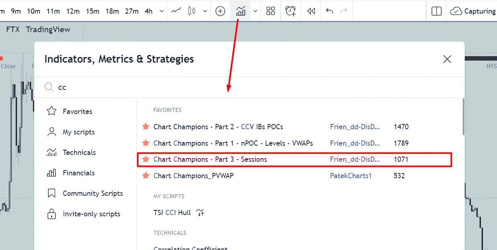
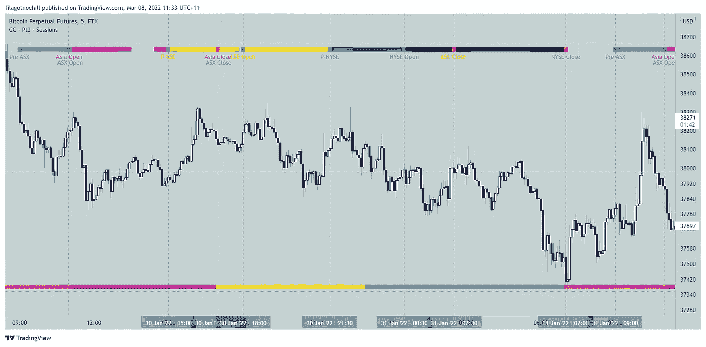
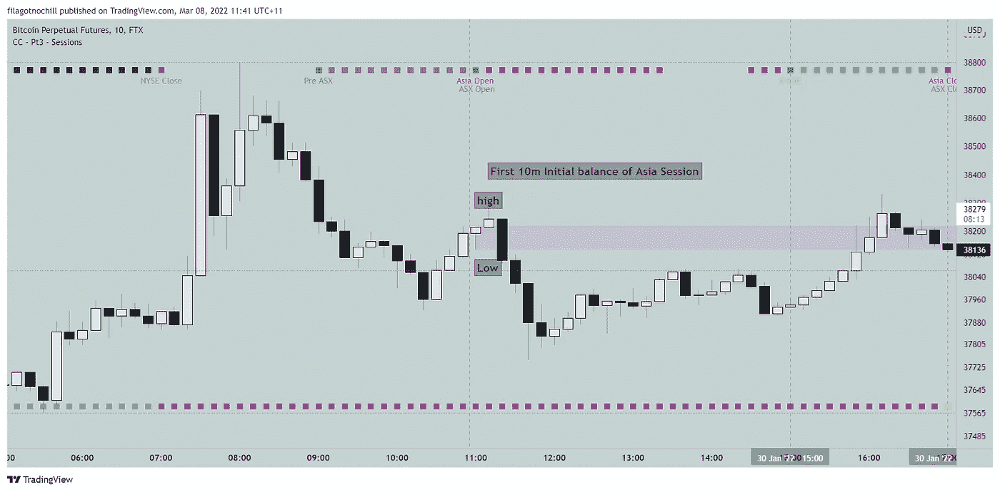
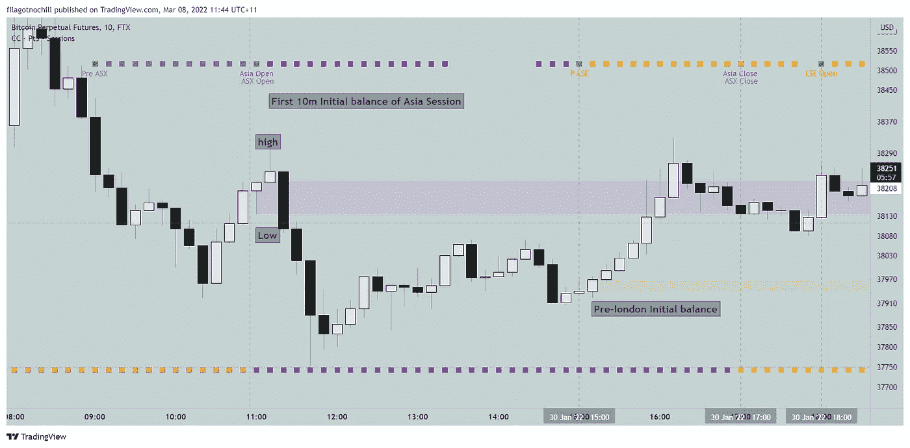
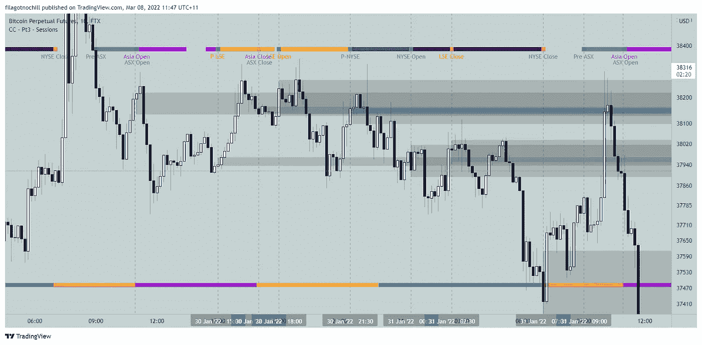
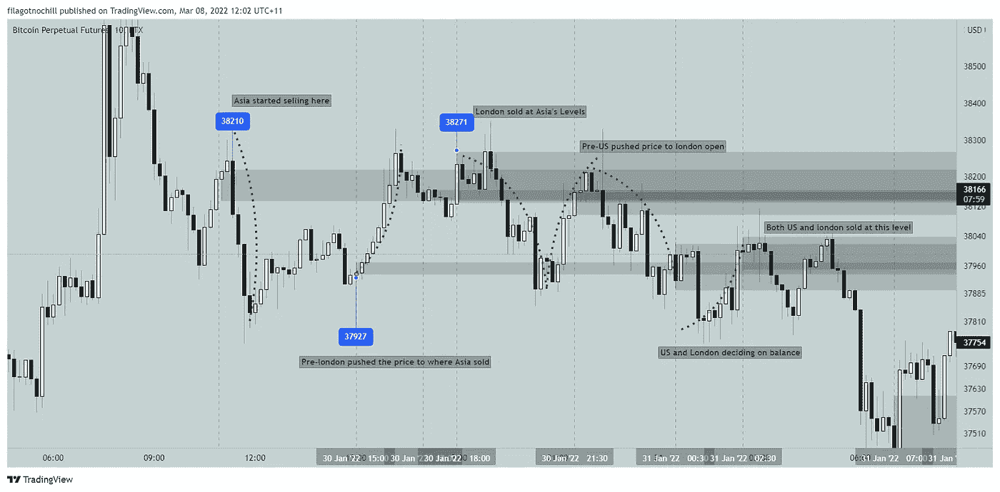
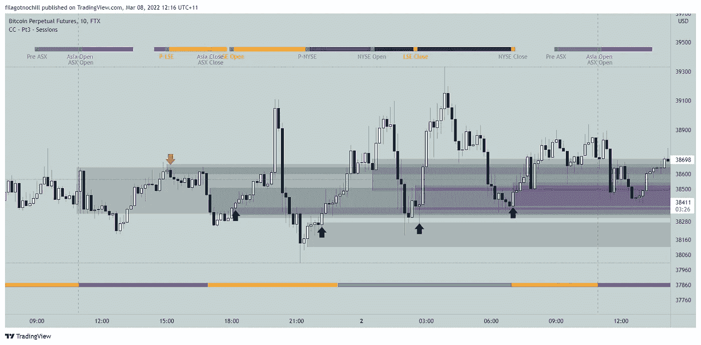

# 了解交易时段、初始余额和日内交易的交易量概况-第 1 部分

> 原文：<https://medium.com/coinmonks/understanding-trading-sessions-intial-balance-and-sessionvolume-profile-for-intraday-trading-part-26b104d11ee7?source=collection_archive---------4----------------------->

如果您已经阅读了[上一篇文章](/@sigmabasis/time-volume-and-price-the-key-concepts-you-need-to-understand-for-day-trading-439fc9aa1596#abb6-d15cd0e34a48)并通读了参考资料，您现在应该对卷概要文件很熟悉了。

在这篇文章中，我将回顾交易时段的概念，以及初始余额如何影响交易日。

## 什么是会话？

一个时段是指从市场开盘到收盘的时间段。在期货市场，有四个交易时段:亚洲，伦敦，美国和后市场。每节课的时间取决于你住在哪里。

要查看您交易的市场时段，请使用以下指标:

A typical trading session for BTCPERP on FTX

## 会话开始或初始余额:

初始余额是一个时段内的最高点和最低点。它可以是 1 小时、30 分钟、15 分钟、10 分钟或 5 分钟，或者是整个交易时段。

为了画出最初的平衡，从每一个交易的开始取蜡烛线的最高点和最低点。

Example: Initial balance of Asia session. Go to 10 min timeframe. Mark it’s high and low. And voila, you have plotted the initial balance.

Example: Initial balance of Pre-London Session

## 每次会话初始平衡的重要性:

Highlighted initial balance from the opening of each session

世界各地的机构都想在高价时买进，如果它们在卖，就在低价时买进。所以，一整天他们都在重新平衡他们的账户。这是他们的 TWAP 机器人/订单块所在的位置。根据拍卖市场理论，这是造成平衡和不平衡的原因。所以，初始平衡让我们对机构可能在哪里买入或卖出有了个人看法。

Balancing and rebalancing throughout the day

从上面的图片中，你能观察到一整天都发生了什么吗？你能看出模式吗？

作为散户，你在寻找趋势、支撑和阻力、趋势线、斐波纳契线等等；机构在寻找流动性和平衡。你的限价单就是它们的流动性。他们是真正的做市商。所以你的工作是找到他们的水平来安排你的交易。

所以，使用 CC-Sessions，开始标记这一整天的水平。试着理解正在发生的事情，站在他们的角度思考。他们的故事告诉了你什么？

Another example

在下一个例子中，我将使用成交量曲线(我的主要设置)来检查交易的高点和低点。

这是我的第二个设置，允许我观察当天的机构设置。

感谢您阅读这一部分。快乐适马贸易。

如果您有任何问题，请加入 sigmabasis discord:

[https://discord.gg/utR9wysjEV](https://discord.gg/utR9wysjEV)