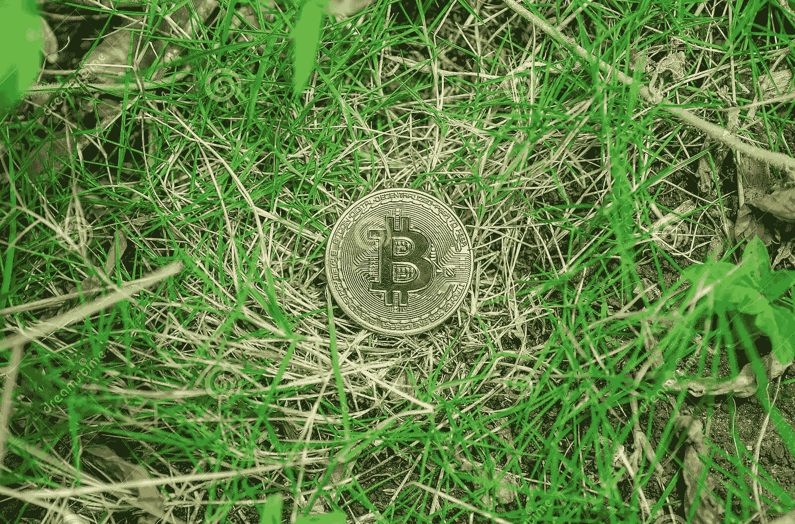
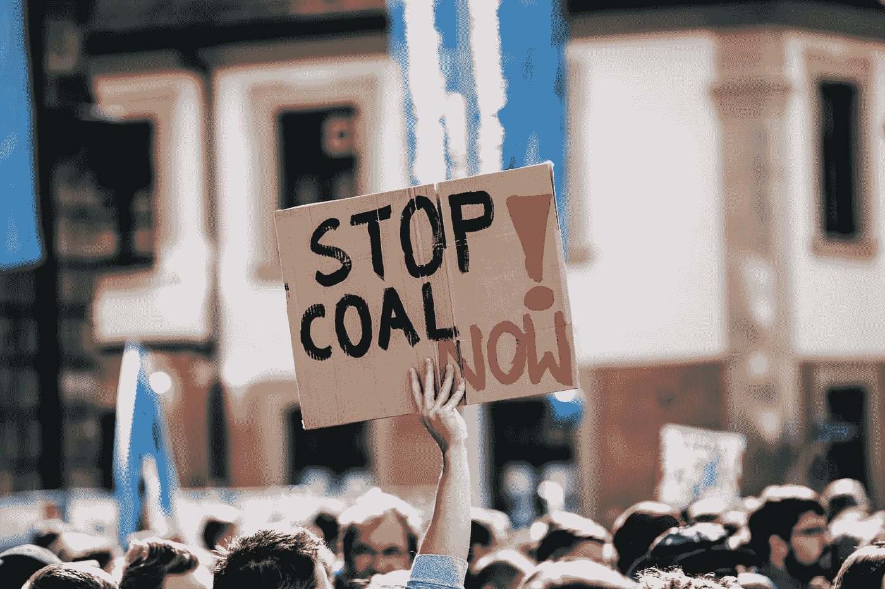

# 透过 ESG 视角了解虚拟资产

> 原文：<https://medium.com/coinmonks/understanding-virtual-assets-through-an-esg-lens-b35d30dfe27f?source=collection_archive---------18----------------------->

虽然虚拟资产(如加密货币)在过去几年中迅速成为主流，但 ESG——将环境、社会和治理措施融入企业运营——已经成为决定投资是否可行的关键因素。因此，世界各地越来越多的公司和立法者正在接受环境、社会和公司治理措施，例如毛里求斯政府最近在其 2022-2023 年预算中表示，它计划推出为毛里求斯可持续发展路线图提供资金的举措，包括碳信用交易框架、环境、社会和公司治理框架以及首次可持续债券。

敏锐地意识到这两种投资趋势，我试图解决的问题是，投资者能否在支持 ESG 目标的同时投资虚拟资产。

# 环境

> 除非比特币进一步崩溃，否则没有理由期待它对环境的影响会减少。”

它始于一次交易。假设你想用比特币购物。第一步是在币安这样的加密交易所开一个账户。然后，你将把你的比特币储存在一个“数字钱包”里，并有权按照你认为合适的方式消费、投资或储蓄。

然而，任何比特币交易首先需要得到比特币网络的验证，该网络由大量“矿工”组成，他们承担着验证网络上每一笔交易的艰巨任务，以确定发送者是否实际拥有发送的金额。作为交换,“矿工”有机会获得代币作为奖励，这导致了一个恶性的高能耗循环。一个成功的比特币矿场可以每 10 分钟收获 [6.25 个比特币——目前价值约 13.1 万美元。](https://argoblockchain.com/articles/explaining-the-bitcoin-block-reward#:~:text=They%20are%20given%20to%20miners,place%20roughly%20every%204%20years.)

根据 [*Digiconomis*](https://digiconomist.net/) t 的创始人亚历克斯·德·弗里斯(Alex de Vries)的说法，比特币网络产生的二氧化碳和新西兰一样多。为了说明其影响，一个比特币在一次交易中消耗的电力相当于处理 [722，705 笔 Visa 卡交易的电力。](https://bit.ly/3zuJG0x)

亚历克斯的研究表明，尽管虚拟资产价格的上涨会鼓励更多的计算机容量用于虚拟资产，从而增加碳排放，但这种容量在价值下降后需要很长时间才能消失，因此气候影响仍然存在。

ESG 支持加密货币的理由是，一些比特币交易使用可再生能源，它们的能源消耗刺激了开发更环保的能源生产形式。诚然，比特币开采的很大一部分是由可再生能源驱动的，世界各地的立法者都在立法，对使用化石燃料发电厂向比特币等加密货币的矿工提供能源施加限制和罚款。2021 年 5 月，中国当局下令打击地下采矿，结果，许多矿工逃到哈萨克斯坦和世界其他国家，在那里他们可以利用脆弱的 ESG 政权。

在毛里求斯，最近颁布的《2021 年虚拟资产和初始令牌提供服务法》( **VAITOS Act 2021** )规定，任何从事采矿服务的人都不需要获得毛里求斯金融服务委员会的许可。我想请毛里求斯政府注意发生在中国和哈萨克斯坦的事件，而不是在毛里求斯实施管理加密采矿服务的规则和条例。这些规则应与财政激励措施相结合，以促进可再生能源的使用，从而支持按照毛里求斯环境、社会和公司治理框架向更可持续的经济转变。

# 社会的

环境、社会和治理的第二个支柱通常包括多样性、人权以及最重要的消费者保护等领域。诚然，加密货币可以通过推动金融服务创新(如 P2P 小额支付)来促进金融包容性。

然而，众所周知，加密货币波动性极大，不适合绝大多数投资者投资。2022 年 5 月 24 日，一名台湾男子被发现死亡，此前他在[投资了 200 万美元的 Luna token](https://www.taiwannews.com.tw/en/news/4551502)，该股票在加密崩溃后暴跌至 1000 美元。

加密市场非常容易受到媒体错误信息的影响[“这主要是由于缺乏监管监督和对加密货币的接受，因此意味着市场价格过度受情绪影响，无论是上涨还是下跌”](https://www.aa.com.tr/en/economy/crypto-market-vulnerable-to-news-misinformation-expert/2366061)——利物浦大学金融技术副教授加文·布朗。

毛里求斯政府应注意世界各地其他司法管辖区为解决虚假信息而实施的政策举措，如美国众议院提出的《深度造假责任法案》,该法案提议使用区块链来验证来源、水印、内容创建者身份和其他相关信息。此外，欧盟去年提出了一系列管理公司如何使用人工智能的法规草案。

# 管理

治理是指围绕公司治理和行为的主题，包括道德、腐败、政治捐款、透明度和公司可持续性。与虚拟资产相关的治理风险从[黑客攻击](https://www.artnews.com/art-news/news/opensea-hack-nfts-phishing-1234619802/)和[拉地毯](https://cointelegraph.com/explained/crypto-rug-pulls-what-is-a-rug-pull-in-crypto-and-6-ways-to-spot-it)到[社区内缺乏多样性。然而，这些风险并不仅限于加密领域。](https://www.forbes.com/sites/qai/2021/11/15/we-need-more-diversity-on-the-blockchain/)

透明度和披露是良好的公司治理模式的基础，因为它们使相关利益攸关方能够做出知情的决定，并让公司高管承担责任。根据金融行动特别工作组( **FATF** )的建议，毛里求斯正在不断实施旨在加强公司披露的立法，以强化毛里求斯的国家公司治理准则。了解你的客户(KYC)对受益和最终受益所有人的检查、定期报告和对违反披露要求的处罚是毛里求斯在打击试图从事犯罪和恶意活动的人方面已经采取的一些措施。

# 结论

虽然虚拟资产为金融包容性提供了一个机会，但投资虚拟资产仍然会产生大量的碳足迹，这似乎与任何环境目标都不一致。这就是为什么对毛里求斯来说，专注于发展可持续的比特币采矿实践，而不是简单地将这个空间作为一个未知领域，是非常重要的。

经过深思熟虑，我会对本文开头提出的问题做出否定的回答，但我仍然乐观地认为，毛里求斯和世界各地的其他立法者将会解决与虚拟资产相关的 ESG 缺陷。

你怎么想呢?

# 作者:Rayyan Sorefan

艾扬·索雷凡 *被授予英格兰、威尔士和毛里求斯的律师资格。他是普华永道法律部(毛里求斯)的高级助理律师。他的业务重点是金融科技、公司法以及银行和金融。*

欲了解更多信息，请联系 rayyan.sorefan@pwc.com 的雷扬

> 加入 Coinmonks [电报频道](https://t.me/coincodecap)和 [Youtube 频道](https://www.youtube.com/c/coinmonks/videos)了解加密交易和投资

# 另外，阅读

*   [最佳以太坊钱包](https://coincodecap.com/best-ethereum-wallets) | [电报上的加密货币机器人](https://coincodecap.com/telegram-crypto-bots)
*   [交易杠杆代币的最佳交易所](https://coincodecap.com/leveraged-token-exchanges) | [购买 Floki](https://coincodecap.com/buy-floki-inu-token)
*   [3Commas 诉 Pionex 诉 crypto hopper](https://coincodecap.com/3commas-vs-pionex-vs-cryptohopper)|[Bingbon Review](https://coincodecap.com/bingbon-review)
*   [加密复制交易平台](/coinmonks/top-10-crypto-copy-trading-platforms-for-beginners-d0c37c7d698c) | [如何在 WazirX 上购买比特币](/coinmonks/buy-bitcoin-on-wazirx-2d12b7989af1)
*   [硬币评论](https://coincodecap.com/coinloan-review)|[Crypto.com 评论](/coinmonks/crypto-com-review-f143dca1f74c)