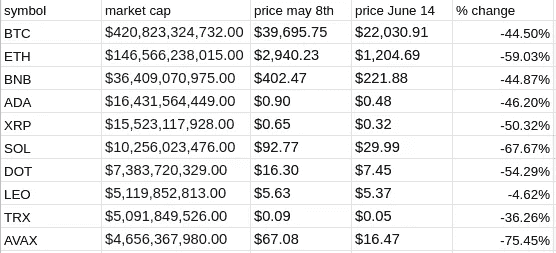
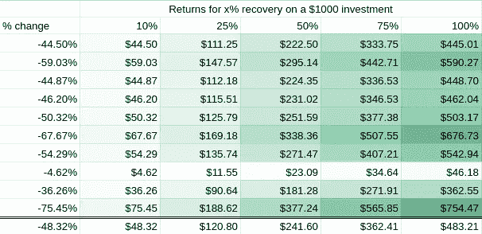
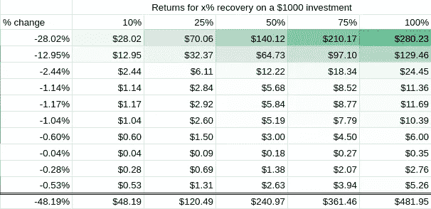
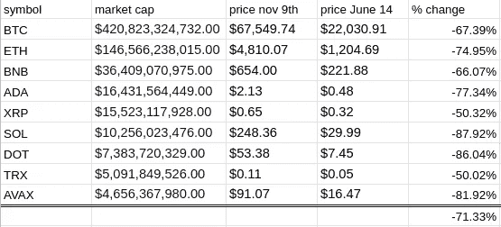
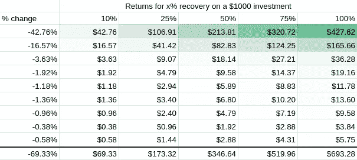

# 被低估:为什么我在熊市期间进入加密。用数字。

> 原文：<https://medium.com/coinmonks/undervalued-why-im-getting-into-crypto-during-the-bear-market-with-numbers-b07ca8946f14?source=collection_archive---------41----------------------->

我想先说我什么都不知道。我对这个领域相当陌生，只是在这里给出我个人的观点和推测。这绝不是财务建议。

在过去的两年中，我认为 crypto 的市场价值与一些重大事件相关，这些事件标志着牛市的开始和结束。这些当然是:

1.  NFT 大爆炸，(~ 2021 年 3 月)，然后逐渐平息。
2.  USDT·德佩格和地球月球坠毁事件(2021 年 5 月 7 日)

市场中的这些变化有助于提供加密空间整体真实内在价值的近似值。

由于它在去年 11 月达到顶峰，而现在仍在不断走低，我的近似值是内在价值介于这两个市场价值之间。

为什么？因为我认为市场在这个时候过于情绪化，因此低估了 crypto 的价值，交易价格低于其内在价值。然而，对于一个更保守的估计，坦率地说，我更相信它，我会说它实际上更接近于 5 月 7 日 Terra 崩溃前的价格和我们现在的价格之间的某个地方。

# 数字

我们来看一些数字。考虑到 1000 美元的初始投资。

看看按市值排名的前 10 名非稳定、非迷因硬币:

让我们计算 1000 美元投资在不同回报水平下的回报。其中硬币的内在价值是当前市场价值和 2022 年 5 月 5 日价格之间的 x%:

Here the bottom row represents the average return equal to the return of the scenario where I might invest equal amounts into teach coin.

现在让我们考虑一下，我用市值来衡量我的投资，这可能是一个风险较小的策略:

Here the bottom row represents the sum of returns.

如你所见:

1.  假设其他条件相同。按市值平均代表的回报几乎等同于将投资平均分配给不同的硬币。
2.  这不是快速致富的计划。

让我们变得更疯狂一点，考虑一种可能性更小的场景，即内在价值实际上位于当前市场价值和 2021 年 11 月 9 日左右的前一个历史高点的市场价值之间。

再一次，计算以市值衡量的 1000 美元投资的回报:

再次强调，这不是一个快速致富的计划。

# 我会错吗？

我当然可能是错的。在这种情况下，crypto 的内在价值继续下降，其市场价值再也不会达到目前的水平。虽然这不仅仅是可能的，也是为什么我只投资我愿意损失的钱，但我不认为这是最有可能的情况，原因之一。

## 密码在将来会有更多的用途

想一想。除了进行匿名交易，加密的目的是什么？当然，我们可以在空间中交易硬币，在 dex 上，并参与其他噱头。但最终，至少在目前，我们唯一真正的效用基本上是购买药物，用一些代币换取其他代币，通过养殖和炒作追逐赚钱。

市场价格完全由供求关系决定。人们想要代币，或者是因为他们真正相信这个项目，或者是因为它被大肆宣传，他们想乘风破浪。这种需求的增加使得当时愿意出售代币的人可以溢价出售代币。

这些由供给和需求决定的市场价值围绕内在价值变动，也就是说，就其效用而言，硬币的实际价值。

我认为有一些现实的长期效用，将会增加加密的内在价值。

1.  Web3。这并不意外。但最终我认为加密将会更多地融入我们的网络生活。但这可能是相当有限的，可能只有在匿名项目中才真正变大。
2.  资产。通货紧缩的硬币和代币，当然包括比特币，由于其最终(非常长期)的稳定性和稀缺性，可以并将最终被视为黄金和白银等资产。正如黄金有价值一样，比特币也有价值，可以用来对冲通胀。
3.  作为我们当前金融系统的基础设施。我认为这是最有可能的，因为比特币实际上是为解决当前系统的缺点而设计的。区块链的交易更好，那么为什么银行最终不采用这项技术呢？交易将是即时的、有保证的和安全的。

我认为这些效用根本没有得到满足。我们仍然处于非常早期的阶段，因此我认为随着时间的推移，这种实用性的增加将会增加整个加密技术的市场价值。

感谢阅读，请务必在 [twitter](https://twitter.com/landomoves) 上关注我

> 加入 Coinmonks [电报频道](https://t.me/coincodecap)和 [Youtube 频道](https://www.youtube.com/c/coinmonks/videos)了解加密交易和投资

# 另外，阅读

*   [用信用卡购买密码的 10 个最佳地点](https://coincodecap.com/buy-crypto-with-credit-card)
*   [加拿大最佳加密交易机器人](https://coincodecap.com/5-best-crypto-trading-bots-in-canada) | [Bybit vs 币安](https://coincodecap.com/bybit-binance-moonxbt)
*   [阿联酋 5 大最佳加密交易所](https://coincodecap.com/best-crypto-exchanges-in-uae) | [SimpleSwap 评论](https://coincodecap.com/simpleswap-review)
*   购买 Dogecoin 的 7 种最佳方式 | [ZebPay 评论](https://coincodecap.com/zebpay-review)
*   [最佳期货交易信号](https://coincodecap.com/futures-trading-signals) | [流动性交易回顾](https://coincodecap.com/liquid-exchange-review)
*   【Huobi 的加密交易信号 | [Swapzone 审查](/coinmonks/swapzone-review-crypto-exchange-data-aggregator-e0ad78e55ed7)