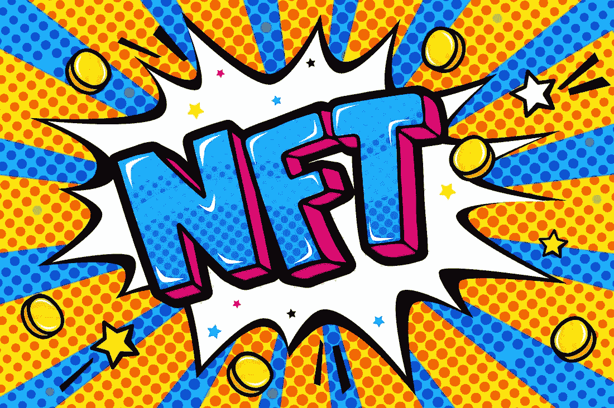
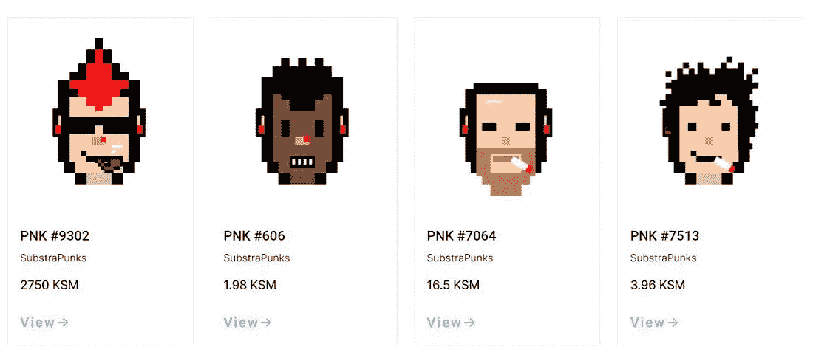

# 独特的网络——波尔卡多特最重要的 NFT 项目

> 原文：<https://medium.com/coinmonks/unique-network-the-most-important-nft-project-in-polkadot-e8519b17b01b?source=collection_archive---------2----------------------->

以太坊之后，NFT 的人群转移到了索拉纳。许多索拉纳 NFT 项目都选择了上游。卡尔达诺公司也做得很好。最近，Fantom 推出了名为 Artion 的新市场。波尔卡多呢？那里发生了什么事？这并不是说波尔卡多特无所事事，看着竞争继续前进。

但事实并非如此，Polkadot 速度很慢，因为它是一种极其复杂的架构。目前，重点是草间弥生的船上跳伞，然后，最终在波尔卡多特。波尔卡多特只会希望副链能为它的生态系统提供先进的 NFT 能力。Polkadot 本身作为一个中继链并不具备这种能力。那么，哪些项目可以带来这种能力呢？

Efinity 里最炒作的一个。然而，Efinity 不知何故没有波尔卡多特的背景，他们没有参与草间弥生的拍卖，也没有参与早期的社区。有一个有趣的项目叫做 [RMRK](https://rmrk.app/) ，最近刚刚启动。他们为草间弥生制定了《NFT 议定书》,并积极参与制定草间弥生的 NFT 战略。他们的第一次 NFTs，卡娜莉亚鸟取得了巨大的成功。每只鸟都有可以装备的插槽，使它们成为动态的 NFT。然而，RMRK 在州立矿山。他们将很快加入一个大型的波尔卡多特 NFT 项目。这个项目叫做[独特网络](https://unique.network/)。

独一无二的网络创造了第一个对加密朋克的官方致敬。这些朋克被称为亚朋克。有趣的是，底层朋克是底层中的第一个，这是波尔卡多特和草间弥生背后的技术。这意味着他们是波尔卡多特的第一批 NFT！他们被大大低估了。那是因为 Unique Network 还没有在草间弥生推出副链。

但在下一个 Parachain 阶段，他们将推出，那时热潮将开始。

## **那么什么是独特的网络呢？**

独特的网络是一个区块链，一个副链，你可以在上面建立 NFT dapps，市场，铸造解决方案，游戏，发射台等。它可以被视为波尔卡多特 NFT 标准的基础。也是以太坊虚拟机兼容的。从长远来看，它还将与其他连锁店建立联系。

## **那么独特的网络带来了哪些优势呢？**

**免费增值模式:**在以太坊中，每个用户都要为一个游戏中的每笔交易支付油费。在 Unique 中，开发者可以承担这笔费用，给予折扣，让他们的游戏免费增值。独特降低了进入门槛。

**高级所有权:**通过在 NFT 插槽中添加功能，可以使用 RMRK 独有的 NFT。你可以租用，委托你的 NFTs。

**NFT 到 NFT 的相互作用:**非金融交易可以与其他非金融交易相互作用，从而影响相关资产的属性。

我不确定是否有一个 NFT 专用的区块链可以做到所有这些。Plus Unique 与非常受欢迎的游戏 launch pad Seedify 建立了合作关系。在 Seedify 上发布的任何游戏都将由 Unique Network 在各种发布中提供支持。这是一个野生名单的游戏管道！

## **你知道 Unique Network 有 5 个 Web 3 授权吗？**

是的。它们是整个底物生态系统中的第二种，仅次于 Astar。他们已经在生态系统中工作了很长时间，并且有着非常好的关系网。他们自 2019 年以来一直是波尔卡多特大使，与 RMRK 一起，也是草间弥生 NFT 战略的一部分。他们在 2020 年草间弥生的名为 Hackusama 的黑客马拉松中赢得了两项大奖。

**投资商**

投资者是博彩业的名人。它得到了 Animoca Brands、Outlier Ventures、DFG、Long Hash、Master Ventures 等公司的支持。这也证明了产品引起了风投的兴趣。

**市场**:

Unique 的 marketplace 目前已上线。

它只列出了 Substrapunks 和他们的第二个 NFT，Chelobricks。你知道吗，如果你在一个钱包里放了一个未上市的 Substrapunk 和 Chelobrick，你将获得该平台每季度 50%的收入！

**UNQ 和石英**

石英是草间弥生唯一的象征，UNQ 将是波尔卡多特的象征。两者都有 10 亿英镑的供应量。你可以通过参与他们即将推出的草间弥生众筹贷款(第三期)来获得石英。此外，UNQ 的公开出售将很快进行。

小心这个项目！

***注:*** *本帖首次发表* [*此处*](https://crypto.writer.io/p/unique-network-the-most-important) *与* [*上的子帖同*](https://crypto.writer.io/) *。*

**通过我的推荐加入**

[Crypto.com](https://binance.com/en/register?ref=E8PCD3AF)——[币安](https://platinum.crypto.com/r/sut3pd9bzn)

跟我来吧

**👉** [推特](https://twitter.com/rumadas123)

**👉** [领英](https://www.linkedin.com/in/ruma-das-a1439320/)

> 加入 Coinmonks [电报频道](https://t.me/coincodecap)和 [Youtube 频道](https://www.youtube.com/c/coinmonks/videos)了解加密交易和投资

## 另外，阅读

*   [Coldcard 评论](https://blog.coincodecap.com/coldcard-review) | [BOXtradEX 评论](https://blog.coincodecap.com/boxtradex-review)|[uni swap 指南](https://blog.coincodecap.com/uniswap)
*   [比特币基地评论](/coinmonks/coinbase-review-6ef4e0f56064) | [德里比特评论](/coinmonks/deribit-review-options-fees-apis-and-testnet-2ca16c4bbdb2) | [FTX 评论](/coinmonks/ftx-crypto-exchange-review-53664ac1198f)
*   [n ave 零点回顾](/coinmonks/ngrave-zero-review-c465cf8307fc) | [Phemex 回顾](/coinmonks/phemex-review-4cfba0b49e28) | [PrimeXBT 回顾](/coinmonks/primexbt-review-88e0815be858)
*   最佳[区块链分析](https://bitquery.io/blog/best-blockchain-analysis-tools-and-software)工具| [赚比特币](/coinmonks/earn-bitcoin-6e8bd3c592d9)
*   [加密套利](/coinmonks/crypto-arbitrage-guide-how-to-make-money-as-a-beginner-62bfe5c868f6)指南| [如何做空比特币](/coinmonks/how-to-short-bitcoin-568a2d0b4ae5)
*   [比特币基地 vs 瓦济克斯](https://blog.coincodecap.com/coinbase-vs-wazirx) | [比特鲁点评](https://blog.coincodecap.com/bitrue-review) | [波洛涅克斯 vs 比特鲁](https://blog.coincodecap.com/poloniex-vs-bittrex)
*   [德国最佳加密交易所](https://blog.coincodecap.com/crypto-exchanges-in-germany) | [Arbitrum:第二层解决方案](https://blog.coincodecap.com/arbitrum)
*   [币安交易机器人](/coinmonks/binance-trading-bots-d0d57bb62c4c) | [OKEx 评论](/coinmonks/okex-review-6b369304110f) | [阿塔尼评论](https://blog.coincodecap.com/atani-review)
*   [最佳加密交易信号电报](/coinmonks/best-crypto-signals-telegram-5785cdbc4b2b) | [MoonXBT 评论](/coinmonks/moonxbt-review-6e4ab26d037)
*   [如何在 Bitbns 上购买柴犬(SHIB)币？](https://blog.coincodecap.com/buy-shiba-bitbns) | [买弗洛基](https://blog.coincodecap.com/buy-floki-inu-token)