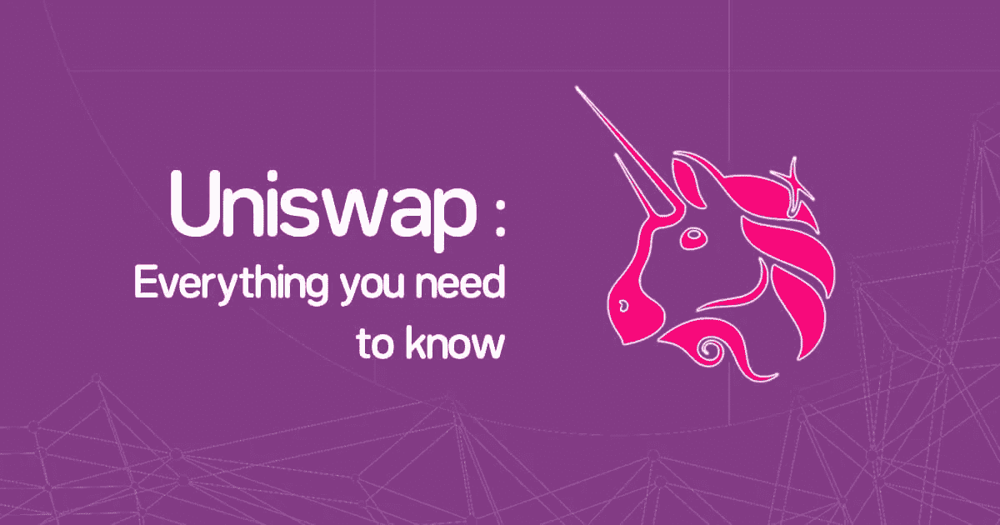

# Uniswap 的交易量突破 1 万亿美元，但仅被 390 万个地址使用

> 原文：<https://medium.com/coinmonks/uniswap-breaks-1t-in-volume-but-has-only-been-used-by-3-9m-addresses-c48a06a6accf?source=collection_archive---------57----------------------->

(DEX)自 2018 年底在以太坊推出以来，Uniswap 的总交易量已突破 1 万亿美元

然而，这来自相对较小的用户群，表明未来有很大的潜在增长空间。Uniswap 实验室是该协议和生态系统开发的主要贡献者，根据他们的数据，仅过了三年多，DEX 的累计地址数量本月就达到了约 390 万个。

该数据于周二通过 Twitter 发布，Uniswap 实验室团队指出:“在过去的三年里，该协议已经让数百万用户进入了去中心化金融(DeFi)的世界，引入了公平和无许可的交易，降低了流动性供应的壁垒。”

Uniswap 目前在以太坊和第 2 层缩放解决方案 Polygon、optimistry 和 Arbitrum 上受支持。Uniswap 实验室本月早些时候还透露，DEX 将扩展到 Gnosis Chain 中的两个以太坊虚拟机(EVM)兼容链，以及基于 Polkadot 的 para-chain Moonbeam 网络。

就交易量而言，Uniswap 在 DEX 市场遥遥领先于其竞争对手。来自 CoinGecko 的数据显示，Uniswap 的 v3 协议在过去 24 小时内产生了价值 9.38 亿美元的交易量，占总市场份额的 33%。

相比之下，基于币安智能链的 PancakeSwap (v2)以 4.91 亿美元和 17.3%的市场份额排名第二。

当将 Uniswaps 的 24 个数据与集中式交易所(CEXs)进行比较时，其价值 9.38 亿美元的交易量远远落后于币安、FTX 和比特币基地等平台，这些平台分别产生了 122 亿美元、19.5 亿美元和 17.9 亿美元的交易量。

然而，值得注意的是，DEX 远远领先于加密领域的一些大公司，如 Crypto.com 和北海巨妖，它们分别创造了 7.249 亿美元和 5.974 亿美元的收入。

根据 DefiLlama 的数据，Uniswap 还积累了约 59.3 亿美元的总价值锁定(TVL)，在 DeFi 领域排名第五，而 PancakeSwap 以 42.7 亿美元的 TVL 排名第七。MakerDAO 是 TVL 最大的平台，拥有 98.2 亿美元。

尽管 Uniswap 有能力吸引强劲的需求和流动性，但它并没有在 2022 年对其本土资产 Uniswap (UNI)的价格产生太大影响。自 1 月初以来，截至本文撰写之时，UNI 股价已下跌约 67%，至 5.59 美元。

UNI 的历史高点 44.92 美元也回到了 2021 年 5 月初，自那以来下跌了 87.5%。

> 加入 Coinmonks [电报频道](https://t.me/coincodecap)和 [Youtube 频道](https://www.youtube.com/c/coinmonks/videos)了解加密交易和投资

# 另外，阅读

*   [CoinDCX 评论](/coinmonks/coindcx-review-8444db3621a2) | [加密保证金交易交易所](https://coincodecap.com/crypto-margin-trading-exchanges)
*   [红狗赌场评论](https://coincodecap.com/red-dog-casino-review) | [Swyftx 评论](https://coincodecap.com/swyftx-review) | [CoinGate 评论](https://coincodecap.com/coingate-review)
*   [Bookmap 评论](https://coincodecap.com/bookmap-review-2021-best-trading-software) | [美国 5 大最佳加密交易所](https://coincodecap.com/crypto-exchange-usa)
*   [如何在 FTX 交易所交易期货](https://coincodecap.com/ftx-futures-trading) | [OKEx vs 币安](https://coincodecap.com/okex-vs-binance)
*   [CoinLoan 评论](https://coincodecap.com/coinloan-review) | [YouHodler 评论](/coinmonks/youhodler-4-easy-ways-to-make-money-98969b9689f2) | [BlockFi 评论](https://coincodecap.com/blockfi-review)
*   [XT.COM 评论](https://coincodecap.com/profittradingapp-for-binance)币安评论 |