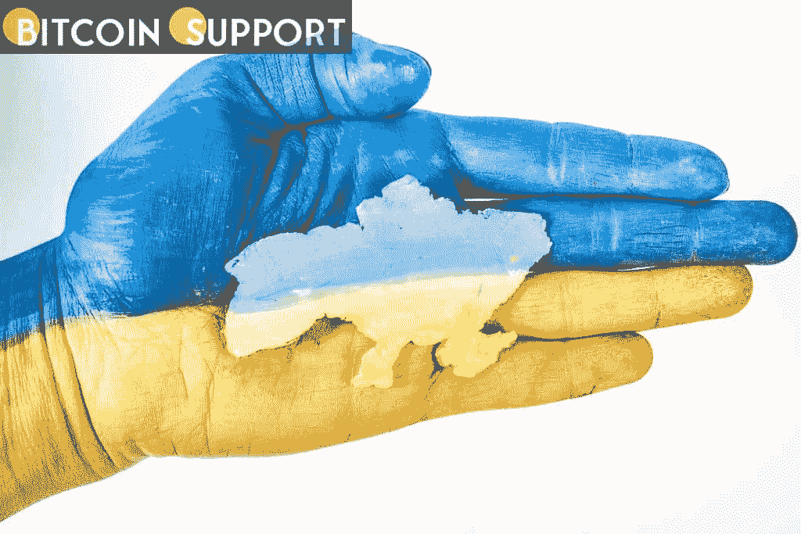

# Uniswap 为乌克兰创建了一个将 altcoins 转换为 ETH 捐赠的接口

> 原文：<https://medium.com/coinmonks/uniswap-creates-an-interface-for-converting-altcoins-into-eth-donations-for-ukraine-191d2fbe4e58?source=collection_archive---------91----------------------->

**Visit our website:-** [**https://bitcoinsupports.com/**](https://bitcoinsupports.com/)

Uniswap 团队解释说:“我们创建了这个界面，以便任何想要捐赠但拥有其他 ERC-20 代币的人只需点击一下就可以这样做。”分散化交易所 Uniswap 周二推出了一个界面，允许用户将 ERC-20 令牌转换为 Aave、Chainlink 的 link 和分散化的 MANA to Ether)等。然后，硬币通过一次交易被发送到乌克兰政府的官方加密钱包地址。

Uniswap 表示，乌克兰提供的地址是在一个集中的交换机上，在它对首次展示(USDT)的解释中只接受以太和系绳。因此，任何在 Uniswap 名单上拥有 ERC-20 代币的人，如果希望通过将钱包与 DEX 连接来捐赠，都可以更容易地做到这一点。然而，根据 Uniswap 团队引用的一条推文，加密社区的一些成员担心“这些钱包的钥匙由乌克兰的一个集中交易所持有”，并呼吁采取更“安全的保管策略”不管怎样，乌克兰今天早些时候增加了对波尔卡多特 dot 的捐赠支持。Polkadot 的创始人 Gavin Wood 向新支持的地址捐赠了 580 万美元。区块链社会一直在帮助乌克兰抗击目前的冲突。除了捐赠之外，像不可兑现的象征性捐赠这样有利于乌克兰艺术家和乌克兰的举措也获得了关注。

截止发稿时，乌克兰政府和该国慈善组织已经募集了超过 5300 万美元的捐款。这些数字是基于受监控的项目，不包括个人捐赠或使用多种代用币进行的捐赠。Kuna 的乌克兰储备基金，活着回来，以及直接转移到乌克兰政府验证的钱包地址的比特币(BTC)，以太，系绳和圆点都是值得注意的捐赠项目。不过，值得一提的是，捐赠价值的增加部分是由于加密货币市场持续繁荣导致的资本增值。

**访问我们的网站:-**[**https://bitcoinsupports.com/**](https://bitcoinsupports.com/)

**免责声明:以上为作者观点，不应视为投资建议。读者应该自己做研究。**

> 加入 Coinmonks [电报频道](https://t.me/coincodecap)和 [Youtube 频道](https://www.youtube.com/c/coinmonks/videos)了解加密交易和投资

# 另外，阅读

*   [比特币基地僵尸程序](/coinmonks/coinbase-bots-ac6359e897f3) | [AscendEX 审查](/coinmonks/ascendex-review-53e829cf75fa) | [OKEx 交易僵尸程序](/coinmonks/okex-trading-bots-234920f61e60)
*   [如何在印度购买比特币？](/coinmonks/buy-bitcoin-in-india-feb50ddfef94) | [WazirX 审查](/coinmonks/wazirx-review-5c811b074f5b)
*   [CryptoHopper 替代品](/coinmonks/cryptohopper-alternatives-d67287b16d27) | [HitBTC 审查](/coinmonks/hitbtc-review-c5143c5d53c2)
*   [CBET 评论](https://coincodecap.com/cbet-casino-review) | [库科恩 vs 比特币基地](https://coincodecap.com/kucoin-vs-coinbase)
*   [折叠 App 审核](https://coincodecap.com/fold-app-review) | [Kucoin 交易机器人](/coinmonks/kucoin-trading-bot-automate-your-trades-8cf0ca2138e0) | [Probit 审核](https://coincodecap.com/probit-review)
*   [如何匿名购买比特币](https://coincodecap.com/buy-bitcoin-anonymously) | [比特币现金钱包](https://coincodecap.com/bitcoin-cash-wallets)
*   [币安 vs FTX](https://coincodecap.com/binance-vs-ftx) | [最佳(索尔)索拉纳钱包](https://coincodecap.com/solana-wallets)
*   [比诺莫评论](https://coincodecap.com/binomo-review) | [斯多葛派 vs 3Commas vs TradeSanta](https://coincodecap.com/stoic-vs-3commas-vs-tradesanta)
*   [Capital.com 评论](https://coincodecap.com/capital-com-review) | [港加密借贷平台](https://coincodecap.com/crypto-lending-hong-kong)
*   如何在 Uniswap 上交换加密？ | [A-Ads 审查](https://coincodecap.com/a-ads-review)
*   [WazirX vs coin dcx vs bit bns](/coinmonks/wazirx-vs-coindcx-vs-bitbns-149f4f19a2f1)|[block fi vs coin loan vs Nexo](/coinmonks/blockfi-vs-coinloan-vs-nexo-cb624635230d)